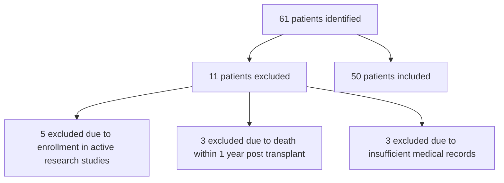

Yale New Haven Health logo

# Impact of a health-system specialty pharmacy on medication adherence in post-kidney transplant patients

Adina Petrosan, PharmD; Elizabeth Cohen, PharmD; Mitchell DelVecchio, PharmD; Martha Stutsky, PharmD; Kristen Belfield, PharmD

## Background

* After kidney transplant, patients are initiated on a complicated medication therapy plan, including six to seven new medications, many of which are multiple tablets, making adherence a challenge. Non-adherence to post-transplant medication can cause an increased risk of rejection.

* At Yale New Haven Transplant Center (YNHTC), patients are given the option to receive their medications through Outpatient Pharmacy Services, a health-system specialty pharmacy. The health-system specialty pharmacy helps promote adherence through refill reminder calls, pharmacist-led counseling and free same day delivery in the state.

## Objectives

* Determine the impact of a Yale New Haven Health system specialty pharmacy, on patient’s medication adherence using Proportion of Days Covered (PDC)

* Identify any secondary outcomes that may impact a patient’s medication adherence such as third party payer, pre-transplant medication adherence questionnaire, transplant education assessment scores, and number of post-transplant readmissions

## Methods

* A retrospective, single center, chart review

* <u>Inclusion criteria:</u> Kidney transplant patients who were transplanted between January 2017 and June 2017

* <u>Exclusion criteria:</u> Actively enrolled in a research study, deceased within one year of transplant, or had incomplete medical records

* Adherence was assessed by calculating the PDC
$$ Porportion\ of\ Days\ Covered = \left( \frac{Number\ of\ days\ in\ period\ "covered"}{Number\ of\ days\ in\ period} \right) \times 100\% $$

* Divided into <u>three</u> groups:

    * Patients who use a health system specialty pharmacy

    * Patients who use both a health system specialty pharmacy and an outside pharmacy

    * Patients who use an outside pharmacy only

* <u>Primary outcome:</u> Average PDC for patients using health-system specialty pharmacy versus other pharmacies

* <u>Secondary outcomes:</u> Pre-transplant medication adherence questionnaire, transplant education assessment scores, and number of post-transplant readmissions

* Statistical tests: T-tests, linear regression, and ANOVA tests were used to calculate statistical significance

## Results

Figure 1: Patient Exclusion

Figure 2: Number of Patients Enrolled

| Category                                                      | Percentage |
| ------------------------------------------------------------- | ---------- |
| Health-system specialty pharmacy only                         | 52%        |
| Both health-system specialty pharmacy and an outside pharmacy | 32%        |
| Outside pharmacy only                                         | 16%        |

Figure 3: Average Adherence Rate (PDC) vs. Pharmacy3

| Pharmacy Type                                                      | Average Adherence Rate (%) |
| ------------------------------------------------------------------ | -------------------------- |
| Health system specialty pharmacy only                              | 94.7                       |
| Both health system specialty pharmacy and another outside pharmacy | 83.2                       |
| Outside pharmacy only                                              | 91.8                       |

Table 1: Baseline Characteristics

| Patient characteristic                           | Health system specialty pharmacy only (n=26) n (%) | Both health-system specialty pharmacy and an outside pharmacy (n=8) n (%) | Outside pharmacy only (n=16) n (%) |
| ------------------------------------------------ | -------------------------------------------------- | ------------------------------------------------------------------------- | ---------------------------------- |
| Male                                             | 17 (65.4)                                          | 2 (25)                                                                    | 12 (75)                            |
| Race                                             |                                                    |                                                                           |                                    |
| Caucasian                                        | 14 (53.8)                                          | 3 (37.5)                                                                  | 8 (50)                             |
| Asian                                            | 1 (3.8)                                            | 1 (12.5)                                                                  | 3 (18.8)                           |
| Hispanic                                         | 3 (11.5)                                           | 0 (0)                                                                     | 1 (6.2)                            |
| African American                                 | 8 (30.8)                                           | 4 (50)                                                                    | 4 (25)                             |
| Age (average in years)                           | 53                                                 | 47                                                                        | 56                                 |
| Primary payer                                    |                                                    |                                                                           |                                    |
| Private insurance                                | 7 (26.9)                                           | 2 (25)                                                                    | 5 (31.3)                           |
| State/Federal insurance                          | 19 (73)                                            | 6 (75)                                                                    | 11 (68.7)                          |
| Highest education level                          |                                                    |                                                                           |                                    |
| Some high school                                 | 2 (7.7)                                            | 0 (0)                                                                     | 1 (6.3)                            |
| Completed high school                            | 7 (26.9)                                           | 0 (0)                                                                     | 4 (25)                             |
| Some college                                     | 8 (30.8)                                           | 4 (50)                                                                    | 6 (37.5)                           |
| Completed college                                | 4 (15.4)                                           | 0 (0)                                                                     | 4 (25)                             |
| Post-graduate degree                             | 5 (19.2)                                           | 2 (25)                                                                    | 0 (0)                              |
| Vocational training                              | 0 (0)                                              | 2 (25)                                                                    | 1 (6.3)                            |
| Readmissions (average)                           | 0.38                                               | 0.75                                                                      | 0.88                               |
| Pre-transplant adherence questionnaire (average) | 7.05                                               | 7.39                                                                      | 7.20                               |
| Transplant education assessment scores (average) | 9.42                                               | 9.57                                                                      | 9.07                               |

<u>Table 2: Average Medication Adherence Rate vs. Secondary Outcomes</u>

| Patient characteristic                        | Average medication adherence rate (%) | P-value |
| --------------------------------------------- | ------------------------------------- | ------- |
| Gender                                        |                                       |         |
| Male                                          | 92.6                                  | 0.32¹   |
| Female                                        | 91.0                                  |         |
| Third party payer (private vs. state/federal) |                                       |         |
| Private                                       | 90.7                                  | 0.31¹   |
| State/Federal                                 | 92.4                                  |         |
| Highest education level                       |                                       |         |
| Some high school                              | 99.8                                  | 0.34³   |
| Completed high school                         | 95.1                                  |         |
| Some college                                  | 93.5                                  |         |
| Completed college                             | 88.6                                  |         |
| Vocational training                           | 84.6                                  |         |
| Post-graduate degree                          | 86.8                                  |         |
| Donor type                                    |                                       |         |
| DDKT                                          | 92.2                                  | 0.38³   |
| LRKT                                          | 95.8                                  |         |
| LUKT                                          | 89.8                                  |         |

Table 3: Secondary Outcomes

| Patient Characteristic                          | P-value |
| ----------------------------------------------- | ------- |
| No. of readmissions in one year post transplant | 0.53²   |
| Pre-transplant adherence questionnaire          | 0.84²   |
| Transplant education assessment scores          | 0.81²   |
| Age                                             | 0.31²   |

P values calculated using the following statistical tests: 1=two-tailed t-test, 2= linear regression, 3= ANOVA

## Discussion

The proportion of days covered was significantly lower for patients who use a health system specialty pharmacy and another pharmacy compared to either a health system specialty pharmacy alone or another pharmacy alone, with a p value of 0.045. Secondary endpoints studied, pre-transplant medication adherence questionnaire, transplant education assessment scores, and number of post-transplant readmissions, were not significant.

## Conclusion

* A health system specialty pharmacy does impact the one-year medication adherence rate of patients who are post-kidney transplant.

* A patient’s medication adherence rate may be related to the use of multiple pharmacies versus one single pharmacy, rather than use of a specific pharmacy.

* Secondary outcomes, such as third party payer, pre-transplant medication adherence questionnaire, transplant education assessment scores, and number of post-transplant readmissions have no significant impact on medication adherence in post-kidney transplant patients.

## Future Directions

Further studies to investigate this relationship should be conducted.

Authors of this presentation have nothing to disclose concerning possible financial or personal relationships with commercial entities that may have a direct or indirect interest in the subject matter of this presentation.

