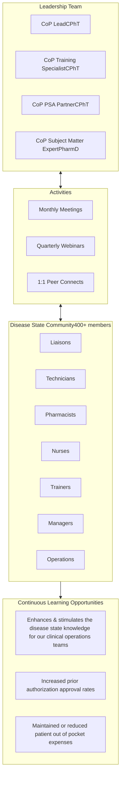

SHIELDS HEALTH SOLUTIONS logo

# Communities of Practice for Specialty Pharmacies

Kuwan Blake, BA, CPhT
Dawn DiPasquale, CPhT, CTDP

QR code to scan for more information

Poster at NASP 2022 Annual Meeting & Expo

## BACKGROUND

* As the fastest growing area of the pharmaceutical sector, specialty pharmacy is undergoing continuous change and advancement including newly approved medications, additional specialty disease states, updated national guidelines, insurance policies, and pharmaceutical industry resources.

* The Shields care model includes Specialty Pharmacy Liaisons (SPL), and Patient Support Advocates (PSA); pharmacy technicians trained in specific specialty health conditions and treatments to handle all pharmacy needs for patients, including submission of prior authorizations (PAs), investigation of financial assistance (FA) options, and coordination of timely medication refills.

* Due to the specialty pharmacy sector’s ongoing and constant changes and advancements, it’s important to provide continuous learning programs that ensure health care professionals receive up to date trainings of high value and impact.

## METHODS

* A Community of Practice (CoP) is established for specific disease states that our specialty pharmacy program services.

* Within each community there are 4 individuals appointed in stretch assignment roles to comprise a leadership team.

* Functional activities strengthen knowledge and promote continued learning across clinical operations teams.

* The topics originate from the leadership team based on observations, recommendations from the community, and business analytics reports.

* The community's monthly meetings and quarterly webinars are led by the leadership team or guest speakers that cover topics aimed at improving patient outcomes and efficiency as well as manufacturer-led topics on prior authorization criteria, copay assistance programs, and new drug approvals.

## RESULTS

* The Community of Practice program was successfully implemented in late 2020 with a focus on 4 primary disease states: diabetes, infectious diseases, autoimmune conditions and neurology. Each community has a robust membership of varying roles: 185 members in the infectious diseases’ community, 205 in the autoimmune community, 112 in the diabetes community, and 117 in the neurology community. Initial review of the data for a disease state unsupported by CoP versus a disease state supported by CoP showed an 18% average increase of prior authorization (PA) approval rates. A subsequent, advanced review of the data comparing each specific CoP disease state from 2020 Q2 (pre-CoP) and 2022 Q2 (post-CoP), demonstrated a 27% average increase of PA approval rates (Figure 1) and maintained or reduced out of pocket expenses for our patients, which improves adherence (Figures 2 & 3).

Figure 1: Prior Authorization Approval Rate

| 27% Average Increase Disease State | 27% Average Increase Pre-CoP (%) | 27% Average Increase Post-CoP (%) | 27% Average Increase Increase (%) |
| -------------------------------------- | ------------------------------------ | ------------------------------------- | ------------------------------------- |
| Autoimmune                             | 77                                   | 91                                    | 14                                    |
| Neurology                              | 72                                   | 92                                    | 20                                    |
| Infectious Diseases                    | 70                                   | 99                                    | 29                                    |
| Diabetes                               | 38                                   | 83                                    | 45                                    |

Figure 2: Copayment Comparisons

| Disease State       | Pre-CoP | Post-CoP |
| ------------------- | ------- | -------- |
| Autoimmune          | $5      | $5       |
| Neurology           | $5      | $5       |
| Infectious Diseases | $3      | $3       |
| Diabetes            | $25     | $8       |

Figure 3: Financial Assistance Impact

Maintenance of Copay icon Lowering of Copay icon Improved Adherence icon

Despite ongoing challenges with manufacturers, foundations, payers and outside pharmacies, Shields has been able to maintain and even reduce out-of-pocket expenses for patients whos' disease state fall within our communities.

## CONCLUSION

* The CoP program serves as a platform to enhance employees’ disease state knowledge for roles across the organization by promoting continuing education opportunities and ultimately improving our patient outcomes. This program also demonstrates the value of encouraging altruistic community training to enhance our employees’ knowledge within their disease states while promoting professional development and leadership opportunities. It established a network between more than 15 company roles across more than 20 health system partners.

## DISCLAIMERS

* The authors of this presentation have nothing to disclose concerning possible financial or personal relationships with commercial entities that may have a direct or indirect interest in the subject matter of this presentation

