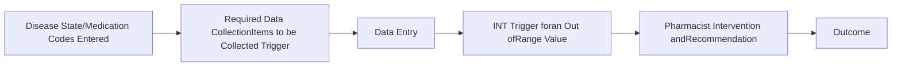
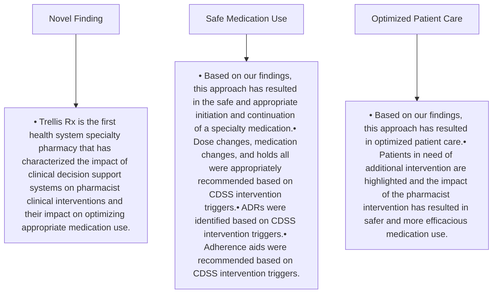

# Impact of Pharmacist Clinical Decision Support System Alerts on Pharmacist Interventions

Trellis logo

Jessica Mourani, Pharm.D., Brandon Hardin Pharm.D., Brandon Newman Pharm.D., Hector Mayol

## BACKGROUND

* Clinical decision support systems (CDSS) represent a shift in healthcare with many health systems looking to increase the quality of patient care.

* A CDSS is a promising approach to the aggregation and use of patient data to identify patients who would most benefit from interventions by a pharmacist.

* Trellis Rx is the first health system specialty pharmacy services provider to implement CDSS logic into our specialty pharmacy technology platform, Arbor®.

* This allows us to integrate evidence-based clinical guidelines into the delivery of high-quality patient care by auto triggering a pharmacist intervention based on medication specific lab values that would deem a medication as requiring additional clinical pharmacist review.

## OBJECTIVES

This study is aimed at describing the clinical outcome impacts of a pharmacist clinical decision support system on pharmacist interventions.

## METHODS

### Study Design

* This is a 9-month, multicenter, retrospective review of this system and the impact of the interventions triggered and then completed by a clinical pharmacist.

### Methods:

* A CDSS was implemented in September 2020. A pharmacist intervention would auto-trigger when pre-determined out of range lab values were entered by a pharmacist upon medication initiation or continuation.

* This intervention would be reviewed by the pharmacist to then determine the safety, efficacy, and overall appropriateness of the medication.

### CDSS PROCESS

## RESULTS

### INTERVENTIONS TRIGGERED

A total of 2583 interventions were auto-triggered and responded to based on lab value logic entered. The top three disease states accounting for these interventions were autoimmune (n=607), oncology (n=600), and infectious diseases (n=596).

| Disease State       | Percentage |
| ------------------- | ---------- |
| Autoimmune          | 33%        |
| Oncology            | 34%        |
| Infectious Diseases | 33%        |

### INTERVENTION OUTCOMES

* 1002 (55.6%) resulted in a pharmacist recommending a dose or medication change

* 537 (30%) resulted in ordering of additional labs to ensure safety

* 152 (8.4%) resulted in holding a future dose

* 90 (5%)resulted in patient adherence aids

* 22 (1%) resulted in identification of an adverse drug reaction

| Intervention Type         | Count |
| ------------------------- | ----- |
| Dose or Medication Change | 1002  |
| Lab Order                 | 537   |
| Hold Dose                 | 152   |
| Adherence Aid             | 90    |
| ADR Identificaiton        | 22    |

## CONCLUSIONS

Clinical Decision Support Systems provide an excellent means of augmenting a pharmacist's workflow in a variety of patient care tasks. In our model, it has ensured the delivery of consistent quality patient care, a vital component of any specialty pharmacy model to improve patient outcomes.

## REFERENCES

1. Osheroff, J. et al. Improving Outcomes with Clinical Decision Support: An Implementer’s Guide. (HIMSS Publishing, 2012).

2. Sutton, R.T., Pincock, D., Baumgart, D.C. et al. An overview of clinical decision support systems: benefits, risks, and strategies for success. npj Digit. Med. 3, 17 (2020). https://doi.org/10.1038/s41746-020-0221-y

