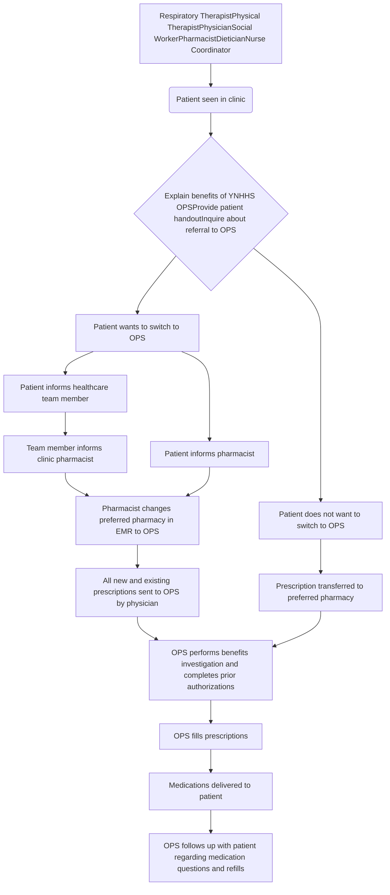

Yale New Haven Health logo

Yale New Haven Health Yale New Haven Children's Hospital logo

# Impact of Health-System Specialty Pharmacy Services on Medication Adherence in Pediatric Patients with Cystic Fibrosis

Vincent Tao, PharmD; Martha Stutsky, PharmD; Mitchell DelVecchio, PharmD;
Talia Papiro, PharmD; Sarah A. Kelly, PharmD

## Background

* Specialty medications represent a growing part of the pharmacological management of chronic disease states such as cystic fibrosis (CF).

* The management of CF in the pediatric population is complex, as it involves multiple medications and treatment success is largely determined by adherence to the care plan.

* Due to various factors, there can be delays between prescribing of specialty medications and initiation of therapy in the pediatric CF population as well as barriers to continued adherence.

## Advantages of Health-System Specialty Pharmacy

|                                  | Outside Specialty Pharmacy Services                    | Health-System Specialty Pharmacy Services                 |
| -------------------------------- | ------------------------------------------------------ | --------------------------------------------------------- |
| Clinical assessment & monitoring | May not have access to electronic medical record (EMR) | Direct access to electronic medical record (EMR)          |
| Patient education                | Limited                                                | Continuous                                                |
| Turn-around time                 | Average 7-14 days                                      | < 72 hours                                                |
| Financial services               | Limited assistance                                     | Prior authorization & financial assistance                |
| Coordination of care             | Limited / no direct access to prescribers & nurses     | Close access to prescribers & nurses                      |
| Access to medications            | Limited prescription pick-up                           | Local prescription pick-up, same-day or next-day delivery |

Prescribed Specialty Medications for Cystic Fibrosis Clinic Patients: September 2018 – February 2019

| Medication | Percentage (n) |
| ---------- | -------------- |
| Pulmozyme  | 48% (n=50)     |
| Tobramycin | 25% (n=26)     |
| Orkambi    | 11% (n=11)     |
| Kalydeco   | 10% (n=11)     |
| Symdeko    | 6% (n=6)       |

## Objective

* Assess the impact of Outpatient Pharmacy Services (OPS) at Yale New Haven Health on medication adherence in pediatric patients with cystic fibrosis.

## Project Description

* A prospective review of medication adherence in 65 pediatric patients with CF was conducted over a 6 month period and compared to a retrospective cohort.

* Education about health system specialty pharmacy services was delivered to patients through: invitation letter to the patient, informational pamphlets distributed in clinic, and direct education in clinic by the pharmacist.

* A clinic workflow was developed and implemented in September 2018 to streamline the patient referral process:

## Results

### Prescriptions Received by OPS

| Time Period                                                | % Prescriptions Received by OPS | % Prescriptions Received by Outside Pharmacy |
| ---------------------------------------------------------- | ------------------------------- | -------------------------------------------- |
| Pediatric Cystic Fibrosis Precriptions (Sept'17 - Feb'18)  | n=5                             | n=60                                         |
| Pediatric Cystic Fibrosis Prescriptions (Sept'18 - Feb'19) | n=100                           | n=42                                         |

OPS Fill Rate: September 2018 - February 2019

| Category                                | % Prescriptions Filled by OPS | % Prescriptions Filled by Outside Pharmacy |
| --------------------------------------- | ----------------------------- | ------------------------------------------ |
| Pediatric Cystic Fibrosis Prescriptions | 89%                           | 11%                                        |

### Prescriptions Received and Filled by OPS: September 2018 – February 2019

| Month | % Scripts Received | % Scripts Filled |
| ----- | ------------------ | ---------------- |
| Sep   | 40                 | 100              |
| Oct   | 45                 | 100              |
| Nov   | 55                 | 100              |
| Dec   | 45                 | 100              |
| Jan   | 48                 | 100              |
| Feb   | 50                 | 100              |

Medication Adherence: MPR and PDC

Medication Adherence Chart

## Conclusions

* Challenges that were faced throughout the implementation of health-system specialty pharmacy services included integration of a new workflow into an existing one, patient buy-in, and insurance lockouts.

* Collaboration with members of the healthcare team in clinic to create minimal disturbance and a smooth integration is critical to successful implementation.

| Metric                   | Pre-Implementation | Post-Implementation |
| ------------------------ | ------------------ | ------------------- |
| Prescriptions Written    | 65                 | 142                 |
| Clinical Continuity Rate | 7.7%               | 70.4%               |
| Fill Rate                | 100%               | 89%                 |
| MPR                      | 0.85               | 0.86                |
| PDC                      | 0.75               | 0.80                |

## Future Directions

* Development and implementation of collaborative practice agreements within the pediatric CF clinic

* Expansion of health-system specialty pharmacy services to other pediatric clinic settings to improve clinical continuity throughout the health system network

## Impact on the Patient Experience

* This single-center retrospective and prospective review of medication adherence showed improved and sustained patient medication adherence following implementation of health-system specialty pharmacy services.

* The increase in utilization of OPS led to an increase in prescriptions received and filled by the health-system specialty pharmacy.

* Implementation of a clinic workflow designed to increase specialty pharmacy services in pediatric patients with CF was associated with improvements in MPR and PDC, indicating sustained medication adherence by patients.

