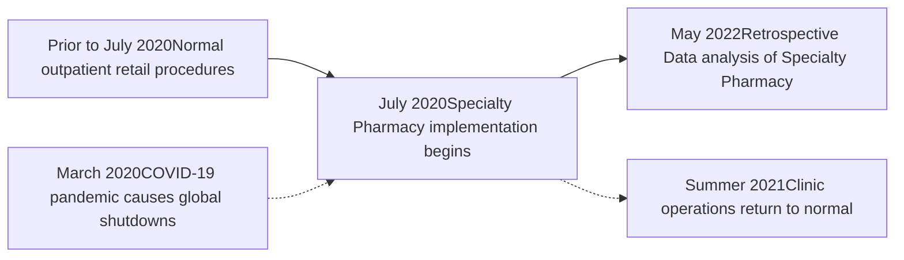

St. Jude Children's Research Hospital logo

# Impact of Specialty Pharmacy Implementation on Disease Burden and Quality of Life in Pediatric and Young Adult Patients Living with HIV

Tiffany M. Nason, Pharm.D1; Susan D. Carr, Pharm.D.1; Timothy J. Howze, Pharm.D.1,3; Steve M. Pate, DPh1; Joseph N. Sciasci, Pharm.D.1; Adejumoke Shofoluwe Pharm.D.1,3; Jacob B. Goss, B.S.3; Najwa I. Stewart, B.S.3; Nehali Patel M.D.2

Departments of Pharmacy and Pharmaceutical Sciences1, Infectious Diseases2, St. Jude Children's Research Hospital and University of Tennessee Health Science Center3

## BACKGROUND

* Treatment with, and adherence to, oral anti-retroviral therapy (ART) regimens are the foundation to reducing disease burden and improving quality of life (QOL) in patients living with HIV.

* Poor adherence to ART may contribute to increased resistance, decreased QOL, disease progression and patient death.

* Studies have shown that pharmacy-led interventions improve medication adherence in patients with HIV. 1

## OBJECTIVE

* The purpose of this study was to determine if implementing an accredited specialty pharmacy (SP) model had an impact on viral load (VL) suppression and QOL in pediatric and young adult patients living with HIV.

## METHODS

* A single center, retrospective analysis was conducted July 2019 through July 2021.

* The study included 37 patients (ages 2 to 23) who received ART from the hospital outpatient pharmacy for at least one year prior to the SP implementation and one year post implementation.

* All patients were subsequently enrolled in the SP program in July 2020 and had additional outreach from SP pharmacists and technicians for at least one year following enrollment.

* QOL responses obtained via verbal rating scale (1-10) survey to patients and was conducted by a technician/pharmacist for a duration of one year after implementation.

* All data was obtained from dispensing software and patient electronic medical records.

* An ART dashboard with patient viral loads/CD4 count over time, refill dates, internal vs. external prescriptions was created in collaboration with the pharmacy informatics team to assist with data analysis.

## RESULTS

* Implementation of the SP model suggests increased pharmacy team members outreach resulted in 14.7% decrease in VL (p = 0.038) when compared with one year prior with a sustained average proportion of days covered (PDC) at 80%.

* Patient-reported QOL scores improved or remained unchanged with favored QOL for 97% of patients during the one year following implementation.

* The initiation of the SP model coincided with the COVID-19 pandemic. No other confounding interventions were identified that could have impacted adherence.

Impact of Specialty Pharmacy Outreach on Patient Average Viral Load

| Category | Viral Load (copies/mL) |
| -------- | ---------------------- |
| Before   | 530                    |
| After    | 430                    |

Patient-Reported QOL Scores

| Category | Responses (1-10) |
| -------- | ---------------- |
| Before   | 9.15             |
| After    | 9.4              |

Average Viral Load by Month

| Time (Month) | Viral Load (copies/mL) |
| ------------ | ---------------------- |
| Jun '19      | 550                    |
| Jul '19      | 850                    |
| Aug '19      | 100                    |
| Sep '19      | 400                    |
| Oct '19      | 50                     |
| Nov '19      | 1100                   |
| Dec '19      | 300                    |
| Jan '20      | 500                    |
| Feb '20      | 150                    |
| Mar '20      | 50                     |
| Apr '20      | 50                     |
| May '20      | 100                    |
| Jun '20      | 300                    |
| Jul '20      | 3050                   |
| Aug '20      | 300                    |
| Sep '20      | 100                    |
| Oct '20      | 1150                   |
| Nov '20      | 150                    |
| Dec '20      | 400                    |
| Jan '21      | 150                    |
| Feb '21      | 400                    |
| Mar '21      | 650                    |
| Apr '21      | 680                    |
| May '21      | 150                    |
| Jun '21      | 100                    |

## CONCLUSIONS

* The SP model established a formalized, high-touch clinical care approach between the pharmacy and patients receiving ART at our institution.

* The enhanced outreach efforts of pharmacists and technicians proved instrumental in providing additional level of clinical engagement via phone outreach when other clinical areas minimized in-person interaction.

## REFERENCES

1. Bonner, K., Mezochow, A., Roberts, T., Ford, N. & Cohn, J. (2013). Viral Load Monitoring as a Tool to Reinforce Adherence. JAIDS Journal of Acquired Immune Deficiency Syndromes, 64 (1), 74-78.

## DISCLOSURES

The authors of this presentation have no financial or personal disclosures in relation to this project.

