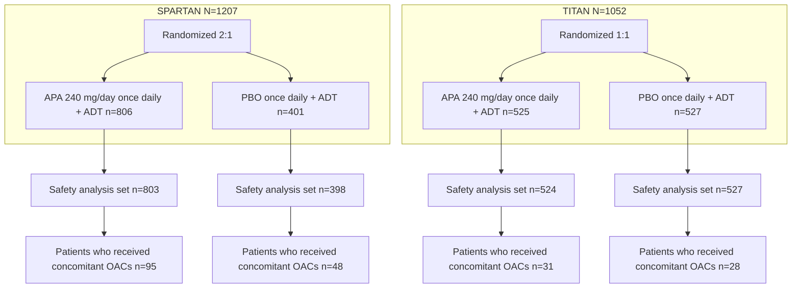

# Concomitant Use of Apalutamide and Anticoagulants

Karen Nenno1, Rushihkesh Potdar2, Benjamin A. Gartrell3, Robert Given4, Christopher Pieczonka5, Jeffrey Frankel6, Kris O’MalleyLeFebvre1, Amitabha Bhaumik7, Sharon McCarthy7, Tracy McGowan2, Lawrence Karsh8

1SCL Health- Lutheran Medical Center, Wheat Ridge, CO, USA; 2Medical Group Oncology, Janssen Pharmaceuticals, Horsham, PA, USA; 3Departments of Medical Oncology and Urology, Montefiore Einstein Center for Cancer Care, Bronx, New York, NY, USA; 4Urology of Virginia, Eastern Virginia Medical School, Norfolk, VA, USA; 5Associated Medical Professionals of New York, Syracuse, New York, NY, USA; 6Seattle Urology Research Center, Seattle, WA, USA; 7Janssen Research and Development, Raritan, NJ, USA; 8The Urology Center of Colorado, Denver, CO, USA

## BACKGROUND

* Oral anti-androgens and oral anticoagulants (OACs) are very important classes of drugs, often used concomitantly in older, higher-risk population with prostate cancer1,2

* Apalutamide (APA), an oral androgen receptor signaling inhibitor, in combination with androgen deprivation therapy (ADT), is approved for treatment of nonmetastatic castration-resistant prostate cancer (nmCRPC) and metastatic castration-sensitive prostate cancer (mCSPC) based on phase 3 SPARTAN and TITAN studies,3-6 respectively

* APA acts as an inducer for cytochrome P450 (CYP) enzymes, including CYP3A4, CYP2C19, CYP2C9 and transporters like P-glycoprotein, which are involved in metabolism of commonly used OACs.7 Co-administration of APA with OACs may thus have potential drug-drug interactions, possibly resulting in lower exposure to these medications.

## OBJECTIVES

* To evaluate the incidence of treatment-emergent thrombotic and embolic adverse events (AEs) in patients receiving concomitant OACs with APA + ADT or placebo (PBO) + ADT in the SPARTAN and TITAN studies

## METHODS

* Occurrence of thrombotic and embolic AEs in the overall study population and in the subgroups that did or did not receive concomitant OACs was assessed with descriptive post hoc analysis of data from the SPARTAN and TITAN studies

Figure 1. Design of post hoc analysis of the SPARTAN and TITAN studies

All patients received a concomitant gonadotropin-releasing hormone analog or had a bilateral orchiectomy. Patients were excluded if they had evidence of severe/unstable angina, myocardial infarction, symptomatic congestive heart failure, arterial or venous thromboembolic events, or clinically significant ventricular arrhythmias within 6 months before randomization.

Safety analysis set consists of all patients who received at least 1 dose of study drug.

ADT, androgen deprivation therapy; APA, apalutamide; OACs, oral anticoagulants; PBO, placebo.

## METHODS

* Anticoagulants were identified by WHO Drug Anatomical Therapeutic Chemical (ATC) level 4 classifications (Direct factor Xa inhibitors, Direct thrombin inhibitors, Vitamin K antagonists)

    ◊ Concomitant use of certain OACs such as apixaban, rivaroxaban, edoxaban, dabigatran, and warfarin was allowed in SPARTAN and TITAN studies

* Thrombotic and embolic AEs were coded using the Medical Dictionary for Regulatory Activities (MedDRA, version 19.1)

## RESULTS

* In SPARTAN, 1207 patients with nmCRPC were randomized (2:1) to APA + ADT (n=806) or PBO + ADT (n=401)3

* In TITAN, 1052 patients with mCSPC were randomized (1:1) to receive APA + ADT (n=525) or PBO + ADT (n=527)4

* Data were analyzed from patients receiving concurrent OACs among all treated patients:

    ◊ SPARTAN: APA + ADT, 95/803 (11.8%); PBO + ADT, 48/398 (12.1%)

    ◊ TITAN: APA + ADT, 31/524 (5.9%); PBO + ADT, 28/527 (5.3%)

* Incidence of thrombotic and embolic AEs in APA + ADT group vs and PBO + ADT group in the overall safety population was as follows:

    ◊ SPARTAN: 38 (4.7%) vs 14 (3.5%)

    ◊ TITAN: 22 (4.2%) vs 20 (3.8%)

* Incidence of thrombotic and embolic AEs in the subgroup of patients receiving concomitant OACs with APA + ADT or PBO + ADT was as follows:

    ◊ SPARTAN: 11 (11.6%) vs 6 (12.5%)

    ◊ TITAN: 6 (19.4%) vs 6 (21.4%)

| Table 1. Occurrence of thrombotic and embolic adverse events in the SPARTAN and TITAN studies (Safety population) | Table 1. Occurrence of thrombotic and embolic adverse events in the SPARTAN and TITAN studies (Safety population) SPARTAN APA + ADT | Table 1. Occurrence of thrombotic and embolic adverse events in the SPARTAN and TITAN studies (Safety population) SPARTAN PBO + ADT | Table 1. Occurrence of thrombotic and embolic adverse events in the SPARTAN and TITAN studies (Safety population) TITAN APA + ADT | Table 1. Occurrence of thrombotic and embolic adverse events in the SPARTAN and TITAN studies (Safety population) TITAN PBO + ADT |
| ----------------------------------------------------------------------------------------------------------------- | ------------------------------------------------------------------------------------------------------------------------------------------- | ------------------------------------------------------------------------------------------------------------------------------------------- | ----------------------------------------------------------------------------------------------------------------------------------------- | ----------------------------------------------------------------------------------------------------------------------------------------- |
| Safety population, n                                                                                              | 803                                                                                                                                         | 398                                                                                                                                         | 524                                                                                                                                       | 527                                                                                                                                       |
| Thrombotic and embolic AEs, n (%)                                                                                 | 38 (4.7)                                                                                                                                    | 14 (3.5)                                                                                                                                    | 22 (4.2)                                                                                                                                  | 20 (3.8)                                                                                                                                  |
| Number of patients who received concomitant OACs, n                                                               | 95                                                                                                                                          | 48                                                                                                                                          | 31                                                                                                                                        | 28                                                                                                                                        |
| Thrombotic and embolic AEs, n (%)                                                                                 | 11 (11.6)                                                                                                                                   | 6 (12.5)                                                                                                                                    | 6 (19.4)                                                                                                                                  | 6 (21.4)                                                                                                                                  |
| Number of patients who did not receive concomitant OACs, n                                                        | 708                                                                                                                                         | 350                                                                                                                                         | 493                                                                                                                                       | 499                                                                                                                                       |
| Thrombotic and embolic AEs, n (%)                                                                                 | 27 (3.8)                                                                                                                                    | 8 (2.3)                                                                                                                                     | 16 (3.2)                                                                                                                                  | 14 (2.8)                                                                                                                                  |

Percent is based on the safety population.
ADT, androgen deprivation therapy; APA, apalutamide; AEs, adverse events; OACs, oral anticoagulants; PBO, placebo.

## RESULTS

Thrombotic and embolic AEs in the subgroup of patients receiving concomitant OACs:

* **Grade 3 or 4:**

    ◊ SPARTAN: 6 (6.3%) patients in APA + ADT group vs 5 (10.4%) in PBO + ADT group

        – AEs in APA + ADT group: Acute myocardial infarction, ischemic stroke, myocardial infarction, intracardiac thrombus, device occlusion and pulmonary embolism (n=1 each)

    ◊ TITAN: 3 (9.7%) patients in APA + ADT group vs 1 (3.6%) in PBO + ADT group

        – AEs in APA + ADT group: Pulmonary embolism (n=2) and cerebrovascular accident (n=1)

* **Grade 5:**

    ◊ SPARTAN: None

    ◊ TITAN: APA + ADT group: 1 patient vs PBO + ADT group: None

        – AE in APA + ADT group: Myocardial infarction

| Table 2. Summary of treatment-emergent thrombotic and embolic adverse events in patients who received concomitant OACs in SPARTAN study (Safety population) Patients with ≥1 event, n (%) | Table 2. Summary of treatment-emergent thrombotic and embolic adverse events in patients who received concomitant OACs in SPARTAN study (Safety population) APA + ADT (n=95) Any grade | Table 2. Summary of treatment-emergent thrombotic and embolic adverse events in patients who received concomitant OACs in SPARTAN study (Safety population) APA + ADT (n=95) Grade 3 | Table 2. Summary of treatment-emergent thrombotic and embolic adverse events in patients who received concomitant OACs in SPARTAN study (Safety population) APA + ADT (n=95) Grade 4 | Table 2. Summary of treatment-emergent thrombotic and embolic adverse events in patients who received concomitant OACs in SPARTAN study (Safety population) PBO + ADT (n=48) Any grade | Table 2. Summary of treatment-emergent thrombotic and embolic adverse events in patients who received concomitant OACs in SPARTAN study (Safety population) PBO + ADT (n=48) Grade 3 | Table 2. Summary of treatment-emergent thrombotic and embolic adverse events in patients who received concomitant OACs in SPARTAN study (Safety population) PBO + ADT (n=48) Grade 4 |
| ----------------------------------------------------------------------------------------------------------------------------------------------------------------------------------------- | ---------------------------------------------------------------------------------------------------------------------------------------------------------------------------------------------- | -------------------------------------------------------------------------------------------------------------------------------------------------------------------------------------------- | -------------------------------------------------------------------------------------------------------------------------------------------------------------------------------------------- | ---------------------------------------------------------------------------------------------------------------------------------------------------------------------------------------------- | -------------------------------------------------------------------------------------------------------------------------------------------------------------------------------------------- | -------------------------------------------------------------------------------------------------------------------------------------------------------------------------------------------- |
| Acute myocardial infarction                                                                                                                                                               | 1 (1.1)                                                                                                                                                                                        | 1 (1.1)                                                                                                                                                                                      | 0                                                                                                                                                                                            | 1 (2.1)                                                                                                                                                                                        | 1 (2.1)                                                                                                                                                                                      | 0                                                                                                                                                                                            |
| Coronary artery occlusion                                                                                                                                                                 | 1 (1.1)                                                                                                                                                                                        | 0                                                                                                                                                                                            | 0                                                                                                                                                                                            | 0                                                                                                                                                                                              | 0                                                                                                                                                                                            | 0                                                                                                                                                                                            |
| Intracardiac thrombus                                                                                                                                                                     | 1 (1.1)                                                                                                                                                                                        | 1 (1.1)                                                                                                                                                                                      | 0                                                                                                                                                                                            | 0                                                                                                                                                                                              | 0                                                                                                                                                                                            | 0                                                                                                                                                                                            |
| Myocardial infarction                                                                                                                                                                     | 1 (1.1)                                                                                                                                                                                        | 0                                                                                                                                                                                            | 1 (1.1)                                                                                                                                                                                      | 0                                                                                                                                                                                              | 0                                                                                                                                                                                            | 0                                                                                                                                                                                            |
| Stress cardiomyopathy                                                                                                                                                                     | 0                                                                                                                                                                                              | 0                                                                                                                                                                                            | 0                                                                                                                                                                                            | 1 (2.1)                                                                                                                                                                                        | 1 (2.1)                                                                                                                                                                                      | 0                                                                                                                                                                                            |
| Transient ischemic attack                                                                                                                                                                 | 2 (2.1)                                                                                                                                                                                        | 0                                                                                                                                                                                            | 0                                                                                                                                                                                            | 1 (2.1)                                                                                                                                                                                        | 0                                                                                                                                                                                            | 0                                                                                                                                                                                            |
| Ischemic stroke                                                                                                                                                                           | 1 (1.1)                                                                                                                                                                                        | 0                                                                                                                                                                                            | 1 (1.1)                                                                                                                                                                                      | 0                                                                                                                                                                                              | 0                                                                                                                                                                                            | 0                                                                                                                                                                                            |
| Deep vein thrombosis                                                                                                                                                                      | 3 (3.2)                                                                                                                                                                                        | 0                                                                                                                                                                                            | 0                                                                                                                                                                                            | 0                                                                                                                                                                                              | 0                                                                                                                                                                                            | 0                                                                                                                                                                                            |
| Peripheral arterial occlusive disease                                                                                                                                                     | 0                                                                                                                                                                                              | 0                                                                                                                                                                                            | 0                                                                                                                                                                                            | 1 (2.1)                                                                                                                                                                                        | 1 (2.1)                                                                                                                                                                                      | 0                                                                                                                                                                                            |
| Pulmonary embolism                                                                                                                                                                        | 1 (1.1)                                                                                                                                                                                        | 1 (1.1)                                                                                                                                                                                      | 0                                                                                                                                                                                            | 2 (4.2)                                                                                                                                                                                        | 2 (4.2)                                                                                                                                                                                      | 0                                                                                                                                                                                            |
| Device occlusion                                                                                                                                                                          | 1 (1.1)                                                                                                                                                                                        | 1 (1.1)                                                                                                                                                                                      | 0                                                                                                                                                                                            | 0                                                                                                                                                                                              | 0                                                                                                                                                                                            | 0                                                                                                                                                                                            |

Percent is based on the safety population.
ADT, androgen deprivation therapy; APA, apalutamide; OACs, oral anticoagulants; PBO, placebo.

## RESULTS

| Table 3. Summary of treatment-emergent thrombotic and embolic adverse events in patients who received concomitant OACs in TITAN study (Safety population) Patients with ≥1 event, n (%) | Table 3. Summary of treatment-emergent thrombotic and embolic adverse events in patients who received concomitant OACs in TITAN study (Safety population) APA + ADT (n=31) Any grade | Table 3. Summary of treatment-emergent thrombotic and embolic adverse events in patients who received concomitant OACs in TITAN study (Safety population) APA + ADT (n=31) Grade 3 | Table 3. Summary of treatment-emergent thrombotic and embolic adverse events in patients who received concomitant OACs in TITAN study (Safety population) APA + ADT (n=31) Grade 4 | Table 3. Summary of treatment-emergent thrombotic and embolic adverse events in patients who received concomitant OACs in TITAN study (Safety population) PBO + ADT (n=28) Any grade | Table 3. Summary of treatment-emergent thrombotic and embolic adverse events in patients who received concomitant OACs in TITAN study (Safety population) PBO + ADT (n=28) Grade 3 | Table 3. Summary of treatment-emergent thrombotic and embolic adverse events in patients who received concomitant OACs in TITAN study (Safety population) PBO + ADT (n=28) Grade 4 |
| --------------------------------------------------------------------------------------------------------------------------------------------------------------------------------------- | -------------------------------------------------------------------------------------------------------------------------------------------------------------------------------------------- | ------------------------------------------------------------------------------------------------------------------------------------------------------------------------------------------ | ------------------------------------------------------------------------------------------------------------------------------------------------------------------------------------------ | -------------------------------------------------------------------------------------------------------------------------------------------------------------------------------------------- | ------------------------------------------------------------------------------------------------------------------------------------------------------------------------------------------ | ------------------------------------------------------------------------------------------------------------------------------------------------------------------------------------------ |
| Pulmonary embolism                                                                                                                                                                      | 2 (6.5)                                                                                                                                                                                      | 1 (3.2)                                                                                                                                                                                    | 1 (3.2)                                                                                                                                                                                    | 2 (7.1)                                                                                                                                                                                      | 1 (3.6)                                                                                                                                                                                    | 0                                                                                                                                                                                          |
| Myocardial infarction                                                                                                                                                                   | 2 (6.5)                                                                                                                                                                                      | 0                                                                                                                                                                                          | 0                                                                                                                                                                                          | 0                                                                                                                                                                                            | 0                                                                                                                                                                                          | 0                                                                                                                                                                                          |
| Deep vein thrombosis                                                                                                                                                                    | 1 (3.2)                                                                                                                                                                                      | 0                                                                                                                                                                                          | 0                                                                                                                                                                                          | 3 (10.7)                                                                                                                                                                                     | 0                                                                                                                                                                                          | 0                                                                                                                                                                                          |
| Cerebrovascular accident                                                                                                                                                                | 1 (3.2)                                                                                                                                                                                      | 1 (3.2)                                                                                                                                                                                    | 0                                                                                                                                                                                          | 1 (3.6)                                                                                                                                                                                      | 0                                                                                                                                                                                          | 0                                                                                                                                                                                          |

Percent is based on the safety population.
ADT, androgen deprivation therapy; APA, apalutamide; OACs, oral anticoagulants; PBO, placebo.

## CONCLUSIONS

* Among patients with advanced or metastatic prostate cancer who were on concomitant OACs, the occurrence of thrombotic and embolic AEs were similar in patients receiving APA + ADT and PBO + ADT in the phase 3 SPARTAN and TITAN studies

* This post hoc analysis suggests that when necessary concomitant OACs can be used with APA. Appropriate monitoring should be provided.

## REFERENCES

1. Shatzel JJ, et al. J Oncol Pract. 2017;13:720-727; 2. Shore N, et al. Target Oncol. 2019;14:527-539; 3. Smith MR, et al. N Engl J Med. 2018;378:1408-18; 4. Chi KN, et al. N Engl J Med. 2019;381:13-24; 5. Chi KN, et al. J Clin Oncol. 2021; 39:2294-303; 6. Smith MR, et al. Eur Urol. 2021;79:150-8; 7. ERLEADA® (apalutamide) tablets, for oral use. Full prescribing information. 2020. https://www.janssenlabels.com/package-insert/product-monograph/prescribing-information/ERLEADA-pi.pdf.

## ACKNOWLEDGMENTS

Akshada Deshpande, PhD (SIRO Clinpharm Pvt Ltd, India) provided writing assistance and Jennifer Han, MS and Harman Kaur, PharmD (Janssen Scientific Affairs, LLC) provided additional editorial support for the development of this poster.

## DISCLOSURES

K. Nenno: Consulting fees from Karyopharm to participate in an advisory board. B. Gartrell: Personal fees from Exelixis Inc, Pfizer, Janssen, Genomic Health, and EMD Serono, outside the submitted work. R. Given: Speaker for Janssen, Myovant and Bayer; Investigator for research trials with Janssen, Bayer, Tavanta, Merck, and Pfizer. C. Pieczonka: Consultancy: Dendreon, Bayer, Astra Zeneca, Merck, LUGPA, UroGPO, Janssen, Astellas, Pfizer, Foundation Medicine, Sun; Compensated Research Studies: Dendreon, Bayer, Astra Zeneca, Merck, Janssen, Astellas, Pfizer, Very, Eli-Lilly, Laekna. J. Frankel: Investigator for Urovant Sciences; Investigator and speaker for Astellas Pharma and Pfizer Inc.; Speaker for Tolmar Inc. K. O'MalleyLeFebvre: Nothing to disclose. L. Karsh: Honoraria from Astellas, Bayer, Janssen, Pfizer and Dendreon; Consultancy for 3D Biopsy, Astellas, Astra-Zeneca, Bayer, Dendreon, Ferring, Janssen, Pfizer, and Vaxiion; Speakers’ Bureau: Astellas, Bayer, Janssen, Pfizer, and Clovis; received Travel, Accommodations, Expenses from Astellas, Bayer, Janssen, Pfizer, and Dendreon; received research funding from Astellas, Astra Zeneca, Bayer, BioXcel Therapeutics, Bristol Meyers Squibb, CU Optics, CUSP, Dendreon, Epizyme, Exact Sciences, Ferring, FKD, Genentech/Roche, GenomeDx, Genomic Health, Janssen, Merck, Myovant, Nucleix, OncoCell MDx, Pfizer, Pharmtech/Veru, Precision Med, QED Therapeutics, Siemens, Urogen, and Vaxiion; Stock Owner: Swan Valley Medical. R. Potdar and T. McGowan: Employees of Janssen Pharmaceuticals and own stock in Johnson and Johnson, of which Janssen is a wholly owned subsidiary. A. Bhaumik and S. McCarthy: Employees of Janssen Research & Development, LLC and own stock in Johnson & Johnson, of which Janssen Research & Development is a wholly owned subsidiary.

This poster was supported by Janssen Scientific Affairs, LLC
Presented at National Association of Specialty Pharmacy, Washington, DC, September 27-30, 2021

