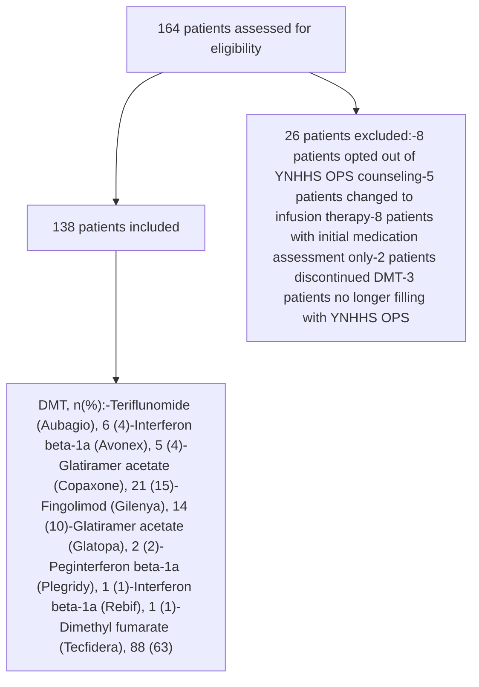

Yale New Haven Health logo

# Correlates and barriers to medication adherence in multiple sclerosis patients and their impact on clinical outcomes

Jenna Lee, PharmD; Mark D'Ambrosi, RPh, CSP; Danielle McPherson, PharmD; Martha Stutsky, PharmD, BCPS
Yale New Haven Health

## Background

* Multiple Sclerosis (MS), a debilitating, chronic disease of the central nervous system, is the most common cause of neurological defects in young adults, affecting more than 2.3 million people worldwide.

* There are currently over a dozen disease-modifying therapies (DMTs) that reduce relapse rates and slow disease progression.

* Despite positive efficacy studies, there are many barriers to medication adherence, which may impact patient outcomes.

## Objective

* Evaluate the correlation between medication adherence and clinical outcomes and to identify barriers to adherence in the MS patients filling DMT prescriptions at Outpatient Pharmacy Services at Yale New Haven Health (YNHHS OPS).

## Methods

* Retrospective, descriptive study of patients diagnosed with MS

* **Inclusion Criteria**: Adult patients filling MS medications at YNHHS OPS in Hamden, CT between January 1, 2018 to July 31, 2018.

* **Exclusion Criteria**: Patients no longer filling with YNHH OPS, not receiving oral or injectable DMT, opted out of YNHH OPS counseling, or have not had >1 fill of DMT

* Subjective adherence and outcomes data were obtained through semi-annual MS Patient Clinical Follow Up assessments conducted by a specialty pharmacist.

* Demographic information, laboratory values, and history were collected and divided into qualitative variables.

* Retrospective medication possession ratios (MPR) data was collected from the pharmacy dispensing system, and hospital admissions obtained through the system-wide electronic health record (EHR).

$$Medication\ Possession\ Ratio = \left( \frac{Total\ Days'\ Supply}{Last\ Fill\ Date - First\ Fill\ Date + Last\ Fill\ Day's\ Supply} \right)$$

* Analyses were performed with RStudio Team (2016). RStudio: Integrated Development for R. RStudio, Inc., Boston, MA

* Correlational analyses identified associations of patient factors and medication adherence and the correlation of medication adherence and clinical outcomes.

* Chi-squared test was utilized to compare nominal variables and t-test was utilized to compare continuous variables.

## Results

**Study Inclusion:**

### Patient Characteristics

| Characteristic\*                   | MPR < 90% (n=21) | MPR ≥ 90% (n=117) | Cumulative (N=138) |
| ---------------------------------- | ---------------- | ----------------- | ------------------ |
| Age, yr. ±SD                       | 46.2 ± 13        | 51.4 ± 11.4       | 50.7 ± 11.7        |
| Male sex, n(%)                     | 5 (23.8)         | 31 (26.5)         | 36 (26)            |
| Race, n(%)                         |                  |                   |                    |
| Caucasian                          | 16 (76.2)        | 75 (64.1)         | 91 (65.9)          |
| African American                   | 5 (23.8)         | 28 (23.9)         | 33 (23.9)          |
| Other                              | 0                | 14 (12)           | 14 (10.2)          |
| Language, n(%)                     |                  |                   |                    |
| English                            | 21 (100)         | 113 (96.6)        | 134 (97.2)         |
| Spanish                            | 0                | 2 (1.7)           | 2 (1.4)            |
| French                             | 0                | 2 (1.7)           | 2 (1.4)            |
| BMI, kg/m² ±SD†                    | 32.7 ± 9.8       | 30 ± 7.5          | 29.5 ± 7.9         |
| MS Subtype, n(%)                   |                  |                   |                    |
| Relapsing-Remitting                | 15 (71.4)        | 110 (94)          | 125 (90.6)         |
| CIS                                | 3 (14.3)         | 2 (1.7)           | 5 (3.6)            |
| Other                              | 3 (14.3)         | 5 (4.3)           | 8 (5.8)            |
| MS Duration, yr. ±SD               | 10.7 ± 10        | 11.7 ± 9.6        | 11.6 ± 9.6         |
| Charleston Comorbidity Index, n(%) |                  |                   |                    |
| Mild (0-2)                         | 15 (71.4)        | 89 (76.1)         | 104 (75.4)         |
| Moderate (3-4)                     | 6 (28.6)         | 22 (18.8)         | 28 (20.3)          |
| Severe (≥ 5)                       | 0                | 6 (5.1)           | 6 (4.3)            |

\*All p values not statistically significant unless indicated
† P=0.05

### Correlation Analysis of Medication Adherence Factors and Clinical Outcomes

| Category                                             | MPR < 80% | MPR ≥ 80% |
| ---------------------------------------------------- | --------- | --------- |
| Depression†                                          | 100       | 38.3      |
| Admission/ED visits document in EHR for MS symptoms‡ | 40.0      | 11.2      |

† Comparison in depression diagnosis in MPR < 80% (n=5) versus MPR ≥ 80% (n=133)
‡ Comparison in MPR < 80% versus MPR ≥ 80%; Correlation with cumulative MPR data also statistically significant (-0.22; p=0.03)

Note: There was not a significant correlation found between medication adherence and the following factors: age, gender, race, smoking status, alcohol use, medication frequency, medication route, reported side effects from medications, insurance type, copay assistance, or patient copay.

There was not a significant correlation found between medication adherence and patient reported missed days of school, work, or planned events or healthcare visits.

### Self Reported Adherence Data*

| Category                       | Percentage |
| ------------------------------ | ---------- |
| Reported no missed doses       | 71         |
| 1 missed dose in last 4 weeks  | 13         |
| 2 missed doses in last 4 weeks | 7          |
| 3 missed doses in last 4 weeks | 7          |
| 4 missed doses in last 4 weeks | 1          |
| 5 missed doses in last 4 weeks | 1          |

\*Reported at pharmacist semi-annual follow-up

## Discussion

* A total of 138 patients were included in the analysis.

* Adherence results found that 3.6% (5/138) of patients had a MPR < 80%, 15.2% (21/138) had a MPR < 90%, and 29% (40/138) of patients subjectively reported missing a dose of medication in the last 4 weeks.

* In patients with a MPR < 90% compared to a MPR ≥ 90%, all patient characteristics were not significantly different between each group with the exception of BMI (p=0.05).

* A weak, but statistically significant, correlation (p < 0.05) was identified between patients with a diagnosis of depression and patients with an MPR < 80%, suggesting a weak correlation between worsening adherence and increasing depressive symptoms.

* There was not a significant correlation found for additional factors.

* A weak, but statistically significant, correlation (p < 0.05) was identified between patients with hospital admissions or ED visits due to MS symptoms documented in the EHR and patients with an MPR < 80% as well as the cumulative MPR results, suggesting a weak correlation between worsening adherence and increasing hospital admission or ED visits due to MS.

## Limitations

* Retrospective, single center analysis

* Small study population

* ED/hospital admissions data was collected from only the YNHHS database

## Conclusions

* Patients who were not adherent to DMTs were associated with a higher rate of hospital admissions or ED visits due to MS symptoms documented in the EHR.

* The importance of mental health for patients should be emphasized in this population as increasing depression symptoms was correlation with decreasing medication adherence.

* Although medication frequency, route, cost, and individual patient factors should be considered when selecting a medication, there was not a correlation between these factors and medication adherence in our patient population.

## Future Directions

* Further initiatives investigating how to improve patient adherence should be conducted.

