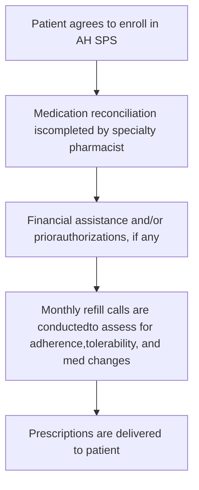

# The Impact of an Integrated Health-System Specialty Pharmacy on HIV Antiretroviral Therapy Adherence, Viral Suppression, and CD4 Count in an Outpatient ID Clinic

Atrium Health logo

Elizabeth Barnes, PharmD, BCACP, AAHIVP; Jing Zhao, MD, PhD; Adam Giumenta, CPhT; Marc Johnson, MD
Atrium Health Myers Park Infectious Disease Clinic, Charlotte, NC; Atrium Health Specialty Pharmacy Services

# Introduction

HIV continues to be a serious health issue in the U.S. However, the Southern states experience the greatest burden of HIV infection with an estimated 46% of all HIV-infected patients residing within this region. The Charlotte Metropolitan area is ranked 25th in the nation for HIV annual case rates and 10th in the Southern U.S. Charlotte-based health-system, Atrium Health (AH), currently cares for over 5,000 HIV-infected patients across 6 different counties through 3 urban outpatient ID clinics. A key component in helping alleviate the burden of HIV in the South, is to ensure that patients are adherent to their treatment regimens. Nearly all patients who adhere to ARV therapy at a rate of 90% or greater are able to achieve and maintain viral suppression which is critical to restoring immune function, improving survival, preventing the development of resistance, and reducing transmission to sexual partners. Clinical pharmacists, as experts in medication management, can play a key role in helping to promote and assist with adherence. AH Specialty Pharmacy Service (SPS) recognized the need to connect the patient, provider, pharmacist, and pharmacy at the point of care in order to improve clinical outcomes for these patients. As a result, a 2-person specialty team consisting of an HIV clinical pharmacist and pharmacy technician were embedded within the AH Myers Park ID clinic in August 2017 to offer specialty pharmacy services.

Figure 1. Atrium Health Specialty Pharmacy Service Practice Model

# Objectives:

* The primary objective was to evaluate the antiretroviral medication adherence rate of patients that utilize AH SPS.

* Main patient-centered clinical endpoints included: (1) the number of patients with a suppressed viral load of < 20 copies/ml, and (2) number of patients with CD4 counts of 200 or greater.

* The intervention group (opt-in group) was defined as HIV patient care that utilized our health-system specialty pharmacy service. The control group (opt-out group) was defined as HIV patient care that did not utilize our health-system specialty pharmacy.

* Within group comparisons from baseline to follow-up were made as well as group-to-group comparisons.

# Methods:

* Single-center, retrospective cohort study conducted from August 7th, 2017 to June 30th, 2018.

* Prescription refill history was reviewed through pharmacy claim data from the date of entry <u>or</u> declination to program up to the end of the follow up (June 30th, 2018).

* Adherence rate was calculated using the calculation for Medication Possession Ratio (MPR). For collection of non-integrated external pharmacy refill data, manual phone calls were made to each pharmacy to inquire about refill histories. For purposes of this evaluation, refill history includes the date the prescription was filled.

* Baseline viral load and CD4 count at time of entry <u>or</u> declination to the program was recorded as well as at the end of the observation period.

# Results

## Baseline Characteristics

* Male vs female ratios were similar in each group; with a slightly older population in the opt-out group.

* In terms of race, there were more black patients within the opt-out group.

* No statistically significant difference in regimen complexity (number of tablets/day).

* Number of pts with psychiatric diagnoses and/or substance abuse disorders were similar.

* Overall, most patients had either Medicare or Medicaid as their payor source (vs commercial insurance)

## Adherence Rates

* For those patients using AH SPS, the median Medication Possession Ratio (MPR) was higher at 100% versus only 94% for those patients that opted out of the service (P < 0.01).

* The total number of patients within the opt-in group with an MPR of 90% or greater was significantly higher when compared with the opt-out group (89.1% vs. 64.0%, P < 0.01).

Table 2. Medication Possession Ratio by Opt-out and Opt-in groups

|                    | Opt-in group (N=46) | Opt-out group (N=50) | P value |
| ------------------ | ------------------- | -------------------- | ------- |
| ≥90%               | 41 (89.1%)          | 32 (64.0%)           |         |
| <90%               | 5 (10.9%)           | 18 (36.0%)           | <0.01ᵃ  |
| Median \[P25, P75] | 1.00 \[0.99, 1.00]  | 0.94 \[0.82, 0.99]   | <0.01ᵇ  |

P values: a= Fisher's exact test, b= Wilcoxon-Mann Whitney test.

Table 1. Baseline patient characteristics

|                            | Opt-in group (N=46) | Opt-out group (N=50) | P value |
| -------------------------- | ------------------- | -------------------- | ------- |
| Age                        | 53.7±12.9           | 58.5±9.4             | 0.04 ᵃ  |
| Sex                        |                     |                      | 0.30ᵇ   |
| Female                     | 22 (47.8%)          | 18 (36.0%)           |         |
| Male                       | 24 (52.2%)          | 32 (64.0%)           |         |
| Race                       |                     |                      | 0.03ᵇ   |
| White                      | 6 (13.0%)           | 2 (4.0%)             |         |
| Black                      | 37 (80.4%)          | 48 (96.0%)           |         |
| Other                      | 3 (6.5%)            | 0 (0.0%)             |         |
| Insurance Status           |                     |                      | 0.23ᵇ   |
| Commercial                 | 9 (19.5%)           | 5 (10.0%)            |         |
| Medicaid                   | 8 (17.4%)           | 17 (34.0%)           |         |
| Medicare only              | 4 (8.7%)            | 11 (22.0%)           |         |
| Medicare + Medicaid        | 25 (54.3%)          | 17 (34.0%)           |         |
| Education                  |                     |                      | 0.28ᶜ   |
| Incomplete high school     | 16 (34.8%)          | 22 (44.0%)           |         |
| High School or GED         | 12 (26.1%)          | 16 (32.0%)           |         |
| Some college or higher     | 18 (39.1%)          | 12 (24.0%)           |         |
| Substance abuse            |                     |                      | 0.63ᶜ   |
| No                         | 33 (71.7%)          | 38 (76.0%)           |         |
| Yes                        | 13 (28.3%)          | 12 (24.0%)           |         |
| Psychiatric diagnosis      |                     |                      | 0.94ᶜ   |
| No                         | 30 (65.2%)          | 33 (66.0%)           |         |
| Yes                        | 16 (34.8%)          | 17 (34.0%)           |         |
| Type of regimen            |                     |                      | 0.48ᵇ   |
| INSTI                      | 33 (71.7%)          | 32 (64.0%)           |         |
| PI                         | 4 (8.7%)            | 6 (12.0%)            |         |
| NNRTI                      | 4 (8.7%)            | 2 (4.0%)             |         |
| Other                      | 5 (10.9%)           | 10 (20.0%)           |         |
| Number of pills in regimen |                     |                      | 0.71ᶜ   |
| 1                          | 25 (54.3%)          | 23 (46.0%)           |         |
| 2                          | 9 (19.6%)           | 11 (22.0%)           |         |
| =3                         | 12 (26.1%)          | 16 (32.0%)           |         |

P values: a= t-test, b= Fisher's exact test, c= Pearson's chi-square test.

## CD4 Count

* Within the opt-in group, of the 6 patients that had CD4 counts < 200 at baseline, all but one had improved immune function with a CD4 count 200 or greater by the end of the observation period (p = 0.03. **Table 3 & Figure 1**).

* There was no improvement in immune function of the 3 patients with CD4 counts < 200 at baseline within the opt-out group.

* By the end of the observation period, the number of patients with weakened immune function as demonstrated by CD4 < 200 increased from 3 to 4 patients.

* No statistically significant difference in meeting the end-point of CD4 200 or greater when the group-to-group comparison was made.

## Viral Load

* Within the opt in group, 10 of the 46 patients had a detectable viral load of 20 copies/ml or greater at baseline.

* By observation period end, all but 3 reached viral suppression of < 20 copies/ml (21.7% at the baseline vs. 6.5% at the follow up, p value = 0.03. **Table 3 & Figure 1**).

* Of the 3 patients that did not reach viral suppression, all had viral loads < 200 copies/ml.

* At baseline within the opt-out group, 12 out of 50 patients had a detectable viral load of 20 copies/ml or greater.

* Only 3 of these 12 patients reached viral suppression by the end of the observation period (p = .41).

* For the 9 remaining patients that did not reach viral suppression, 4 had viral loads of 200 copies/ml or greater.

* No statistically significant difference in meeting the end-point of viral suppression with < 20 copies/ml when the group-to-group comparisons were made.

Figure 2. Viral load suppression and CD4 by Opt-out and Opt-in groups

| Category                      | Baseline (%) | Follow-up (%) |
| ----------------------------- | ------------ | ------------- |
| Opt-out Viral Load Suppressed | 76.0         | 82.0          |
| Opt-in Viral Load Suppressed  | 78.3         | 93.5          |
| Opt-out CD4 Improved          | 94.0         | 92.0          |
| Opt-in CD4 Improved           | 87.0         | 97.8          |

Table 3. Clinical Outcomes by Opt-out and Opt-in groups

|            | Opt-in (N=46) Baseline | Opt-in (N=46) Follow-up | Opt-in (N=46) P ᵃ | Opt-out (N=50) Baseline | Opt-out (N=50) Follow-up | Opt-out (N=50) P ᵃ |
| ---------- | -------------------------- | --------------------------- | --------------------- | --------------------------- | ---------------------------- | ---------------------- |
| Viral load |                            |                             |                       |                             |                              |                        |
| <20        | 36 (78.3%)                 | 43 (93.5%)                  |                       | 38 (76.0%)                  | 41 (82.0%)                   |                        |
| ≥20        | 10 (21.7%)                 | 3 (6.5%)                    | 0.03                  | 12 (24.0%)                  | 9 (18.0%)                    | 0.41                   |
| CD4        |                            |                             |                       |                             |                              |                        |
| <200       | 6 (13.0%)                  | 1 (2.2%)                    |                       | 3 (6.0%)                    | 4 (8.0%)                     |                        |
| ≥200       | 40 (87.0%)                 | 45 (97.8%)                  | 0.03                  | 47 (94.0%)                  | 46 (92.0%)                   | 0.56                   |

a: Using McNemar's test within groups

# Conclusion

* Our integrated health-system specialty pharmacy made a meaningful clinical impact upon HIV-infected patients using our services.

* AH SPS provided high touch support to enrolled patients by proactively offering medication refills, identifying and managing drug interactions, assisting with side effect management and addressing any barriers to adherence.

* Our program identified a statistically significant improvement adherence to ART with the involvement of an integrated health-system specialty pharmacy in patient care.

* Viral suppression rates and immune markers were also significantly improved from baseline to follow-up for those enrolled in our service.

* While the difference between the opt-in and opt-out patients in reaching the clinical endpoints of viral suppression and improved immune function did not meet statistical significance – this may be due in part to the small sample size.

* Ultimately, this demonstrates that a health-system specialty pharmacy service can help to improve the HIV care continuum and should be incorporated into the standard of practice for providing care in this patient population. In the future, AH SPS would like to further evaluate the impact an integrated health-system specialty pharmacy service has upon clinic appointment attendance, hospital admissions, long term survival and opportunistic infection rates.

# Acknowledgements

Thank you to Dr Marc Johnson, Medical Director of the AH Myers Park Infectious Disease Clinic

# Contact Info

Elizabeth.Barnes@atriumhealth.org

# Resources

1. Centers for Disease Control and Prevention. HIV Surveillance Report, 2017; vol. 29. http://www.cdc.gov/hiv/library/reports/hiv-surveillance.html. Published November 2018. Accessed January 15th, 2019.

2. Centers for Disease Control and Prevention. HIV continuum of care, U.S., 2014, overall and by age, race/ethnicity, transmission route and sex. https://www.cdc.gov/nchhstp/newsroom/2017/HIV-Continuum-of-Care.html. Accessed January 15th, 2019.

3. North Carolina HIV/AIDS Surveillance System, Mecklenburg County Data. 2016 Adolescent/Adult Newly Diagnosed HIV Case Reporting: Mecklenburg County. https://www.meckgov/HealthDepartment/HealthStatistics/Documents/2016%20HIV%Disease%20factsheet1.pdf. Published November 2017. Accessed July 24th, 2019.

4. Horberg MA, Hurley LB, Silverberg MJ, Kinsman CJ, Quesenberry CP. Effect of Clinical Pharmacists on Utilization of and Clinical Response to Antiretroviral Therapy. J Acquir Immune Defic Syndr. 2007;44(5):531-539.

5. Crowe M. Evaluating your clinical programs with prescription claim records. Pharmacy Today. 2013;19(7):40-41.

6. Henderson KC, Hindman J, Johnson SC, et al. Assessing the effectiveness of pharmacy-based adherence interventions on anti-retroviral adherence in persons with HIV. AIDS Patient Care STDS. 2011;25(4):221-228.

7. Panel on Antiretroviral Guidelines for Adults and Adolescents, Department of Health and Human Services. Guidelines for the use of antiretroviral agents in HIV-1 infected adults and adolescents. https://aidsinfo.nih.gov/guidelines/html/1/adult-and-adolescent-arv/0. Accessed Jan 15th, 2019.

