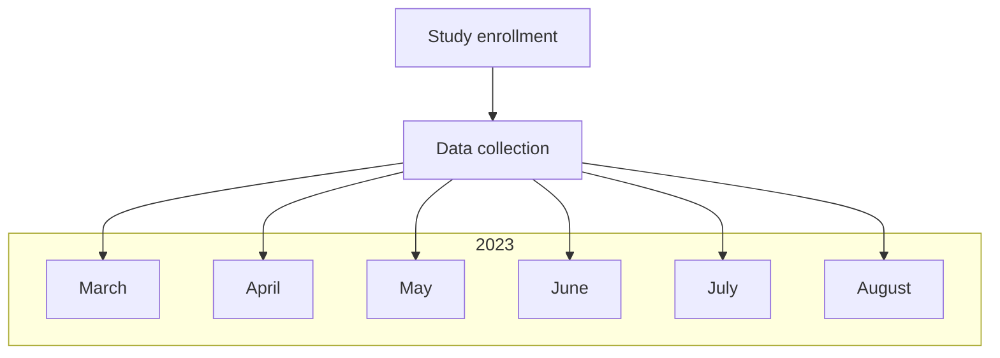
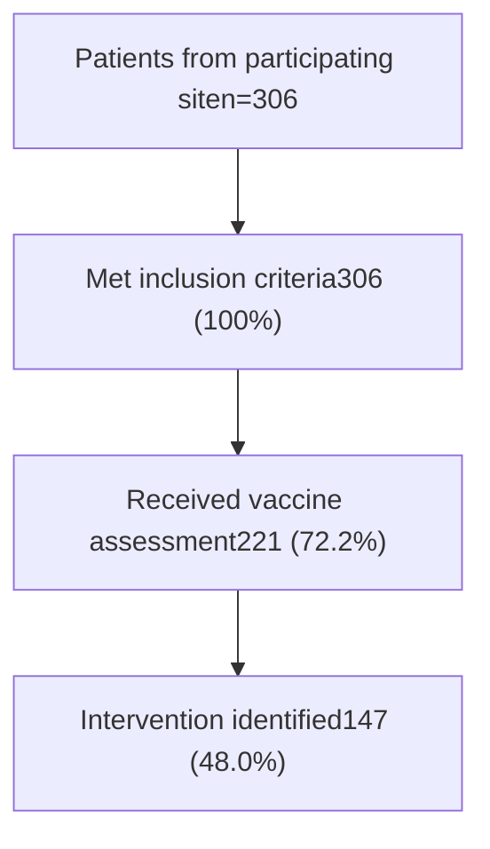

# Immunization Screening Prior to Initiation of Immune Modulating Medications: A Multi-site Study

Amanuel Kehasse, PharmD, PhD2; Kimhouy Tong, PharmD, BCPS1; Rena Gosser, PharmD, BCPS, FASHP3; Karen C. Thomas, PharmD, PhD, MBA4; Mackenzie VanSice, PharmD, BCACP4; Kate Lewis, PharmD, MHA, BCPS5
1Yale New Haven Health; 2Clearway Health; 3UW Medicine; 3University of Illinois Chicago; 4University of Rochester Medical Center; 5Froedtert Health

## Background

* Pharmacists have a long-standing role in immunization uptake and increasingly provide care within different practice settings.

* One rapidly growing practice area is health system specialty pharmacies (HSSPs) serving patients on self-administered biologic therapies and oral small molecules, collectively referred to as immune modulating treatments, which have an increased risk for infection, including those derived from live vaccines.

* Information is limited on whether and how pharmacists may impact immunization rates prior to initiating immune mediating specialty medications, including biologic therapies (e.g. tumor necrosis factor inhibitors such as etanercept) and synthetic small molecules (e.g. JAK inhibitors such as tofacitinib).

## Objectives

Our multi-site study aimed to describe the impact of HSSPs on immunization screening rates and outcomes in patients initiating self-administered immune modulating therapies.

## Methods

* Prospective, observational cohort multi-site study.

* Data collection points include patient demographics, immune suppressing therapy initiated, treated specialty condition, vaccine assessment completion, vaccine assessed, outcome of assessment and intervention details.

* Study sites collected, de-identified, aggregated and uploaded site data to data aggregation platform (REDCap) using data collection template. Lead investigators aggregated all site data for collective analysis.

* Descriptive data presented as numbers and percentages; measures of central tendency presented as median with interquartile ranges.

**Inclusion**

* Prescribed immune modulating specialty medication between March 1, 2023 and May 31, 2023, inclusive

* Medication used to treat dermatologic, inflammatory bowel or rheumatologic condition

## Exclusion

* <18 years

* Treatment with immune modulating specialty medication within prior year

* Prescription originated from outside the health system

## Figure 1. Study timeline

## Figure 2. Enrollment overview

## RESULTS

| Patient characteristics (n=306) Health system specialty pharmacy, n (%) | Patient characteristics (n=306) Health system specialty pharmacy, n (%) | Patient characteristics (n=306) Health system specialty pharmacy, n (%) |
| --------------------------------------------------------------------------- | --------------------------------------------------------------------------- | --------------------------------------------------------------------------- |
| Yale New Haven Health                                                       | 129                                                                         | (42.2)                                                                      |
| Boston Medical Center                                                       | 67                                                                          | (21.9)                                                                      |
| University of Rochester                                                     | 61                                                                          | (19.9)                                                                      |
| University of Washington                                                    | 30                                                                          | (9.80)                                                                      |
| University of Illinois Chicago                                              | 14                                                                          | (4.58)                                                                      |
| Froedtert Hospital                                                          | 5                                                                           | (1.63)                                                                      |
| Age, years (IQR)                                                            | 48                                                                          | (35, 61)                                                                    |
| Gender, n (%)                                                               |                                                                             |                                                                             |
| Female                                                                      | 182                                                                         | (59.5)                                                                      |
| Male                                                                        | 122                                                                         | (39.9)                                                                      |
| Other                                                                       | 2                                                                           | (0.7)                                                                       |
| Race, n(%)                                                                  |                                                                             |                                                                             |
| White                                                                       | 179                                                                         | (58.5)                                                                      |
| Black or African American                                                   | 58                                                                          | (19.0)                                                                      |
| Not available                                                               | 35                                                                          | (11.4)                                                                      |
| Unknown                                                                     | 9                                                                           | (2.94)                                                                      |
| Other                                                                       | 8                                                                           | (2.61)                                                                      |
| Other Asian                                                                 | 7                                                                           | (2.29)                                                                      |
| Decline to Answer                                                           | 4                                                                           | (1.31)                                                                      |
| Vietnamese                                                                  | 2                                                                           | (0.65)                                                                      |
| Asian Indian                                                                | 2                                                                           | (0.65)                                                                      |
| Native Hawaiian/Pacific Islander                                            | 1                                                                           | (0.33)                                                                      |
| Chinese                                                                     | 1                                                                           | (0.33)                                                                      |
| American Indian/Alaska Native                                               | 0                                                                           | (0)                                                                         |

| Clinical characteristics (n=306) Clinical area\*, n (%) | Clinical characteristics (n=306) Clinical area\*, n (%) | Clinical characteristics (n=306) Clinical area\*, n (%) |
| ----------------------------------------------------------- | ----------------------------------------------------------- | ----------------------------------------------------------- |
| Dermatology                                                 | 138                                                         | (45.1)                                                      |
| Rheumatology                                                | 124                                                         | (40.5)                                                      |
| Gastroenterology                                            | 44                                                          | (14.4)                                                      |
| Pharmaceutical class\*, n(%)                                |                                                             |                                                             |
| Tumor necrosis factor inhibitor                             | 169                                                         | (55.2)                                                      |
| Interleukin inhibitor                                       | 104                                                         | (34.0)                                                      |
| Janus kinase inhibitor                                      | 21                                                          | (6.9)                                                       |
| B-cell inhibitor                                            | 10                                                          | (3.3)                                                       |
| T-cell inhibitor                                            | 2                                                           | (0.7)                                                       |
| Intervention outcome, n(%)                                  |                                                             |                                                             |
| Pharmacist communicated to patient                          | 137                                                         | (62.0)                                                      |
| No intervention identified                                  | 74                                                          | (33.5)                                                      |
| Pharmacist communicated to clinic staff                     | 69                                                          | (31.2)                                                      |
| Pharmacist coordinated or placed immunization order         | 13                                                          | (5.9)                                                       |
| Pharmacist recommended delaying therapy start               | 1                                                           | (0.5)                                                       |
| Pharmacist administered immunization                        | 0                                                           | (0)                                                         |
| Collaborative practice agreement, n(%)                      |                                                             |                                                             |
| Ordered vaccine                                             | 11                                                          | (3.6)                                                       |
| Administered vaccine                                        | 1                                                           | (0.3)                                                       |

## Figure 3. Intervention outcomes

| Vaccine                  | Pharmacist coordinated or placed immunization order | Pharmacist communicated to clinic staff | Pharmacist communicated to patient | Patients (n) |
| ------------------------ | --------------------------------------------------- | --------------------------------------- | ---------------------------------- | ------------ |
| COVID                    | 1                                                   | 1                                       | 116                                | 116          |
| Herpes Zoster (Shingrix) | 1                                                   | 1                                       | 66                                 | 66           |
| Pneumococcal             | 1                                                   | 1                                       | 51                                 | 51           |
| Inactivated influenza    | 1                                                   | 1                                       | 32                                 | 32           |
| Tetanus                  | 1                                                   | 1                                       | 26                                 | 26           |
| Pertussis                | 1                                                   | 1                                       | 21                                 | 21           |
| Hepatitis B              | 1                                                   | 1                                       | 11                                 | 11           |
| Hepatitis A              | 1                                                   | 1                                       | 2                                  | 2            |
| N/A                      | 0                                                   | 0                                       | 3                                  | 3            |

\*N/A: none of the listed vaccines

## Discussion

* Study patients were majority female, white and hailing from Northeastern region of the United States.

* Most immune suppressing therapies were initiated for dermatology and rheumatology indications.

* No interventions associated with human papillomavirus, measles, mumps and rubella or meningococcal vaccines.

* The volume of intervention outcomes per vaccine exceed the number of patients per intervened vaccine, suggesting pharmacists provided multiple immunization related services for each vaccine intervention.

* Only a small subset of vaccine services were provided under collaborative practice agreement. This may in part explain the large proportion of interventions communicated to the patient or clinic, who must then take additional steps to address the immunization gap. As such, there may be an opportunity to improve efficiency in safe initiation of immune suppressing agents.

* Despite well-established recognition of pharmacists as immunizers in the community setting, very few vaccine services were provided by HSSP pharmacists.

## Conclusion

* High intervention rates to improve immunizations prior to immune modulating medications speak to the potential opportunity health system specialty pharmacies have in the safe initiation of self-administered immune suppressing therapies.

* Immunization screening coupled with vaccine administration under collaborative practice agreements may be a currently untapped mechanism to improve vaccination rates within the HSSP setting.

## Limitations/Barriers

* HSSPs are highly integrated into health systems, limiting availability of a non-HSSP comparative group.

* Potential variability in definition of vaccine assessment that may have led to under reporting of assessments not associated with an intervention.

## Acknowledgements

Many thanks to the HSSP collaborators on this multi-site study: Autumn Zuckerman & Nick Gazda (Vanderbilt University Medical Center); Thomas Platt (University of Kentucky); Gabrielle Plaia (Dartmouth Hitchcock Medical Center); Jennifer Loucks (University of Kansas Medical Center); Agnes Cha (Northwell Health); Erica Godley (Novant Health).

