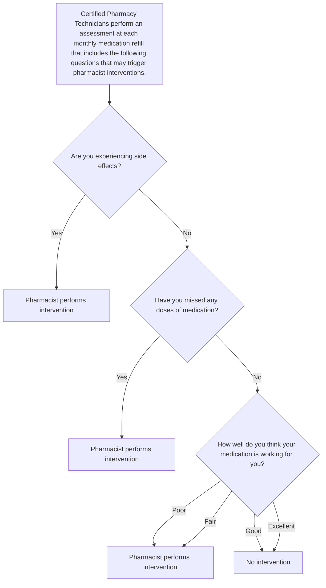

# ASSESSING PATIENT-REPORTED OUTCOMES AND SPECIALTY PHARMACIST INTERVENTIONS IN MULTIPLE SCLEROSIS
QR code
VANDERBILT UNIVERSITY MEDICAL CENTER logo

E. Danielle Bryan, PharmD1 | Rebekah Finley, PharmD candidate2 | Nisha B. Shah, PharmD1 | Ryan Moore, MS3 | Megan Peter, PhD1 | Leena Choi, PhD3 | Autumn D. Zuckerman, PharmD, BCPS, AAHIVP, CSP1
1Vanderbilt Specialty Pharmacy, Vanderbilt University Medical Center | 2Lipscomb University College of Pharmacy | 3Department of Biostatistics, Vanderbilt University Medical Center

## BACKGROUND

* Patient reported outcomes (PROs) are used to assess response to medication and the need for therapeutic adjustments in patients with multiple sclerosis (MS).1,2

* Vanderbilt Specialty Pharmacy assesses PROs through monthly refill questionnaires (MRQs) to help guide specialty pharmacist interventions.

## OBJECTIVE

To assess PROs and pharmacist interventions in patients prescribed specialty multiple sclerosis (MS) medications at a health-system specialty pharmacy.

## METHODS

| DESIGN    | Single-center retrospective analysis                                                                                                                                                               |
| --------- | -------------------------------------------------------------------------------------------------------------------------------------------------------------------------------------------------- |
| INCLUSION | Patients prescribed a MS specialty medication by center’s outpatient MS clinic provider with: • 2+ fills through the center’s specialty pharmacy, AND • 2+ MRQs from January to March 2020 |
| OUTCOMES  | • Adverse effects (AE) • Missed doses and reasons • Perceived effectiveness • Specialty pharmacist interventions                                                                       |

| TABLE 1. DEMOGRAPHICS (n=335) | TABLE 1. DEMOGRAPHICS (n=335) n (%) or median (IQR) |
| ----------------------------- | ------------------------------------------------------- |
| Age, years                    | 45 (52-60)                                              |
| Gender, female                | 256 (76)                                                |
| Race                          |                                                         |
| White                         | 274 (82)                                                |
| Black                         | 50 (15)                                                 |
| Unknown                       | 9 (3)                                                   |
| Other                         | 2 (<1)                                                  |
| Insurance type                |                                                         |
| Commercial                    | 196 (59)                                                |
| Medicare                      | 127 (38)                                                |
| Medicaid                      | 12 (4)                                                  |
| Diagnosis                     |                                                         |
| Relapsing-remitting           | 295 (88)                                                |
| Secondary progressive         | 27 (8)                                                  |
| Primary progressive           | 11 (3)                                                  |
| Clinically isolated syndrome  | 1 (<1)                                                  |
| Tumefactive                   | 1 (<1)                                                  |
| Specialty medication          |                                                         |
| Fingolimod                    | 74 (22)                                                 |
| Dimethyl fumarate             | 63 (19)                                                 |
| Glatiramer acetate            | 56 (17)                                                 |
| Interferon beta-1a            | 56 (17)                                                 |
| Dalfampridine                 | 33 (10)                                                 |
| Teriflunomide                 | 32 (10)                                                 |
| Interferon beta-1b            | 13 (4)                                                  |
| Peginterferon beta-1a         | 7 (2)                                                   |
| Siponimod                     | 1 (<1)                                                  |

## RESULTS

## FIGURE 2. ADVERSE EFFECTS

| Patient Status                             | Specialty medication     | Reported adverse effect                          |
| ------------------------------------------ | ------------------------ | ------------------------------------------------ |
| 98% of patients reported no adverse effect |                          |                                                  |
| 6 patients (2%) reported an AE             | Fingolimod (n=1)         | Hair loss                                        |
|                                            | Interferon beta-1a (n=1) | Flu-like symptoms                                |
|                                            | Dimethyl fumarate (n=4)  | Headache Burning Flushing Dermatitis |

## FIGURE 3. MISSED DOSES

| No missed doses                                             | 1 or more missed doses                                                             |
| ----------------------------------------------------------- | ---------------------------------------------------------------------------------- |
| 90% (n=301) of patients reported no missed medication doses | 10% (n=34) reported 1 or more missed doses                                         |
|                                                             | Forgetfulness was the most reported explanation for missing 1 or more doses (n=22) |

## FIGURE 1. MONTHLY REFILL QUESTIONNAIRE AND WORKFLOW

## FIGURE 4. PERCEIVED MEDICATION EFFECTIVENESS

Perceived effectiveness infographic

| Total Assessments                                     | Perceived Effectiveness (Good or Excellent)                                             |
| ----------------------------------------------------- | --------------------------------------------------------------------------------------- |
| 1,017 medication refill assessments over 335 patients | 98% (n=999) of MRQ responses reported medication effectiveness as ‘good’ or ‘excellent’ |

## FIGURE 5. SPECIALTY PHARMACIST INTERVENTIONS (n=175)

| Intervention Type         | Count |
| ------------------------- | ----- |
| Adherence                 | 39    |
| Safety                    | 36    |
| Side effect/toxicity      | 20    |
| Other drug information    | 15    |
| Disease exacerbation      | 13    |
| Coordination of care      | 11    |
| Financial/insurance issue | 9     |
| Medication list change    | 8     |
| ED/Hospital visit         | 6     |
| New condition             | 6     |
| Drug interaction          | 5     |
| Adverse event             | 2     |
| Administration            | 2     |
| Stability/storage         | 2     |
| Dosing                    | 1     |

* Most common interventions were related to medication adherence, therapeutic monitoring/safety and side effects.
* Interventions related to adherence most often included chart review or update and patient counseling.
* Interventions related to therapeutic monitoring/safety typically included reviewing lab or therapy monitoring and making treatment recommendations.

## CONCLUSIONS

* Patients receiving medication through an integrated health-system specialty pharmacy reported low rates of missed doses (10%) and adverse effects (2%), and most rated high perceived effectiveness of their medication (95%).
* MS integrated specialty pharmacists perform targeted interventions to ensure safe and effective medication use.
* PROs can be used to direct patient’s future course of therapy with the assistance of specialty pharmacist interventions.

1. Lavallee DC, Chenok KE, Love RM, et al. Incorporating Patient-Reported Outcomes Into Health Care To Engage Patients And Enhance Care. Health Aff (Millwood). 2016;35(4):575-582. 2. AMCP Partnership Forum: Improving Quality, Value, and Outcomes with Patient-Reported Outcomes. J Manag Care Spec Pharm. 2018;24(3):304-310.

