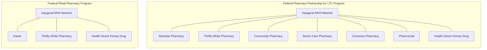

MHA Exceptional Service. Extraordinary People. logo

# Enabling Access to Federal COVID-19 Pharmacy Programs

Stacey Ness, Pharm.D, CSP, IgCP, MSCS, AAHIVP, Diane Koontz, and Russ Procopio

Managed Health Care Associates, Inc. (MHA), Florham Park, NJ

MHA Exceptional Service. Extraordinary People. logo

## BACKGROUND

In late 2020, a collaboration between the federal government, states, and territories was launched to facilitate rapid COVID-19 vaccination across the United States. Two such programs were the Federal Pharmacy Partnership for Long-Term Care (LTC) Program, which facilitated on-site vaccination of residents and staff at more than 75,000 enrolled long-term care facilities1, and the Federal Retail Pharmacy Program, designed to leverage the strength and expertise of pharmacy partners across the country.2

## Federal Pharmacy Partnership for Long-Term Care Program

COVID-19 disproportionally impacted patients in Long Term Care facilities in the United States (US) throughout 2020. Since the pandemic began, it was evident that the elderly and those patients with comorbidities were at increased risk for a more severe form of COVID-19 disease and mortality. Diabetes, cardiovascular disease, chronic respiratory disease, cerebrovascular disease, malignancy, and dementia were shown to independently increase the risk of COVID-19 progression, severe outcomes, and death.3 One study, conducted on 43,510 nursing home residents in the US, showed that 65.5% of nursing facility patients were diagnosed with dementia, 46.8% had hypertension, 20.9% suffered a stroke, 20.6% had diabetes mellitus, and 14.3% chronic obstructive pulmonary disease with a mean age of resident to be 84.4 +/- 7.8, all illustrative of the risk level of nursing facility patients to develop severe COVID-19.4 Further placing facility residents at risk is the incidence of various degrees of disability, which may often lead to the inability to properly perform preventative health measures, such as masking and hand washing. For facility residents with disabilities, interactions with facility personnel to assist with activities of daily living are often prolonged and a limited number of care workers can be responsible for multiple residents.3 Based on the significant risk to facility patients, the Centers for Disease Control (CDC) began discussing plans in 3Q 2020 to prioritize residents and staff in LTC facilities across the US in preparation for the availability of a

## BACKGROUND CONTINUED

COVID-19 vaccine. CDC’s aim was to provide end-to-end management of the COVID-19 vaccination process, including cold chain management, on-site vaccinations, and fulfillment of reporting requirements at no cost to the facilities in order to reduce the burden on LTC facility administration, clinical leadership, and health departments.1

## Federal Retail Pharmacy Program

Once the Federal Pharmacy Partnership for LTC Program was in place to address the needs of that vulnerable patient population, the CDC turned its attention to vaccinating the general population in the most efficient manner possible given the limited vaccine supply available early in 2021. The goals of the CDC’s Federal Retail Pharmacy Program were to make it easier for individuals to access COVID-19 vaccine at a pharmacy in their communities and to improve vaccine uptake while decreasing the logistical and operations burden on state, local and territorial health departments.2

The federal government recognized that pharmacists are highly trusted and trained healthcare providers who have direct access to and knowledge of their patient populations. Pharmacists are trained to counsel patients, administer vaccines, and provide vaccine education. Furthermore, the majority of Americans live within five miles of a pharmacy, making them readily accessible in the community. Therefore, the CDC indicated that pharmacies would be a key component of the COVID-19 vaccine strategy.2

Recognizing the crucial role that post-acute care pharmacies were going to play in the COVID-19 federal government vaccination plans, Managed Health Care Associates, Inc (MHA), a leading post-acute care group purchasing and health care services organization, advocated for inclusion of MHA member pharmacies into these federal programs upon the Federal Pharmacy Partnership for LTC Program’s launch in December 2020 and the Federal Retail Pharmacy Program’s launch in February 2021.1,2

## OBJECTIVE

The objective of this case study is to review the MHA network administrator experience in working with the CDC to ensure that post-acute care pharmacies were able to participate in the Federal Pharmacy Partnership for LTC Program and the Federal Retail Pharmacy Program upon their respective launches.

## METHODS

A retrospective review was conducted of communication and activities with the CDC and other stakeholders from September 2020 through February 2021.

## RESULTS

MHA worked with Health and Human Services (HHS), CDC, jurisdictions, Centers for Medicare and Medicaid Services (CMS), and professional organizations such as American Health Care Association (AHCA), Leading Age, and the American Society of Consultant Pharmacists (ASCP) to advocate for participation of post-acute care pharmacies in federal COVID-19 vaccination programs. MHA successfully advocated on behalf of member pharmacies in the post-acute care space to enable pharmacy participation in both the Federal Pharmacy Partnership for LTC Program and the Federal Retail Pharmacy Program upon their respective launches, with MHA serving as the network administrator.

On-site vaccine administration for LTC facilities launched nationally on December 21, 2020 with 52 jurisdictions participating. Federal LTC pharmacy partners upon program launch included CVS and Walgreens along with MHA network pharmacies. Due to MHA’s advocacy efforts, MHA network pharmacies included upon program launch were: Absolute Pharmacy, Community Pharmacy, Consonus Pharmacy, Health Direct/Kinney Drugs, Pharmscript, Senior Care Pharmacy, and Thrifty White Pharmacy.1

The Federal Retail Pharmacy Program launched in February 2021 with 20 pharmacy partners along with MHA network pharmacies Thrifty White Pharmacy, Health Direct/Kinney Drugs, and Kaiser participating at the inauguration of the program.2

## CONCLUSION

MHA’s advocacy efforts enabled MHA member pharmacies in the post-acute care setting to access and participate in both the Federal Pharmacy Partnership for LTC Program and the Federal Retail Pharmacy Program upon their respective launches, with MHA serving as the network administrator.

Although both the federal COVID-19 vaccine programs have since expanded their reach significantly, it was critical to work with multiple stakeholders in order to facilitate access at the earliest possible time for as many pharmacies as possible in order to rapidly deploy the COVID-19 vaccine. Future research will detail the expansion of the MHA Network of participating pharmacies in the Federal Pharmacy Partnership for LTC Program and the Federal Retail Pharmacy Program. As of May 20, 2021, there were 116 corporations participating in federal programs via the MHA pharmacy network, comprised of 633 individual pharmacies serving vaccine recipients in 48 states.5

## REFERENCES

1. Understanding the Pharmacy Partnership for Long-Term Care Program, archived version available at <u>https://web.archive.org/web/20210202132328/https://www.cdc.gov/vaccines/covid-19/long-term-care/pharmacy-partnerships.html</u> Accessed August 2021.

2. Understanding the Federal Retail Pharmacy Program for COVID-19 Vaccination. Available at : <u>https://www.cdc.gov/vaccines/covid-19/retail-pharmacy-program/index.html</u> Accessed August 2021

3. The Impact of COVID-19 Pandemic on Long-Term Care Facilities Worldwide: An Overview on International Issues. Available at <u>https://www.hindawi.com/journals/bmri/2020/8870249/</u> Accessed August 2021.

4. Comorbidity and 1-Year Mortality Risks in Nursing Home Residents. Available at <u>https://agsjournals.onlinelibrary.wiley.com/doi/abs/10.1111/j.1532-5415.2005.53216.x</u> Accessed August 2021.

5. Managed Health Care Associates, Inc. (MHA), Data on File. Accessed May 20, 2021.

For additional information, contact info@mhainc.com
Presented virtually to the National Association of Specialty Pharmacy, September 2021.

© 2021 Managed Health Care Associates, Inc. All Rights Reserved

RESEARCH POSTER PRESENTATION DESIGN © 2015 www.PosterPresentations.com

