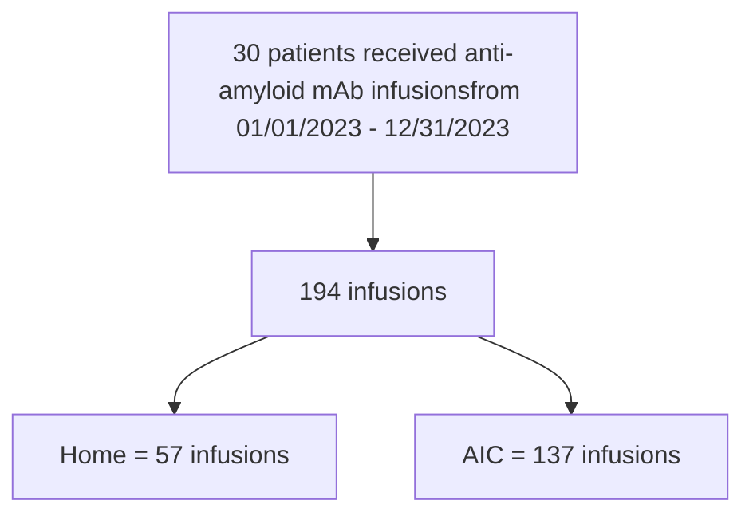

# Evaluating the safety of anti-amyloid monoclonal antibody infusions in alternative sites of care
Authors: Christine Miller, PharmD; Lauren Pica, APRN, FNP-C; Barbara Prosser, RPh, FNHIA; Lynn Janssen, PharmD – Soleo Health
SOLEO HEALTH Simplifying Complex Care logo

## Background
The approval of anti-amyloid monoclonal antibodies (mAbs) provides a novel approach to the treatment of Alzheimer's disease. Infusions in alternative sites of care can benefit the patient financially and logistically, but coverage is largely payor dependent. The purpose of this study is to describe observations from this national complex specialty pharmacy around the safety of anti-amyloid mAb infusions in alternative sites of care, including the home.

## Methods
A multidisciplinary team conducted a retrospective review of medical records for patients receiving anti-amyloid mAbs from 01/01/2023-12/31/2023, including infusion-related reactions and adverse events reported by the patient or caregiver. Thirty patients received a total of 194 infusions administered by registered nurses employed by this organization. Fifty-seven infusions were provided in the home environment, and 137 infusions were conducted in the pharmacy's ambulatory infusion centers (AIC).

## Results

**Table 1. Infusion-Related Reactions Observed by the Nurse During Anti-Amyloid mAb Infusions**

| Infusion-Related Reaction | Infusions (Total=194) Number | Infusions (Total=194) % | Patients (n=30) Number | Patients (n=30) % |
| ------------------------- | -------------------------------- | --------------------------- | -------------------------- | --------------------- |
| Headache                  | 3                                | 1.5%                        | 1                          | 3%                    |
| Hypertension              | 3                                | 1.5%                        | 3                          | 10%                   |
| Hypotension               | 21                               | 11%                         | 13                         | 43%                   |
| Paresthesia               | 1                                | 0.5%                        | 1                          | 3%                    |
| None                      | 166                              | 85.5%                       | 29                         | 97%                   |

* Twenty-nine patients experienced zero infusion-related reactions across 166 infusions.
* The infusion rate was slowed during 1% of infusions.
* Zero infusions were discontinued due to infusion-related reactions.
* No signs or symptoms of hypersensitivity or other infusion-related reactions were observed by the nurse or reported by the patient during drug administration or the post-infusion observation period.
* None of the following were identified during the infusions or the post-infusion observation period: Fever, chills, aches, pain, nausea, vomiting, rash, dizziness, swelling, hives, itchiness, edema, cough.
* Patients completed mini-mental state exams with the registered nurse during 94% of clinical assessments performed with the infusions.

**Table 2. Adverse Events Reported by the Patient or Caregiver During Clinical Assessment with Each Anti-Amyloid Infusion (Total=194)**

| Adverse Event     | Infusions (number) | Infusions (%) |
| ----------------- | ------------------ | ------------- |
| Dizziness         | 5                  | 3%            |
| Fall              | 13                 | 7%            |
| Flu-like symptoms | 3                  | 2%            |
| Laryngitis        | 7                  | 4%            |
| Nausea            | 3                  | 2%            |
| None              | 170                | 88%           |

* Some patients reported multiple adverse events around the same infusion.
* Adverse events reported in ≤1% infusions include chills, diarrhea, fatigue, fever, GI symptoms, headache, macular degeneration, seizure-like activity, vomiting, and weight loss.

**Table 3. Symptoms of Amyloid-Related Imaging Abnormalities (ARIA) Reported or Observed During Clinical Assessment with Each Anti-Amyloid Infusion**

| ARIA symptom                   | Infusions (Total=194) Number | Infusions (Total=194) % | Patients (n=30) Number | Patients (n=30) % | Number of patients who reported the ARIA symptom during baseline assessment |
| ------------------------------ | -------------------------------- | --------------------------- | -------------------------- | --------------------- | --------------------------------------------------------------------------- |
| Altered mental status          | 11                               | 6%                          | 1                          | 3%                    | 0                                                                           |
| Confusion                      | 21                               | 11%                         | 5                          | 17%                   | 3                                                                           |
| Disorientation                 | 6                                | 3%                          | 2                          | 7%                    | 1                                                                           |
| Dizziness/Vertigo              | 3                                | 2%                          | 2                          | 7%                    | 1                                                                           |
| Headache                       | 14                               | 7%                          | 2                          | 7%                    | 1                                                                           |
| Gait difficulty                | 2                                | 1%                          | 2                          | 7%                    | 1                                                                           |
| Irregular verbal communication | 4                                | 2%                          | 1                          | 3%                    | 0                                                                           |
| Visual disturbance             | 2                                | 1%                          | 1                          | 3%                    | 1                                                                           |
| None                           | 160                              | 82%                         | 23                         | 77%                   |                                                                             |

\* One patient discontinued therapy after confirmatory MRI
\* One patient discontinued due to non-response to therapy after one year, as determined by the prescriber

## Conclusion
With the prevalence of Alzheimer's disease expecting to reach 13 million by 2050, a wider scope of services needs to be considered for this patient population. Anti-amyloid mAb infusions can be safely and successfully administered in alternative sites of care, including the home. The Alzheimer's therapy pipeline is rich and encompasses different mechanisms of action and routes of administration. These therapies may continue to require specialized testing to gain and maintain access to the medication and to monitor for adverse events periodically. Specialty pharmacies are poised as partners within the healthcare system to help manage the patient journey with these complex therapies and provide alternative sites of care to this growing population.

Authors of this presentation disclose the following concerning possible financial or personal relationships with commercial entities that may have a direct or indirect interest in the subject matter of this presentation: Nothing to disclose
© 2024 Soleo Health Inc. All Rights Reserved

