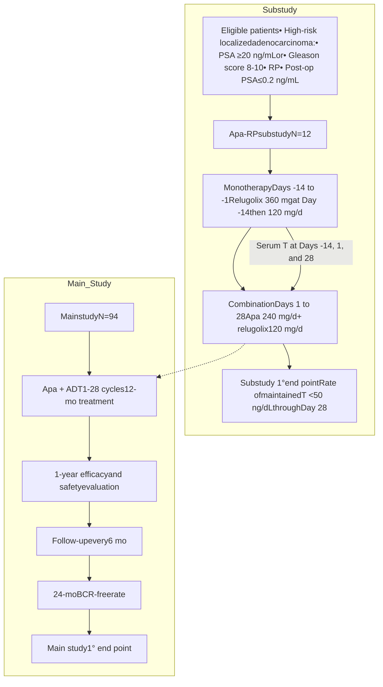

40

# Concomitant Apalutamide and Relugolix in Patients With High-Risk Localized Prostate Cancer: Testosterone Suppression 1-Year Update

Gordon Brown,1,2 Laurence Belkoff,3 Jason Hafron,4 Pankaj Aggarwal,5 Rushikesh Potdar,5 Amitabha Bhaumik,6 Jennifer Phillips,5 Tracy McGowan,5 Neal Shore7

1New Jersey Urology, A Summit Health Company, Voorhees, NJ; 2Rowan University School of Osteopathic Medicine, Stratford, NJ; 3MidLantic Urology LLC, Bala Cynwyd, PA; 4Michigan Institute of Urology, West Bloomfield, MI; 5Janssen Medical Affairs, Horsham, PA; 6Janssen Research & Development, Titusville, NJ; 7Carolina Urologic Research Center, Myrtle Beach, SC

## INTRODUCTION

* Apalutamide (Apa) is an orally available androgen receptor inhibitor approved for nonmetastatic castration-resistant and metastatic castration-sensitive prostate cancer (PC) in combination with androgen deprivation therapy (ADT)1

* Relugolix is a new oral form of ADT2 that has not been extensively studied in combination, including with Apa, for the suppression of testosterone (T)

* The label for relugolix recommends doubling the dose to maintain castration levels of T when coadministered with CYP3A inducers such as Apa

* Apa-RP is a single-arm, open-label, multicenter, phase 2 study that evaluates the biochemical recurrence (BCR)-free rate in patients with high-risk localized PC following radical prostatectomy (RP) who received 12 months of adjuvant Apa and ADT (Figure 1). Follow-up for this study is ongoing

* A substudy of Apa-RP assessed castration (T <50 ng/dL) and adverse events (AEs) seen with coadministration of Apa + relugolix in 12 patients (Figure 1). The primary end point was rate of castration through the initial 28 days of coadministration following a 14-day run-in with relugolix monotherapy

* We previously reported that coadministration of Apa + relugolix maintained castration at the 28-day time point without the need for dose adjustment of relugolix3

* Patients who maintained castration continued on to the main study for an additional 11 cycles of Apa + relugolix

### FIGURE 1: Apa-RP substudy and main study

PSA, prostate-specific antigen.

## OBJECTIVE

* To assess maintenance of castration with Apa + relugolix through 1 year of coadministration

## METHODS

* T levels at the following time points were analyzed: at baseline (Day -14), on Days 1 and 28, then every 3 months for 1 year, and at 30 days post treatment discontinuation

* Treatment-emergent AEs (TEAEs) are reported for the above time period

## RESULTS

### Patient disposition

* Of 12 enrolled patients, all continued on to the main study and continued with Apa + relugolix

* 10 patients completed Apa + relugolix therapy at 1 year:

- 2 withdrew because of AEs before the 1-year time point (complications of COVID-19 and Stevens-Johnson syndrome)

### Testosterone levels through 1 year

* Of 10 patients who completed therapy by 1 year, all maintained castration (T <50 ng/dL) (Figure 2 and supplement icon)

- 8 patients recovered their T (>50 ng/dL) by 1 month after treatment discontinuation. The other 2 patients continue to be followed for T recovery

- Median T was 348.5 (182-697) ng/dL at Day -14, 8.5 (2.4-40) ng/dL at 1 year, and recovered to 229.5 (23-352) ng/dL at 1 month post treatment discontinuation (Figure 3)

* No patients required an increase in their relugolix dose

### Safety profile

* All patients (100%) experienced an AE, with 50% being grade 3-4, and 25% considered serious (Table 1)

* The most common TEAEs were fatigue and hot flash (Table 1)

#### TABLE 1: Summary of TEAEs during 1 year of treatment with Apa + relugolix

| Overall population N=12 TEAE, n (%)                              | Overall population N=12 Apa + relugolix |
| -------------------------------------------------------------------- | ------------------------------------------- |
| Any                                                                  | 12 (100)                                    |
| Grade 3-4                                                            | 6 (50)                                      |
| Serious                                                              | 3 (25)                                      |
| TEAEs leading to Tx discontinuation, interruption, or dose reduction | 2 (17)                                      |
| TEAEs leading to death                                               | 0                                           |
| TEAEs occurring in ≥2 patients                                       |                                             |
| Fatigue                                                              | 5 (42)                                      |
| Hot flash                                                            | 5 (42)                                      |
| Rash                                                                 | 3 (25)                                      |
| COVID-19                                                             | 3 (25)                                      |
| Arthralgia                                                           | 2 (17)                                      |
| Back pain                                                            | 2 (17)                                      |
| Headache                                                             | 2 (17)                                      |

TEAEs were graded per Common Terminology Criteria for Adverse Events v 5.0. Tx, treatment.

### FIGURE 2: Rates of castration through 1 year

| Time Point | Patients With Testosterone <50 ng/dL (%) | n   |
| ---------- | ---------------------------------------- | --- |
| Day -14    | 0                                        | 12  |
| Day 1      | 100                                      | 12  |
| Day 28     | 100                                      | 11a |
| 1 year     | 100                                      | 10b |

aOne patient had missing T measurement. bTwo patients withdrew. Data are summarized descriptively.

### FIGURE 3: Median (range) T levels with Apa + relugolix

| Time Point                       | Median T Levels (ng/dL) | Range (ng/dL) | n   |
| -------------------------------- | ----------------------- | ------------- | --- |
| Day -14                          | 348.5                   | 182-697       | 12  |
| Day 1                            | 8.7                     | <3-26         | 12  |
| Day 28                           | 10                      | <3-35         | 11a |
| 1 year                           | 8.5                     | 2.4-40        | 10b |
| 1 month after Tx discontinuation | 229.5                   | 23-352        | 10b |

aOne patient had missing T measurement. bTwo patients withdrew. Data are summarized descriptively.

## KEY TAKEAWAY

Key icon Relugolix leads to effective, long-term castration without the need for dose adjustment when coadministered with apalutamide, with rapid recovery of testosterone upon treatment discontinuation

## CONCLUSIONS

Checkmark icon 1-year Apa + relugolix coadministration maintained castrate T levels in all patients who completed therapy

Checkmark icon 8 patients were able to recover their T within 1 month of treatment discontinuation

Checkmark icon The safety findings in this study were consistent with the known safety profiles of each drug

## ACKNOWLEDGMENTS

Thank you to the patients who participated in this study and their families, as well as the investigators, study coordinators, and study teams.

The apalutamide and androgen deprivation therapy (ADT) adjuvant to radical prostatectomy (Apa-RP) study, including this reported substudy of apalutamide and relugolix, was sponsored by Janssen US Medical Affairs.

Writing assistance was provided by Larissa Belova, PhD, and Laura Graham, PhD, of Parexel, and was funded by Janssen US Medical Affairs.

## DISCLOSURES

**GB**: Consultant/advisor, speakers’ bureau, expert testimony: Astellas Pharma, Bayer, Janssen, Merck, Pfizer; research funding: Janssen Biotech, Merck. **JH**: Consultant/advisor: Astellas Pharma Inc., Dendreon Pharmaceuticals LLC, Janssen Biotech Inc., Myriad Genetic Laboratories, Myovant Sciences, Pfizer Inc., Promaxo, Lynx DX; meeting participant/lecturer: Astellas Pharma Inc., Amgen Inc., Bayer, Blue Earth Diagnostics, Dendreon Pharmaceuticals LLC, Janssen Biotech Inc., Lantheus, Merck & Co., Myriad Genetic Laboratories, Myovant Sciences, Pfizer Inc., Procept-Biorobotic, Progenics Pharmaceuticals, Inc., Tolmar Pharmaceuticals Inc., Urogen Pharma Inc. **NS**: Consultant/advisor: AbbVie, Amgen, Astellas Pharma, AstraZeneca, Bayer, Boston Scientific, Bristol Myers Squibb/Sanofi, Clarity Pharmaceuticals, CG Oncology, Clovis Oncology, Dendreon, Exact Imaging, Exact Sciences, FerGene, Ferring, Foundation Medicine, Genesis Cancer Care, Genzyme, InVitae, Janssen Scientific Affairs, Lantheus, Lilly, MDxHealth, Medivation/Astellas, Merck, Myovant Sciences, Myriad Genetics, Nymox, Pacific Edge Biotechnology, Pfizer, Phosphorus, Sanofi, Sema4, Sesen Bio, Specialty Networks, Peerview, Photocure, Propella Therapeutics, Telix Pharmaceuticals, Tempus, Tolmar, Urogen Pharma, Vaxiion; speakers’ bureau: Astellas Pharma, AstraZeneca, Bayer, Janssen, Clovis Oncology, Foundation Medicine, Guardant Health, Merck, Pfizer; expert testimony: Ferring; research funding: AbbVie, Advantagene, Amgen, Aragon Pharmaceuticals, Astellas Pharma, AstraZeneca, Bayer, Boston Scientific, Bristol Myers Squibb/Pfizer, CG Oncology, Clovis Oncology, Dendreon, DisperSol, Endocyte, Exact Imaging, Exelixis, Ferring, FKD Therapies, FORMA Therapeutics, Foundation Medicine, Genentech, Guardant Health, In-Vitae, ISTARI Oncology, Janssen, Jiangsu Yahong Meditech, MDx-Health, Medivation, Merck, MT Group, Myovant Sciences, Myriad Genetics, Novartis, Nymox, OncoCellMDx, Pacific Edge, Palette Life Sciences, Pfizer, Plexxikon, POINT Biopharma, Propella Therapeutics, RhoVac, Sanofi, Seattle Genetics, Sesen Bio, Steba Biotech, Theralase, Tolmar, Very, Urogen Pharma, Urotronic, US Biotest, Vaxiion, Zenflow. **RP, PA, AB, JP, and TM**: employees of Janssen US Medical Affairs or Janssen Research & Development and may hold stock in Johnson & Johnson. **LB**: no conflicts of interest to declare.

PROSTATE CANCER logo

## REFERENCES:

1. ERLEADA (apalutamide) [prescribing information]. Janssen Pharmaceutical Companies, Horsham, PA.
2. Shore ND, et al. *N Engl J Med.* 2020;382:2187-2196.
3. Brown G, et al. *Target Oncol.* 2023;18:95-103.

## Scan the QR code
QR Code

http://qr-landingpage.com/NASP_Brown_Apa_RP-Relugolix

The QR code is intended to provide scientific information for individual reference, and the information should not be altered or reproduced in any way.

Presented at NASP 2023 Annual Meeting & Expo; September 18-21, 2023, Grapevine, Texas, USA.

