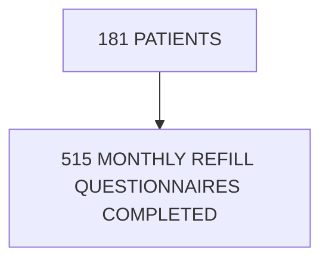

# ASSESSING PATIENT-REPORTED OUTCOMES WITHIN AN INFLAMMATORY BOWEL DISEASE CLINIC AT AN INTEGRATED CARE CENTER
Vanderbilt University Medical Center logo

E. DANIELLE BRYAN, PHARMD1, BROOKE WELCH, PHARMD CANDIDATE2, NISHA B. SHAH, PHARMD1, AUTUMN D. ZUCKERMAN, PHARMD, BCPS, AAHIVP, CSP1, RYAN MOORE, MS3
1VANDERBILT SPECIALTY PHARMACY, VANDERBILT UNIVERSITY MEDICAL CENTER, 2UNIVERSITY OF TENNESSEE HEALTH SCIENCE CENTER, 3DEPARTMENT OF BIOSTATISTICS, VANDERBILT UNIVERSITY MEDICAL CENTER

## BACKGROUND

* Inflammatory bowel disease (IBD) impacts a patient’s quality of life and routine functioning.1

* Patient reported outcomes (PROs) can help assess disease status and response to medication therapy. Vanderbilt Specialty Pharmacy collects PROs through the monthly refill questionnaires (MRQs).

* Short inflammatory bowel disease questionnaire (SIBDQ) and patient health questionnaire (PHQ) are disease specific PROs routinely collected to assess disease status. An inflammatory lab marker C-reactive protein (CRP) can also be used.2

## OBJECTIVE

To evaluate PROs in patients prescribed specialty medications by a health-system based outpatient IBD clinic and dispensed by an integrated specialty pharmacy.

## METHODS

| DESIGN          | Single-center retrospective analysis                                                                                                         |
| --------------- | -------------------------------------------------------------------------------------------------------------------------------------------- |
| INCLUSION       | Patients with IBD prescribed a specialty medication with: • 2+ fills through the center's specialty pharmacy, and • 2+ MRQ responses |
| TIME PERIOD     | January through March 2020                                                                                                                   |
| PRIMARY OUTCOME | Patient-reported adverse events, missed doses and medication effectiveness                                                                   |

**SECONDARY OUTCOMES**: To evaluate change from patient's baseline using: SIBDQ, PHQ, and CRP

## RESULTS

**TABLE 1. COHORT DEMOGRAPHICS (N=181)**

|                              | n (%)      |
| ---------------------------- | ---------- |
| Age, years, median (IQR\\\*) | 42 (33,55) |
| Gender, female               | 95 (52%)   |
| Race                         |            |
| White                        | 167 (92%)  |
| Black or African American    | 9 (5%)     |
| Asian                        | 3 (2%)     |
| Unknown                      | 1 (<1%)    |
| Insurance type               |            |
| Commercial                   | 140 (77%)  |
| Medicare                     | 33 (18%)   |
| Medicaid                     | 4 (2%)     |
| Other                        | 4 (2%)     |

\*Interquartile range

## RESULTS

| TABLE 2. IBD STATUS AND CHARACTERISTICS (N=181) | TABLE 2. IBD STATUS AND CHARACTERISTICS (N=181) n (%) |
| ----------------------------------------------- | --------------------------------------------------------- |
| IBD Type                                        |                                                           |
| Crohn's                                         | 158 (87%)                                                 |
| Ulcerative Colitis                              | 23 (13%)                                                  |
| Crohn's Type                                    |                                                           |
| Fistulizing disease                             | 74 (47%)                                                  |
| Stricturing disease                             | 69 (44%)                                                  |
| Perianal disease                                | 60 (38%)                                                  |
| Disease extent                                  |                                                           |
| Both small bowel and colonic                    | 58 (37%)                                                  |
| Small bowel only                                | 34 (22%)                                                  |
| Colonic                                         | 31 (20%)                                                  |
| All sites                                       | 28 (18%)                                                  |
| Ileal                                           | 7 (4%)                                                    |
| Previous IBD surgery, yes                       | 79 (50%)                                                  |
| Previous biologic therapy, yes                  | 106 (66%)                                                 |

**FIGURE 2. MISSED DOSES (N=181)**

| Status                 | Percentage (n) |
| ---------------------- | -------------- |
| No missed              | 94% (n=170)    |
| At least 1 missed dose | 6% (n=11)      |

**Reasons for missed doses (n=11):**
* Ran out of medication (n=1)
* Need follow-up MD appointment prior to refills (n=2)
* Forgetfulness (n=2)
* Held due to illness or procedure (n=3)
* Hospitalization (n=4)

**FIGURE 1. IBD SPECIALTY MEDICATIONS (N=181)**

| Medication   | Number of Patients |
| ------------ | ------------------ |
| Adalimumab   | 104                |
| Ustekinumab  | 57                 |
| Tofacitinib  | 8                  |
| Golimumab    | 6                  |
| Certolizumab | 6                  |

**FIGURE 3. ADVERSE EVENTS (N=181)**

| Status                                  | Percentage (n) |
| --------------------------------------- | -------------- |
| No adverse effects                      | 99%            |
| Reported adverse effects on ustekinumab | 1% (n=2)       |

**Reported adverse effects:**
* Hot flashes
* Headache

**FIGURE 4. MEDICATION EFFECTIVENESS (N=515)**

| Effectiveness Rating | Percentage |
| -------------------- | ---------- |
| Excellent            | 85%        |
| Good                 | 13%        |
| Fair                 | 2%         |

Most patients (98%) reported effectiveness as 'good' or 'excellent'.

**FIGURE 5. SIBDQ, PHQ AND CRP**

| Days since first lab | SIBDQ Score |
| -------------------- | ----------- |
| 0                    | 58          |
| 200                  | 56          |
| 400                  | 54          |
| 600                  | 52          |

Most patients' SIBDQ scores decreased over time indicating an improvement in disease severity based on patient response.

| Days since first lab | PHQ-9 Score |
| -------------------- | ----------- |
| 0                    | 5           |
| 200                  | 5           |
| 400                  | 5           |
| 600                  | 5           |

Most patients' PHQ-9 scores were relatively stable over time.

| Days since first lab | C-Reactive Protein (mg/L) |
| -------------------- | ------------------------- |
| 0                    | 5                         |
| 200                  | 6                         |
| 400                  | 8                         |
| 600                  | 10                        |

Most patients' CRP lab values slightly increased over time, indicating more inflammation.

## CONCLUSIONS

* Patients with IBD receiving care within an integrated care model reported high rate of medication effectiveness and low rates of adverse effects and missed doses.

* The secondary outcomes remained relatively stable, which concluded no significant differences over time when compared to the patient’s baseline.

* Additional research is needed to evaluate the relationship between PROs and long-term clinical outcomes.

1. Jackson BD, et al. Examination of the relationship between disease activity and patient-reported outcome measures in an IBD cohort. Intern Med J. 2018;48(10):1234-1241. 2. Crohn’s & Colitis Foundation. IBD Surveys for Clinical Practice. Corhnscolitisfoundation.org. New York, June 2018. 3. GBD 2017 IBD Collaborators. The global, regional, and national burden of inflammatory bowel disease in 195 countries and territories, 1990-2017: a systematic analysis for the Global Burden of Disease Study 2017. Lancet Gastroenterol Hepatol. 2020 Jan 5.

