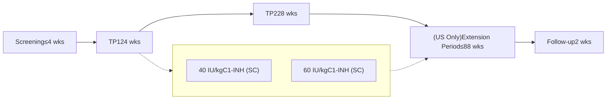

# Patterns of On-demand Medication Use in Patients With Hereditary Angioedema Treated Long-term With Prophylactic Subcutaneous C1-Inhibitor

Donald S. Levy,1 Joseph Chiao,2 John Dang,2 Christopher Hood,2 Henrike Feuersenger3

1University of California-Irvine, Orange, California, USA; 2CSL Behring, King of Prussia, Pennsylvania, USA; 3CSL Behring, Marburg, Germany

## INTRODUCTION

* Hereditary angioedema (HAE) due to C1-inhibitor (C1-INH) deficiency is characterized by recurrent edema of the face, limbs, and trunk, and submucosal tissues of the gastrointestinal, genitourinary, and upper respiratory tracts.1,2 Attacks may be disfiguring, painful, and, in the case of upper airway involvement, potentially fatal.3,4

* International HAE treatment guidelines recommend that all acute attacks be considered for immediate (on-demand) treatment.5 Recommended medications for on-demand treatment include C1-INH (plasma-derived or recombinant); ecallantide, a kallikrein inhibitor; and icatibant, a bradykinin-2-receptor antagonist.5

* HAE prophylactic therapy has the potential to reduce the need for on-demand treatment by decreasing the frequency and severity of attacks, which may in turn improve the cost-effectiveness of overall therapy.

* Subcutaneous C1-inhibitor (C1-INH [SC] 60 IU/kg, HAEGARDA®, CSL Behring) is indicated for routine prophylaxis to prevent attacks in adolescent and adult patients with HAE.6 Efficacy and safety of C1-INH (SC) was demonstrated in a placebo-controlled phase III trial (COMPACT) and an open-label extension (OLE) of this trial, in which patients were treated for up to 2.7 years.7,8 In these studies, patients were permitted to use on-demand rescue medication for the treatment of acute attacks.7,8

* In this analysis, we examined patterns of on-demand medication use in patients treated with C1-INH (SC) 60 IU/kg in the OLE.

## METHODS

* The OLE of the COMPACT trial was a multicenter, randomized, parallel-arm study. Eligible patients (age ≥6 years with ≥4 attacks over 2 consecutive months) were randomly assigned to receive C1-INH (SC) at 40 IU/kg or 60 IU/kg twice weekly for 52 weeks. Patients in the United States were eligible to continue treatment for up to 140 weeks (Figure 1).

* Throughout the study, patients were permitted to use on-demand medication for treatment of any HAE attacks, including plasma-derived C1-INH, recombinant C1-INH, icatibant, ecallantide, and fresh frozen plasma.

## Figure 1. COMPACT Open-label Extension Study Design

Up-titration was allowed in increments of 20 IU/kg (up to 80 IU/kg) in case of frequent HAE attacks

* The use of on-demand medication for the treatment of HAE attacks was an exploratory endpoint.

* An attack was considered treated if use of on-demand medication was recorded in the electronic case report form between the start and end date of the HAE attack.

## RESULTS

* A total of 126 patients were randomized to treatment (40 IU/kg: n = 63; 60 IU/kg: n = 63). Data for the FDA-approved 60 IU/kg dose are presented.

* Of the 63 patients in the 60 IU/kg treatment arm, 24 (38.1%) had at least 1 treated attack.

* The mean (SD) and median (range) numbers of treated HAE attacks per month were 0.27 (0.66) and 0.00 (0.00–3.87), respectively.

* In the 60 IU/kg treatment arm, a total of 371 HAE attacks were reported, of which 229 (61.7%) were treated with on-demand medications. Of the 229 attacks, 83.8% (192/229) were treated with only 1 dose of on-demand medication (Table 1).

* The majority of treated attacks were treated with plasma-derived C1-INH (IV) or icatibant (Figure 2). No attacks were treated with recombinant C1-INH or fresh frozen plasma.

* Of the 229 attacks that were treated, 113 (49%) were severe, 89 (39%) were moderate, and 27 (12%) were mild. The mean (SD) severity of treated attacks was 1.97 (0.58) (1 = mild, 2 = moderate, 3 = severe).

## Table 1. Treated HAE Attacks During Prophylaxis With C1-INH (SC) 60 IU/kg

| Uses of Rescue Medication, n | Patients With Treated Attacks (N=63), n (%) | Treated Attacks (N=229), n (%) |
| ---------------------------- | ------------------------------------------- | ------------------------------ |
| 1                            | 24 (38.1)                                   | 192 (83.8)                     |
| 2                            | 6 (9.5)                                     | 25 (10.9)                      |
| 3                            | 4 (6.3)                                     | 7 (3.1)                        |
| 3                            | 1 (1.6)                                     | 5 (2.2)                        |

## Figure 2. Number of Attacks Treated with On-demand Medication (Treated Attacks, N=229)

| Medication  | Number of Attacks |
| ----------- | ----------------- |
| pdC1-INH    | 88                |
| Icatibant   | 142               |
| Ecallantide | 3                 |
| Other       | 4                 |

* Post-hoc analysis of annualized on-demand medication use showed that 39 patients (61.9%) treated with C1-INH (SC) 60 IU/kg did not use on-demand medication; 66.7% used on-demand medication less than once per year (mean [SD]: 3.8 [9.6] uses/year; median: 0.0 uses/year).

* The use of on-demand medication remained consistently low throughout the study. An analysis of the subgroup of US patients treated with C1-INH (SC) 60 IU/kg for more than 2 years in the OLE trial showed that between months 25 and 30, 87% (20/23) did not use any on-demand medication. The mean number of uses of on-demand medication per month was 0.08 during this time period, or approximately 1 use per year, and the median was 0.0 uses per month (Figure 3A, 3B).

* Consistent with these results, 83% of patients (19/23) treated with C1-INH (SC) 60 IU/kg for more than 2 years were completely attack-free between months 25 and 30. During this period, the mean attack rate was 0.08 attacks/month (approximately 1 attack per year), a reduction of 97% compared with the pre-study period.

## Figure 3. Use of On-Demand Medication Over Time in Patients Treated With C1-INH (SC) 60 IU/kg for >2 Years*

### A. Use of on-demand medication per month

| Month    | Mean (SD) Use of On-demand Medication/Month | Median | Percentile (25th, 75th) |
| -------- | ------------------------------------------- | ------ | ----------------------- |
| 1 to 6   | 0.13                                        | 0.0    | (0.0, 0.0)              |
| 7 to 12  | 0.35                                        | 0.0    | (0.0, 0.0)              |
| 13 to 18 | 0.29                                        | 0.0    | (0.0, 0.0)              |
| 19 to 24 | 0.24                                        | 0.0    | (0.0, 0.0)              |
| 25 to 30 | 0.08                                        | 0.0    | (0.0, 0.0)              |

N=23

### B. Percentage of patients without any on-demand medication use

| Month    | Percentage of Patients (%) |
| -------- | -------------------------- |
| 1 to 6   | 87                         |
| 7 to 12  | 78                         |
| 13 to 18 | 83                         |
| 19 to 24 | 83                         |
| 25 to 30 | 87                         |

N=23

\* Five patients had exposure to C1-INH (SC) 60 IU/kg for more than 30 months.

## CONCLUSIONS

* The use of on-demand medication was consistently low during prophylactic therapy with C1-INH (SC) 60 IU/kg in this long-term, open-label study.

    - Nearly 40% of the attacks that occurred were not treated with on-demand medication.

    - Only 38% of patients had an attack that was treated with on-demand medication.

    - Two-thirds of patients used on-demand medication less than once per year.

    - Among patients with >2 years of C1-INH (SC) 60 IU/kg exposure, 87% did not use any rescue medication during months 25 to 30.

* The potential for marked reductions in on-demand medication use should be considered in cost-effectiveness analyses of HAE prophylactic therapies.

Sponsor: CSL Behring

Presented at the 2019 National Association of Specialty Pharmacy Annual Meeting, Washington, DC, September 9-12, 2019.

References: 1. Gower RG, Busse PJ, Aygören-Pürsün E, et al. Hereditary angioedema caused by C1-esterase inhibitor deficiency: a literature-based analysis and clinical commentary on prophylaxis treatment strategies. World Allergy Org J. 2011;4(2 suppl):S9-S21. 2. Bork K, Meng G, Staubach P, Hardt J. Hereditary angioedema: new findings concerning symptoms, affected organs, and course. Am J Med. 2006;119(3):267-274. 3. Bork K, Staubach P, Eckardt AJ, Hardt J. Symptoms, course, and complications of abdominal attacks in hereditary angioedema due to C1 inhibitor deficiency. Am J Gastroenterol. 2006;101(3):619-627. 4. Bork K, Hardt J, Witzke G. Fatal laryngeal attacks and mortality in hereditary angioedema due to C1-INH deficiency. J Allergy Clin Immunol. 2012;130(3):692-697. 5. Maurer M, Magerl M, Ansotegui I, et al. The international WAO/EAACI guideline for the management of hereditary angioedema − The 2017 revision and update. Allergy. 2018;73(8):1575-1596. 6. HAEGARDA [prescribing information]. King of Prussia, PA: CSL Behring; 2017. 7. Longhurst H, Cicardi M, Craig T, et al; COMPACT Investigators. Prevention of hereditary angioedema attacks with a subcutaneous C1 inhibitor. N Engl J Med. 2017;376(12):1131-1140. 8. Craig T, Zuraw B, Longhurst H, et al. Long-term outcomes with subcutaneous C1-inhibitor replacement therapy for prevention of hereditary angioedema attacks: an open-label extension study of the COMPACT trial. J Allergy Clin Immunol Pract. 2019;Feb 14. [Epub ahead of print].

CSL Behring logo

