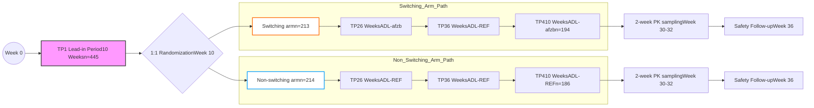

41

# Multiple Switching Between the Biosimilar Adalimumab PF-06410293 and High-Concentration Reference Adalimumab in Combination With Methotrexate in Patients With Moderately to Severely Active Rheumatoid Arthritis

Mark Latymer1, Daniel F Alvarez2, Donna S Cox2, Karen Wang3, Wuyan Zhang4

1Pfizer Biopharmaceuticals Group, Pfizer Ltd, Kent, UK; 2Pfizer Inc, Global Product Development, Collegeville, PA, USA; 3Pfizer Inc, Global Product Development, La Jolla, CA, USA; 4Pfizer Inc, Global Product Development, Lake Forest, IL, USA

## > OBJECTIVE

* To compare the impact of multiple switches between standard concentration adalimumab (ADL)-afzb and high-concentration reference adalimumab (ADL-REF) on steady-state pharmacokinetics (PK) (a surrogate for efficacy), immunogenicity, and safety in patients with rheumatoid arthritis (RA) receiving concomitant methotrexate (MTX).

## > CONCLUSIONS

* The risk of multiple switching between citrate-free 40 mg/0.4 mL (high concentration) ADL-REF and citrate-free 40 mg/0.8 mL (standard concentration) ADL-afzb with respect to immunogenicity, safety, or possible diminished efficacy (using PK as a surrogate) was no greater than the risk of using ADL-REF without switching.

* This first controlled multi-switch study in RA supports the submission of interchangeability of ADL-afzb with ADL-REF to the US FDA.

QR code to view electronic version of poster
Please scan this QR code with your smartphone app to view an electronic version of this poster. If you don’t have a smartphone, access the poster via the internet at: https://scientificpubs.congressposter.com/p/mqxjbobxo8gtzqsh Copies of this poster obtained through the QR code are for personal use only and may not be reproduced without written permission of the authors.

### References

1. US Food and Drug Administration. Considerations in demonstrating interchangeability with a reference product. https://www.fda.gov/regulatory-information/search-fda-guidance-documents/considerations-demonstrating-interchangeability-reference-product-guidance-industry. Accessed July 24, 2023.

2. US Food & Drug Administration, CDER. Humira (adalimumab) prescribing information. https://www.rxabbvie.com/pdf/humira.pdf. Accessed July 24, 2023.

3. European Medicines Agency. Humira (adalimumab). https://www.ema.europa.eu/en/documents/humira-epar-medicine-overview_en.pdf. Accessed July 24, 2023.

4. Fleischmann RM, et al. Arthritis Res Ther 2018;20(1)178.

5. Fleischmann R, et al. Ann Rheum Dis 2020;79(suppl 1):1439-40.

6. Fleischmann R, et al. Lancet Rheumatol 2023;5:e532-41.

### Acknowledgments

This study was sponsored by Pfizer. Editorial/medical writing support was provided by Sharmila Blows, PhD, of Engage Scientific Solutions and was funded by Pfizer. This work was previously presented as a poster at the 57th American Society of Health System Pharmacists (ASHP) Midyear Clinical Meeting & Exhibition, December 4–8, 2022, Las Vegas, NV, USA.

Copyright © 2023

### Disclosures

DF Alvarez (daniel.f.alvarez@pfizer.com), DS Cox (donna.cox@pfizer.com), M Latymer (mark.latymer@pfizer.com), K Wang (karen.wang2@pfizer.com), and W Zhang (Wuyan.zhang@pfizer.com) are employees of Pfizer and hold stock or stock options in Pfizer. W Zhang holds stock or stock options in Abbott and AbbVie.

Presented at the National Association of Specialty Pharmacy (NASP) 2023 Annual Meeting & Expo, September 18–21, 2023, Grapevine, TX, USA

## > INTRODUCTION

* In the US, for a biosimilar to be designated as interchangeable, i.e., can potentially be substituted for the reference product (RP) without the involvement of the prescriber, studies are required by the US FDA which show that the biological product1:

  - Is biosimilar to the RP;

  - Produces the same clinical result as the RP in any given patient; and

  - For a product that is administered more than once to an individual, switching between the interchangeable product and the RP neither increases safety risks nor decreases effectiveness compared with using the RP without switching.

* PF-06410293 (Abrilada™, ADL-afzb) is a citrate-free ADL biosimilar approved in the US,2 Canada, the EU,3 and more than 20 other countries.

* The clinical equivalence of ADL-afzb with Humira® (ADL-REF) was confirmed in a comparative, randomized, double-blind, parallel-group clinical trial in patients with RA.4,5

* To support the submission of interchangeability of ADL-afzb to the FDA,1 the impact of switching between standard concentration citrate-free ADL-afzb and high-concentration citrate-free ADL-REF was compared with continuous dosing with ADL-REF on steady-state serum ADL pharmacokinetics (PK) in patients with active RA. Results from this study are reported here and published in full in *The Lancet Rheumatology*.6

## > METHODS

* Phase 3, open-label, 2-arm, randomized, parallel-group study conducted in 445 adults with clinically active RA from 61 sites in 10 countries (January 13, 2020–June 22, 2021; NCT04230213).

* Patients receiving background MTX for ≥12 weeks were randomized to either:

  - Switches between subcutaneous (SC) 40 mg/0.4 mL (100 mg/mL) ADL-REF and 40 mg/0.8 mL (50 mg/mL) ADL-afzb (switching arm), or

  - Continuous SC 40 mg/0.4 mL (100 mg/mL) ADL-REF (non-switching [control] arm).

* There were 4 treatment periods (TPs) and 3 switches in the switching arm with safety follow-up after TP4 (Figure 1).

### Figure 1: Study design

ADL=adalimumab; ADL-REF=reference adalimumab; PK=pharmacokinetics; TP=treatment period

* Primary endpoint: maximum observed serum concentration (Cmax) and area under the serum concentration–time curve over the dosing interval (AUCtau) obtained during a 2-week PK intensive sampling interval (Week 30 predose–Week 32 predose).

  - Using PK as a surrogate for efficacy, these measures can be used to support that the risk of diminished efficacy from switching between ADL-REF and ADL-afzb is no greater than the risk of using ADL-REF without switching.1

* Secondary PK parameters: time of maximum observed serum concentration (Tmax), average serum concentration (Cav), and apparent clearance (CL/F) (same interval); predose concentrations (Ctrough) (TP1–TP4).

* Secondary immunogenicity and safety endpoints: percentage of patients with anti-drug antibodies/neutralizing antibodies (ADAs/NAbs), ADA/NAb titers over time, and adverse events (AEs).

## > RESULTS

* Of 445 patients enrolled in the study, 18 patients discontinued in TP1 (12 due to AEs, 5 withdrew, 1 other), and 427 patients completed TP1.

* 94% of patients in the switching arm and 91% in the non-switching arm completed the study.

* – No patients discontinued due to insufficient clinical response.

### Pharmacokinetics

* No clinically meaningful differences were observed in mean steady-state PK parameters between the arms (Table 1).

* – 90% confidence intervals (CIs) for geometric mean ratios of Cmax and AUCtau were within the pre-specified equivalence margin (80–125%) at Weeks 30–32, demonstrating PK equivalence between arms (Figure 2).

### Table 1: Comparisons of Cmax and AUCtau (TP4, PK population)

| Parameter (units)  | Adjusted geometric means Switching arm (ADL-REF and ADL-afzb) (n=194) | Adjusted geometric means Non-switching arm (ADL-REF) (n=186) |
| ------------------ | ------------------------------------------------------------------------- | ---------------------------------------------------------------- |
| Cmax (µg/mL)       | 8.21                                                                      | 8.00                                                             |
| AUCtau (µg\*hr/mL) | 2237                                                                      | 2125                                                             |

ANOVA model was applied to log-transformed data, with terms for treatment and randomization stratification factor (body weight categories).

ADL=adalimumab; ADL-REF=reference adalimumab; ANOVA=analysis of variance; AUCtau=area under the serum concentration–time curve over the dosing interval; Cmax=maximum observed serum concentration; PK=pharmacokinetics; TP=treatment period

### Figure 2: Switching arm (ADL-REF and ADL-afzb) vs non-switching arm (ADL-REF): GMRs of Cmax and AUCtau (90% CIs) (TP4, PK population)

| Parameter          | GMR (90% CI)        |
| ------------------ | ------------------- |
| Cmax (µg/mL)       | 102.6 (97.1, 108.4) |
| AUCtau (µg\*hr/mL) | 105.2 (98.2, 112.8) |

Results were obtained using ANOVA model applied to log-transformed data, with terms for treatment and randomization stratification factor (body weight categories). The mean differences and the CI were exponentiated to provide estimates of GMR and the 90% CIs for the ratio.

ADL=adalimumab; ADL-REF=reference adalimumab; ANOVA=analysis of variance; AUCtau=area under the serum concentration–time curve over the dosing interval; CI=confidence interval; Cmax=maximum observed serum concentration; GMR=geometric mean ratio; PK=pharmacokinetics; TP=treatment period

* Secondary endpoints Tmax, Cav, and CL/F were similar between the switching and non-switching arms, with overlapping ranges and similar variability in Cav and CL/F.

* A similar mean PK concentration–time profile was exhibited in both arms (Figure 3).

* ADL Ctrough was similar at Week 10 and Week 30 visits within each treatment arm, suggesting patients reached PK steady state by Week 10.

### Figure 3: Mean PK concentrations over time (TP4, PK population)

| Planned time post dose (hours) | Switching arm (ADL-REF and ADL-afzb) (n=194) | Non-switching arm (ADL-REF) (n=186) |
| ------------------------------ | -------------------------------------------- | ----------------------------------- |
| 0                              | 8.2                                          | 8.0                                 |
| 24                             | 10.5                                         | 10.2                                |
| 48                             | 11.8                                         | 11.5                                |
| 72                             | 12.2                                         | 11.8                                |
| 96                             | 12.0                                         | 11.6                                |
| 120                            | 11.5                                         | 11.2                                |
| 144                            | 10.8                                         | 10.5                                |
| 168                            | 10.2                                         | 9.8                                 |
| 192                            | 9.5                                          | 9.2                                 |
| 216                            | 9.0                                          | 8.8                                 |
| 240                            | 8.5                                          | 8.2                                 |
| 264                            | 8.0                                          | 7.8                                 |
| 288                            | 7.5                                          | 7.2                                 |
| 312                            | 7.0                                          | 6.8                                 |
| 336                            | 6.5                                          | 6.2                                 |

Planned time post dose (hours)
ADL=adalimumab; ADL-REF=reference adalimumab; PK=pharmacokinetics; TP=treatment period

### Immunogenicity

* Percentages of ADA/NAb-positive patients in the switching and non-switching arms were similar at Week 10 (randomization) with 25.8% and 27.6% ADA-positive, respectively.

* At Week 32 (end of TP4), incidence of ADA-positive patients was 46.9% (switching) and 48.6% (non-switching).

* Patients in both the switching and non-switching arms exhibited similar ADA and NAb titers.

* Among ADA/NAb-positive patients, persistent ADA and NAb responses were similar between the switching arm (86.2% and 66.7%, respectively) and non-switching arm (90.6% and 71.0%, respectively).

### Safety

* The median number of doses in TP1 was 5; median duration of treatment was 57 days.

* Most treatment-emergent adverse events (TEAEs) (Table 2) during TP1 were grades 1 or 2 in severity; there was 1 grade 4 AE in a patient with metastatic ovarian cancer.

### Table 2: All-causality AEs in TP1 and TP2 and beyond

| Number (%) of patients          | TP1n=445   | TP2 Switching arm (ADL-REF and ADL-afzb) n=213 | TP2 Non-switching arm (ADL-REF) n=214 |
| ------------------------------- | ---------- | ------------------------------------------------------ | --------------------------------------------- |
| Patients evaluable for AEs      | 445        | 213                                                    | 214                                           |
| Patients with all-causality AEs | 107 (24.0) | 82 (38.5)                                              | 62 (29.0)                                     |
| Patients with serious TEAEs     | 13 (2.9)   | 3 (1.4)                                                | 8 (3.7)                                       |

ADL=adalimumab; ADL-REF=reference adalimumab; AE=adverse event; PK=pharmacokinetics; TEAE=treatment-emergent adverse event; TP=treatment period

* The most common TEAEs in TP1 were infections and infestations (8.8%), skin and subcutaneous tissue disorders (4.9%), laboratory investigations (4.0%), and general disorders and administration site conditions (3.8%).

* The median number of doses in TP2 was 12 in both arms; median duration of treatment was 155 days in both arms.

* During TP2 and beyond, 38.5% (82/213) of patients had TEAEs in the switching arm vs 29.0% (62/214) in the non-switching arm (Table 2).

* The most common TEAE in TP2 and beyond was infections and infestations (switching arm 10.3%; non-switching arm 11.7%).

* Percentage of patients with permanent discontinuations due to AE was similar between arms in TP2 (switching arm 3.8%; non-switching arm 4.2%).

* Both arms were balanced for serious AEs and AEs of special interest (grade ≥3) with no deaths.

