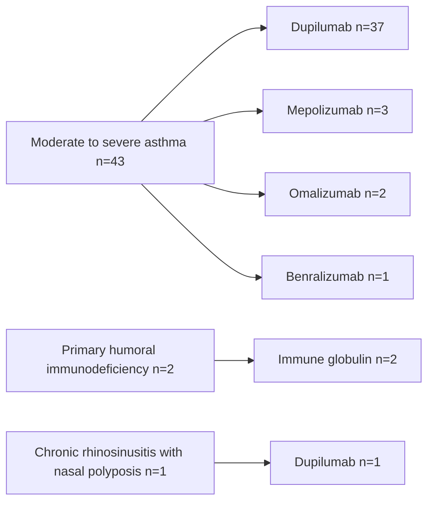
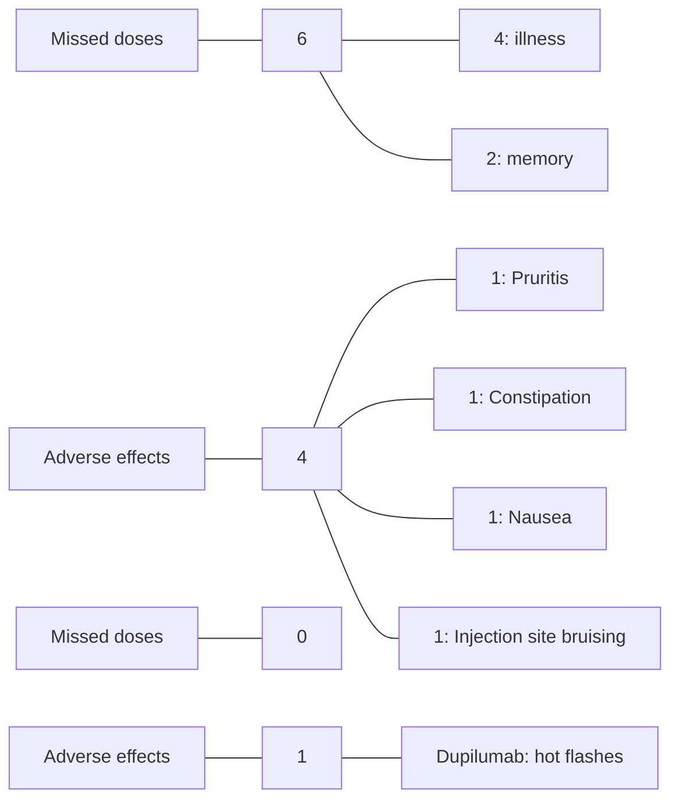

# ASSESSING PATIENT-REPORTED OUTCOMES AND PHARMACIST INTERVENTIONS IN PATIENTS PRESCRIBED SPECIALTY MEDICATIONS FOR DERMATOLOGY AND ASTHMA, SINUS, AND ALLERGY
VANDERBILT UNIVERSITY MEDICAL CENTER logo

E. Danielle Bryan, PharmD1 | Rebekah Finley, PharmD candidate2 | Nisha B. Shah, PharmD1 | Ryan Moore, MS3 | Josh DeClercq, MS3 | Leena Choi, PhD3 | Autumn D. Zuckerman, PharmD, BCPS, AAHIVP, CSP1
1Vanderbilt Specialty Pharmacy, Vanderbilt University Medical Center; 2Lipscomb University College of Pharmacy; 3Department of Biostatistics, Vanderbilt University Medical Center

## BACKGROUND | RESULTS

* Patient reported outcomes (PROs) can be used to assess therapeutic response and need for therapeutic changes in patients with dermatology, asthma, sinus, and allergy disease states.1

* Vanderbilt Specialty Pharmacy, a health-system specialty pharmacy (HSSP), assesses PROs through monthly refill questionnaires (MRQs) to guide pharmacist interventions and improve patient care.2

### DERMATOLOGY COHORT (N=144) | ASAP COHORT (N=46)

## OBJECTIVE

To assess PROs in patients receiving dermatology or asthma, sinus, and allergy (ASAP) medications at an HSSP

## METHODS

**DESIGN** Single-center retrospective analysis

**INCLUSION** Patients receiving a dermatology or ASAP specialty medication with:
* 2+ fills through the center's specialty pharmacy, and
* 2+ MRQ responses

**TIMEFRAME** January - March 2020

## OUTCOMES

* Patient-reported missed doses
* Patient-reported adverse effects
* Patient-reported medication effectiveness
* Specialty pharmacist interventions

| TABLE 1. DERMATOLOGY PATIENT CHARACTERISTICS | n (%)      |
| -------------------------------------------- | ---------- |
| Age, years, median (IQR)                     | 53 (40-63) |
| Gender, male                                 | 61 (42)    |
| Race                                         |            |
| White                                        | 114 (79)   |
| Black or African American                    | 22 (15)    |
| Other Asian                                  | 4 (3)      |
| Unknown                                      | 4 (3)      |
| Insurance type                               |            |
| Commercial                                   | 95 (66)    |
| Medicare                                     | 44 (31)    |
| Medicaid                                     | 4 (3)      |
| Diagnosis                                    |            |
| Plaque psoriasis                             | 92 (64)    |
| Atopic dermatitis                            | 31 (22)    |
| Hidradenitis suppurativa                     | 12 (8)     |
| Mycosis fungoides                            | 5 (3)      |
| Other                                        | 4 (3)      |
| Previous biologic therapy, yes               | 57 (40)    |

FIGURE 1. DERMATOLOGY MEDICATIONS

| Medication   | Number of Patients |
| ------------ | ------------------ |
| Tofacitinib  | 1                  |
| Golimumab    | 1                  |
| Brodalumab   | 1                  |
| Certolizumab | 2                  |
| Ustekinumab  | 3                  |
| Ixekizumab   | 4                  |
| Guselkumab   | 5                  |
| Bexarotene   | 7                  |
| Etanercept   | 10                 |
| Secukinumab  | 20                 |
| Apremilast   | 24                 |
| Dupilumab    | 31                 |
| Adalimumab   | 35                 |

| TABLE 2. ASAP PATIENT CHARACTERISTICS | n (%)      |
| ------------------------------------- | ---------- |
| Age, years, median (IQR)              | 50 (41-62) |
| Gender, male                          | 19 (41)    |
| Race                                  |            |
| White                                 | 31 (67)    |
| Black or African American             | 14 (30)    |
| Declined to answer                    | 1 (2)      |
| Insurance type                        |            |
| Commercial                            | 24 (52)    |
| Medicare                              | 18 (39)    |
| Medicaid                              | 4 (9)      |
| Smoking status                        |            |
| Non-smoker                            | 30 (65)    |
| Previous smoker                       | 14 (30)    |
| Current smoker                        | 2 (4)      |
| Previous biologic therapy, yes        | 27 (59)    |

FIGURE 2. ASAP DIAGNOSES AND MEDICATIONS

FIGURE 3. OVERALL MEDICATION EFFECTIVENESS
"How well do you feel medication is working for you?"
597 MRQ responses

| Rating            | Percentage (n) |
| ----------------- | -------------- |
| Excellent or good | 99% (n=589)    |

FIGURE 4. SPECIALTY PHARMACIST INTERVENTIONS FOR DERMATOLOGY AND ASAP PATIENTS (N=29)

| Intervention Type                         | Number of Interventions |
| ----------------------------------------- | ----------------------- |
| Coordination of care                      | 1                       |
| ED / hospitalization / urgent care        | 3                       |
| Condition-related concern or exacerbation | 4                       |
| Medication list change                    | 4                       |
| Common side effect / toxicity             | 4                       |
| General drug information                  | 6                       |
| Adherence / missed dose                   | 7                       |

## CONCLUSIONS

* Patients with inflammatory conditions receiving care within an integrated health system specialty pharmacy reported high medication effectiveness with low rates of missed doses (3.2%) and adverse effects (<1%).

* Specialty pharmacists perform valuable interventions to ensure safe and effective medication use. Further research is needed to understand the long-term clinical outcomes in these populations.

1. Lavallee DC, Chenok KE, Love RM, et al. Incorporating Patient-Reported Outcomes Into Health Care To Engage Patients And Enhance Care. Health Aff (Millwood). 2016;35(4):575-582. 2. AMCP Partnership Forum: Improving Quality, Value, and Outcomes with Patient-Reported Outcomes. J Manag Care Spec Pharm. 2018;24(3):304-310.

