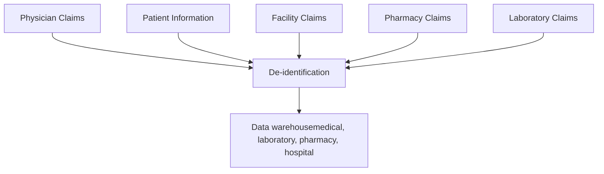

Mitsubishi Tanabe Pharma logo MITSUBISHI CHEMICAL GROUP logo

# A Preliminary Analysis of Radicava ORS® (Oral Edaravone)–Treated Patients With Amyotrophic Lateral Sclerosis Enrolled in a US-Based Administrative Claims Database

Malgorzata Ciepielewska, MS1; Jeffrey Zhang, PhD2; Ying Liu, PhD2; Polina Da Silva, MSc1
1Mitsubishi Tanabe Pharma America, Inc., Jersey City, New Jersey, USA; 2Princeton Pharmatech, LLC, Princeton, New Jersey, USA

## Introduction

* Amyotrophic lateral sclerosis (ALS) is a fatal neurodegenerative condition that causes neuron cell death, progressive muscular weakness, and paralysis1

* In 2017, ALS had an estimated prevalence of 5.5-9.9 per 100,000 United States (US) population2

* Radicava® (edaravone) IV (intravenous; Mitsubishi Tanabe Pharma America [MTPA], hereafter “MTPA IV edaravone”) was approved by the US Food and Drug Administration (FDA) in 2017 for the treatment of ALS and has been shown in clinical trials to slow the rate of physical functional decline3

- In a phase 3 trial, MTPA IV edaravone was shown to slow down the rate of functional decline by 33% (P=0.0013), as measured by the ALS Functional Rating Scale-Revised (ALSFRS-R), compared with placebo at 24 weeks4

* Subsequently, Radicava ORS® (edaravone) oral suspension (MTPA, hereafter “MTPA oral edaravone”) was FDA approved for use in patients with ALS in May 20223

* At the time of this study, the FDA had approved riluzole, MTPA IV and oral edaravone, and the combination of sodium phenylbutyrate and taurursodiol for the treatment of patients with ALS3,5,6

* ALS clinical trials present a challenge due to disease heterogeneity; therefore, although randomized controlled trials are considered the gold standard, research studies employing real-world evidence can provide supplemental data7

## Objective

* To characterize MTPA oral edaravone–treated patients with ALS in this observational, US-based administrative claims analysis

## Methods

### Study Design

* The Optum Clinformatics® Data Mart (CDM) is statistically de-identified under the expert determination method consistent with the Health Insurance Portability and Accountability Act of 1996, and is managed according to Optum customer data use agreements

* The database includes approximately 17 to 19 million annual covered lives, for a total of more than 65 million unique lives over a period ranging from January 2007 through December 31, 2022. The population is geographically diverse, spanning all 50 states

* CDM administrative claims submitted for payment by providers and pharmacies are verified, adjudicated, and de-identified prior to inclusion. These data, including patient-level enrollment information, are derived from claims submitted for all medical and pharmacy healthcare services with information related to healthcare costs and resource utilization (Figure 1)

### Figure 1. Optum Clinformatics® Data Mart

## Statistical Analyses

### Descriptive Analysis

* Assessed descriptively using counts and percentages for categorical variables and measures of central tendency (mean/median/standard deviation/interquartile range) for continuous variables

## Results

### Patient Demographic and Clinical Characteristics

* Demographic and clinical characteristics are reported for MTPA oral edaravone–treated patients with ALS (n=375), which included 69 patients who initially received MTPA IV edaravone and switched to MTPA oral edaravone, and 306 patients who received MTPA oral edaravone and were previously MTPA IV edaravone–naïve (Table 1)

### Table 1. Demographic and Clinical Characteristics of Patients With ALS

|                                           | Switched From MTPA IV to MTPA Oral Edaravone (N=69) | Initiated With MTPA Oral Edaravone (N=306) | Total (N=375)    |
| ----------------------------------------- | ------------------------------------------------------- | ---------------------------------------------- | -------------------- |
| Age Group, n (%)                          |                                                         |                                                |                      |
| 18–39                                     | 4 (5.8)                                                 | 2 (0.7)                                        | 6 (1.6)              |
| 40–49                                     | 9 (13.0)                                                | 16 (5.2)                                       | 25 (6.7)             |
| 50–59                                     | 13 (18.8)                                               | 63 (20.6)                                      | 76 (20.3)            |
| 60–69                                     | 30 (43.5)                                               | 110 (35.9)                                     | 140 (37.3)           |
| 70–79                                     | 10 (14.5)                                               | 98 (32.0)                                      | 108 (28.8)           |
| 80+                                       | 3 (4.3)                                                 | 17 (5.6)                                       | 20 (5.3)             |
| Age (years)                               |                                                         |                                                |                      |
| Mean (SD)                                 | 60.9 (11.9)                                             | 65.2 (9.87)                                    | 64.4 (10.4)          |
| Median \[min, max]                        | 62.0 \[30.0, 83.0]                                      | 66.0 \[34.0, 87.0]                             | 65.0 \[30.0, 87.0]   |
| Sex, n (%)                                |                                                         |                                                |                      |
| Male                                      | 39 (56.5)                                               | 165 (53.9)                                     | 204 (54.4)           |
| Female                                    | 30 (43.5)                                               | 141 (46.1)                                     | 171 (45.6)           |
| Race, n (%)                               |                                                         |                                                |                      |
| White                                     | 52 (75.4)                                               | 233 (76.1)                                     | 285 (76.0)           |
| Black                                     | 2 (2.9)                                                 | 21 (6.9)                                       | 23 (6.1)             |
| Other                                     | 12 (17.4)                                               | 27 (8.8)                                       | 39 (10.4)            |
| Unknown                                   | 3 (4.3)                                                 | 25 (8.2)                                       | 28 (7.5)             |
| Region, n (%)                             |                                                         |                                                |                      |
| Midwest                                   | 16 (23.2)                                               | 68 (22.2)                                      | 84 (22.4)            |
| Northeast                                 | 10 (14.5)                                               | 47 (15.4)                                      | 57 (15.2)            |
| South                                     | 29 (42.0)                                               | 118 (38.6)                                     | 147 (39.2)           |
| West                                      | 14 (20.3)                                               | 72 (23.5)                                      | 86 (22.9)            |
| Unknown                                   | 0                                                       | 1 (0.3)                                        | 1 (0.3)              |
| Payer, n (%)                              |                                                         |                                                |                      |
| Medicare                                  | 46 (66.7)                                               | 214 (69.9)                                     | 260 (69.3)           |
| Commercial                                | 23 (33.3)                                               | 92 (30.1)                                      | 115 (30.7)           |
| Riluzole, n (%)                           |                                                         |                                                |                      |
| Yes                                       | 65 (94.2)                                               | 266 (86.9)                                     | 331 (88.3)           |
| No                                        | 4 (5.8)                                                 | 40 (13.1)                                      | 44 (11.7)            |
| Sodium phenylbutyrate-taurursodiol, n (%) |                                                         |                                                |                      |
| Yes                                       | 29 (42.0)                                               | 179 (58.5)                                     | 208 (55.5)           |
| No                                        | 40 (58.0)                                               | 127 (41.5)                                     | 167 (44.5)           |
| Overall treatment duration (months)       |                                                         |                                                |                      |
| Mean (SD)                                 | 27.0 (16.8)                                             | 4.26 (3.44)                                    | 8.45 (11.8)          |
| Median \[min, max]                        | 21.3 \[3.07, 67.8]                                      | 3.92 \[0.0331, 12.4]                           | 4.73 \[0.0331, 67.8] |

ALS, amyotrophic lateral sclerosis; IV, intravenous; MTPA, Mitsubishi Tanabe Pharma America; SD, standard deviation.

* The percentage of patients who reached specific disease progression milestones before the index date are listed in Table 2

### Table 2. Pre-index Disease Progression Milestones in Patients With ALS*

|                                                   | Switched From MTPA IV to MTPA Oral Edaravone (N=69) | Initiated With MTPA Oral Edaravone (N=306) | Total (N=375) |
| ------------------------------------------------- | ------------------------------------------------------- | ---------------------------------------------- | ----------------- |
| Pre-index use of canes/walkers/wheelchairs, n (%) |                                                         |                                                |                   |
| Yes                                               | 27 (39.1)                                               | 54 (17.6)                                      | 81 (21.6)         |
| No                                                | 42 (60.9)                                               | 252 (82.4)                                     | 294 (78.4)        |
| Pre-index use of artificial nutrition, n (%)      |                                                         |                                                |                   |
| Yes                                               | 22 (31.9)                                               | 50 (16.3)                                      | 72 (19.2)         |
| No                                                | 47 (68.1)                                               | 256 (83.7)                                     | 303 (80.8)        |
| Pre-index use of non-invasive ventilation, n (%)  |                                                         |                                                |                   |
| Yes                                               | 27 (39.1)                                               | 63 (20.6)                                      | 90 (24.0)         |
| No                                                | 42 (60.9)                                               | 243 (79.4)                                     | 285 (76.0)        |
| Pre-index use of invasive ventilation, n (%)      |                                                         |                                                |                   |
| Yes                                               | 1 (1.4)                                                 | 4 (1.3)                                        | 5 (1.3)           |
| No                                                | 68 (98.6)                                               | 302 (98.7)                                     | 370 (98.7)        |
| Pre-index hospitalization, n (%)                  |                                                         |                                                |                   |
| Yes                                               | 25 (36.2)                                               | 80 (26.1)                                      | 105 (28.0)        |
| No                                                | 44 (63.8)                                               | 226 (73.9)                                     | 270 (72.0)        |
| Pre-index use of gastrostomy tube, n (%)          |                                                         |                                                |                   |
| Yes                                               | 14 (20.3)                                               | 36 (11.8)                                      | 50 (13.3)         |
| No                                                | 55 (79.7)                                               | 270 (88.2)                                     | 325 (86.7)        |

ALS, amyotrophic lateral sclerosis; IV, intravenous; MTPA, Mitsubishi Tanabe Pharma America.
\*The index date was the first dosing date of MTPA oral edaravone.

* The US distribution of patients enrolled in the Optum CDM who received MTPA oral edaravone is presented in Figure 2

### Figure 2. US Distribution of Patients With ALS Enrolled in the Optum CDM Who Were Prescribed MTPA Oral Edaravone

US map showing distribution of patients with ALS prescribed MTPA oral edaravone

ALS, amyotrophic lateral sclerosis; CDM, Clinformatics® Data Mart; MTPA, Mitsubishi Tanabe Pharma America; US, United States.

### Treatment Timelines for Patients With ALS

* Treatment timeline examples for 4 patients with ALS enrolled in the CDM indicated that patients were prescribed and initiated FDA-approved treatments for ALS at various stages of their disease progression (Figure 3)

### Figure 3. Examples of Treatment Timelines for CDM-Enrolled Patients With ALS

| Patient ID | Enrollment Start/End | MTPA IV Edaravone | MTPA Oral Edaravone | RELYVRIO    | Riluzole    | ALS diagnosed |
| ---------- | -------------------- | ----------------- | ------------------- | ----------- | ----------- | ------------- |
| 1          | 2016 - 2023          |                   | 2022 - 2023         |             | 2016 - 2023 | 2016          |
| 2          | 2016 - 2023          | 2017 - 2022       | 2022 - 2023         | 2022 - 2023 | 2016 - 2023 | 2016          |
| 3          | 2016 - 2023          | 2017 - 2022       | 2022 - 2023         |             | 2016 - 2023 | 2016          |
| 4          | 2016 - 2023          | 2017 - 2022       | 2022 - 2023         |             | 2016 - 2023 | 2016          |

ALS, amyotrophic lateral sclerosis; CDM, Clinformatics® Data Mart; FDA, Food and Drug Administration; ID, identification; IV, intravenous; MTPA, Mitsubishi Tanabe Pharma America.

### Most Common Concomitantly Prescribed Drugs

* Patients who initiated treatment with MTPA oral edaravone were most frequently concomitantly prescribed central nervous system agents, while patients who initiated treatment with MTPA IV edaravone and switched to MTPA oral edaravone were most frequently concomitantly prescribed antibiotics (Figure 4)

### Figure 4. Top 15 Drugs Concomitantly Prescribed After Initial MTPA Edaravone Dose

| Drug Class                                | Initiated With MTPA Oral Edaravone (No. of Patients) | MTPA IV Switched to MTPA Oral Edaravone (No. of Patients) |
| ----------------------------------------- | ---------------------------------------------------- | --------------------------------------------------------- |
| Central nervous system agents, misc.      | 190                                                  | 45                                                        |
| Ammonia detoxicants                       | 185                                                  | 40                                                        |
| Antibiotics                               | 180                                                  | 115                                                       |
| Adrenergic agonists                       | 175                                                  | 105                                                       |
| Selective-serotonin reuptake inhibitors   | 170                                                  | 40                                                        |
| Vaccines                                  | 165                                                  | 100                                                       |
| HMG-CoA reductase inhibitors              | 160                                                  | 35                                                        |
| Caloric agents                            | 155                                                  | 30                                                        |
| Opiate agonists                           | 150                                                  | 95                                                        |
| Proton-pump inhibitors                    | 145                                                  | 85                                                        |
| GABA-derivative skeletal muscle relaxant  | 140                                                  | 80                                                        |
| Antimuscarinics/antispasmodics            | 135                                                  | 25                                                        |
| Anticonvulsants, miscellaneous            | 130                                                  | 85                                                        |
| Benzodiazepines (anxiolytic, sedativ/hyp) | 125                                                  | 90                                                        |
| Angiotensin-converting enzyme inhibitors  | 120                                                  | 20                                                        |

IV, intravenous; MTPA, Mitsubishi Tanabe Pharma America.

### Figure 5. Top 15 Procedures After Initial MTPA Edaravone Dose

| Procedure                           | Initiated With MTPA Oral Edaravone (No. of Patients) | MTPA IV Switched to MTPA Oral Edaravone (No. of Patients) |
| ----------------------------------- | ---------------------------------------------------- | --------------------------------------------------------- |
| Routine venipuncture                | 145                                                  | 55                                                        |
| Comprehen metabolic panel           | 140                                                  | 60                                                        |
| Complete CBC w/ auto diff WBC       | 135                                                  | 50                                                        |
| Home vent type used non-invasv intf | 130                                                  | 15                                                        |
| Cough stim devc altrnat pos & neg   | 125                                                  | 10                                                        |
| Hos op clin visit assess & mgmt pt  | 120                                                  | 20                                                        |
| Resp suctn pump home model elec     | 115                                                  | 15                                                        |
| Therapeutic exercises               | 110                                                  | 10                                                        |
| X-ray exam chest 1 view             | 105                                                  | 35                                                        |
| Electrocardiogram report            | 100                                                  | 45                                                        |
| Breathing capacity test             | 95                                                   | 40                                                        |
| Therapeutic activities              | 90                                                   | 10                                                        |
| Assay thyroid stim hormone          | 85                                                   | 30                                                        |
| Lipid panel                         | 80                                                   | 45                                                        |
| Emergency dept visit high MDM       | 75                                                   | 30                                                        |

IV, intravenous; MTPA, Mitsubishi Tanabe Pharma America.

## Limitations

* This study was limited only to patients with ALS who had commercial health coverage or Medicare Advantage plans. Consequently, results of this analysis may not be generalizable to patients with ALS with other insurance plans or without health insurance coverage

* This study relied on administrative claims data, which are subject to coding limitations and entry error. The possibility of underdiagnosis of ALS may have led to a selection bias and/or smaller sample sizes, as patients with ALS who were untreated or who did not have a relevant diagnosis recorded on their medical claims were excluded

* Patients who were no longer enrolled in the Optum CDM database during the post-index period were excluded from the analysis. Therefore, the study population may appear to have been healthier than the total population of patients with ALS in the database

## Conclusions

* This study is ongoing, with additional results expected in future analyses

* These real-world data may help clinicians and payers better understand the demographics, clinical characteristics, and healthcare utilization of patients with ALS treated with MTPA oral edaravone

## References

1. Goutman SA, Hardiman O, Al-Chalabi A, et al. Lancet Neurol. 2022;21(5):465-479.

2. Mehta P, Raymond J, Punjani R, et al. Amyotroph Lateral Scler Frontotemporal Degen. 2023;24(1-2)108-116.

3. Radicava® (edaravone) IV and Radicava ORS® (edaravone) oral suspension Prescribing Information. Mitsubishi Tanabe Pharma Corporation; 2022.

4. Writing Group; Edaravone (MCI-186) ALS 19 Study Group. Lancet Neurol. 2017;16(7):505-512.

5. Rilutek® (riluzole). Package insert. Bridgewater, NJ:Sanofi-Aventis U.S. LLC; 2012.

6. Relyvrio® (sodium phenylbutyrate and taurursodiol). Prescribing Information. Cambridge MA: Amylyx Pharmaceuticals Inc.; September 2022.

7. Berger ML, Sox H, Willke RJ, et al. Pharmacoepidemiol Drug Saf. 2017;26:1033-1039.

## Acknowledgments

* The authors thank Irene Brody, VMD, PhD, of p-value communications, Cedar Knolls, NJ, USA, for providing medical writing support. Editorial support was also provided by p-value communications. This support was funded by Mitsubishi Tanabe Pharma America, Inc., Jersey City, NJ, USA, in accordance with Good Publication Practice Guidelines 2022

## Disclosures

* MC and PDS are employees of Mitsubishi Tanabe Pharma America, Inc. JZ and YL are employees of Princeton Pharmatech, which has received consultancy fees from Mitsubishi Tanabe Pharma America, Inc.

* This study was sponsored by Mitsubishi Tanabe Pharma America, Inc.

QR code to view a PDF of this poster
Scan here to view a PDF of this poster. Copies obtained through quick response (QR) code are for personal use only and may not be reproduced without written permission from the authors.
MA-RC-US-0578

Presented at the National Association of Specialty Pharmacy (NASP) 2024 Annual Meeting & Expo | Oct 6-9 | Nashville, TN

