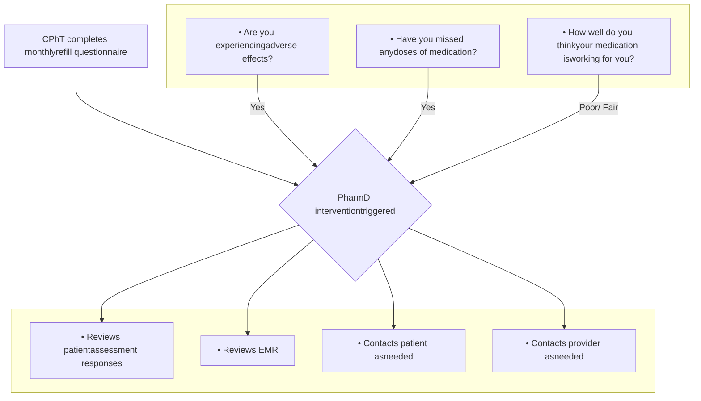

# Assessing Patient-Reported Outcomes and Pharmacist Interventions in Rheumatology Specialty Disease States within an Integrated Care Center

VANDERBILT UNIVERSITY MEDICAL CENTER logo

E. Danielle Bryan, PharmD<sup>1</sup> | Brooke Welch, PharmD candidate<sup>2</sup> | Autumn D. Zuckerman, PharmD, BCPS, AAHIVP, CSP<sup>1</sup> | Nisha B. Shah, PharmD<sup>1</sup> | Megan Peter, PhD<sup>1</sup> | Ryan Moore, MS<sup>3</sup> | Leena Choi, PhD<sup>3</sup>
<sup>1</sup>Vanderbilt Specialty Pharmacy, Vanderbilt University Medical Center | <sup>2</sup>University of Tennessee Health Science Center | <sup>3</sup>Department of Biostatistics, Vanderbilt University Medical Center

## BACKGROUND

* Patient reported outcomes (PROs) are used to assess response to medication and the need for therapeutic adjustments in patients with rheumatologic disease states.<sup>1,2</sup>

* Vanderbilt Specialty Pharmacy, an integrated health-system specialty pharmacy, assesses PROs through monthly refill questionnaires (MRQs) to guide specialty pharmacist interventions and improve patient care.

## OBJECTIVE

To assess PROs and pharmacist interventions in patients prescribed specialty rheumatology medications at a health-system specialty pharmacy.

## METHODS

| DESIGN             | Single-center retrospective analysis                                                                                                                                                                             |
| ------------------ | ---------------------------------------------------------------------------------------------------------------------------------------------------------------------------------------------------------------- |
| PATIENT POPULATION | Patients prescribed a specialty medication by center's outpatient rheumatology clinic provider with:<br/>• 2+ fills through the center's specialty pharmacy, AND<br/>• 2+ monthly refill questionnaire responses |
| TIMEFRAME          | January – March 2020                                                                                                                                                                                             |


## FIGURE 1. MONTHLY REFILL QUESTIONNAIRE AND WORKFLOW



## TABLE 1. DEMOGRAPHICS (n=809)

|                           | n (%)       |
| ------------------------- | ----------- |
| Age, years- median \[IQR] | 57 \[43-64] |
| Gender, female            | 562 (69)    |
| Race, white               | 731 (90)    |
| Insurance type            |             |
| Commercial                | 510 (63)    |
| Medicare                  | 259 (32)    |
| Medicaid                  | 40 (5)      |


## RESULTS

## TABLE 2. RA CLINICAL INFORMATION (n=809)

|                                   | n (%)    |
| --------------------------------- | -------- |
| Indication                        |          |
| Seropositive rheumatoid arthritis | 330 (41) |
| Psoriatic arthritis               | 168 (21) |
| Seronegative rheumatoid arthritis | 123 (15) |
| Ankylosing spondylitis            | 71 (9)   |
| Juvenile idiopathic arthritis     | 69 (9)   |
| Other                             | 49 (6)   |
| Specialty medication              |          |
| Adalimumab                        | 259 (32) |
| Etanercept                        | 221 (27) |
| Tofacitinib (IR/XR)               | 107 (13) |
| Abatacept                         | 55 (7)   |
| Secukinumab                       | 42 (5)   |
| Other                             | 125 (15) |


## FIGURE 2. PATIENT-REPORTED RESPONSES (n=2306)

### Adherence

| Category       | Percentage |
| -------------- | ---------- |
| No missed dose | 95         |
| Missed dose(s) | 5          |


### Adverse Effects

| Category          | Percentage |
| ----------------- | ---------- |
| No adverse effect | 99         |
| Adverse effect(s) | 1          |


### Perceived Effectiveness

| Category  | Percentage |
| --------- | ---------- |
| Excellent | 67         |
| Good      | 29         |
| Fair      | 3          |
| Poor      | <1         |


## FIGURE 3. PATIENT-REPORTED REASONS FOR MISSED DOSES (n=116)

95% of MRQ responses reported NO missed doses. The most common reason for a missed dose was intentional holding for illness or procedure (n=80, 69%). Missed doses can be common in biologic therapies which typically require intentional holding for infection, surgery or hospitalization.

| Reason               | Count |
| -------------------- | ----- |
| Illness or Procedure | 80    |
| Forgetfulness        | 15    |
| Supply issue         | 9     |
| Hospitalization      | 7     |
| Other                | 4     |
| Financial barrier    | 1     |


## FIGURE 4. ADVERSE EFFECTS (n=22)

```mermaid
graph TD
    A[22 patients(1%)reportedAE]
    A --- B[Adalimumab(n=6)]
    A --- C[Secukinumab(n=4)]
    A --- D[TofacitinibIR/XR(n=4)]
    A --- E[Etanercept(n=3)]
    A --- F[Abatacept(n=3)]
    A --- G[Other (n=2)]
```

## FIGURE 5. SPECIALTY PHARMACIST INTERVENTION ALERTS (n=339)

| Intervention Type                    | Count |
| ------------------------------------ | ----- |
| Adherence/Missed Dose                | 124   |
| Condition-Related Concern            | 55    |
| Common Side Effect                   | 32    |
| ED/Hospitalization/Urgent Care Visit | 28    |
| Other Intervention Types             | 26    |
| Medication List Change               | 26    |
| Drug Information                     | 17    |
| Drug Administration Question         | 13    |
| Efficacy                             | 11    |
| New Condition or Diagnosis           | 7     |


Interventions were commonly related to adherence, exacerbations or adverse effects. Adherence interventions most often included patient counseling and chart review or update. Other interventions included: new condition/diagnosis, coordination of care, medication interaction, change in medication dose/frequency, financial/insurance issue, drug dosing, storage, safety, adverse event, inability to perform typical activities.

## CONCLUSIONS

* Rheumatology patients receiving medication through an integrated health-system specialty pharmacy reported low rates of missed doses (5%) and adverse effects (1%), and most rated high perceived effectiveness of their medication (96%).

* Specialty pharmacists integrated into rheumatology clinics perform targeted interventions to ensure safe and effective medication use.

* PROs can be used to direct a patient’s future course of therapy with the assistance of specialty pharmacist interventions.

1. Lavallee DC, Chenok KE, Love RM, et al. Incorporating Patient-Reported Outcomes Into Health Care To Engage Patients And Enhance Care. Health Aff (Millwood). 2016;35(4):575-582. 2. AMCP Partnership Forum: Improving Quality, Value, and Outcomes with Patient-Reported Outcomes. J Manag Care Spec Pharm. 2018;24(3):304-310.


