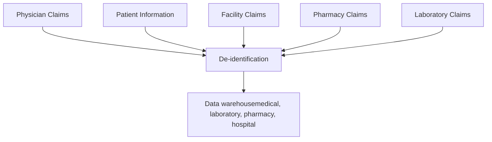

Mitsubishi Tanabe Pharma logo

MITSUBISHI CHEMICAL GROUP logo

# Healthcare Resource Utilization of Radicava ORS® (Oral Edaravone)–Treated Patients With Amyotrophic Lateral Sclerosis Enrolled in a US-Based Administrative Claims Database

Malgorzata Ciepielewska, MS1; Jeffrey Zhang, PhD2; Ying Liu, PhD2; Polina Da Silva, MSc1

1Mitsubishi Tanabe Pharma America, Inc., Jersey City, New Jersey, USA; 2Princeton Pharmatech, LLC, Princeton, New Jersey, USA

## Introduction

* Amyotrophic lateral sclerosis (ALS) is a fatal neurodegenerative condition that causes neuron cell death, progressive muscular weakness, and paralysis1

* In 2017, ALS had an estimated prevalence of 5.5-9.9 per 100,000 United States (US) population2

* Riluzole was the first US Food and Drug Administration (FDA)-approved treatment for ALS in December 19953

* Radicava® (edaravone) IV (intravenous; Mitsubishi Tanabe Pharma America [MTPA], hereafter "MTPA IV edaravone") was approved by the FDA in 2017 for the treatment of ALS and has been shown in clinical trials to slow the rate of physical functional decline4

- In a phase 3 trial, MTPA IV edaravone was shown to slow down the rate of functional decline by 33% (P=0.0013), as measured by the ALS Functional Rating Scale-Revised (ALSFRS-R), compared with placebo at 24 weeks5

* Subsequently, Radicava ORS® (edaravone) oral suspension (MTPA, hereafter "MTPA oral edaravone") was FDA approved for use in patients with ALS in May 20224

* Additionally, the FDA has approved tofersen for use in patients with ALS with a superoxide dismutase 1 (SOD1) gene mutation in April 20236

* Finally, sodium phenylbutyrate and taurursodiol (PB-TURSO), an oral, fixed-dose combination therapy, was FDA approved in September 2022 after positive results from a phase 2 clinical trial7

- But after phase 3 study showed negative results, PB-TURSO was voluntarily withdrawn from US and Canadian markets in April 20248

* ALS clinical trials present a challenge due to disease heterogeneity; therefore, although randomized controlled trials are considered the gold standard, research studies employing real-world evidence can provide supplemental data9

## Objective

* To describe demographics, treatment utilization, pre-index disease progression milestones, and preliminary data on healthcare resource utilization (HCRU) of MTPA oral edaravone-treated patients with ALS in this real-world, observational, US-based administrative claims analysis

## Methods

### Study Design

* The Optum Clinformatics® Data Mart (CDM) is statistically de-identified under the expert determination method consistent with the Health Insurance Portability and Accountability Act of 1996, and is managed according to Optum customer data use agreements

* The database includes up to 19 million annual covered lives. The population is geographically diverse, spanning all 50 states

* CDM administrative claims submitted for payment by providers and pharmacies are verified, adjudicated, and de-identified prior to inclusion. These data, including patient-level enrollment information, are derived from claims submitted for all medical and pharmacy healthcare services with information related to healthcare costs and resource utilization (Figure 1)

* Patients with ALS who were continuously enrolled in Optum's de-identified CDM from June 15, 2022, through June 30, 2023, were included and divided into 2 groups:

- Group 1 initially received MTPA IV edaravone and switched to MTPA oral edaravone

- Group 2 received MTPA oral edaravone and was previously MTPA edaravone-naïve

* The index date was the first dosing date of MTPA oral edaravone

* HCRU was evaluated by group and by Medicare vs commercial insurance coverage

### Figure 1. Optum Clinformatics® Data Mart

### Statistical Analyses

#### Descriptive analysis

* Assessed descriptively using counts and percentages for categorical variables and measures of central tendency (mean/median/standard deviation/interquartile range) for continuous variables

## Results

### Patient Demographics, Insurance Coverage, and ALS Treatment Utilization

* Demographics, insurance coverage, and ALS treatment utilization are reported for MTPA oral edaravone-treated patients with ALS (N=375), which included 69 patients who initially received MTPA IV edaravone and switched to MTPA oral edaravone, and 306 patients who received MTPA oral edaravone and were previously MTPA edaravone-naïve (Table 1)

### Table 1. Patient Demographics, Insurance Coverage, and ALS Treatment Utilization

|                                         | Switched From MTPA IV to MTPA Oral Edaravone (n=69) | Initiated With MTPA Oral Edaravone (n=306) | Total (N=375)      |
| --------------------------------------- | --------------------------------------------------- | ------------------------------------------ | ------------------ |
| **Age Group, n (%)**                    |                                                     |                                            |                    |
| 18–39                                   | 4 (5.8)                                             | 2 (0.7)                                    | 6 (1.6)            |
| 40–49                                   | 9 (13.0)                                            | 16 (5.2)                                   | 25 (6.7)           |
| 50–59                                   | 13 (18.8)                                           | 63 (20.6)                                  | 76 (20.3)          |
| 60–69                                   | 30 (43.5)                                           | 110 (35.9)                                 | 140 (37.3)         |
| 70–79                                   | 10 (14.5)                                           | 98 (32.0)                                  | 108 (28.8)         |
| 80+                                     | 3 (4.3)                                             | 17 (5.6)                                   | 20 (5.3)           |
| **Age (years)**                         |                                                     |                                            |                    |
| Mean (SD)                               | 60.9 (11.9)                                         | 65.2 (9.87)                                | 64.4 (10.4)        |
| Median \[Min, Max]                      | 62.0 \[30.0, 83.0]                                  | 66.0 \[34.0, 87.0]                         | 65.0 \[30.0, 87.0] |
| **Sex, n (%)**                          |                                                     |                                            |                    |
| Male                                    | 39 (56.5)                                           | 165 (53.9)                                 | 204 (54.4)         |
| Female                                  | 30 (43.5)                                           | 141 (46.1)                                 | 171 (45.6)         |
| **Race, n (%)**                         |                                                     |                                            |                    |
| White                                   | 52 (75.4)                                           | 233 (76.1)                                 | 285 (76.0)         |
| Black                                   | 2 (2.9)                                             | 21 (6.9)                                   | 23 (6.1)           |
| Other                                   | 12 (17.4)                                           | 27 (8.8)                                   | 39 (10.4)          |
| Unknown                                 | 3 (4.3)                                             | 25 (8.2)                                   | 28 (7.5)           |
| **Region, n (%)**                       |                                                     |                                            |                    |
| Midwest                                 | 16 (23.2)                                           | 68 (22.2)                                  | 84 (22.4)          |
| Northeast                               | 10 (14.5)                                           | 47 (15.4)                                  | 57 (15.2)          |
| South                                   | 29 (42.0)                                           | 118 (38.6)                                 | 147 (39.2)         |
| West                                    | 14 (20.3)                                           | 72 (23.5)                                  | 86 (22.9)          |
| Unknown                                 | 0                                                   | 1 (0.3)                                    | 1 (0.3)            |
| **Payer, n (%)**                        |                                                     |                                            |                    |
| Medicare                                | 46 (66.7)                                           | 214 (69.9)                                 | 260 (69.3)         |
| Commercial                              | 23 (33.3)                                           | 92 (30.1)                                  | 115 (30.7)         |
| **Riluzole, n (%)**                     |                                                     |                                            |                    |
| Yes                                     | 65 (94.2)                                           | 266 (86.9)                                 | 331 (88.3)         |
| No                                      | 4 (5.8)                                             | 40 (13.1)                                  | 44 (11.7)          |
| **PB-TURSO, n (%)**                     |                                                     |                                            |                    |
| Yes                                     | 29 (42.0)                                           | 179 (58.5)                                 | 208 (55.5)         |
| No                                      | 40 (58.0)                                           | 127 (41.5)                                 | 167 (44.5)         |
| **Overall Treatment Duration (months)** |                                                     |                                            |                    |
| Mean (SD)                               | 27.0 (16.8)                                         | 4.26 (3.44)                                | 8.45 (11.8)        |
| Median \[Min, Max]                      | 21.3 \[3.07, 67.8]                                  | 3.92 \[0.03, 12.4]                         | 4.73 \[0.03, 67.8] |

ALS, amyotrophic lateral sclerosis; IV, intravenous; MTPA, Mitsubishi Tanabe Pharma America; PB-TURSO, sodium phenylbutyrate-taurursodiol; SD, standard deviation.

### Pre-index Disease Progression Milestones

* The percentage of MTPA oral edaravone-treated patients in each group who reached certain disease progression milestones before the index date are listed in Table 2

* A higher percentage of patients who switched from MTPA IV edaravone to MTPA oral edaravone reached each of the pre-index disease progression milestones vs those who initiated with MTPA oral edaravone, although most patients in both groups did not reach each of the milestones

### Table 2. Pre-index Disease Progression Milestones of Patients With ALS*

|                                                       | Switched From MTPA IV to MTPA Oral Edaravone (n=69) | Initiated With MTPA Oral Edaravone (n=306) | Total (N=375) |
| ----------------------------------------------------- | --------------------------------------------------- | ------------------------------------------ | ------------- |
| **Pre-index Use of Canes/Walkers/Wheelchairs, n (%)** |                                                     |                                            |               |
| Yes                                                   | 27 (39.1)                                           | 54 (17.6)                                  | 81 (21.6)     |
| No                                                    | 42 (60.9)                                           | 252 (82.4)                                 | 294 (78.4)    |
| **Pre-index Use of Artificial Nutrition, n (%)**      |                                                     |                                            |               |
| Yes                                                   | 22 (31.9)                                           | 50 (16.3)                                  | 72 (19.2)     |
| No                                                    | 47 (68.1)                                           | 256 (83.7)                                 | 303 (80.8)    |
| **Pre-index Use of Non-invasive Ventilation, n (%)**  |                                                     |                                            |               |
| Yes                                                   | 27 (39.1)                                           | 63 (20.6)                                  | 90 (24.0)     |
| No                                                    | 42 (60.9)                                           | 243 (79.4)                                 | 285 (76.0)    |
| **Pre-index Use of Invasive Ventilation, n (%)**      |                                                     |                                            |               |
| Yes                                                   | 1 (1.4)                                             | 4 (1.3)                                    | 5 (1.3)       |
| No                                                    | 68 (98.6)                                           | 302 (98.7)                                 | 370 (98.7)    |
| **Pre-index Hospitalization, n (%)**                  |                                                     |                                            |               |
| Yes                                                   | 25 (36.2)                                           | 80 (26.1)                                  | 105 (28.0)    |
| No                                                    | 44 (63.8)                                           | 226 (73.9)                                 | 270 (72.0)    |
| **Pre-index Use of Gastrostomy Tube, n (%)**          |                                                     |                                            |               |
| Yes                                                   | 14 (20.3)                                           | 36 (11.8)                                  | 50 (13.3)     |
| No                                                    | 55 (79.7)                                           | 270 (88.2)                                 | 325 (86.7)    |

ALS, amyotrophic lateral sclerosis; IV, intravenous; MTPA, Mitsubishi Tanabe Pharma America.
\*The index date was the first dosing date of MTPA oral edaravone.

### Pre-index HCRU of MTPA Oral Edaravone-Treated Patients With ALS Based on Insurance Coverage

* Pre-index HCRU was recorded for MTPA oral edaravone-treated patients in each group based on Medicare vs commercial insurance coverage (Table 3)

* The number of Medicare-covered patients was at least double than the number of patients covered by commercial insurance in each group

* Most patients in both groups experienced ≥1 pre-index outpatient visit and pharmacy prescription

* Most patients in both groups did not experience ≥1 pre-index inpatient admission or emergency room visit

### Table 3. Pre-index HCRU of MTPA Oral Edaravone-Treated Patients With ALS Based on Insurance Coverage

|                                                       | Switched From MTPA IV to MTPA Oral Edaravone (n=69) Medicare (n=46) | Switched From MTPA IV to MTPA Oral Edaravone (n=69) Commercial (n=23) | Initiated With MTPA Oral Edaravone (n=306) Medicare (n=214) | Initiated With MTPA Oral Edaravone (n=306) Commercial (n=92) | Total (N=375) Medicare (n=260) | Total (N=375) Commercial (n=115) |
| ----------------------------------------------------- | ----------------------------------------------------------------------- | ------------------------------------------------------------------------- | --------------------------------------------------------------- | ---------------------------------------------------------------- | ---------------------------------- | ------------------------------------ |
| **≥1 Pre-index Inpatient Admission, n (%)**           |                                                                         |                                                                           |                                                                 |                                                                  |                                    |                                      |
| Yes                                                   | 5 (10.9)                                                                | 8 (34.8)                                                                  | 32 (15.0)                                                       | 12 (13.0)                                                        | 37 (14.2)                          | 20 (17.4)                            |
| No                                                    | 41 (89.1)                                                               | 15 (65.2)                                                                 | 182 (85.0)                                                      | 80 (87.0)                                                        | 223 (85.8)                         | 95 (82.6)                            |
| **Number of Pre-index Inpatient Admissions, n (%)**   |                                                                         |                                                                           |                                                                 |                                                                  |                                    |                                      |
| Mean (SD)                                             | 2.07 (6.22)                                                             | 7.04 (11.0)                                                               | 5.57 (20.8)                                                     | 3.60 (12.0)                                                      | 4.95 (19.1)                        | 4.29 (11.9)                          |
| Median \[Min, Max]                                    | 0 \[0, 29.0]                                                            | 0 \[0, 34.0]                                                              | 0 \[0, 189]                                                     | 0 \[0, 79.0]                                                     | 0 \[0, 189]                        | 0 \[0, 79.0]                         |
| **≥1 Pre-index Outpatient Visit, n (%)**              |                                                                         |                                                                           |                                                                 |                                                                  |                                    |                                      |
| Yes                                                   | 33 (71.7)                                                               | 18 (78.3)                                                                 | 152 (71.0)                                                      | 72 (78.3)                                                        | 185 (71.2)                         | 90 (78.3)                            |
| No                                                    | 13 (28.3)                                                               | 5 (21.7)                                                                  | 62 (29.0)                                                       | 20 (21.7)                                                        | 75 (28.8)                          | 25 (21.7)                            |
| **Number of Pre-index Outpatient Visits, n (%)**      |                                                                         |                                                                           |                                                                 |                                                                  |                                    |                                      |
| Mean (SD)                                             | 38.8 (76.0)                                                             | 78.3 (106)                                                                | 31.8 (54.0)                                                     | 34.0 (47.0)                                                      | 33.1 (58.4)                        | 42.8 (65.3)                          |
| Median \[Min, Max]                                    | 8.00 \[0, 423]                                                          | 32.0 \[0, 400]                                                            | 9.00 \[0, 368]                                                  | 15.5 \[0, 249]                                                   | 9.00 \[0, 423]                     | 23.0 \[0, 400]                       |
| **≥1 Pre-index Emergency Room Visit, n (%)**          |                                                                         |                                                                           |                                                                 |                                                                  |                                    |                                      |
| Yes                                                   | 20 (43.5)                                                               | 11 (47.8)                                                                 | 66 (30.8)                                                       | 39 (42.4)                                                        | 86 (33.1)                          | 50 (43.5)                            |
| No                                                    | 26 (56.5)                                                               | 12 (52.2)                                                                 | 148 (69.2)                                                      | 53 (57.6)                                                        | 174 (66.9)                         | 65 (56.5)                            |
| **Number of Pre-index Emergency Room Visits, n (%)**  |                                                                         |                                                                           |                                                                 |                                                                  |                                    |                                      |
| Mean (SD)                                             | 1.50 (2.13)                                                             | 2.96 (4.54)                                                               | 1.21 (2.35)                                                     | 1.71 (2.82)                                                      | 1.27 (2.31)                        | 1.96 (3.25)                          |
| Median \[Min, Max]                                    | 0 \[0, 8.00]                                                            | 0 \[0, 18.0]                                                              | 0 \[0, 12.0]                                                    | 0 \[0, 16.0]                                                     | 0 \[0, 12.0]                       | 0 \[0, 18.0]                         |
| **≥1 Pre-index Pharmacy Prescription, n (%)**         |                                                                         |                                                                           |                                                                 |                                                                  |                                    |                                      |
| Yes                                                   | 43 (93.5)                                                               | 23 (100)                                                                  | 188 (87.9)                                                      | 81 (88.0)                                                        | 231 (88.8)                         | 104 (90.4)                           |
| No                                                    | 3 (6.5)                                                                 | 0                                                                         | 26 (12.1)                                                       | 11 (12.0)                                                        | 29 (11.2)                          | 11 (9.6)                             |
| **Number of Pre-index Pharmacy Prescriptions, n (%)** |                                                                         |                                                                           |                                                                 |                                                                  |                                    |                                      |
| Mean (SD)                                             | 37.8 (31.3)                                                             | 96.7 (119)                                                                | 31.3 (48.3)                                                     | 58.5 (110)                                                       | 32.4 (45.8)                        | 66.1 (113)                           |
| Median \[Min, Max]                                    | 30.5 \[0, 118]                                                          | 47.0 \[1.00, 389]                                                         | 16.0 \[0, 326]                                                  | 20.0 \[0, 668]                                                   | 18.0 \[0, 326]                     | 27.0 \[0, 668]                       |

ALS, amyotrophic lateral sclerosis; HCRU, healthcare resource utilization; IV, intravenous; MTPA, Mitsubishi Tanabe Pharma America; SD, standard deviation.

### Post-index HCRU of MTPA Oral Edaravone-Treated Patients With ALS Based on Insurance Coverage

* Post-index HCRU was recorded for MTPA oral edaravone-treated patients in each group based on Medicare vs commercial insurance coverage (Table 4)

### Table 4. Post-index HCRU of MTPA Oral Edaravone-Treated Patients With ALS Based on Insurance Coverage

|                                                        | Switched From MTPA IV to MTPA Oral Edaravone (n=69) Medicare (n=46) | Switched From MTPA IV to MTPA Oral Edaravone (n=69) Commercial (n=23) | Initiated With MTPA Oral Edaravone (n=306) Medicare (n=214) | Initiated With MTPA Oral Edaravone (n=306) Commercial (n=92) | Total (N=375) Medicare (n=260) | Total (N=375) Commercial (n=115) |
| ------------------------------------------------------ | ----------------------------------------------------------------------- | ------------------------------------------------------------------------- | --------------------------------------------------------------- | ---------------------------------------------------------------- | ---------------------------------- | ------------------------------------ |
| **≥1 Post-index Inpatient Admission, n (%)**           |                                                                         |                                                                           |                                                                 |                                                                  |                                    |                                      |
| Yes                                                    | 4 (8.7)                                                                 | 2 (8.7)                                                                   | 33 (15.4)                                                       | 11 (12.0)                                                        | 37 (14.2)                          | 13 (11.3)                            |
| No                                                     | 42 (91.3)                                                               | 21 (91.3)                                                                 | 181 (84.6)                                                      | 81 (88.0)                                                        | 223 (85.8)                         | 102 (88.7)                           |
| **Number of Post-index Inpatient Admissions, n (%)**   |                                                                         |                                                                           |                                                                 |                                                                  |                                    |                                      |
| Mean (SD)                                              | 1.67 (6.46)                                                             | 2.17 (7.51)                                                               | 3.23 (9.28)                                                     | 2.07 (5.93)                                                      | 2.96 (8.86)                        | 2.09 (6.24)                          |
| Median \[Min, Max]                                     | 0 \[0, 30.0]                                                            | 0 \[0, 32.0]                                                              | 0 \[0, 57.0]                                                    | 0 \[0, 27.0]                                                     | 0 \[0, 57.0]                       | 0 \[0, 32.0]                         |
| **≥1 Post-index Outpatient Visit, n (%)**              |                                                                         |                                                                           |                                                                 |                                                                  |                                    |                                      |
| Yes                                                    | 22 (47.8)                                                               | 11 (47.8)                                                                 | 107 (50.0)                                                      | 36 (39.1)                                                        | 129 (49.6)                         | 47 (40.9)                            |
| No                                                     | 24 (52.2)                                                               | 12 (52.2)                                                                 | 107 (50.0)                                                      | 56 (60.9)                                                        | 131 (50.4)                         | 68 (59.1)                            |
| **Number of Post-index Outpatient Visits, n (%)**      |                                                                         |                                                                           |                                                                 |                                                                  |                                    |                                      |
| Mean (SD)                                              | 9.02 (14.9)                                                             | 9.35 (16.7)                                                               | 10.1 (17.6)                                                     | 10.9 (25.1)                                                      | 9.88 (17.1)                        | 10.6 (23.6)                          |
| Median \[Min, Max]                                     | 0 \[0, 57.0]                                                            | 0 \[0, 56.0]                                                              | 0.500 \[0, 94.0]                                                | 0 \[0, 128]                                                      | 0 \[0, 94.0]                       | 0 \[0, 128]                          |
| **≥1 Post-index Emergency Room Visit, n (%)**          |                                                                         |                                                                           |                                                                 |                                                                  |                                    |                                      |
| Yes                                                    | 7 (15.2)                                                                | 3 (13.0)                                                                  | 55 (25.7)                                                       | 18 (19.6)                                                        | 62 (23.8)                          | 21 (18.3)                            |
| No                                                     | 39 (84.8)                                                               | 20 (87.0)                                                                 | 159 (74.3)                                                      | 74 (80.4)                                                        | 198 (76.2)                         | 94 (81.7)                            |
| **Number of Post-index Emergency Room Visits, n (%)**  |                                                                         |                                                                           |                                                                 |                                                                  |                                    |                                      |
| Mean (SD)                                              | 0.54 (1.56)                                                             | 0.52 (1.38)                                                               | 0.86 (2.04)                                                     | 0.51 (1.21)                                                      | 0.80 (1.96)                        | 0.51 (1.24)                          |
| Median \[Min, Max]                                     | 0 \[0, 8.00]                                                            | 0 \[0, 4.00]                                                              | 0 \[0, 19.0]                                                    | 0 \[0, 6.00]                                                     | 0 \[0, 19.0]                       | 0 \[0, 6.00]                         |
| **≥1 Post-index Pharmacy Prescription, n (%)**         |                                                                         |                                                                           |                                                                 |                                                                  |                                    |                                      |
| Yes                                                    | 27 (58.7)                                                               | 12 (52.2)                                                                 | 143 (66.8)                                                      | 46 (50.0)                                                        | 170 (65.4)                         | 58 (50.4)                            |
| No                                                     | 19 (41.3)                                                               | 11 (47.8)                                                                 | 71 (33.2)                                                       | 46 (50.0)                                                        | 90 (34.6)                          | 57 (49.6)                            |
| **Number of Post-index Pharmacy Prescriptions, n (%)** |                                                                         |                                                                           |                                                                 |                                                                  |                                    |                                      |
| Mean (SD)                                              | 19.2 (21.2)                                                             | 18.0 (22.5)                                                               | 15.1 (18.9)                                                     | 13.2 (20.0)                                                      | 15.8 (19.3)                        | 14.2 (20.5)                          |
| Median \[Min, Max]                                     | 14.5 \[0, 69.0]                                                         | 4.00 \[0, 58.0]                                                           | 10.0 \[0, 138]                                                  | 0.500 \[0, 79.0]                                                 | 10.0 \[0, 138]                     | 1.00 \[0, 79.0]                      |

ALS, amyotrophic lateral sclerosis; HCRU, healthcare resource utilization; IV, intravenous; MTPA, Mitsubishi Tanabe Pharma America; SD, standard deviation.

## Limitations

* This study was limited only to patients with ALS who had commercial health coverage or Medicare Advantage plans. Consequently, results of this analysis may not be generalizable to patients with ALS with other insurance plans or without health insurance coverage

* This study relied on administrative claims data, which are subject to coding limitations and entry error. The possibility of underdiagnosis of ALS may have led to a selection bias and/or smaller sample sizes, as patients with ALS who were untreated or who did not have a relevant diagnosis recorded on their medical claims were excluded

* Patients who were no longer enrolled in the Optum CDM database during the post-index period were excluded from the analysis. Therefore, the study population may appear to have been healthier than the total population of patients with ALS in the database

## Conclusions

* This study is ongoing, with additional results expected in future analyses

* These real-world data may help clinicians and payers better understand the demographics, ALS treatment utilization, disease progression milestones, and HCRU of MTPA oral edaravone-treated patients with ALS with Medicare or commercial insurance coverage

## References

1. Goutman SA, Hardiman O, Al-Chalabi A, et al. Lancet Neurol. 2022;21(5):465-479.
2. Mehta P, Raymond J, Punjani R, et al. Amyotroph Lateral Scler Frontotemporal Degen. 2023;24(1-2):108-116.
3. Rilutek® (riluzole). Package insert. Bridgewater, NJ: Sanofi-Aventis U.S. LLC; 2012.
4. Radicava® (edaravone) IV and Radicava ORS® (edaravone) oral suspension Prescribing Information. Mitsubishi Tanabe Pharma Corporation; 2022.
5. Writing Group; Edaravone (MCI-186) ALS 19 Study Group. Lancet Neurol. 2017;16(7):505-512.
6. QALSODY® (tofersen) injection. Prescribing Information. Cambridge, MA: Biogen MA Inc.; April 2023.
7. Relyvrio™ (sodium phenylbutyrate and taurursodiol). Prescribing Information. Cambridge MA: Amylyx Pharmaceuticals Inc.; September 2022.
8. Amylyx Pharmaceuticals. April 4, 2024. Accessed April 8, 2024. https://www.amylyx.com/news/amylyx-pharmaceuticals-announces-formal-intention-to-remove-relyvrior/albriozatm-from-the-market-provides-updates-on-access-to-therapy-pipeline-corporate-restructuring-and-strategy
9. Berger ML, Sox H, Willke RJ, et al. Pharmacoepidemiol Drug Saf. 2017;26:1033-1039.

## Acknowledgments

* The authors thank Irene Brody, VMD, PhD, of p-value communications, Cedar Knolls, NJ, USA, for providing medical writing support. Editorial support was also provided by p-value communications. This support was funded by Mitsubishi Tanabe Pharma America, Inc., Jersey City, NJ, USA, in accordance with Good Publication Practice Guidelines 2022.

## Disclosures

* MC and PDS are employees of Mitsubishi Tanabe Pharma America, Inc. JZ and YL are employees of Princeton Pharmatech, which has received consultancy fees from Mitsubishi Tanabe Pharma America, Inc.

* This study was sponsored by Mitsubishi Tanabe Pharma America, Inc.

QR code to view a PDF of this poster

Scan here to view a PDF of this poster. Copies obtained through quick response (QR) code are for personal use only and may not be reproduced without written permission from the authors.
MA-RC-US-0579

Presented at the National Association of Specialty Pharmacy (NASP) 2024 Annual Meeting & Expo | Oct 6-9 | Nashville, TN

