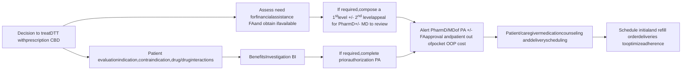

# IMPACT OF SPECIALTY PHARMACY INTEGRATION ON TIME TO MEDICATION ACCESS FOR PRESCRIPTION CANNABIDIOL
Vanderbilt University Medical Center logo
**MEDICAL CENTER**

WENDI OWENS, CPHT1 | KAYLA JOHNSON, PHARMD, BCPS, BCPP 1 | HOLLY DIAL, PHARMD CANDIDATE2 | JOSH DECLERCQ, MS3 | LEENA CHOI, PHD3 | AUTUMN D. ZUCKERMAN, PHARMD, BCPS, AAHIVP, CSP1 | NISHA B. SHAH, PHARMD1
1VANDERBILT SPECIALTY PHARMACY, VANDERBILT UNIVERSITY MEDICAL CENTER, 2LIPSCOMB UNIVERSITY COLLEGE OF PHARMACY, 3DEPARTMENT OF BIOSTATISTICS, VANDERBILT UNIVERSITY MEDICAL CENTER

## BACKGROUND

* Access to prescription cannabidiol (CBD), an adjunct therapy for uncontrolled seizure disorders, is restricted by insurance requirements which may potentially lead to initiation delays.1

* Integrated specialty pharmacies (ISPs) composed of pharmacists and certified pharmacy technicians (CPhT) can navigate the cumbersome medication access pathway to assist in patients initiating prescription CBD in a timely manner.

## STUDY OBJECTIVE

Measure the duration from initial specialty pharmacy patient assessment (when embedded pharmacy team is notified of decision to treat) to prescription CBD access.

### Figure 1. Integrated Specialty Pharmacy Workflow

**Healthcare Team Member:** <mark>MD</mark> <mark>PharmD</mark> <mark>CPhT</mark>

## METHODS

**Design** Single-center, retrospective cohort study

**Inclusion** All patients prescribed CBD by center's outpatient neurology clinics between January 2019 – April 2020

**Exclusion**
* Participation in a prescription CBD clinical trial
* Access and fulfillment process not handled by ISP

**Outcomes**
* Primary: Interval from initial patient assessment to first prescription CBD shipment in days
* Secondary: Interval from first assessment to BI, BI to insurance approval, insurance approval to initial shipment, and FA impact on OOP cost

**Data sources** Electronic health record and specialty pharmacy management system

## RESULTS

### Figure 2. Embedded Clinic CPhT Role

|                                                           |                                                                                                                                                                                         |
| --------------------------------------------------------- | --------------------------------------------------------------------------------------------------------------------------------------------------------------------------------------- |
| \*\*Pre-Prescription CBD Launch\*\*                       | • Coordinate with clinical staff to discuss and initiate standardized access process • Interface with market access representatives to discuss potential obstacles and FA options   |
| \*\*Patient Prescription CBD Initiation\*\*               | • Complete pharmacy BI • Complete PAs and appeals • Evaluate patient OOP cost and obtain FA if needed                                                                           |
| \*\*Ongoing Treatment Access and Coordination of Care\*\* | • Ensure timely renewal of PAs • Monthly check-in to schedule refill delivery and assess for medication changes and seizure control • Maintain and renew patient FA as required |

### Table 1. Cohort Demographics (N = 136)

|                             | Pediatric (N=92) % (n) | Adult (N=44) % (n) |
| --------------------------- | -------------------------- | ---------------------- |
| Age, years \[median, (IQR)] | 10 (5 – 14)                | 28 (21 – 44)           |
| Gender, female              | 47 (43)                    | 57 (25)                |
| Race, white                 | 84 (77)                    | 86 (38)                |
| Insurance type              |                            |                        |
| Medicaid                    | 73 (67)                    | 32 (14)                |
| Commercial                  | 20 (18)                    | 23 (10)                |
| Medicare                    | --                         | 46 (20)                |
| TriCare                     | 5 (7)                      | --                     |
| Height, cm \[median, (IQR)] | 130 (102 – 147)            | 164 (153 – 173)        |
| Weight, kg \[median, (IQR)] | 29 (17 – 38)               | 62 (49 – 76)           |
| Lennox-Gastaut Syndrome     | 89 (82)                    | 80 (35)                |

IQR = interquartile range

### Figure 3. Time From Initial Patient Assessment to Prescription CBD Shipment (N = 136)

| Interval               | Median (IQR) Days |
| ---------------------- | ----------------- |
| Approval to shipment   | 5 (3-9)           |
| BI to approval         | 0 (0-2)           |
| First assessment to BI | 0 (0-0)           |

By patient
\* Appeal required; + Process exception

* 80 (59%) patients were able to start therapy within 7 days or less from initial assessment
* Process exception patient paid cash for immediate treatment initiation while ISP obtained medication approval

* Median time from DTT to initial medication shipment was 7 days (IQR 4 – 13)

### Figure 4. Financial Assistance Impact on Initial OOP Cost

| OOP cost category | Initial OOP cost (Frequency) | Final OOP cost (Frequency) |
| ----------------- | ---------------------------- | -------------------------- |
| No cost           | 105                          | 125                        |
| $0.01 to $20      | 10                           | 10                         |
| $20.01 to $100    | 12                           | 1                          |
| $100              | 9                            | 0                          |

* A total of 14 patients (10%) required FA

* After FA, 130 of the 136 (96%) patients had an OOP <u><</u> $20.00 on initial fill

## CONCLUSIONS

* The management of a prescription CBD approval pathway by an integrated specialty pharmacy team ensures timely access to therapy

* Certified pharmacy technician ownership of key steps in the prescription CBD approval pathway under pharmacist oversight streamlines access and allows the pharmacist to focus on clinical aspects of patient care

References: 1. Epidiolex (cannabidiol) oral solution [package insert]. Carlsbad, CA: Greenwich Biosciences, Inc. Authors have the following to disclose concerning possible financial or personal relationships with any commercial entities that may have a direct or indirect interest in the subject matter of this presentation: Autumn Zuckerman – Pfizer, AstraZeneca; Nisha Shah – Pfizer, AstraZeneca.

