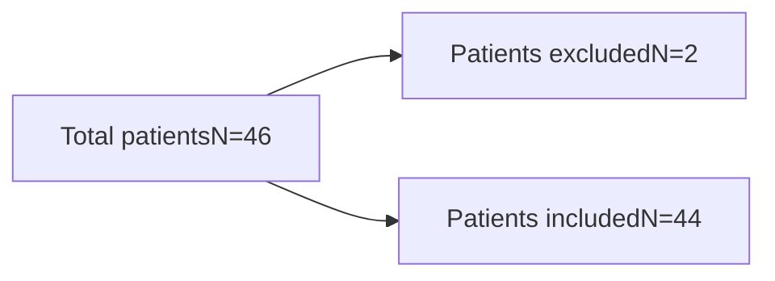

# Impact of a high-touch, collaborative, patient-centric, Hepatitis C specialty clinical program on completion of glecaprevir/pibrentasvir therapy

Walmart logo

M Swoope, PharmD, R Krouskos, PharmD, G Peeler, PharmD Candidate, C Wood, PharmD Candidate, C Bertram, PharmD, MBA
Walmart Specialty Pharmacy, Orlando, FL

Walmart Specialty Pharmacy logo

# BACKGROUND

* Hepatitis C (Hep C) is a liver infection caused by the Hepatitis C virus (HCV). It is the most common, chronic, blood-borne infection in the United States. It is estimated to affect as many as 3 million Americans.

* Most of our patients become infected with the Hep C virus by sharing needles or other equipment to inject drugs. Hep C is a short-term illness for some patients, however, for 70%–85% of patients who become infected with the virus, it becomes a long-term, chronic infection.

* Chronic Hep C is a serious disease that can result in long-term health problems, even death. Many of our patients might not be aware of their infection because they are not clinically ill.

* Currently, there is no vaccine, however, Hep C is often curable with the newer antiviral therapy that is shorter in duration and more tolerable than previous options.

* The Pharmacy Quality Alliance has provided a Specialty Core Measure Set defining Hep C Treatment Completion of Therapy as the “Percentage of individuals 18 years and older who initiated antiviral therapy during the measurement year for treatment of chronic Hep C, and who completed the minimum intended duration of therapy with no significant gap(s) in therapy.”

# OBJECTIVE

* To measure the impact of a high-touch, specialty clinical program, on driving therapy completion of glecaprevir/pibrentasivr in Hepatitis C patients.

* Overall, this program was built to demonstrate that a high-performing, specialty pharmacy has clinical value to patients and other key stakeholders in the pharmaceutical supply chain (e.g., physicians, payors, pharmaceutical industry, etc.).

# METHODS

* A Retrospective, Single Center Specialty Pharmacy study.

* Program outreach strategy included:
    

    - A “Welcome Call” was completed by a pharmacy technician with all patients.
    

    - The technician determined the best time with the patient (shared decision making) for the pharmacist to reach out to the patient.
    

    - A specialty clinical pharmacist completed a “New Start Pharmacist Initial Counseling Call” with all patients.
    

    - A Nursing Refill Reminder Call was initiated & completed.
    

    - A patient care coordinator synchronized prescription shipment with the nurse.

# METHODS

* After the patient completed their final refill, a nurse generated an “End-of-Therapy Call” to determine if completion of the therapy occurred with the provider.

* If any end-of-therapy calls were not completed, the pharmacy interns contacted the ordering physician’s office to determine if completion of the therapy occurred.

| Inclusion Criteria                                                                               | Exclusion Criteria                                               |
| ------------------------------------------------------------------------------------------------ | ---------------------------------------------------------------- |
| \* Patients who initiated therapy for glecaprevir/pibrentasvir during the month of February 2019 | \* Patients unable to complete therapy due to allergic reactions |

# RESULTS

* Sixteen patients were not eligible for this call due to the patient reaching out to the pharmacy prior to the refill reminder call for their shipment, refill not applicable, or allergies to the medication.

| Category                      | Number of Patients |
| ----------------------------- | ------------------ |
| Pharmacist Initial Counseling | 46                 |
| Nursing Refill Reminder       | 30                 |
| End of Therapy                | 44                 |

Patients that received specialty pharmacy...

# RESULTS

| Category                                                         | Percentage |
| ---------------------------------------------------------------- | ---------- |
| Patients eligible to complete therapy                            | 96%        |
| Patients ineligible to complete therapy due to allergic reaction | 4%         |

### Completion of Therapy Rate

| Category                              | Percentage |
| ------------------------------------- | ---------- |
| Patients eligible to complete therapy | 100%       |

# CONCLUSIONS

* A collaborative, high-touch specialty pharmacy managing Hep C patients confirmed a high rate of completion thereby indicating better performance.

* Specialty pharmacies that demonstrate improved outcomes with strong, coordinated, care processes can be more confident delivering value-based care for reimbursement.

# REFERENCES

1. Joel Claycomb, PharmD. Pharmacists In Position to Impact Change for Hepatitis C. Accessed 05/28/2019. Internet link: https://www.pharmacytimes.com/resource-centers/hepatitisc/pharmacists-in-position-to-impact-change-for-hepatitis-c.

2. PQA’s Specialty Core Measure Set. Accessed 05/28/2019. Internet link: https://www.pqaalliance.org/assets/Measures/PQA%20Specialty%20Measures%20Core%20Set%20081018.pdf.

3. HCV Guidance: Recommendations for Testing, Managing, and Treating Hepatitis C. Accessed 06/10/2019. Internet link: https://www.hcvguidelines.org/.

4. Viral Hepatitis C. Accessed 5/28/2019. Internet link: https://www.cdc.gov/hepatitis/hcv/index.htm.

# ACKNOWLEDGEMENTS & DISCLOSURES

Our sincerest thanks to the entire Walmart Specialty Pharmacy team for their dedication to engaging patients, building relationships, and influencing outcomes for our patients in this study and daily creating moments of care that change lives for everyone, everywhere.

Authors of this poster have nothing to disclose.

