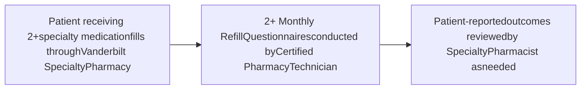

VANDERBILT UNIVERSITY MEDICAL CENTER logo QR code

# Assessing Patient-Reported Outcomes within an Integrated Health System Specialty Pharmacy

**E. Danielle Bryan1 | Katie Hosteng1 | Autumn D. Zuckerman1 | Ryan Moore2 | Leena Choi2**
1Vanderbilt Specialty Pharmacy, Vanderbilt University Medical Center | 2Department of Biostatistics, Vanderbilt University Medical Center

### SUMMARY

* The objective of this study was to determine if there is an association among patient-reported outcomes (missed doses, side effects, perceived medication effectiveness) in patients prescribed specialty medications at an integrated health system specialty pharmacy.

* Patient-reported side effects, missed doses, and perceived medication effectiveness were collected for 1,398 patients over 3 months.

* Patients filling specialty medications within an integrated health system specialty pharmacy model reported low rates of missed doses and side effects.

* Because side effects and adherence are associated with perceived medication effectiveness, specialty pharmacies should consider targeted monitoring in patients who report these outcomes.

### METHODS

#### January – March 2020

> Patient-reported side effects impact adherence and perceived medication effectiveness.

### RESULTS

FIGURE 1. Patient-Reported Outcomes

| Metric                                                      | Value |
| ----------------------------------------------------------- | ----- |
| Monthly refill questionnaires completed (n=1,398 patients)  | 4,125 |
| Perceived medication effectiveness as "excellent" or "good" | 97%   |
| Reported no side effects                                    | 99%   |
| Reported no missed doses                                    | 96%   |

Table 1. Patient Demographics (n=1398)

| Characteristic            | n (%)       |
| ------------------------- | ----------- |
| Age, years- median \[IQR] | 56 \[44-64] |
| Gender, female            | 930 (66)    |
| Race, white               | 1209 (87)   |
| Insurance type            |             |
| Commercial                | 801 (57)    |
| Medicare                  | 513 (37)    |
| Medicaid                  | 75 (5)      |
| Tricare/Other             | 9 (1)       |

Table 2. Specialty Clinics (n=1398)

| Specialty Clinic   | n (%)    |
| ------------------ | -------- |
| Rheumatology       | 712 (51) |
| Multiple Sclerosis | 332 (24) |
| Neurology          | 167 (12) |
| Dermatology        | 141 (10) |
| Asthma & Allergy   | 46 (3)   |

### Association Among Patient-Reported Outcomes

FIGURE 2. Side Effects and Missed Doses

| Category        | No Missed Dose | Missed Dose |
| --------------- | -------------- | ----------- |
| No side effects | 0.96           | 0.04        |
| Side effects    | 0.86           | 0.14        |

\* Patients who reported side effects were **2.87x** more likely to report a missed dose

FIGURE 3. Side Effects and Perceived Effectiveness

| Category        | Excellent | Good | Fair | Poor |
| --------------- | --------- | ---- | ---- | ---- |
| No side effects | 0.74      | 0.23 | 0.02 | 0.01 |
| Side effects    | 0.28      | 0.44 | 0.13 | 0.15 |

\* Patients who reported no side effects were **7.49x** more likely to report higher effectiveness

FIGURE 4. Missed Doses and Perceived Effectiveness

| Category       | Excellent | Good | Fair | Poor |
| -------------- | --------- | ---- | ---- | ---- |
| No Missed Dose | 0.74      | 0.23 | 0.02 | 0.01 |
| Missed Dose    | 0.57      | 0.34 | 0.05 | 0.04 |

\* Patients who reported no missed doses were **2.13x** more likely to report higher effectiveness

1. Lavallee DC, Chenok KE, Love RM, et al. Incorporating Patient-Reported Outcomes Into Health Care To Engage Patients And Enhance Care. Health Aff (Millwood). 2016;35(4):575-582. 2. AMCP Partnership Forum: Improving Quality, Value, and Outcomes with Patient-Reported Outcomes. J Manag Care Spec Pharm. 2018;24(3):304-310.

