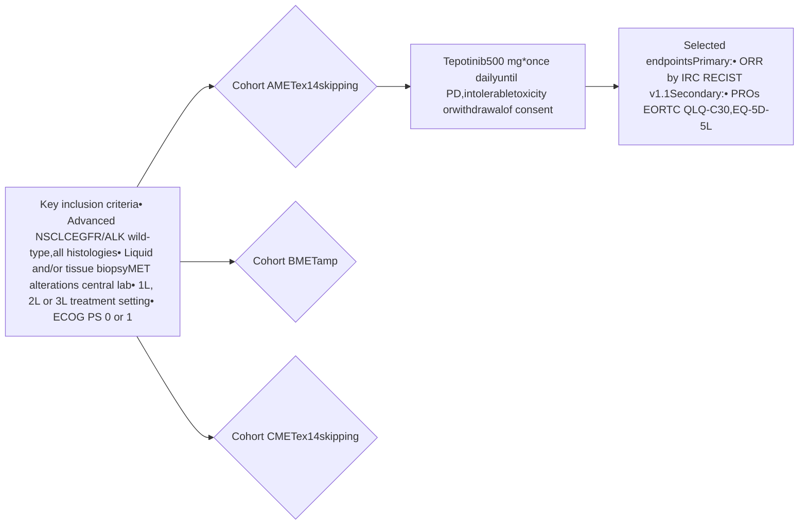

# US health utility in advanced non-small cell lung cancer (NSCLC) patients harboring MET exon 14 (METex14) skipping mutations treated with tepotinib

Copies of this poster obtained through Quick Response (QR) Code are for personal use only and may not be reproduced without permission from ASCO QCS, NASP and the author of this poster.

<u>Paul K. Paik1,2</u>, Mo Yang3, Emma Knowles4, Anthony Hatswell4, Simone Lang5, Bruce Gaumond3, Manuel Reister5, Helene Vioix5, Frank Xiaoqing Liu3

1 Thoracic Oncology Service, Memorial Sloan-Kettering Cancer Center, New York, NY, USA; 2 Weill Cornell Medical College, New York, NY, USA; 3 EMD Serono, Rockland, MA, USA; 4 Delta Hat, Nottingham, UK; 5 The healthcare business of Merck KGaA, Darmstadt, Germany

# CONCLUSIONS

* VISION is the first trial of a MET inhibitor to provide data on health utilities (preference-based measures of HRQoL) in patients with METex14 skipping NSCLC

* Overall HRQoL scores remained stable with tepotinib treatment, with no meaningful change in EORTC QLQ-C30 or EQ-5D-5L scores up to 84 weeks

* EORTC QLU-C10D and EQ-5D utilities showed moderate-to-high functioning and quality of life during tepotinib therapy until progression

* The increase in EQ-5D utilities with tepotinib before IRC-assessed progression exceeds the previously reported minimally important difference in cancer of 0.081

* Utility with tepotinib did not vary by prior treatment status, or by adenocarcinoma or squamous histology

* EORTC QLU-C10D and EQ-5D utilities from matched data collection points were highly correlated, suggesting similarities between both utility instruments

# INTRODUCTION

* Tepotinib is a highly selective, oral, once-daily MET inhibitor2,3 that has been approved in the US for treatment of advanced NSCLC harboring METex14 skipping4,5

* Approval was based on the Phase II VISION trial (Figure 1), in which tepotinib showed durable clinical activity and was well tolerated in patients with advanced METex14 skipping NSCLC6,7

* PROs were evaluated as a secondary endpoint using EORTC QLQ-C30 and the EQ-5D-5L questionnaires, and showed maintenance of overall HRQoL during tepotinib treatment6,8

* Results were scored from 0 to 100, where a change of ≥10 points from baseline was considered to be the minimal clinically important difference; higher scores indicated improvement on EORTC QLQ-C30 global health status and EQ-5D-5L VAS scores

* Health utilities are HRQoL metrics reflecting patient preferences for different health states, and are expressed on a scale from 0 (dead) to 1 (full health)9

* Utilities are widely used to inform cost-effectiveness analyses in Health Technology Assessment (HTA)9

* To complement the clinical findings of VISION, we used PRO data collected in the trial to evaluate utilities in tepotinib-treated patients with METex14 skipping NSCLC (Cohort A; data cut-off: July 1, 2020)

## Figure 1. VISION: Open-label, multicenter, multicohort, Phase II trial (NCT02864992)6

\*Containing 450 mg active moiety.

# RESULTS (CONTINUED)

* In VISION, PROs were assessed according to the schedule in Figure 2

## Figure 2. VISION: Schedule of PRO assessments

| Event            | Week | PROs (EORTC QLQ-C30, EQ-5D-5L) |
| ---------------- | ---- | ------------------------------ |
| Baseline         | 1    | \[yes]                         |
| Treatment        | 7    | \[yes]                         |
| Treatment        | 13   | \[yes]                         |
| Treatment        | 19   | \[yes]                         |
| Treatment        | 25   | \[yes]                         |
| Treatment        | 31   | \[yes]                         |
| Treatment        | 37   | \[yes]                         |
| Treatment        | 49   | \[yes]                         |
| Treatment        | 61   | \[yes]                         |
| Treatment        | 73   | \[yes]                         |
| PD               |      |                                |
| EoT              |      | \[yes]                         |
| Safety follow-up |      | \[yes]                         |

* PRO questionnaire responses were used to derive utilities using US weights:

  - EORTC QLU-C10D utilities were derived from EORTC QLQ-C30 responses using US value sets10

  - For EQ-5D utilities, EQ-5D-5L data were mapped to EQ-5D-3L responses using a crosswalk algorithm,11 and utilities were obtained using the value set for EQ-5D-3L weights for the US12,13

* To account for dependencies within the data (i.e., correlated repeated measurements within patients) when evaluating mean change over time, utilities were analyzed using linear mixed modeling

* The linear mixed models included a random intercept and fixed effects for baseline utility and progression status (i.e., pre- or post-progression health states, as assessed by IRC or INV):

  - Utility ~ (1 | patient ID) + baseline + progression status

* Exploratory analyses also evaluated the impact of prior treatment status, or adenocarcinoma or squamous histology

* Model fit was evaluated using the AIC and BIC

# RESULTS

## Patients

* At data cut-off (July 1, 2020), 152 patients were treated with tepotinib; 151 patients had confirmed METex14 skipping and were analyzed for HRQoL, with a median follow-up for overall survival of 16.4 (range: 0.3 to 43.3) months

* Of 151 patients, half of the patients were male (52.3%), most were elderly (median age 73.0 years) with an ECOG PS of 1 (73.5%), half had a history of nicotine use (51.7%), and 54.3% had received prior therapy

* Questionnaire completion numbers were high (Table S1; accessible via QR code on the bottom right of the poster)

## Global health and VAS scores

* Mean baseline scores of EORTC QLQ-C30 global health and EQ-5D-5L VAS showed moderate-to-high functioning and quality of life (54.3 [SD: 24.2] and 62 [SD: 20.4], respectively)

* Mean change from baseline in EORTC QLQ-C30 global health and EQ-5D-5L VAS scores demonstrated stability in patient quality of life over time (Figures 3 and 4)

## Figure 3. Mean change from baseline in EORTC QLQ-C30 global health score

| Time on treatment (weeks) | Mean change from baseline |
| ------------------------- | ------------------------- |
| 6                         | \~2                       |
| 12                        | \~5                       |
| 18                        | \~5                       |
| 24                        | \~5                       |
| 30                        | \~5                       |
| 36                        | \~5                       |
| 42                        | \~5                       |
| 60                        | \~5                       |
| 72                        | \~5                       |
| 84                        | \~5                       |
| EoT                       | \~-5                      |

Visits with ≤ 10 patients are not presented, with the exception of the EoT/30-day safety follow-up. Dashed lines show minimal clinically important difference of +/- 10 points.

## Figure 4. Mean change from baseline in EQ-5D-5L VAS score

| Time on treatment (weeks) | Mean change from baseline |
| ------------------------- | ------------------------- |
| 6                         | \~2                       |
| 12                        | \~5                       |
| 18                        | \~5                       |
| 24                        | \~5                       |
| 30                        | \~5                       |
| 36                        | \~5                       |
| 42                        | \~5                       |
| 60                        | \~5                       |
| 72                        | \~5                       |
| 84                        | \~5                       |
| EoT                       | \~-5                      |

Visits with ≤ 10 patients are not presented, with the exception of the EoT/30-day safety follow-up. Dashed lines show minimal clinically important difference of +/- 10 points.

## EORTC QLU-C10D and EQ-5D utilities

* Of 151 patients analyzed for HRQoL, 983 and 907 observations were available for estimating EORTC QLU-C10D and EQ-5D utilities, respectively

* In linear mixed model analyses:

  - EORTC QLU-C10D health utilities were found to be significantly associated with baseline utility and progression status by IRC, but not with prior treatment status (Table S2; accessible via QR code on the bottom right of the poster)

  - EQ-5D utilities were found to be significantly associated with baseline utility and progression status by IRC, but not with prior treatment status or histology (Table S3; accessible via QR code on the bottom right of the poster)

* Therefore, separate utility values for baseline and pre- and post-progression health states were included in the analysis, irrespective of prior treatment for EORTC QLU-C10D health utilities, and irrespective of prior treatment or histologic subtype for EQ-5D utilities

* Estimated mean EORTC QLU-C10D utilities increased after tepotinib initiation, from 0.691 at baseline to 0.722 in the IRC-assessed progression-free period, and decreased after progression (0.671; Figure 5)

* Estimated mean EQ-5D utilities increased after tepotinib initiation, from 0.727 at baseline to 0.787 in the IRC-assessed progression-free period, and decreased after progression (0.733; Figure 5)

* Similar trends were seen when progression was based on INV assessment (Figure 6)

## Figure 5. Estimated EORTC QLU-C10D and EQ-5D utilities, according to baseline utility and progression status (IRC-assessed)

| Health state            | Estimated EORTC QLU-C10D utilities† | Estimated EQ-5D utilities‡ |
| ----------------------- | ----------------------------------- | -------------------------- |
| Baseline                | 0.691 (± 0.013)                     | 0.727 (± 0.011)            |
| Pre-progression         | 0.722 (± 0.015)                     | 0.787 (± 0.012)            |
| Post-progression        | 0.671 (± 0.012)                     | 0.733 (± 0.011)            |
| Sample Size Information |                                     |                            |
| Patients, n             | 150                                 | 150                        |
| Obv, n                  | 135                                 | 777\* / 197#               |

Error bars: standard error. \*776 observations for EQ-5D utilities; †Estimated using Model 1 (see Table S2); ‡Estimated using Model 3 (see Table S3); #209 observations for EQ-5D utilities.

## Figure 6. Estimated EORTC QLU-C10D and EQ-5D utilities, according to baseline utility and progression status (INV-assessed)

| Health state            | Estimated EORTC QLU-C10D utilities† | Estimated EQ-5D utilities‡ |
| ----------------------- | ----------------------------------- | -------------------------- |
| Baseline                | 0.691 (± 0.012)                     | 0.727 (± 0.011)            |
| Pre-progression         | 0.719 (± 0.015)                     | 0.785 (± 0.012)            |
| Post-progression        | 0.669 (± 0.012)                     | 0.726 (± 0.011)            |
| Sample Size Information |                                     |                            |
| Patients, n             | 150                                 | 150                        |
| Obv, n                  | 135                                 | 808\* / 166#               |

Error bars: standard error. \*754 observations for EQ-5D utilities; †Estimated using a linear mixed model with a random intercept (coefficient: 0.719; SE: 0.015; p<0.001) and fixed effects for baseline utility (coefficient: –0.028; SE: 0.012; p=0.029) and progression status (coefficient: –0.049; SE: 0.012; p<0.001); ‡Estimated using a linear mixed model with a random intercept (coefficient: 0.785; SE: 0.012; p<0.001) and fixed effects for baseline utility (coefficient: –0.058; SE: 0.011; p<0.001) and progression status (coefficient: –0.059; SE: 0.011; p<0.001); #153 observations for EQ-5D utilities.

## Correlation between EORTC QLU-C10D and EQ-5D utilities

* Utilities measured with each method (EORTC QLU-C10D and EQ-5D) were generally similar in all health states (Figures 5 and 6)

* Matched EORTC QLU-C10D and EQ-5D utilities derived from data collected at the same visit were generally highly correlated (Pearson’s correlation coefficient: 0.681; Figure 7)

## Figure 7. Scatterplot of matched EORTC QLU-C10D and EQ-5D utility scores from the same visit

Scatterplot of matched EORTC QLU-C10D and EQ-5D utility scores

**Abbreviations:** 1L, first line; 2L, second line; 3L, third line; AIC, Akaike information criterion; ALK, anaplastic lymphoma kinase; BIC, Bayesian information criterion; ECOG PS, Eastern Cooperative Oncology Group performance status; EGFR, epidermal growth factor receptor; EORTC QLU-C10D, European Organization for Research and Treatment of Cancer Quality of Life Utility Measure-Core 10 dimensions; EORTC QLQ-C30, EORTC Quality of Life Questionnaire Core 30; EoT, end of treatment; EQ-5D, EuroQol 5-dimension; EQ-5D-3L, EuroQol 5-dimension 3-level scale; EQ-5D-5L, EuroQol 5-dimension 5-level scale; HRQoL, health-related quality of life; HTA, Health Technology Assessment; INV, investigator; IRC, independent review committee; MET, mesenchymal-epithelial transition factor; METamp, MET amplification; METex14, MET exon 14; NSCLC, non-small cell lung cancer; Obv, observation; ORR, objective response rate; PD, progressive disease; PRO, patient-reported outcome; RECIST, Response Evaluation Criteria in Solid Tumours; SD, standard deviation; SE, standard error; VAS, visual analog score.

**References:** 1. Pickard AS, et al. Health Qual Life Outcomes. 2007;5:70; 2. Bladt F, et al. Clin Cancer Res. 2013;19(11):2941–2951; 3. Falchook GS, et al. Clin Cancer Res. 2020;26(6):1237–1246; 4. Tepotinib Japanese Package Insert, 2020; 5. Tepotinib US Prescribing Information, 2021; 6. Paik PK, et al. N Engl J Med. 2020;383(10):931–943; 7. Paik PK, et al. J Thorac Oncol. 2021;16(3S):S174[MA11.05]; 8. Garassino MC, et al. Ann Oncol. 2020;31(S4):S864[1347P]; 9. Tosh JC, et al. Value Health. 2011;14(1):102–109; 10. Revicki DA, et al. Med Decis Making. 2021;41(4):485–501; 11. van Hout B, et al. Value Health. 2012;15(5):708–715; 12. Dolan P. Med Care 1997;35(11):1095–1108; 13. Methods for Analyzing 'EQ-5D' Data and Calculating 'EQ-5D' Index Scores. Access: https://cran.r-project.org/web/packages/eq5d/eq5d.pdf.

**Acknowledgements:** Study sponsored by the healthcare business of Merck KGaA, Darmstadt, Germany (CrossRef Funder ID: 10.13039/100009945). The authors would like to thank patients, all investigators and co-investigators, and the study teams at all participating centers and at the healthcare business of Merck KGaA, Darmstadt, Germany. Medical writing and editorial assistance was provided by Mark Dyson, Syneos Health Medical Communications (London, UK), and funded by the healthcare business of Merck KGaA, Darmstadt, Germany.

**Disclosures:** Paul Paik reports an advisory role at AbbVie, AstraZeneca, Calithera, Celgene, Lilly, Takeda; EMD Serono, Xencor, Bicara, Boehringer Ingelheim, GlaxoSmithKline, EMD Serono; his research institution has received research expenses from Celgene, EMD Serono. Bruce Gaumond, Mo Yang and Frank Xiaoqing Liu are employees of EMD Serono. Emma Knowles and Anthony Hatswell are employees of Delta Hat. Simone Lang, Manuel Reister and Helene Vioix are employees of the healthcare business of Merck KGaA, Darmstadt, Germany.

Poster originally accepted and presented at ASCO QCS, 24–25 September 2021

Presented at the National Association of Specialty Pharmacy (NASP) Annual Meeting | September 27–30, 2021 | Virtual

QR Code for Supplementary materials
QR Code for Poster recording
Materials obtained through these Quick Response (QR) Codes are for personal use only and may not be reproduced without the consent of the poster author.

