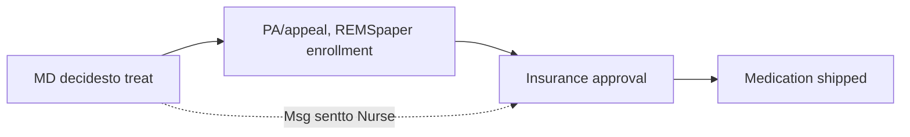
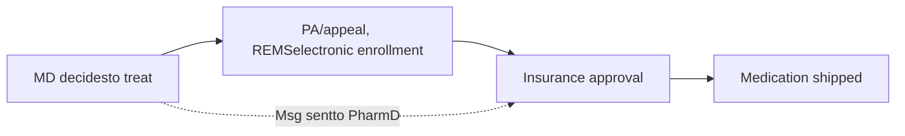

Vanderbilt University Medical Center logo

# PREDICTING TIME TO MEDICATION ACCESS FOR HEMATOLOGIC MALIGNANCIES: THE IMPACT OF AN INTEGRATED SPECIALTY PHARMACY AND LIMITED DISTRIBUTION DRUG NETWORKS

VANDERBILT UNIVERSITY MEDICAL CENTER

Houston Wyatt, PharmD, CSP1 | Autumn Zuckerman, PharmD, CSP1 | Megan Peter, PhD1 | Samuel Starks2 | Matt Maulis, PharmD2 | Josh DeClercq, MS3 | Leena Choi, PhD3 | Madan Jagasia, MBBS, MS4
1Specialty Pharmacy, Vanderbilt University Medical Center, 2Lipscomb University College of Pharmacy, 3Department of Biostatistics, Vanderbilt University Medical Center, 4Division of Hematology and Oncology, Vanderbilt University Medical Center

## BACKGROUND

* Oral anti-neoplastic therapy can be difficult to access due to insurance authorization, out of pocket costs, and limited distribution drugs (LDDs).1

* In September 2015, a clinical pharmacist joined the Hematology Clinic at Vanderbilt-Ingram Cancer Center to facilitate timeliness of medications dispensed by Vanderbilt Specialty Pharmacy (non-LDDs).

* The pharmacist’s scope expanded to manage LDDs in June 2016 (Workflow shown in Figure 1).

## Figure 1. Clinic Workflow by Time Period and Drug Type

**Pre-PharmD Integration, Limited Distribution Drug (Time 1): Sept 2015- May 2016**

**Post-PharmD Integration, Limited Distribution Drug (Time 2): June 2016- Sept 2017**

**Non-Limited Distribution Drug, PharmD Integration (Time 1 and 2): Sept 2015- Sept 2017**

## OBJECTIVES

* Compare access time for LDD vs. non-LDD prescriptions

* Assess whether integrating a clinical pharmacist into clinic decreased access time to LDD medications

## METHODS

### Inclusion criteria:

* Oral anti-neoplastic therapy prescribed by a hematology provider to an adult patient between Sept 2015-Sept 2017, excluding uninsured patients or free drug sample recipients.

### Primary outcome:

* Time (in days) from treatment decision to medication shipment

### Statistical analysis:

* Proportional odds logistic regression to test whether access time was associated with drug type (LDD vs. non-LDD), Time Period (Time 1: 9/2015-5/2016; Time 2: 6/2016-9/2017), and Drug Type* Time Period, controlling for off-label use and insurance type.

## RESULTS

### Table 1. Characteristics of Prescriptions (n=410)

|                     | Time 1 (n=119) n (%) | Time 2 (n=291) n (%) |
| ------------------- | ------------------------ | ------------------------ |
| Insurance           |                          |                          |
| Commercial          | 70 (59%)                 | 143 (49%)                |
| Government          | 49 (41%)                 | 148 (51%)                |
| Combination Therapy |                          |                          |
| Yes                 | 9 (8%)                   | 31 (11%)                 |
| No                  | 110 (92%)                | 260 (89%)                |
| Off Label           |                          |                          |
| Yes                 | 10 (8%)                  | 36 (12%)                 |
| No                  | 109 (92%)                | 255 (88%)                |
| Drug Type           |                          |                          |
| Non-LDD             | 89 (75%)                 | 196 (67%)                |
| LDD                 | 30 (25%)                 | 95 (33%)                 |
| Common Medications  |                          |                          |
| LDD:                |                          |                          |
| Revlimid®           | 23 (19%)                 | 60 (21%)                 |
| Pomalyst®           | 7 (6%)                   | 35 (12%)                 |
| Non-LDD:            |                          |                          |
| Imbruvica®          | 30 (25%)                 | 41 (14%)                 |
| Ninlaro®            | 16 (13%)                 | 39 (13%)                 |
| Jakafi®             | 17 (14%)                 | 36 (12%)                 |

### Primary Outcome

Median time from treatment decision to shipment:

* 6 days (IQR: 3-9) for LDD

* 3 days (IQR: 1-6) for non-LDD

Predictors of Medication Access Time (Table 2)

* Longer access time for off-label than on-label indications

* In Time 1, time from treatment decision to shipment was significantly longer for LDD than non-LDD drugs

* For LDD drugs, access time reduced from Time 1 to Time 2

### Table 2. Proportional Odds Logistic Regression testing predictors of Medication Access Time

| Predictor                           | Odds Ratio | Lower CI | Upper CI | p-value |
| ----------------------------------- | ---------- | -------- | -------- | ------- |
| Time 2 vs. Time 1                   | 1.34       | 0.86     | 2.09     | 0.191   |
| LDD vs. Non-LDD                     | 6.56       | 3.07     | 14.04    | <0.001  |
| Off-label vs. on-label              | 2.59       | 1.47     | 4.55     | 0.001   |
| Government vs. Commercial Insurance | 1.02       | 0.72     | 1.44     | 0.905   |
| Time 2 \* LDD                       | 0.41       | 0.17     | 0.96     | 0.040   |

### Figure 2. Mean Days between Treatment Decision, PA Completion, Insurance Approval, and Drug Shipment

| Category   | Tx Dec to PA Complete | PA Complete to Approval | Approval to Shipment |
| ---------- | --------------------- | ----------------------- | -------------------- |
| Non-LDD    | 0.8                   | 1.3                     | 2.7                  |
| LDD Time 1 | 4.4                   | 0.3                     | 3.0                  |
| LDD Time 2 | 0.6                   | 0.7                     | 5.2                  |

Note: LDD=Limited Distribution Drug, PA=Prior Authorization, Tx Dec=Treatment Decision

100% of insurance appeals were approved (5 in Time 1, 23 in Time 2)

## RESULTS

### Figure 3. Time from Treatment Decision to Insurance Approval: Time 1 {A} vs. Time 2 {B}

Scatter plot showing time from treatment decision to insurance approval over time for LDD and non-LDD drugs, divided into Time 1 (A) and Time 2 (B)

## CONCLUSION

* Integrating a pharmacist into clinic significantly shortened time from treatment decision to shipment for LDD drugs, partially overcoming access barriers.

* Access to these drugs is still slower than non-LDD medications as they cannot be fully integrated into clinic workflow. The integrated specialty pharmacy program at VSP adds value to patient access and outperforms LDD medications, challenging the value of LDD networks beyond medical economics.

### References:

1. Schwartz RN, Eng KJ, Frieze DA, et. al. NCCN Task Force Report: Specialty Pharmacy: J Natl Compr Canc Netw.2010 v. 8, p. S-1-S-12.

