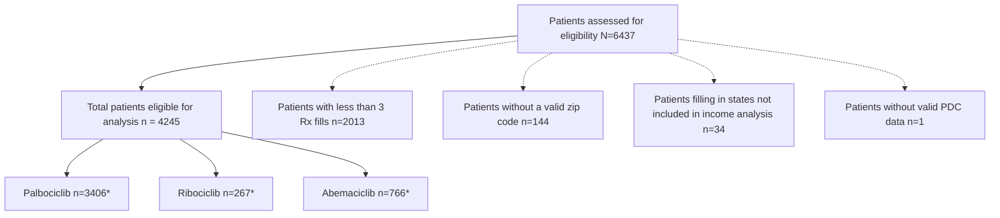

SHIELDS HEALTH SOLUTIONS logo

# Factors Influencing CDK4/6 Inhibitor Adherence

Navya Clement, PharmD, BCPS, CSP; Martha Stutsky, PharmD, BCPS; Shreevidya Periyasamy, MS HIA; Kate Smullen, PharmD, MSCS; Andrew Argeros; Diane Wolfe, RPh; Jennifer L. Donovan, PharmD

## BACKGROUND

* The National Comprehensive Cancer Network recognizes CDK4/6 inhibitors palbociclib, abemaciclib, and ribociclib in combination with aromatase inhibitors or fulvestrant as first-line therapy regimens in the treatment of HR-positive/HER2-negative advanced or metastatic breast cancer.1

* Several reports describe adherence and persistence with oral oncolytics and with CDK4/6 inhibitors specifically, but there are limited reports that describe factors associated with adherence for this drug class.2-4

* The primary objective is to understand factors impacting patient adherence to CDK4/6 inhibitors.

## METHODS

* Multicenter, retrospective observational analysis of adult patients new to therapy with a CDK4/6 inhibitor from 35 U.S. health systems with integrated specialty pharmacies (HSSPs) working with ShieldsRx.

* Inclusion criteria for patients was treatment initiation within the last four years, ≥3 prescription fills for a CDK4/6 inhibitor, and currently on therapy or discontinued.

* Descriptive statistics were used to analyze the groups which were stratified by drug, age, insurance type, median household income, and geographic region (Midwest, Northeast, South, West).

* Significance test (Kruskal-Wallis) and post-hoc test (Dunn) were used to assess differences in PDC between drug groups stratified by geographic region.

* Adherence was evaluated by calculating the proportion of days covered (PDC), defined as the total days' supply divided by the total possible days covered.

* Groups were analyzed by mapping state of residence median household income with average PDC.

Figure 1: Study Inclusion Determination

\*Will not add to n, as some patients were on more than one drug during the time period

## RESULTS

Patient characteristics are listed in **Table 1** with the associated PDC for each group. Analysis of PDC between drug groups showed non-significant differences when stratified by geographic region (**Figure 2**). A summary of average median household income by state associated with PDC categories (**Figure 3**) demonstrates income was lowest at $61,254 in the lowest PDC tier (82.0-86.5%) and highest at $70,639 in the highest PDC tier (≥90.0%). Individuals with higher PDC were associated with higher median household income.

## Table 1: Patient Characteristics

| CHARACTERISTIC (N=4245)         | Palbociclib n=3406 | Ribociclib n=267 | Abemaciclib n=766 |
| ------------------------------- | ------------------ | ---------------- | ----------------- |
| Age\* (years)                   | 69                 | 60               | 68                |
| ≤50 years, n(%)                 | 288 (8)            | 63 (24)          | 130 (17)          |
| PDC\*                           | 87%                | 88%              | 85%               |
| 50 years, n(%)                  | 3118 (92)          | 204 (76)         | 636 (83)          |
| PDC\*                           | 87%                | 87%              | 87%               |
| Gender                          |                    |                  |                   |
| Female, n(%)                    | 3340 (98)          | 261 (98)         | 755 (99)          |
| PDC\*                           | 87%                | 87%              | 87%               |
| Male, n(%)                      | 63 (1.8)           | 6 (2)            | 11 (1)            |
| PDC\*                           | 88%                | 93%              | 88%               |
| Unknown, n(%)                   | 3 (0.2)            | -                | -                 |
| PDC\*                           | 100%               | -                | -                 |
| Health System Geographic Region |                    |                  |                   |
| Midwest, n(%)                   | 1410 (41)          | 139 (52)         | 323 (42)          |
| PDC\*                           | 88%                | 89%              | 88%               |
| Northeast, n(%)                 | 716 (21)           | 33 (12)          | 157 (20)          |
| PDC\*                           | 87%                | 86%              | 87%               |
| South, n(%)                     | 687 (20)           | 40 (15)          | 158 (21)          |
| PDC\*                           | 86%                | 82%              | 85%               |
| West, n(%)                      | 593 (18)           | 55 (21)          | 128 (17)          |
| PDC\*                           | 88%                | 88%              | 86%               |
| Insurance Type\*\*              |                    |                  |                   |
| Commercial, n(%)                | 2284 (67)          | 197 (74)         | 504 (66)          |
| PDC\*                           | 87%                | 88%              | 87%               |
| Medicaid, n(%)                  | 406 (12)           | 42 (16)          | 92 (12)           |
| PDC\*                           | 87%                | 86%              | 85%               |
| Medicare, n(%)                  | 1369 (40)          | 68 (25)          | 244 (32)          |
| PDC\*                           | 87%                | 87%              | 88%               |
| Unknown, n(%)                   | 180 (5)            | 16 (6)           | 20 (3)            |
| PDC\*                           | 90%                | 91%              | 89%               |
| Number of prescription fills\*  | 16                 | 12               | 10                |

\*Average

\*\*Will not add to n, as some patients had more than one insurance type

Figure 2: Distribution of PDC by CDK4/6 Inhibitor and Geographic Region

| Drug        | Region    | Average PDC |
| ----------- | --------- | ----------- |
| Palbociclib | West      | 0.88        |
| Palbociclib | Midwest   | 0.88        |
| Palbociclib | South     | 0.86        |
| Palbociclib | Northeast | 0.87        |
| Ribociclib  | West      | 0.88        |
| Ribociclib  | Midwest   | 0.89        |
| Ribociclib  | South     | 0.82        |
| Ribociclib  | Northeast | 0.86        |
| Abemaciclib | West      | 0.86        |
| Abemaciclib | Midwest   | 0.88        |
| Abemaciclib | South     | 0.85        |
| Abemaciclib | Northeast | 0.87        |

Geographic Regions: Northeast South Midwest West

Figure 3: PDC and Average Median Household Income Distribution by State5

Geographical map of US showing PDC distribution by state

| PDC Tiers                       | 82.0 - 86.5% | 86.7 - 89.9% | ≥90%       |
| ------------------------------- | ------------ | ------------ | ---------- |
| Average median household income | $61,254.00   | $65,818.00   | $70,639.00 |
| Average per capita income       | $32,640.00   | $36,108.00   | $37,332.00 |
| Volume (n)                      | 707          | 2195         | 1364       |

## CONCLUSIONS

* Analysis of a large cohort of CDK4/6 inhibitor patients at HSSPs demonstrated high and consistent adherence across drug, age group, insurance type, and geographic location, highlighting the impact of the HSSP care model.

* Observations between U.S. state income level and adherence underscore the need to direct additional support to vulnerable populations.

* Further analysis mapping income at zip code level is recommended to separate various income groups.

## REFERENCES

1. NCCN Clinical Practice Guidelines in Oncology: Breast cancer. Version 4.2022. Available at: https://www.nccn.org/professionals/physician_gls/pdf/breast.pdf

2. Stephenson JJ, Gable JC, Zincavage R, et al. Treatment Experiences with CDK4&6 Inhibitors Among Women with Metastatic Breast Cancer: A Qualitative Study. Patient Prefer Adherence 2021;15:2417-2429. Published 2021 Nov 3. doi:10.2147/PPA.S319239

3. Conley CC, McIntyre M, Pensak NA, et al. Barriers and facilitators to taking CDK4/6 inhibitors among patients with metastatic breast cancer: a qualitative study. Breast Cancer Res Treat. 2022;192(2):385-399. doi:10.1007/s10549-022-06518-2

4. Gil-Gil M, Alba E, Gavilá J, et al. The role of CDK4/6 inhibitors in early breast cancer. Breast. 2021;58:160-169. doi:10.1016/j.breast.2021.05.008

5. Quick Facts: United States. United States Census Bureau. https://www.census.gov/quickfacts/fact/map/US/INC110220 (Accessed September 2, 2022).

## DISCLOSURES

The authors of this presentation have nothing to disclose concerning possible financial or personal relationships with commercial entities that may have a direct or indirect interest in the subject matter of this presentation

QR Code

SCAN ME icon

Virtual Poster at NASP 2022 Annual Meeting

