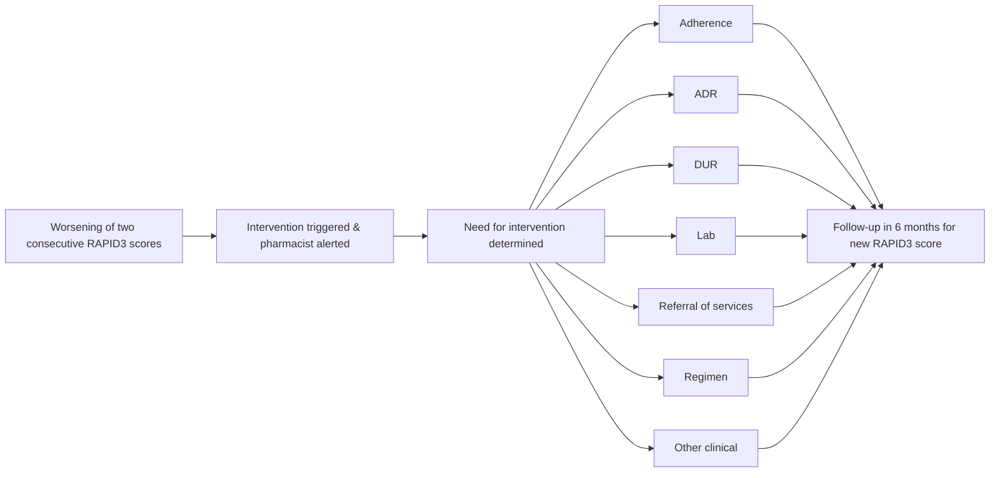

# Evaluating the Impact of Health System Specialty Pharmacist Interventions on Rheumatologic Disease Clinical Outcomes Trellis logo

Suprina Patel PharmD, Neda Hanson PharmD/MPH, Alexa Miller PharmD Candidate

## BACKGROUND

* Routine Assessment of Patient Index Data 3 (RAPID3) is a pooled index of three patient-reported measures the American College of Rheumatology (ACR) accepts as core dataset measures in Rheumatoid Arthritis (RA), Psoriatic Arthritis (PsA), and Ankylosing Spondylitis (AS): function, pain, and patient global estimate of status.

* Trellis Rx partners with health systems to offer medically integrated health system specialty pharmacy services to patients. Pharmacists and pharmacy liaisons with Electronic Health Record (EHR) access are embedded onsite at health systems, uniquely positioning them to conduct RAPID3 assessments and to intervene between appointments when needed, filling a gap in care and allowing for quicker identification of potential interventions.

* Data is collected digitally or telephonically and documented using Arbor, Trellis Rx's proprietary specialty pharmacy technology platform. Arbor enables consistent collection and reporting and auto-triggers pharmacist interventions using an algorithm that identifies worsening RAPID3 scores. The pharmacists then interpret the triggered intervention and worsening scores to make an appropriate clinical recommendation.

## OBJECTIVE

* The primary objective of this study is to determine the benefit of pharmacist involvement by measuring how many interventions are triggered and how many of these triggered interventions result in a pharmacist led intervention.

* Post-intervention RAPID3 scores will also be measured and the resulting improvement in scoring will be analyzed.

## METHODS

* Multi-center, retrospective study of adult patients with a diagnosis of RA, PsA, or AS receiving from September 2020 to May 2021.

* Patients will have had two consecutively worsening RAPID3 scores, resulting in a pharmacist intervention trigger. Interventions completed by pharmacists will be assessed for outcomes.

* Follow up RAPID3 scores post pharmacist intervention will be assessed to describe the value pharmacist intervention will have had on this patient reported outcome.

## PATIENT POPULATION

### MALE/FEMALE COMPARISON

| Category      | Percentage |
| ------------- | ---------- |
| Male (n=51)   | 35         |
| Female (n=95) | 65         |

### PAYER BREAKDOWN

| Category          | Percentage |
| ----------------- | ---------- |
| Commercial (n=75) | 51         |
| Medicare (n=53)   | 36         |
| Medicaid (n=12)   | 8          |
| Tricare (n=1)     | 1          |
| Other (unlabeled) |            |

## RESULTS

* 85 patient cases were included in which a pharmacist intervention was triggered as a result of worsening RAPID3 scores.

* Of the 85 interventions triggered, 38 were determined to be clinically relevant resulting in pharmacist recommendations.
    

    - 30 interventions resulted in a change of therapy.
    

    - 7 resulted in a follow-up appointment.
    

    - 1 resulted in an adherence aid.

* A preliminary analysis shows a trend down in follow-up RAPID3 scores post-pharmacist intervention. A follow-up study will be conducted to evaluate these resulting scores.

* 47 of the 85 interventions triggered were deemed to be a worsening of score unrelated to rheumatologic disease, underlining the importance of a pharmacist review of these values.

### COMPARISON OF INTERVENTIONS MADE

| Intervention Type | Number of Cases |
| ----------------- | --------------- |
| NEW               | 8               |
| ADHERENCE         | 14              |
| FOLLOW-UP         | 14              |
| CHANGED           | 30              |
| MINIMAL           | 33              |
| UNRELATED         | 47              |

* **New**: Pharmacist recommended an alternative therapy due to change in RAPID3

* **Adherence**: Pharmacist made an adherence recommendation due to change in RAPID3 scores

* **Follow-up**: Pharmacist determined change in RAPID3 scores requires in-office follow-up with provider

* **Changed**: Pharmacist recommended a change in dosing, frequency, schedule, etc. due to change in RAPID3 scores

* **Minimal**: Pharmacist evaluated and determined change in RAPID3 scores not clinically significant - no changes made in therapy

* **Unrelated**: Pharmacist evaluated and determined that the change in RAPID3 scores unrelated to RA, PsA, or AS – no changes made in therapy, provider made aware

## DISCUSSION

Patients who have two consecutively worsening RAPID3 scores will have an algorithm-triggered intervention for pharmacist follow up:

* The pharmacist will be alerted and evaluate the scores to make an appropriate intervention.

* Interventions made were broken down into types as shown above.

* Following intervention, RAPID3 scores will be repeated within 6 months to reevaluate patient. Post intervention study will be completed in the future and is not included in this data set.

## CONCLUSIONS

* Pharmacists intervening upon patients with worsening RAPID3 scores are vital to the health of the patient, the health system, and ultimately patient reported outcomes. Locally-embedded health system specialty pharmacists are uniquely positioned to collect and interpret these scores in a routine and meaningful way.

* 38 patients had a pharmacist-led intervention which resulted in therapy change, follow-up visit, or adherence aids.

* It is important to understand that these interventions would have been delayed until the next patient office visit in a non-multidisciplinary team. The benefit of pharmacist involvement in the care of patients with rheumatologic diseases is clearly outlined using the intervention outcomes mentioned. Trellis Rx and our partner health systems will continue to monitor the improvements of patients based upon pharmacist-led interventions.

* Interventions must be partnered with clinical evaluation, and the RAPID3 cannot be used as the sole tool to assess a patient's therapy.

