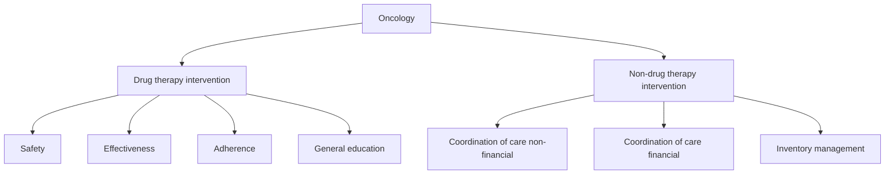
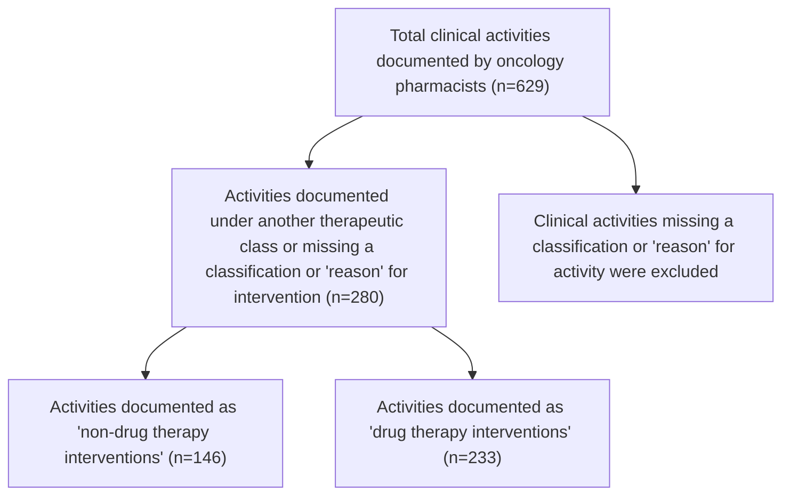

WVU Medicine Specialty Pharmacy logo

# Evaluation of pharmacist-driven clinical interventions in oncology and hematology patients

**Morgan Petitte, PharmD, MBA, BCOP, Marisa Barton, PharmD**
West Virginia University Medicine Specialty Pharmacy
Morgantown, West Virginia

ashp Accredited logo

## Background

* Management of patients with cancer requires collaboration among a patient-centered care team often including specialty pharmacists

* Health system specialty pharmacists are uniquely positioned to provide safe and effective medication management for oncology patients

* The diverse types of solid tumor and hematologic malignancies covered by specialty pharmacists leads to considerable variation in patient management with often unique pharmacist activities

* Defining and classifying pharmacist activities has historically been challenging, particularly in the care of patients with cancer

* More detailed classification of clinical activities performed by oncology specialty pharmacists may lead to a better understanding of their role on the care team as well as more concise documentation of interventions that lead to better patient outcomes1

## Objectives

* **Primary objective**

    - Classify types of clinical activities performed by specialty pharmacists caring for patients with cancer

* **Secondary objective**

    - Quantify pharmacist time spent on clinical activities performed by specialty pharmacists

## Methods

* Retrospective review of clinical activities completed by specialty pharmacists caring for patients with cancer at West Virginia University Medicine Specialty Pharmacy

* Data was collected from activities recorded by specialty pharmacists in Therigy STM™ between Jan. 1, 2024 and June 28, 2024

> **Inclusion criteria**
> * Patients enrolled in the patient management program in the therapeutic category "oncology" with one recorded clinical activity Therigy STM™ between Jan. 1, 2024 and June 28, 2024
> * Recorded clinical activities must have one or more classifications or "reasons" for intervention

> **Exclusion criteria**
> * Any patient not enrolled in the patient management program (PMP)
> * Any clinical activity missing a reason classification or reason for activity
> * Any patient with a clinical activity missing classification or "reason" for intervention

## Results

Chart 1: Clinical activities performed from January 1, 2024 through June 28, 2024

| Drug therapy interventions\* Safety         | Drug therapy interventions\* Effectiveness | Drug therapy interventions\* Adherence | Drug therapy interventions\* General education |
| ----------------------------------------------- | ---------------------------------------------- | ------------------------------------------ | -------------------------------------------------- |
| 131                                             | 13                                             | 60                                         | 29                                                 |
| Side effect, adverse event, toxicity management |                                                |                                            |                                                    |
| Drug-drug interaction                           |                                                |                                            |                                                    |
| Abnormal lab reviews                            |                                                |                                            |                                                    |
| Medication dose or frequency change             |                                                |                                            |                                                    |
| Hold                                            |                                                |                                            |                                                    |
| Improper drug                                   |                                                |                                            |                                                    |
| Symptom management                              |                                                |                                            |                                                    |
| Missing prescription information                |                                                |                                            |                                                    |
| Medication stability                            |                                                |                                            |                                                    |

Safety was the most frequently documented drug therapy intervention

Table 1: Classification of clinical activities documented under "drug therapy intervention"
\*Activities may contain multiple interventions with subsequent multiple classifications

| Non-drug therapy interventions\* Coordination of care (non-financial) | Non-drug therapy interventions\* Coordination of care (financial) | Non-drug therapy interventions\* Inventory management |
| ------------------------------------------------------------------------- | --------------------------------------------------------------------- | --------------------------------------------------------- |
| 130                                                                       | 16                                                                    | 0                                                         |
| Updated medication list                                                   |                                                                       |                                                           |
| Instructed to contact clinic                                              |                                                                       |                                                           |
| Doctor outreach                                                           |                                                                       |                                                           |
| Discharge                                                                 |                                                                       |                                                           |
| Condition concern of patient                                              |                                                                       |                                                           |
| ED/hospitalization or Urgent care visit                                   |                                                                       |                                                           |
| Follow up appointment                                                     |                                                                       |                                                           |
| Immunization                                                              |                                                                       |                                                           |
| Patient deceased                                                          |                                                                       |                                                           |

Non-financial coordination of care was the most frequently documented non-drug therapy intervention

Table 2: Classification of clinical activities documented under "non-drug therapy intervention"
\*Activities may contain multiple interventions with subsequent multiple classifications

## Results

| Therapeutic category | Self-reported time to complete activity in minutes | Median time spent per activity in minutes (range) |
| -------------------- | -------------------------------------------------- | ------------------------------------------------- |
| Oncology             | 7435                                               | 15 (1-157)                                        |

| Top 5 medications with associated clinical activities Medication name | Top 5 medications with associated clinical activities Clinical activities | Top 5 medications with associated clinical activities Reported time spent on activity in minutes (mean) |
| ------------------------------------------------------------------------- | ----------------------------------------------------------------------------- | ----------------------------------------------------------------------------------------------------------- |
| capecitabine                                                              | 91                                                                            | 1025 (11.3)                                                                                                 |
| venetoclax                                                                | 44                                                                            | 457 (10.4)                                                                                                  |
| temozolomide                                                              | 33                                                                            | 391 (11.8)                                                                                                  |
| abemaciclib                                                               | 31                                                                            | 476 (15.4)                                                                                                  |
| abiraterone                                                               | 29                                                                            | 394 (13.6)                                                                                                  |

## Conclusions

* Specialty pharmacists caring for oncology patients completed 629 clinical activities between Jan. 1st, 2024 and June 28th, 2024

* 280 clinical activities were incompletely documented

* The most frequent reason documented for clinical interventions was safety (131) followed closely by non-financial coordination of care (130)

* Pharmacists spent a median of 15 minutes completing each clinical activity with a wide range of 1 to 157 minutes per activity

* The most frequently documented clinical activities were completed were for patients receiving capecitabine

## Discussion

* Limitations of the study include being a single center retrospective study and that a significant portion of clinical activities (270) were excluded for incomplete documentation

* This study did not evaluate the median time reported to complete clinical activities in each category

* Future directions:

    - Evaluate time spent on each subclassification of intervention

    - Evaluate outcomes of interventions

    - Standardize documentation of intervention classifications

## References

1. Patel MP, Barbour SY, Moorman MT. Value Assessment of Oncology Pharmacist Interventions. J Adv Pract Oncol. 2023 May;14(4):329-331. doi: 10.6004/jadpro.2023.14.4.7. Epub 2023 May 1. PMID: 37313275; PMCID: PMC10258854.

Disclosure: Authors have no conflicts of interest to disclose.

