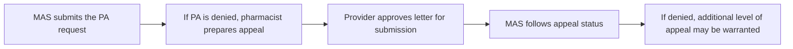

Contact information:
Chandler Combs, PharmD
Medical Center Blvd
Winston-Salem, NC
919-928-4197
cqcombs@wakehealth.edu

# Assessment of a Clinical Pharmacist-Driven Appeal Process in a Dermatology Practice

Wake Forest Baptist Health logo

Chandler Combs, PharmD; Sarah Pearce, PharmD, BCACP, CSP; Jennifer Young, PharmD, BCPS, CSP; Kathy Bricker, PharmD, BCPS; B. Kyle Hansen, PharmD, BCPS
Wake Forest Baptist Health, Winston-Salem, NC

## Background

* Insurance-driven prior authorizations (PA) have become a routine requirement to accessing prescription medications.

* The goal is to review medication appropriateness, however, these processes contribute to treatment delay and can lead to frustration from patients, providers and pharmacies.

* Specialty medications are typically high cost, resulting in frequent PA requirements.

* Surveys have shown that over 60% of specialty patients had some difficulty obtaining their first dose of therapy and almost 1 in 10 patients waited 8 weeks or more to receive their first dose.1

* Current literature has focused on the benefit of adding an embedded clinic pharmacist to help with the appeal process in disease states such as hepatitis C and cardiovascular disease.2,3

* The field of dermatology presents a unique opportunity for pharmacists to be involved in the appeal process due to the increase in prescribed specialty medications for conditions like psoriasis, alopecia, atopic dermatitis, hidradenitis suppurativa and vitiligo4.

## Objective

Evaluate the impact of a clinic-embedded pharmacist on the rate of specialty medication appeal submission in a dermatology practice

## Methods

* Retrospective, single-center review approved by the Wake Forest Baptist Health (WFBH) Institutional Review Board of adult patients with at least 1 specialty prescription medication that required a PA at the WFBH Dermatology Clinic between August 1st, 2018 and May 31st, 2019 and August 1st, 2019 to May 31st, 2020.

* Primary Endpoint: Change in the Rate of Appeals Submitted

* Secondary Endpoints: Change in the Rate of Appeal Approval, Number of Appeals Submitted, Time to Appeal Submission

## Dermatology Appeal Process Workflow

* Historically, nurses at the WFBH Dermatology Clinic managed appeals for denied prior authorizations concurrently with their primary clinical duties.

* Pharmacy presence began in 2018 with the addition of a medication access specialist (MAS). This role is fulfilled by a certified pharmacy technician with trained expertise in medication access.

* In 2019, a pharmacist was embedded into the clinic to support patient care including managing the appeal process.

* In the current process, all specialty medications requiring a PA are routed first through the MAS for completion and submission of the PA on behalf of the provider team.

* If the PA is denied, the appeal is completed and submitted by the pharmacist either by phone call or letter.

## Results

### Rate of Appeal Submission

| Category          | Appeals Submitted | Appeals Not Submitted |
| ----------------- | ----------------- | --------------------- |
| PRE-INTERVENTION  | 21                | 80                    |
| POST-INTERVENTION | 83                | 61                    |

### Time to Appeal Submission

| Category          | Average Time to Appeal Submission (Days) |
| ----------------- | ---------------------------------------- |
| PRE-INTERVENTION  | 67.6                                     |
| POST-INTERVENTION | 20.9                                     |

The rate of appeal submission increased by 36.8% with the addition of a clinic-embedded pharmacist in the dermatology practice (20.8% vs. 57.6%, p<0.001).

* A reduction of 46.7 days was seen in the average time to appeal submission (67.6 days vs. 20.9 days, p<0.001).

* The rate of appeal approval showed an increase of 17.4% with the addition of a clinic-embedded pharmacist (47.6% vs. 65%, p=0.05).

## Discussion

* Prevalent diagnosis codes that were observed in this review included psoriasis, atopic dermatitis, intrinsic (allergic) eczema and alopecia areata.

* The majority of appeals were completed for off-label use, formulary and step therapy requirements.

* Certain manufacturer assistance programs require 1 or 2 appeals to be completed and denied prior to providing financial assistance.

* The rate of appeal approval was higher post-intervention but was not significant which may be indicative of the inability to control the success of the appeal determination process.

* Limitations include the single-center site location, inconsistency with PA documentation pre-intervention and unequal levels of medication access education between nurses and pharmacists.

## Conclusions

* The presence of a clinic-embedded pharmacist in a dermatology practice positively impacted the rate of appeal submission, the rate of appeal approval and time to appeal submission.

* Dermatology provides an optimal environment for the addition of clinical pharmacy services to assist with medication access, especially due to the increase in specialty medications for dermatologic conditions.

## References

1. 2020. 2020 Medication Access Report. [online] Available at: <https://www.covermymeds.com/main/medication-access-report/> [Accessed 7 August 2020].
2. Reynolds, VW, Chinn ME, Jolly JA, et al. Integrated specialty pharmacy yields high PCSK9 inhibitor access and initiation rates. J Clin Lipidol. 2019;13(2):254-264. doi:10.1016/j.jacl.2019.01.003
3. Keast SL, Holderread B, Cothran T, Skrepnek GH. Assessment of the effect of an enhanced prior authorization and management program in a United States Medicaid program on chronic hepatitis C treatment adherence and cost. J Am Pharm Assoc (2003). 2018;58(5):485-491. doi:10.1016/j.japh.2018.06.013
4. Albrecht J, Lebwohl M, Asgari MM, et al. The state and consequences of dermatology drug prices in the United States. J Am Acad Dermatol. 2016;75(3):603-605. doi:10.1016/j.jaad.2016.03.053

**Disclosures:** All authors of this presentation have nothing to disclose concerning possible financial or personal relationships with commercial entities that may have a direct or indirect interest in the subject matter of this presentation.

Acknowledgements: Special thanks to Savannah Gallimore and the providers and staff of WFBH Dermatology Clinic – Country Club.

