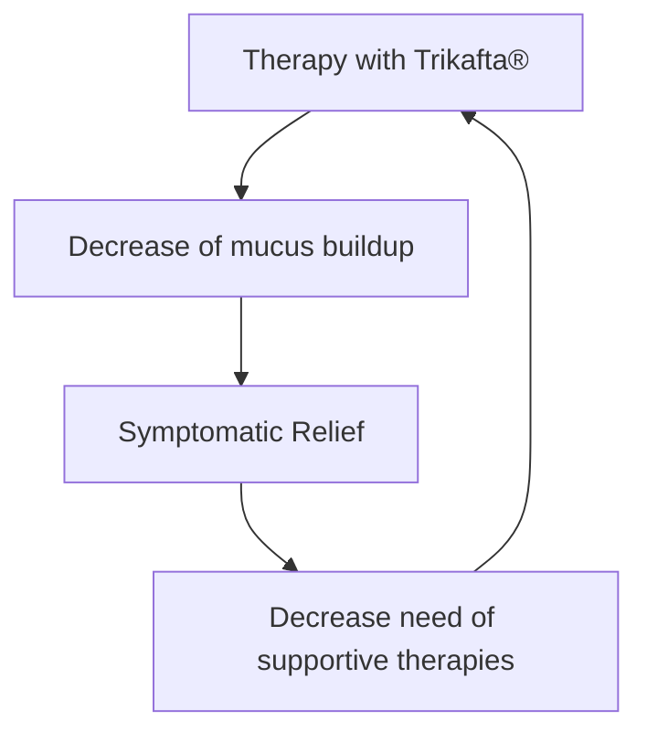
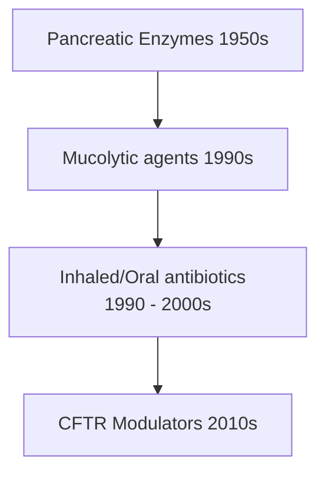

Maxor PHARMACY MANAGEMENT logo Maxor SPECIALTY PHARMACY logo

# CF Refill Utilization Trends with CFTR Modulators

Venise R.N. De Etoulem, Pharm.D, Bonnie Dugie Pharm.D, MBA, CSP; Sarah Richards, Pharm.D, CSP

## BACKGROUND

Cystic Fibrosis (CF) is a progressive, autosomal recessive disorder caused by mutations in the CFTR gene, leading to a dysfunctional CFTR protein. This leads to mucus dehydration, thickening, and build-up on the surface of epithelial cells, causing multi-organ damage, notably in the lungs, pancreas, and gastrointestinal system.

Diagram showing Mutant CFTR Channel with mucus buildup vs Normal CFTR Channel with chloride ions

As the disease progresses, several comorbidities may develop and the leading cause of mortality in CF is reoccurring lung infections. CF patients take an average of 5 different medications and spend approximately 3 hours daily completing their therapy. The average lifespan of a patient with CF is 42 years.

One theory with the development and use of CFTR modulators in therapy is the delay in progression of organ damage and the associated symptomatic relief, most notably with the approval of Elexacaftor/tezacaftor/ivacaftor (Trikafta®) in 2019. Anecdotally, pharmacists at Maxor Specialty Pharmacy have observed a downtrend in the frequency of on-time refills of CF guideline-recommended supportive therapies in patients taking Trikafta®; thus suspecting the abovementioned assumption with CFTR modulators may be true.

## METHODS

In this retrospective, observational study, we look at the changes in utilization of 3 classes of CF supportive therapies: <u>inhaled antibiotics (Inh Abx)</u>, <u>mucolytic agents</u>, and <u>pancreatic enzymes (PERT)</u>. The data for this study was collected from claims processed at the specialty pharmacies of patients taking Trikafta®.

### Inclusion criteria

* Patients 6 years or older with a diagnosis for CF

* Trikafta® started between Oct 2019 and June 2020

* Patients had at least three (3) refills of each of the 3 CF medication classes within 6 months of Trikafta® therapy initiation.

The main outcome of the study was to identify the fill trends of CF guideline-recommended supportive therapies within 6 months of Trikafta® initiation, and evaluate those changes, if any, in percent change when comparing the number of fills of those therapies 6 months before and after initiating therapy with Trikafta®.

### Exclusion criteria

* Trikafta® was stopped within the study period

* The length of therapy with Trikafta® is less than 6 months

## OBJECTIVE

To conduct a comparative analysis of the trends in utilization of CF supportive therapies in patients with CF six months before and after initiation of Trikafta® in percent change and determine the impact of Trikafta® on those refill trends.

## RESULTS

Fill Trends of CF Supportive Therapies, 6 months post-Trikafta® Initiation

| Drug Classes | Decrease | No change | Increase |
| ------------ | -------- | --------- | -------- |
| Inh Abx      | 19       | 15        | 5        |
| Mucolytics   | 12       | 12        | 15       |
| PERT         | 11       | 12        | 16       |

Percent Change in Number of Fills of CF-Supportive Therapies 6 months pre- and post-Trikafta® Initiation

| Drug Classes | 6M pre-TKFT | 6M post-TKFT | Percent Change |
| ------------ | ----------- | ------------ | -------------- |
| Inh Abx      | 145         | 123          | -14.79%        |
| Mucolytics   | 192         | 194          | +1.04%         |
| PERT         | 196         | 207          | +5.61%         |

## CONCLUSION AND DISCUSSION

Our study cohort consisted of 39 patients ranging from 14 to 80 years old who had at least 3 fills of each class of supportive therapies, within 6 months of Trikafta® initiation. Per our data analysis, we observed a 14.79% decrease in refills of inhaled antibiotics after Trikafta® initiation, and no change in mucolytic agents; however, we noticed an increase in claims for PERT. It is worth noting that pancreatic enzymes are not dispensed solely through the specialty pharmacy channel, but can also be filled at local (retail) pharmacies. Because of this, the observed trend for PERT may be unreliable.

These results bear a particular significance from a payor’s perspective in 2 ways: first, lung complications secondary to pulmonary infections account for 90% of CF-related deaths. Patients on Trikafta® who need less of their antibiotics may hint at a possible decrease in risk of infections. Second, the price of inhaled antibiotics is a significant financial burden; thus, decreased need for refills translates to transactional cost savings for patients and payors.

Although these results are preliminary, monitoring trends in refills of supportive therapies in a larger population sample, and for a longer period, may give us a broader picture of real-world evidence of the effects of next-generation CFTR agents.

## REFERENCE

1. Dell, B. The Historical Evolution of CF Treatments and Understanding, <u>https://cysticfibrosisnewstoday.com/2017/11/21/cf-treatments/</u>, 2017

2. Holden, Karl, Cystic Fibrosis from <u>https://teachmepaediatrics.com/respiratory/lower-respiratory-tract/cystic-fibrosis/</u>

3. Mogayzel PJ Jr, Naureckas ET, Robinson KA, Mueller G, Hadjiliadis D, Hoag JB, Lubsch L, Hazle L, Sabadosa K, Marshall B; Pulmonary Clinical Practice Guidelines Committee. Cystic Fibrosis Pulmonary Guidelines: Chronic Medications for Maintenance of Lung Health. Am J Respir Crit Care Med. 2013 Apr;187(7):680-9.

4. How Trikafta® Works, Vertex Pharmaceuticals from <u>https://www.Trikafta®.com/how-trikata-works</u>

