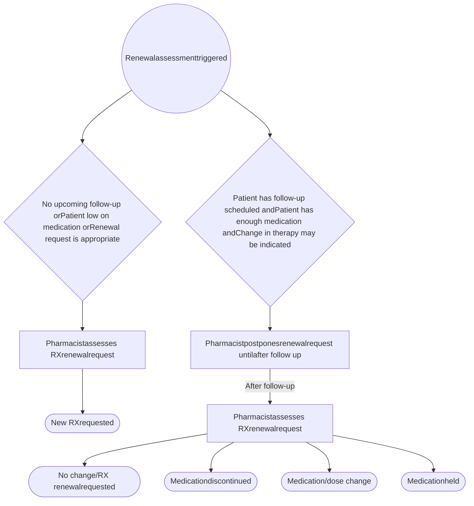

VANDERBILT UNIVERSITY MEDICAL CENTER logo

# FINANCIAL IMPACT OF INTEGRATED SPECIALTY PHARMACY EFFORTS TO AVOID ORAL ONCOLYTIC WASTE

## Study Conclusion and Highlights
* Specialty pharmacist review prior to renewal request proved effective in avoiding waste and unnecessary medication costs
* Therapy was discontinued or changed in 98% of postponed refill renewals
* Total cost avoidance was $967,821
* Median cost avoidance per fill $2,417

Brooke D. Looney, PharmD, CSP1 | Jared Crumb, PharmD1 | Gabrielle Jones, PharmD candidate 2 | Ryan Moore, MS 3 | Leena Choi, PhD 3 | Autumn D. Zuckerman, PharmD, BCPS, AAHIVP, CSP1 | Kristen Whelchel, PharmD, CSP1

1Vanderbilt Specialty Pharmacy, Vanderbilt University Medical Center 2 Lipscomb University School of Pharmacy 3 Department of Biostatistics, Vanderbilt University Medical Center

## PURPOSE

To evaluate the impact on waste and cost avoidance associated with specialty pharmacist postponing requesting a prescription renewal in patients on oral oncolytics who have an upcoming follow-up (i.e., provider visit, labs, imaging) and sufficient medication supply.

QR Code

## METHODS

Single-center retrospective review, Vanderbilt University Medical Center
Patients filling oral oncolytics at Vanderbilt Specialty Pharmacy
January 1, 2020- January 31, 2021

## RESULTS

### Figure 1. Outcome of Follow-up (n=167)

| Category                   | Percentage (n) |
| -------------------------- | -------------- |
| Medication discontinuation | 56% (n=94)     |
| Dose change                | 31% (n=52)     |
| Medication held            | 5% (n=8)       |
| Medication change          | 6% (n=10)      |
| No change                  | 2% (n=3)       |

### Table 1. Top 5 Meds Associated with Cost Avoidance

| Total Cost Avoidance Medication | Total Cost Avoidance Cost Avoidance |
| ----------------------------------- | --------------------------------------- |
| Temozolomide (n=66)                 | $249,707.56                             |
| Palbociclib (n=11)                  | $173,274.50                             |
| Everolimus (n=5)                    | $84,815.64                              |
| Trifluridine-tipiracil (n=5)        | $69,186.40                              |
| Olaparib (n=4)                      | $62,504.40                              |
| Median Cost Avoidance Per Fill      |                                         |
| Tucatinib (n=1)                     | $25,891.20                              |
| Regorafenib (n=2)                   | $23,598.96                              |
| Alpelisib (n=1)                     | $22,466.64                              |
| Ruxolitinib phosphate (n=1)         | $18,692.40                              |
| Ribociclib succinate (n=1)          | $18,195.03                              |

### Figure 2. Median Cost Avoidance Per Fill by Outcome of Follow-up

| Outcome of follow up    | Median AWP cost avoided per fill |
| ----------------------- | -------------------------------- |
| Dosing Changed          | $2,820.09                        |
| Medication Discontinued | $1,951.48                        |
| Medication Changed      | $10,037.60                       |

AWP - average wholesale price

### Table 2. Cost Avoidance by Outcome of Follow-up

| Outcome                    | Total           |
| -------------------------- | --------------- |
| Medication discontinuation | $489,843.34     |
| Dose change                | $294,072.59     |
| Medication change          | $113,035.16     |
| Medication held            | $70,870.65      |
| **Total cost avoidance**   | **$967,821.74** |

### ACKNOWLEDGEMENTS

We would like to acknowledge VSP Oncology and Hematology Specialty Pharmacists Stephanie White, PharmD and Katie Williford, PharmD, BCPS, CSP for their contributions to data review and collection.

