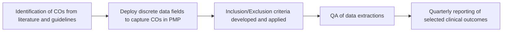

SHIELDS HEALTH SOLUTIONS logo

# Clinical Outcomes Evaluation and Reporting

Kristen Ditch, PharmD, BCCCP; Martha Stutsky, PharmD, BCPS; Carolkim Huynh, PharmD, CSP; Christopher Barr, Shreevidya Periyasamy, MS HIA; Kate Smullen, PharmD, CSP, MSCS; Jennifer L. Donovan, PharmD

QR code with "SCAN ME" text

Virtual Poster at NASP 2022 Annual Meeting

## Background

* Shields Health Solutions partners with Health System Specialty Pharmacies (HSSPs) to offer an integrated specialty pharmacy (SP) program. The care model includes patient risk stratification, board certified clinical pharmacists, full electronic medical record (EMR) integration, a clinical patient management platform (PMP) to standardize workflows, and clinic embedded liaisons to provide adherence management and enhanced onboarding of patients.

* Currently, there are a lack of standardized clinical outcome (CO) benchmarks within SP to measure performance. To evaluate COs across multiple HSSPs, we established a systematic approach to defining and reporting COs for multiple disease states.

* The objective is to describe the process of reporting COs across HSSPs with the goal of creating standard benchmarks to compare performance.

## Methods

* COs that can measure and validate services provided through the integrated care model were identified. Discrete data fields to capture the COs were deployed into the PMP used for multiple HSSPs.

* Pharmacists completed a standardized training program to ensure consistent documentation of COs within the PMP.

* Patient time on service requirements, limits on historical data and inclusion and exclusion patient criteria were applied to each CO to standardize the data extraction process from the PMP and to create a reproducible framework for evaluating results across multiple HSSPs.

* Data extractions for each disease state went through a quality assurance (QA) process to validate the results in a de-identified fashion prior to internal publication.

* Sustained virologic response (SVR), viral suppression, Routine Assessment of Patient Index Data 3 (RAPID3) and hospitalization were selected for quarterly reporting for HCV, HIV, RA, and ONC, respectively.

## Results

From January 2021 to December 2021, COs were analyzed for 15 HSSPs. **Figure 1** summarizes the process of identifying a CO and reporting results in a standard fashion across multiple SPs. Definitions for each CO are in **Table 1**. The percentage of patients for their respective disease state that achieved viral suppression (HIV), SVR (HCV), RAPID3 improvement (RA) or were hospitalized (ONC) are in **Figure 2**.

Figure 1: CO Identification and Reporting Process

Table 1: Outcomes Definitions

| Clinical Outcome    | Definition                                                                              |
| ------------------- | --------------------------------------------------------------------------------------- |
| Viral Suppression   | HIV viral load < 200 copies/mL¹                                                         |
| SVR                 | Undetected HCV viral load at 12 weeks or more post HCV treatment completion             |
| RAPID 3 improvement | Change in RAPID 3 score of ≥ -3.8 from baseline and/or met treat-to-target score of ≤6² |
| Hospitalization     | EMR or patient reported ER or hospital utilization                                      |

## Figure 2: Clinical Outcomes Achievement

| HCV Patients Achieved SVR | HIV Patients Achieved Viral Suppression | RA Patients RAPID3 Improvement | ONC Patients Hospitalization Utilization |
| ------------------------- | --------------------------------------- | ------------------------------ | ---------------------------------------- |
| 94.8%                     | 92.2%                                   | 43.6%                          | 6.9%                                     |
| (346 of 365 patients)     | (3,819 of 4,144 patients)               | (167 of 383 patients)          | (878 of 12,635 patients)                 |

## Conclusions

* A framework to develop and report COs was implemented for a network of HSSPs. Standardized criteria to uniformly evaluate COs allowed each SP to compare their performance and validate quality clinical care for patients.

* Results for HCV, HIV, RA and ONC can be used to shape possible benchmarks to measure clinical outcome performance for these disease states in health system specialty pharmacy

### DISCLOSURES

The authors of this presentation have nothing to disclose concerning possible financial or personal relationships with commercial entities that may have a direct or indirect interest in the subject matter of this presentation.

### REFERENCES

1. National Office on AIDS Policy. National HIV/AIDS Strategy for the United States: updated to 2020. [Accessed August 12, 2019] ; https://www.hiv.gov/federal-response/national-hiv-aids-strategy/overview

2. Ward MM, Castrejon I, Bergman MJ, Alba MI, Guthrie LC, Pincus T. Minimal clinically important improvement of routine assessment of patient index data 3 in rheumatoid arthritis. J Rheumatol. 2019;46(1):27-30.

