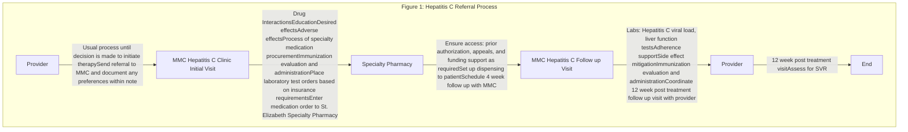
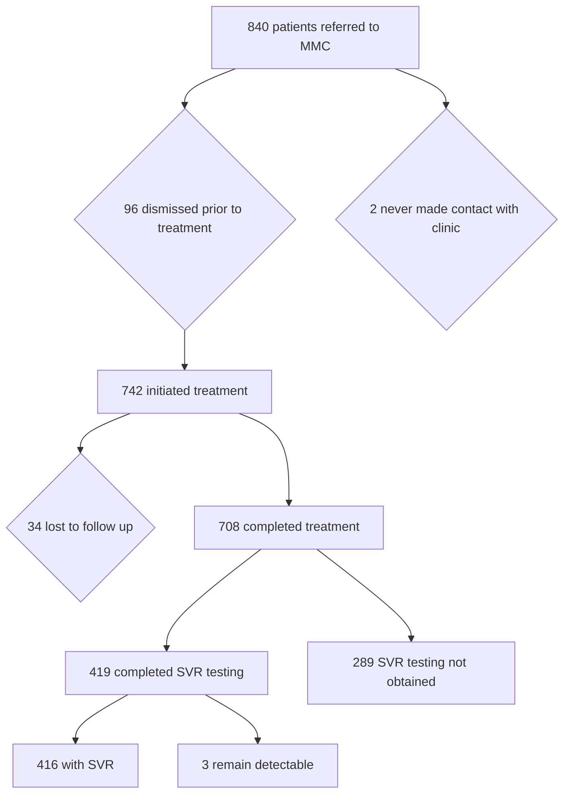

St. Elizabeth HEALTHCARE Pharmacy logo

# Outcomes in patients referred to a pharmacist-managed hepatitis C clinic

Emma Sapp, PharmD, BCACP; Alicia Brunemann, PharmD Candidate 2023; Elizabeth Schlosser, PharmD, BCACP, BCPS; Suzanne Francis, PharmD, BCACP, CDCES

ACHC ACCREDITED SPECIALTY PHARMACY logo

urac ACCREDITED logo

## Background

* 2.4 million Americans living with Hepatitis C virus infection1

* Direct-acting antiviral (DAA) agents are preferred treatment but there are many barriers to DAA treatment2-4

    - Cost

    - Health plan/payer restrictions

    - Lack of patient access

    - Patients lost to follow up

* Specialty pharmacists and pharmacy technicians are uniquely trained to assist in mitigation of DAA treatment barriers

* St. Elizabeth Healthcare's Specialty Pharmacy and Medication Management Clinic (MMC) work together for patients referred for hepatitis C treatment

* Studies suggest typical SVR rate in practice is approximately 86-95% and completion rate is approximately 92-94%5-7

## Objective

Determine if the combination of a pharmacist-managed clinic with a specialty pharmacy improves the treatment cure rate of patients with hepatitis C compared to other studies

## Study Design

* Retrospective observational study

* Time frame: October 1st, 2018 – September 30th, 2021

## Methods

**Primary Outcome:**

* Identify the percentage of patients referred to the pharmacist-run hepatitis C clinic with sustained virologic response (SVR)

**Secondary Outcomes:**

* Evaluate the percentage of patients who completed hepatitis C treatment

* Determine the percentage of patients who obtained SVR labs

**Inclusion Criteria:**

* ≥18 years, diagnosed with hepatitis C infection, and referred to the hepatitis C clinic by a gastroenterologist or infectious disease practitioner who has signed a collaborative care agreement.

**Exclusion Criteria:**

* < 18 years old

* No referral to hepatitis C clinic

**Data Analysis:**

* Data was summarized using descriptive statistics

**Interventions:**

* Patients were followed by St. Elizabeth Medication Management Clinic and Specialty Pharmacy as seen in Figure 1

## Results

Figure 2: Flow diagram of patients referred for HCV treatment

> **95%** of patients who initiated DAA therapy **completed treatment**
>
> **99%** of patients who completed SVR testing **obtained SVR**
>
> **41%** of patients who completed treatment **did not obtain SVR labs**

## Conclusions

* A pharmacist-run hepatitis C clinic working in combination with a specialty pharmacy helped to improve SVR rates and completion rates compared to that seen in literature.

* Over forty percent of our patients did not obtain labs to assess SVR.

* **Future Impact:** Addition of 12 week post treatment visit with pharmacist-run clinic vs. provider office.

## References

1. Centers for Disease Control and Prevention. Viral Hepatitis Surveillance—United States, 2019. Atlanta: US Department of Health and Human Services, Centers for Disease Control and Prevention; 2020. Available

2. Millman AJ, Ntiri-Reid B, Irvin R, Kaufmann MH, Aronsohn A, Duchin JS, Scott JD, Vellozzi C. Barriers to Treatment Access for Chronic Hepatitis C Virus Infection: A Case Series. Top Antivir Med. 2017 Jul/Aug;25(3):110-113.

3. Mohammad, RA, Bulloch, MN, Chan, J, et al. (2014). Provision of Clinical Pharmacist Services for Individuals With Chronic Hepatitis C Viral Infection. Pharmacotherapy: The Journal of Human Pharmacology and Drug Therapy, 34(12), 1341-1354. doi:10.1002/phar.1512

4. AASLD-IDSA. Recommendations for testing, managing, and treating hepatitis C. http://www.hcvguidelines.org. Accessed April 28, 2022.

5. Scott J, Fagade M, Baer A, et al. A Population-Based Intervention to Improve Care Cascades of Patients With Hepatitis C Virus Infection. Hepatol Commun. 2020;5(3):387-399. Published 2020 Nov 7. doi:10.1002/hep4.1627

6. Chehl, Navdeep MD; Maheshwari, Anurag MD; Yoo, Hwan MD, PhD; Cook, Colleen BS; Zhang, Talan MS; Brown, Sara MD; Thuluvath, Paul J. MD, FRCP+ HCV compliance and treatment success rates are higher with DAAs in structured HCV clinics compared to general hepatology clinics, Medicine: July 2019 - Volume 98 - Issue 28 - p e16242 doi: 10.1097/MD.0000000000016242

7. Ziff, J., Vu, T., Dvir, D. et al. Predictors of hepatitis C treatment outcomes in a harm reduction-focused primary care program in New York City. Harm Reduct J 18, 38 (2021). https://doi.org/10.1186/s12954-021-00486-4

**Contact & Disclosures**

Emma Sapp emma.sapp@stelizabeth.com

The authors of this presentation have the following to disclose concerning possible financial or personal relationships with commercial entities that may have a direct or indirect interest in the subject matter of this presentation.

