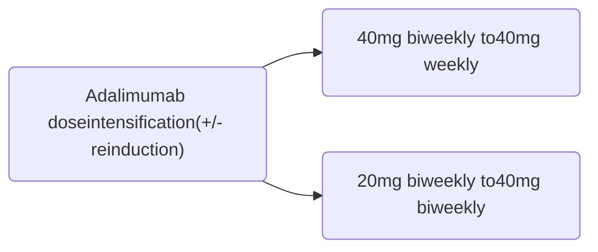
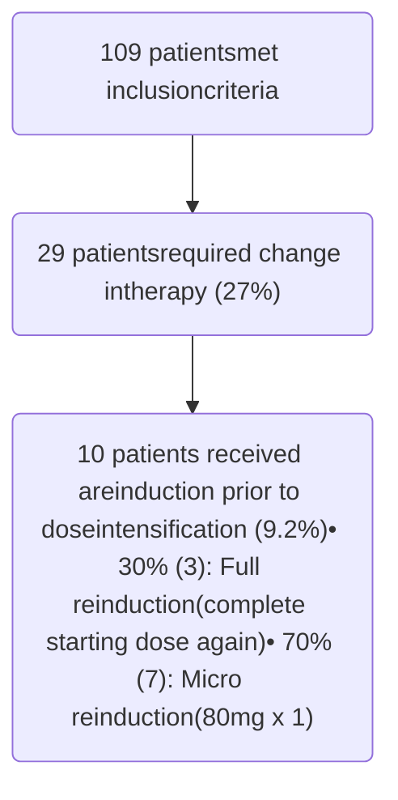

# EVALUATION OF RESPONSE TO ADALIMUMAB DOSE INTENSIFICATION IN PEDIATRIC PATIENTS WITH INFLAMMATORY BOWEL DISEASE

Monroe Carell Jr. Children's Hospital at Vanderbilt logo

Vanderbilt University Medical Center logo

Victoria W. Reynolds, PharmD, BCACP1 | Dedrick Moulton, MD2 | Midya Yarwais, MS1 | Stacy Hawkins, NP3 | Amy Mitchell, PharmD, BCPPS, CSP1 | Josh DeClercq, MS4 | Leena Choi, PhD4
1Department of Pharmaceutical Services, Vanderbilt University Medical Center, 2Division of Pediatric Gastroenterology, Louisiana State University Health Science Center, 3Pediatric Gastroenterology, Vanderbilt Children’s Hospital, 4Department of Biostatistics, Vanderbilt University Medical Center

## BACKGROUND

Adalimumab has a well-established role in the treatment of pediatric inflammatory bowel disease (IBD)

In clinical practice, it is common to increase the frequency of adalimumab in patients who experience a disease exacerbation, waning or loss of response

Previously reported data related to dose escalation of adalimumab by increasing the frequency in pediatric patients is lacking

## OBJECTIVES

**Primary Endpoint**: • Frequency of patients requiring a change in adalimumab therapy

**Secondary Endpoints**:
• Time to change in adalimumab therapy
• Clinical characteristics of patient before and after the adalimumab change

## METHODS

| Design             | Single-center retrospective chart review                                                                                                                                                                                                                                                  |
| ------------------ | ----------------------------------------------------------------------------------------------------------------------------------------------------------------------------------------------------------------------------------------------------------------------------------------- |
| Sample             | Pediatric patients (age <18) in Monroe Carell Jr. Children’s Hospital at Vanderbilt (MCCHV) Pediatric IBD Program prescribed adalimumab from January 2008 to February 2019                                                                                                                |
| Exclusion Criteria | No adalimumab levels No baseline labs Patients not taking adalimumab as prescribed Adalimumab initiated outside of MCCHV                                                                                                                                                      |
| Analysis           | The Wilcoxon signed rank test and Chi-square test were used to compare characteristics of those requiring dose intensification before and after dose change Kaplan-Meier estimates were used to calculate the probability of no change in dose after accounting for censored patients |

## RESULTS

### Figure 1. Patients requiring dose intensification

### Table 1. Medication History of Sample (n=109)

| Characteristic                                                   | % (n)    |
| ---------------------------------------------------------------- | -------- |
| Prior biologic therapy                                           |          |
| No                                                               | 68% (74) |
| Yes - Remicade                                                   | 32% (34) |
| Adalimumab starting dose                                         |          |
| 160mg on day 1, 80mg on day 15, then 40mg every 14 days          | 83% (90) |
| 80mg on day 1, 40mg on day 15, then 20mg every 14 days           | 17% (19) |
| Concomitant therapy at initiation (MTX, AZA, or corticosteroids) |          |
| At least one                                                     | 27% (29) |
| None                                                             | 73% (80) |

### Figure 2. PGA severity and associated adalimumab levels

| PGA       | Adalimumab level (mcg/mL) |
| --------- | ------------------------- |
| quiescent | 11.5                      |
| mild      | 10.8                      |
| moderate  | 8.5                       |
| severe    | 7.2                       |

PGA (physician global assessment) severity score and adalimumab levels. Among the 109 patients in the study, there were a total of 366 patient visits. Of those, there are 305 observations with both a valid PGA score and adalimumab level.

### Table 2. Baseline characteristics stratified by any change in therapy, %(n) or [mean ± SD]

| Characteristic                                                | No change in therapy (n=80)      | Change in therapy (n=29)       |
| ------------------------------------------------------------- | -------------------------------- | ------------------------------ |
| Age at adalimumab start                                       | 13.8 ± 2.9                       | 12.8 ± 2.6                     |
| Gender (male)                                                 | 55% (44)                         | 41% (12)                       |
| Race (White)                                                  | 89% (71)                         | 90% (26)                       |
| Diagnosis                                                     |                                  |                                |
| Crohn's Disease                                               | 83% (66)                         | 83% (24)                       |
| Indeterminate                                                 | 3% (2)                           | 0% (0)                         |
| Ulcerative Colitis                                            | 15% (12)                         | 17% (5)                        |
| PGA                                                           |                                  |                                |
| Quiescent                                                     | 9% (7)                           | 10% (3)                        |
| Mild                                                          | 47% (36)                         | 45% (13)                       |
| Moderate                                                      | 40% (30)                         | 41% (12)                       |
| Severe                                                        | 3.9% (3)                         | 3% (1)                         |
| Missing                                                       | 4                                | 0                              |
| Extraintestinal manifestations at any point in disease course | 49% (39)                         | 48% (14)                       |
| Adalimumab level median \[quartile 1, quartile 3]             | 16.1 ± 8.7 10.9 \[14.2-20.6] | 10.1 ± 5.9 6.1 \[9.2-10.9] |
| Missing                                                       | 3                                | 0                              |

### Figure 3. Kaplan-Meier estimates for time to dose intensification

| Time (years)        | 0    | 1    | 2    | 3    | 4    | 5    |
| ------------------- | ---- | ---- | ---- | ---- | ---- | ---- |
| Probability         | 1.00 | 0.85 | 0.78 | 0.76 | 0.72 | 0.72 |
| Patients on therapy | 109  | 84   | 57   | 30   | 19   | 15   |

Kaplan-Meier estimates for the probability of patients on adalimumab not requiring dose intensification. Each step down denotes an event while a vertical tick mark denotes the time when a patient was censored. The probability that a patient will maintain the same dose at 3 years is 0.76 (95% confidence interval 0.68-0.85).

### Figure 4. Adalimumab levels before and after dose intensification, median [IQR]

| Transition Stage           | Adalimumab level (mcg/mL) |
| -------------------------- | ------------------------- |
| Before transition (n = 29) | 6.1 \[3.9-8.7]            |
| After transition (n = 26)  | 11.2 \[8.6-13.1]          |

Wilcoxon signed rank test p-value: <0.001

## CONCLUSIONS

This study characterizes patients who required dose intensification when using adalimumab for management of pediatric IBD.

Further investigations are needed to address the effect of adalimumab dose intensification on clinical and biochemical response in pediatric IBD patients who experience waning or loss of response, as well as the role or proactive drug monitoring on a prolonged response.

## REFERENCES

1. Humira. Package insert. AbbVie Inc; 2020.

2. Feuerstein JD, et al. Gastroenterology 2017;153:827–834.

