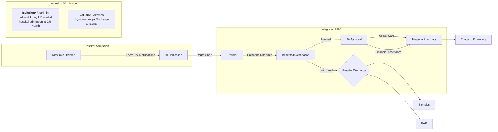

# Assess Integrated Specialty Pharmacy Services as a Medication Optimization Strategy for Rifaximin in Hepatic Encephalopathy Patients

**Alicia Battershell, PharmD, BCPS; Elezabeth Mac, CPhT; Kami Nolan, PharmD, CSP; Haitam Buaisha, MD**
CHI Health Specialty Pharmacy; Omaha, Nebraska

## Introduction

* Occurrence of fully symptomatic overt HE in patients with decompensated cirrhosis is 30-40% and risk of recurrence is 40% at 1 year with an additional 40% risk at 6 months.(1) Patients with HE account for nearly 110,000 hospitalizations yearly (2005-2009) in the United States.

* Chronic therapy with lactulose is challenging due to dosing requirements and side effects, and non-adherence has been identified as a factor for recurrent episodes of HE.(2)

* Treatment guidelines recommend adding rifaximin (Xifaxan®) to lactulose for ongoing management after an overt HE recurrence on lactulose alone to reduce the risk of further episodes and HE-related hospitalizations.(1)

* Clinical observations suggested that rifaximin therapy is not initiated in patients upon HE-related hospital discharge where indicated.

## Objectives

Integrate the CHI Health Specialty Pharmacy medication access coordinator (MAC) into the cascade of care of patients during an HE-related hospitalization to optimize access to and initiation of rifaximin upon discharge.

## Design

Retrospective assessment of integrated MAC assistance in the CHI Health gastroenterology clinic from September 26, 2018-March 31, 2019.

## Disclosures

No financial relationships to disclose.

## Methods

## Results

| Total patients                     | 40   |
| ---------------------------------- | ---- |
| Excluded                           | 31   |
| Included                           | 9    |
| Rifaximin initiated upon discharge | 100% |
| Benefits investigation             | 4    |
| Financial assistance               | 5    |
| CHI Health Specialty Pharmacy      | 2    |

| Category                 | Value |
| ------------------------ | ----- |
| Other GI Groups          | 27    |
| Facility                 | 4     |
| Rifaximin upon discharge | 9     |
| Required PA              | 4     |
| Received samples         | 3     |
| Qualified for PAP        | 2     |

N=40

## Conclusions

* Integrated MAC assistance in a health-system gastroenterology clinic optimizes rifaximin access and initiation in patients following an HE-related hospitalization.

Further evaluation is warranted to determine if medication optimization with rifaximin results in improved adherence and reduced readmissions in this population.

## Discussion

* It is anticipated that more patients going forward will qualify for MAC assistance due to a reduction in the community physician groups providing care at CHI Health.

* Barriers to implementation included technical modifications for reporting, changes to pharmacy and MAC workflow, staff education, and provider competition.

* Ongoing barriers include eligibility requirements for manufacturer assistance programs.

* Currently, hospitalized patients receiving lactulose are being flagged as potential qualifiers for rifaximin therapy.

## Citations

1. Vilstrup H, Amodio P, Bajaj J, et al. Hepatic encephalopathy in chronic liver disease: 2014 practice guideline by the American Association for the Study of Liver Diseases and the European Association for the Study of the Liver. Hepatology. 2014;60(2):715-735. Available at https://www.aasld.org/sites/default/files/2019-06/141022_AASLD_Guideline_Encephalopathy_4UFd_2015.pdf. Accessed 25 July 2019.

2. Bajaj JS, Sanyal AJ, Bell D, Gilles H, Heuman DM. Predictors of the recurrence of hepatic encephalopathy in lactulose-treated patients. Aliment Pharmacol Ther. 2010 May;31(9): 1012-7.

