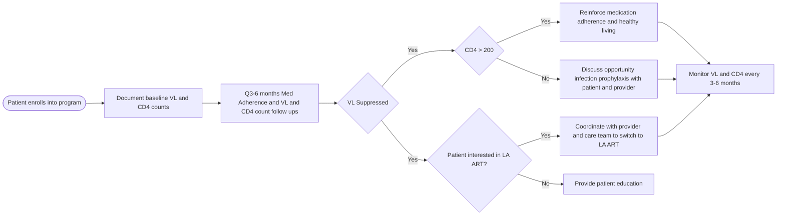

Clearway Health logo

# Beyond Viral Load Suppression: Role of Health System Specialty Pharmacy in HIV Management and Opportunistic Infections Prevention

Amanuel Kehasse, PharmD, PhD1

1Clearway Health

## HIV Management Workflow

LA ART: Long Acting Antiretroviral Therapy

## Introduction

* The primary goal of antiretroviral therapy (ART) is to achieve viral load suppression and maintain CD4 counts above 200 counts per cubic milliliters.

* Viral load suppression reduces the risk of transmitting the virus to others and helps people living with HIV lead a healthy life.

* Once viral load suppression is achieved, supporting patients to transition into less pull burden therapeutic options is key to improve patient quality of life without risking therapeutic failure.

* One way to monitor this is by routine viral load and CD4 levels. When CD4 level is <200, patients are at high risk of developing opportunistic infections and developing AIDS.

* Integrated clinical pharmacists are ideally positioned to support patients and the care team to ensure optimal therapeutic outcomes.

## Objective

The purpose of this study is to evaluate the impact of a clinical pharmacist supported HIV program in achieving both viral load suppression and maintaining immune competence.

## Methodology

* **Study Design**: Multicenter, retrospective observational descriptive study

* **Data Source**: Data was collected from a clinical and pharmacist intervention dashboard.

* **Study Population**: Patients with HIV enrolled in Clearway Health specialty care management program.

* **Inclusion**: Patients were included for analysis if they were enrolled in one of our multisite specialty pharmacy services program from January 1, 2023 to April 30, 2024.

* **Statistical Analysis**: Descriptive Statistics

## Results

| Category          | Percentage |
| ----------------- | ---------- |
| Viral suppression | 96         |
| Detectable        | 4          |

> 3% (n=17) of virally suppressed patients were successfully transitioned to long-acting ART

### CD4+ Count

| Range             | Percentage |
| ----------------- | ---------- |
| 200 cells/mm³     | 95         |
| 100-200 cells/mm³ | 4          |
| <100 cells/mm³    | 1          |

\* Pharmacist supports opportunistic infection prophylaxis

## Discussion

Health system specialty pharmacists play crucial roles in various aspects of HIV care, contributing to the comprehensive management and improvement of patient outcomes. In this study, we evaluated the role of pharmacists in HIV management beyond viral suppression.

A total of 553 patients from three health centers were included for analysis. Out of which, 96% of patients achieved VL suppression. Additionally, 95% of patients had CD4 counts >200, 4% had CD4 count between 100 – 200 counts and 1% had CD4 count <100.

Simplification of HIV regimen is key part of improving medication adherence and patient convenience. Among those who achieved VL suppression, pharmacists educated and supported 3% (n=17) patient to transition to a long-acting injectable ART and maintained their VL suppression and CD4 count >200.

Pharmacists play a pivotal role in HIV management. Their role spans from medication access support, medication and disease state education, therapy modifications, adverse event management, therapy lab monitoring, opportunistic infection prophylactic and managing medication orders.

## Limitations/Barriers

Full scale of pharmacist role in supporting patients living with HIV; such as satin therapy, weight management and CV risk mitigation is not presented in this poster due to variability in data collection.

## Acknowledgment

Special thanks to the pharmacists and liaisons who helped with data collection.

