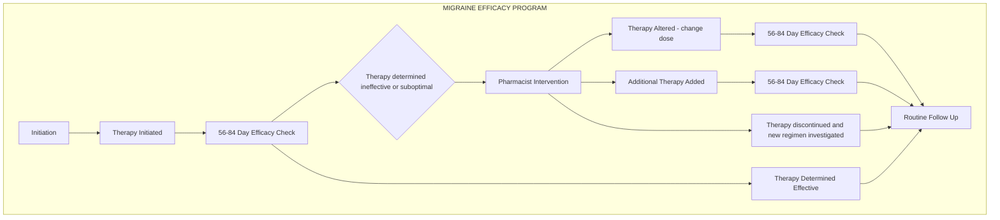

# MR Fast: Assessing the impact of health system specialty pharmacy (HSSP) services on helping patients achieve Migraine Relief Fast
Trellis now part of CPS logo

Amanda Hickman, PharmD, MPH, MSCS; Brandon Hardin, PharmD, MBA, CSP; Mona Modi, PharmD Candidate.

## BACKGROUND

* Migraine creates a significant economic burden for patients and society through direct healthcare costs as well as disability and lost productivity. The financial burden of migraines in the United States are $78 billion annually.

* The goal of preventive therapy is to improve patients’ quality of life by reducing migraine frequency, severity, and duration. Majority of migraine treatments are recommended to be tried for 1 to 6 months to determine efficacy.

* Trellis Rx partners with health systems to offer high-touch specialty pharmacy services to patients. Onsite pharmacists and pharmacy liaisons provide proactive migraine treatment efficacy checks to ensure the patient is on an effective medication for their migraines. If not, the pharmacists work with the patient and provider to find an effective treatment.

## OBJECTIVES

* **Primary objective**: Assess HSSP migraine program value through overall time until therapy determined effective and time until therapy determined effective after first “no” or “suboptimal” response in an efficacy check.

* **Secondary objectives**: Assess change in migraine days from baseline to most recent assessment. Also assess the outcomes of pharmacist interventions.

## METHODS

Study Design: Multicenter, retrospective study

**Participants:**

Inclusion Criteria:

* Adult patients enrolled and starting therapy between October 2020 to October 2021

* Treated with Aimovig (erenumab), Ajovy (fremanezumab), or Emgality (galcanezumab)

Exclusion Criteria:

* Patients treated with Nurtec (rimegepant), Ubrelvy (ubrogepant), Vyepti (eptinezumab), or Botox (onabotulinumtoxin A)

### Population

| Series        | Percentage |
| ------------- | ---------- |
| Aimovig 70mg  | 17%        |
| Aimovig 140mg | 17%        |
| Emgality      | 24%        |
| Ajovy         | 42%        |

n = 500

## METHODS (CONT.)

**Procedure**

* The onsite pharmacists and liaisons documented the migraine data in Arbor®, specialty pharmacy technology platform.

* The pharmacist used this data, additional information given by the patient, and clinical judgement to determine whether the therapy was effective (yes), not effective (no), or sub-optimally effective (suboptimal).

* For patients with sub-optimal or ineffective therapy, pharmacists completed patient and provider interventions with recommendations on how to maximize the patient’s migraine management.

* For this study, data was collected through reports generated from Arbor® to assess the objectives.

## RESULTS

| Metric                                                             | Value   |
| ------------------------------------------------------------------ | ------- |
| Patients on effective therapy by end of study                      | 92%     |
| Average time to effective migraine control                         | 73 days |
| Average reduction in migraine days/month                           | 8 days  |
| Patients who were not optimally controlled at first efficacy check | 24      |

### 24 Patients were “Suboptimal” or “No” at first Efficacy Check
**PATIENT IMPROVEMENT AFTER FIRST EFFICACY CHECK TO END OF STUDY**

| Category                      | Percent |
| ----------------------------- | ------- |
| Improved                      | 71      |
| Remained the same or worsened | 29      |

**DAYS to convert from first “No”/ “Suboptimal” to “Yes”**

| Metric  | Value |
| ------- | ----- |
| Average | 84    |
| Min     | 25    |
| Max     | 231   |
| Median  | 81    |

## RESULTS (CONT.)

### INTERVENTIONS

| Metric                                                                                 | Value |
| -------------------------------------------------------------------------------------- | ----- |
| Patients with “Suboptimal” or ”No” at first efficacy check had interventions completed | 92%   |
| Interventions were accepted                                                            | 95%   |

**INTERVENTION RECOMMENDATIONS**

| Recommendation       | Percentage |
| -------------------- | ---------- |
| Change Therapy       | 64%        |
| Adherence Counseling | 36%        |

## CONCLUSION

<u>Health system specialty pharmacy services are effective at helping patients obtain rapid migraine control through therapy efficacy checks and beneficial interventions.</u>

* >90% of patients were on effective therapy by the end of the study.

* The average time to migraine control was <84 days.

* Majority of patients who did not have optimal migraine control at the first efficacy check obtained control by the next check.

* Nearly all pharmacist interventions were accepted and proved to be beneficial recommendations.

## REFERENCES

1. Kumar A, Renu K. Migraine prophylaxis. StatPearls [Internet]. <u>https://www.ncbi.nlm.nih.gov/books/NBK507873/</u>. Published October 27, 2020. Accessed November 9, 2021.

2. Costs of migraines: Migraine pain. Migraine Relief Center. <u>https://www.themigrainereliefcenter.com/costs-of-migraines/</u>. Published May 16, 2018. Accessed November 9, 2021.

® 2022 Trellis Rx

