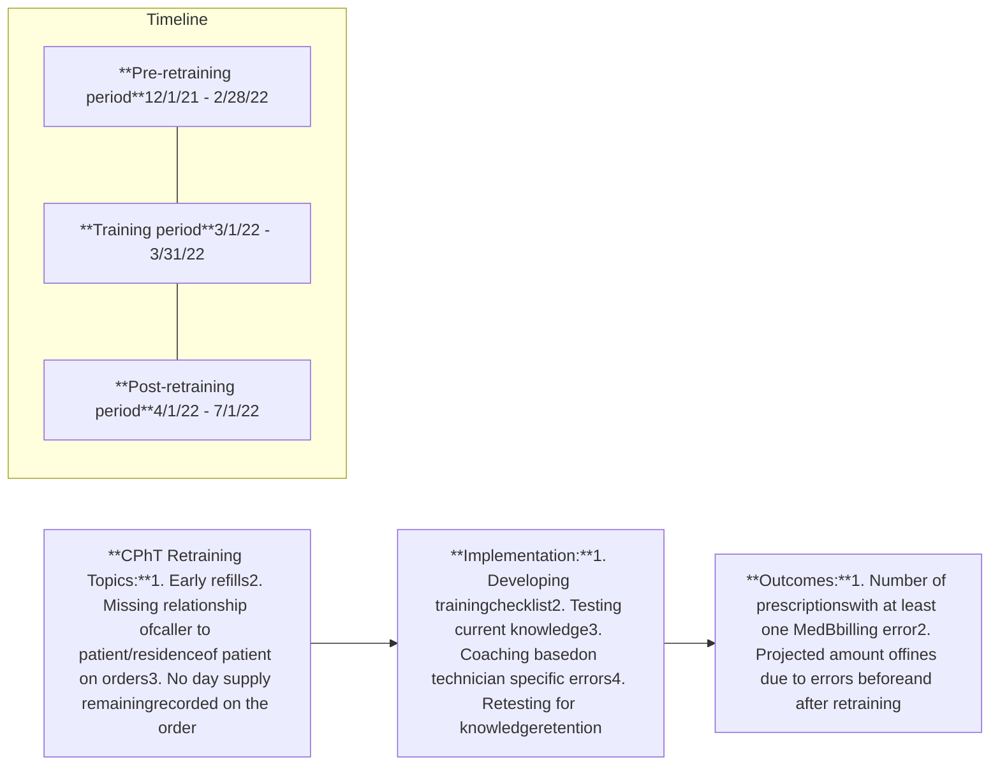

Vanderbilt Transplant Pharmacy
VANDERBILT HEALTH

# RETRAINING OF TRANSPLANT PHARMACY STAFF TO REDUCE MEDICARE PART B PRESCRIPTION BILLING ERRORS IN POST-TRANSPLANT RECIPIENTS

Carey Vallone, CPhT; Sarah Osman, CPhT-Adv; Kirsten Mitchell, CPhT-Adv; Michael Wilson, CPhT; Chelsea Ray, CPhT; Keren Rodriguez, PharmD, CSP; Chris Hayes, PharmD; Rachel Chelewski, PharmD, CSP; Genevieve Staff, PharmD; Autumn Zuckerman, PharmD, BCPS, AAHIVP, CSP; Brianna Hawkins, MBA, PharmD Candidate, 2023; Katie Cruchelow, PhD

QR code

# CONCLUSION

CPhT retraining focused on specific MedB billing errors **successfully reduced error frequency and potential resulting fines.**

Because MedB billing error fines can be costly for pharmacies dispensing high-cost medications, **identifying common errors and training staff can be useful and financially prudent.**

<!-- layout: [CHART TYPE] Diverging/Grouped circles with labels and percentages. [AXES & SERIES] Series: Refill Too Soon (RTS) Errors, Missing Residency (MR) Errors, Day Supply Errors (DSE). [DIMENSIONS] 3 columns x 2 rows. [PRECISION] Percentages as shown. [EXCEPTIONS] Arrows indicate decrease (downward arrow). [CAPTION] None. [PROOF ROW] Refill Too Soon (RTS) Errors | 37.5% Decrease. -->

| Refill Too Soon (RTS) Errors | Missing Residency (MR) Errors | Day Supply Errors (DSE) |
| ---------------------------- | ----------------------------- | ----------------------- |
| ↓ 37.5%                      | ↓ 21.7%                       | ↓ 39.7%                 |

# PURPOSE

Outpatient prescription billing post-transplant can become complex for patients who had Medicare part B (MedB) at the time of transplant. Date of service for processing prescriptions and prescription plan specifics can dictate changes in how patients' Medicare plans are billed.

* The aim of this quality improvement project was to retrain certified pharmacy technicians (CPhTs) on common monthly billing errors and evaluate changes in error rates and potential fines.

# METHODS

* Single center, pre-post analysis, Vanderbilt Transplant Pharmacy 2021-2022

* Patients with at least one MedB prescription billing error

# RESULTS

## Average Medicare Errors/Month Pre-retraining vs. Post-retraining

<!-- layout: [CHART TYPE] Horizontal grouped bar chart. [AXES & SERIES] Category axis: DSE, RTS, MR. Value axis: Errors/Month (0-12). Legend: Pre-retraining (teal), Post-retraining (dark blue). [DIMENSIONS] 3 columns x 3 rows. [PRECISION] Values labeled on bars. [EXCEPTIONS] None. [CAPTION] Above. [PROOF ROW] Category | Pre-retraining | Post-retraining. -->

| Category | Pre-retraining | Post-retraining |
| -------- | -------------- | --------------- |
| DSE      | 1.66           | 1               |
| RTS      | 10.66          | 6.66            |
| MR       | 7.66           | 6               |

## Totals Errors Pre-retraining vs. Post-retraining

<!-- layout: [CHART TYPE] Horizontal grouped bar chart. [AXES & SERIES] Category axis: Total Errors. Value axis: Count (38-46). Legend: Pre-retraining (teal), Post-retraining (dark blue). [DIMENSIONS] 2 columns x 2 rows. [PRECISION] Values labeled on bars. [EXCEPTIONS] None. [CAPTION] Above. [PROOF ROW] Period | Total Errors. -->

| Period          | Total Errors |
| --------------- | ------------ |
| Pre-retraining  | 45           |
| Post-retraining | 41.3         |

<!-- layout: [CHART TYPE] Flowchart/Process diagram. [AXES & SERIES] Steps: CPhT Retraining Topics, Implementation, Outcomes. Timeline: Pre-retraining period, Training period, Post-retraining period. [DIMENSIONS] N/A. [PRECISION] N/A. [EXCEPTIONS] None. [CAPTION] None. [PROOF ROW] N/A. -->

## Total Potential Money Lost to Errors

<!-- layout: [CHART TYPE] Horizontal grouped bar chart. [AXES & SERIES] Category axis: Total Potential Money Lost. Value axis: Dollars ($10,000-$50,000). Legend: Pre-retraining (teal), Post-retraining (dark blue). [DIMENSIONS] 2 columns x 2 rows. [PRECISION] Values labeled on bars. [EXCEPTIONS] 28.2% Decrease annotation. [CAPTION] Above. [PROOF ROW] Period | Amount. -->

| Period          | Amount  |
| --------------- | ------- |
| Pre-retraining  | $45,022 |
| Post-retraining | $32,328 |

\* 28.2% Decrease

