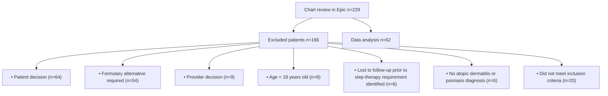
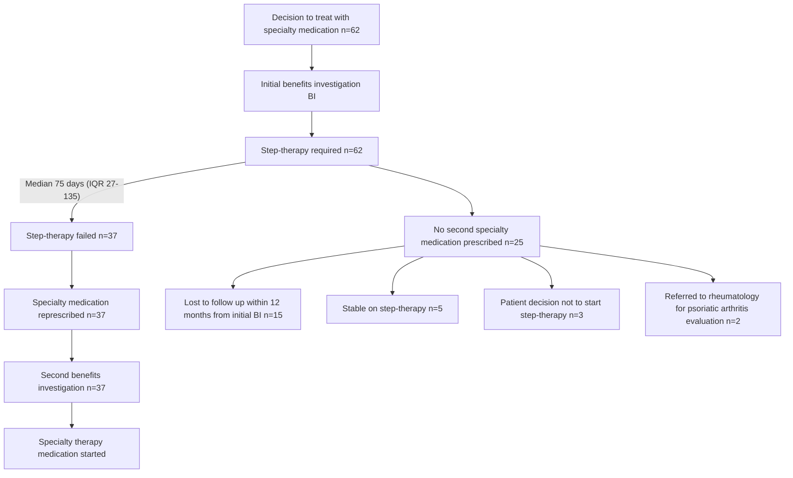

Vanderbilt University Medical Center logo

# Getting To Specialty Treatment In Dermatologic Inflammatory Conditions: Treatment Requirements And Patient Journey

Mackenzie R. Ellis1, Matthew G. Bowles2, Josh DeClercq3, Leena Choi4, Autumn D. Zuckerman2, Chelsea P. Renfro2

1Lipscomb College of Pharmacy; 2Vanderbilt Specialty Pharmacy, Vanderbilt Health; 3Department of Biostatistics, Vanderbilt University Medical Center

QR Code

# CONCLUSION

* 37 patients (60%) failed step-therapy and were referred back to the specialty pharmacy with a median of 75 days from the initial referral to the second referral

* Step-therapy requirements often delay clinically appropriate treatment for atopic dermatitis and psoriasis

## BACKGROUND AND PURPOSE

Insurers often require patients to try less costly non-specialty medications before approving a specialty medication - “step-therapy.” These medications are routinely less efficacious, can require monitoring and may have serious toxicities. The purpose of this study was to evaluate the patient journey and outcomes for patients prescribed a specialty medication for atopic dermatitis or psoriasis.

## METHODS

| Setting            | A single-center, retrospective cohort analysis across Vanderbilt Health System Dermatology clinics                                                                                                                                                                                                                                                                                                                                                                   |
| ------------------ | -------------------------------------------------------------------------------------------------------------------------------------------------------------------------------------------------------------------------------------------------------------------------------------------------------------------------------------------------------------------------------------------------------------------------------------------------------------------- |
| Sample             | Inclusion: Patients prescribed a specialty medication for atopic dermatitis or psoriasis 01/01/2021 - 06/30/2022 required by insurance to utilize step-therapy prior to a specialty medication Exclusion: Patients < 18 years old; lost to follow-up prior to step-therapy requirement identified; change to non-VUMC provider or insurance required formulary alternative specialty medication; patient or provider decision to not pursue specialty medication |
| Primary outcome    | Number of patients for whom insurance denies a specialty medication then fail a step-therapy medication                                                                                                                                                                                                                                                                                                                                                              |
| Secondary outcomes | Number of patients that are not started on specialty medication within 12 months and reason Time from first referral documented to time of second referral documented                                                                                                                                                                                                                                                                                            |

## Figure 1. Study Sample Size Attrition

## RESULTS

| Table 1. Baseline Characteristics (n=62) Characteristics | Table 1. Baseline Characteristics (n=62) n (%) |
| ------------------------------------------------------------ | -------------------------------------------------- |
| Age, years \[median (IQR)]                                   | 50 (37 – 60)                                       |
| Female gender                                                | 36 (58)                                            |
| Race                                                         |                                                    |
| White                                                        | 42 (73)                                            |
| Black                                                        | 6 (10)                                             |
| Indication                                                   |                                                    |
| Atopic dermatitis                                            | 42 (68)                                            |
| Psoriasis                                                    | 20 (32)                                            |
| Pharmacy insurance type                                      |                                                    |
| Commercial                                                   | 53 (86)                                            |
| Medicare                                                     | 7 (11)                                             |
| Previous medications                                         |                                                    |
| Topical corticosteroids                                      | 62 (100)                                           |
| Tacrolimus                                                   | 9 (15)                                             |
| Methotrexate                                                 | 8 (13)                                             |
| Pimecrolimus                                                 | 4 (7)                                              |
| Phototherapy                                                 | 4 (7)                                              |
| Cyclosporine                                                 | 1 (2)                                              |
| Acitretin                                                    | 2 (3)                                              |
| Medication on initial BI                                     |                                                    |
| Dupixent                                                     | 42 (68)                                            |
| Otezla                                                       | 7 (11)                                             |
| Skyrizi                                                      | 7 (11)                                             |
| Taltz                                                        | 3 (5)                                              |
| Humira                                                       | 2 (3)                                              |
| Stelara                                                      | 1 (2)                                              |

BI = benefits investigation

## Figure 2. Patient Journey from Decision to Treat to Receiving Treatment

## Figure 3. Primary Outcome Measure*

Icon chart showing 6 filled icons and 4 empty icons

37 patients (60%) failed step-therapy and were referred back to the specialty pharmacy for initiation of a specialty medication within 12 months

\*Each icon represents 10% of patients included in the study

## Figure 4. Patient Journey to Specialty Medication Initiation

| Number of Step-Therapies Required Number | Number of Step-Therapies Required n (%) |
| -------------------------------------------- | ------------------------------------------- |
| 1                                            | 45 (73)                                     |
| 2                                            | 12 (19)                                     |
| 3                                            | 1 (2)                                       |
| Not documented                               | 4 (6)                                       |

## Table 2. Medication Initiated for Step-Therapya

| Medication                                             | Step-therapy, n (%) |
| ------------------------------------------------------ | ------------------- |
| Tacrolimus                                             | 24 (39)             |
| Methotrexate                                           | 18 (29)             |
| Topical Corticosteroids                                | 9 (15)              |
| Pimecrolimus                                           | 8 (13)              |
| Step-therapy requirement not document in patient chart | 4 (7)               |
| Cyclosporine                                           | 2 (3)               |
| Mycophenolate                                          | 2 (3)               |
| Acitretin                                              | 1 (2)               |
| Aquaphor topical                                       | 1 (2)               |
| Amitriptyline/ketamine                                 | 1 (2)               |

aNumbers will not add up to 62 as some patients were required to complete two or more medications as part of step-therapy

