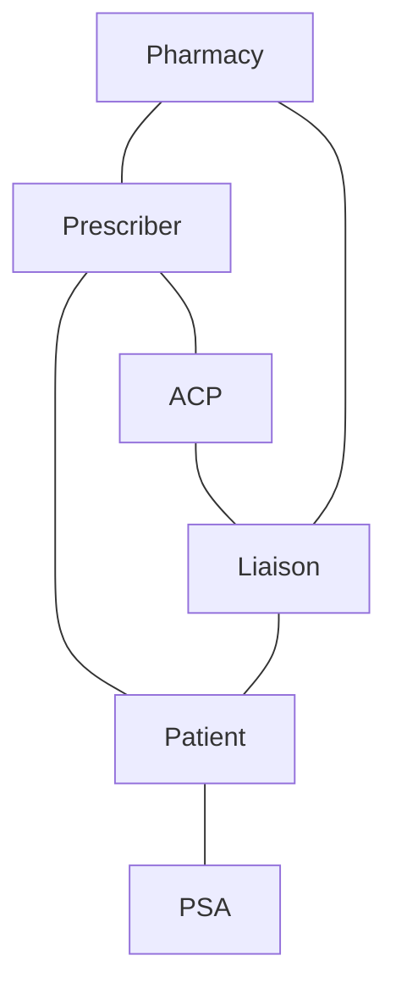

SHIELDS HEALTH SOLUTIONS logo

# Pharmacist Impact on Coverage Outcomes in Oncology

Young Kim, PharmD, BCMTMS; Martha Stutsky, PharmD, BCPS; Kate Smullen, PharmD, MSCS; Jennifer L. Donovan, PharmD

QR code with "SCAN ME" text

Virtual Poster at NASP 2022 Annual Meeting

## BACKGROUND

* Many third-party insurance plans have implemented prior authorization (PA) requirements on specialty oncology medications due to the increasing cost and complexity of treatment.1

* These PAs, coverage denials, and appeals are the most cited sources of administrative burden faced by oncologists,2 with 88% of physicians describing the burden associated with PA as high or extremely high.3

* A centralized, pharmacy-led PA process displayed a higher PA approval rate, faster time to fill, shorter time to process, and reduced staff time versus a clinic-led process.4

* An integrated Health System Specialty Pharmacy (HSSP) clinical program was implemented to ease the administrative burden of PAs by providing ambulatory clinical pharmacist (ACP) support within oncology clinics at a large health system based in New York. The ACP provides remote support in collaboration with the prescribers, liaisons, and patient support advocates (PSA) in the clinics (Figure 1).

* Objective: To evaluate the impact of an ACP program on third party coverage determination outcomes for specialty oncology medications in cancer patients managed by a HSSP.

Figure 1: Ambulatory Clinical Pharmacist Workflow

## METHODS

* Retrospective observational study comparing PA and appeal requests for oncology specialty medications prescribed from clinics in a large New York-based integrated health system without ACP support (comparator: September 2020 to May 2021) and with ACP support (intervention: June 2021 to February 2022).

- Inclusion Criteria: Adult patients new to therapy and enrolled in the HSSP patient management program

- Exclusion Criteria: Transfer patients on therapy previously

* Clinic specialties included genitourinary and thoracic solid tumors, lymphoma, leukemia, and bone marrow transplant.

* Primary outcomes: PA and appeal approval rates

* Secondary outcomes: number of PAs and appeals completed, and percentage of requests submitted with the ACP program

## RESULTS

Out of the 1,685 total PA and appeal requests, 961 (57%) were submitted with ACP support. The top 5 medication classes were antiandrogen agents, Bruton Tyrosine Kinase (BTK) inhibitors, B-Cell Lymphoma 2 (BCL-2) inhibitors, BCR-ABL tyrosine kinase inhibitors, and Epidermal Growth Factor Receptor (EGFR) inhibitors.

Figure 2: PA Approval Rate in the Intervention and Comparator Cohorts

| Cohort              | Denied PAs      | Approved PAs    |
| ------------------- | --------------- | --------------- |
| Without ACP Support | 28.9% (209/724) | 71.1% (515/724) |
| With ACP Support    | 15.7% (151/961) | 84.3% (810/961) |

13.2% increase icon

PA approval rate with ACP support

Figure 3: Appeal Approval Rate in the Intervention and Comparator Cohorts

| Cohort              | Denied Appeals | Approved Appeals |
| ------------------- | -------------- | ---------------- |
| Without ACP Support | 50% (23/46)    | 50% (23/46)      |
| With ACP Support    | 28% (13/46)    | 72% (33/46)      |

22% increase icon

APPEAL approval rate with ACP support

## CONCLUSIONS

* An ambulatory clinical pharmacist, placed in the clinic remotely alongside pharmacy liaison, improved the approval rates of both PAs and appeals for specialty oncology medications.

* The program was associated with a positive impact on approvals even with an increased number of PA and appeal requests submitted.

* These programs may benefit various other healthcare clinics and sites that prescribe a high volume of specialty medications that require PAs.

## REFERENCES

1. Mariotto AB, Yabroff KR, Shao Y, et al: Projections of the cost of cancer care in the United States: 2010-2020. J Natl Cancer Inst 103:117-128, 2011; 2. Kirkwood MK, Hanley A, Bruinooge SS, et al. The State of Oncology Practice in America, 2018: Results of the ASCO Practice Census Survey. J Oncol Pract. 2018;14(7):e412-e420. doi:10.1200/JOP.18.00149; 3. American Medical Association: 2021 AMA Prior Authorization Physician Survey. https://www.ama-assn.org/system/files/prior-authorization-survey.pdf; 4. Cutler T, She Y, Barca J, et al. Impact of pharmacy intervention on prior authorization success and efficiency at a university medical center. J Manag Care Spec Pharm. 2016;22(10):1167-1171. doi: 10.18553/jmcp.2016.22.10.1167

**DISCLOSURES**

The authors of this presentation have nothing to disclose concerning possible financial or personal relationships with commercial entities that may have a direct or indirect interest in the subject matter of this presentation

