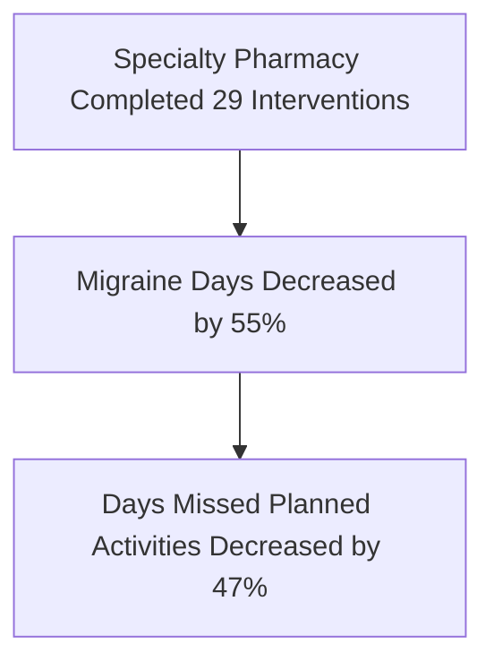

# Impact of Health System Specialty Pharmacy Services on Migraine in Patients Prescribed Calcitonin Gene-Related Peptide Receptor Modulators

Amber Skrtic, PharmD, CSP, AAHIVP; Zel Skrtic, PharmD

PARKVIEW HEALTH logo

Trellis logo

## BACKGROUND

* Migraine is a highly prevalent neurological disorder with significant impact on a patient's daily life.

* Migraineurs typically experience multiple debilitating headaches monthly with each lasting between 4 and 72 hours.

* Calcitonin gene-related peptide modulators (CGRPm) are established as effective preventative treatment for migraine.

* Opportunity exists to clinically optimize utilization of CGRPm to improve patient quality of life outcomes.

## OBJECTIVES

The objective of this study is to evaluate the frequency of specialty patient migraine days per month and days missed planned activity due to migraine before and after specialty pharmacy enrollment to assess the impact of routine health system specialty pharmacy clinical services.

## METHODS

### Study Design

The study is a quasi-experimental interrupted time series analysis of a single group of subjects examined before and after Parkview Specialty Pharmacy service enrollment.

### Subjects

Subjects include those prescribed Calcitonin Gene-Related Peptide modulators for treatment of migraine.

| INCLUSION CRITERIA                                                                                                        | EXCLUSION CRITERIA                                                                              |
| ------------------------------------------------------------------------------------------------------------------------- | ----------------------------------------------------------------------------------------------- |
| • Individuals 18 years of age and older prescribed CGRPm (erenumab, galcanezumab, fremanezumab)                           | • Subjects who enrolled in specialty pharmacy services prior to receiving second fill of CGRPms |
| • Subjects enrolled in Parkview Specialty Pharmacy services for dispensing and clinical monitoring for at least 2 refills | • Those who are not enrolled in specialty pharmacy dispensing services                          |
| • Subjects did not initiate CGRPm in 30 days prior to enrollment in specialty pharmacy services                           | • Individuals who are pregnant or become pregnant during the study period                       |
|                                                                                                                           | • Adults unable to consent                                                                      |

## DATA COLLECTION

In this study, the dependent-variables (number of migraine days per month and days missed planned activity per month due to migraine) were measured multiple times pre- and post- specialty pharmacy enrollment with each occurring approximately one-month apart from the prior measurement. The data was reported by subjects using a standardized set of questions routinely asked of patients taking CGRPm prior to each refill communication.

### Data collected for the purpose of this study includes:

* Services provided to the patient by specialty pharmacy which may include prior authorization, financial assistance, medication interaction review, clinical data review, administration training, medication counseling, adherence support, side effect management, medication fill/refill, home delivery, medication-related outreaches, and medication-related interventions when suboptimal therapy identified.

* Duration of therapy on CGRPm prior to enrollment in specialty pharmacy services.

* Data from routine assessment conducted prior to each CGRPm fill/refill for the duration of the study: number of migraine episodes per month, number missed doses of CGRPm, days missed planned activities, adverse drug reactions experienced, hospitalizations, and number of migraine abortives used.

## RESULTS

38 subjects enrolled in specialty pharmacy services and were clinically managed for 8 months.

* Prior to starting CRGPm, subjects had a baseline mean of 19.9 migraine days per month

* The average duration of CGRPm therapy prior to enrollment was 187 days

### Mean Migraine Days Per Month

| Month     | Mean Migraine Days |
| --------- | ------------------ |
| May       | 3.4                |
| June      | 2.4                |
| July      | 2.3                |
| August    | 1.8                |
| September | 2.0                |
| October   | 2.6                |
| November  | 1.7                |
| December  | 1.5                |

### Mean Days Missed Planned Activity Due to Migraine Per Month

| Month     | Mean Days Missed |
| --------- | ---------------- |
| May       | 0.45             |
| June      | 0.58             |
| July      | 0.28             |
| August    | 0.78             |
| September | 0.76             |
| October   | 0.38             |
| November  | 0.15             |
| December  | 0.22             |

## CONCLUSIONS

### Correlation between Pharmacy Interventions and Days Missed Per Month

| Month     | Interventions | Missed Days |
| --------- | ------------- | ----------- |
| May       | 5             | 0.45        |
| June      | 2             | 0.58        |
| July      | 1             | 0.28        |
| August    | 5             | 0.78        |
| September | 5             | 0.76        |
| October   | 4             | 0.38        |
| November  | 3             | 0.15        |
| December  | 3             | 0.22        |

* While CGRPm are effective at reducing migraine frequency, the high touch model of Parkview Specialty Pharmacy services showed additional, significant benefit to patient-reported outcomes in migraine patients.

* Pharmacist interventions to optimize migraine therapy directly correlated to improvements in days missed due to migraine.

* Due to the dynamic nature of migraine, patients can greatly benefit from frequent touchpoints to address barriers and optimize therapy. Specialty pharmacy services, in particular pharmacist interventions, provide preventative maintenance to ensure long term success with migraine therapy.

## REFERENCES

* Steiner TJ, Stovner LJ, Birbeck GL. Migraine: the seventh disabler. J Headache Pain. 2013;14(1):1. Published 2013 Jan 10. doi:10.1186/1129-2377-14-1

* Russo AF. Calcitonin gene-related peptide (CGRP): a new target for migraine. Annu Rev Pharmacol Toxicol. 2015;55:533-552. doi:10.1146/annurev-pharmtox-010814-124701

