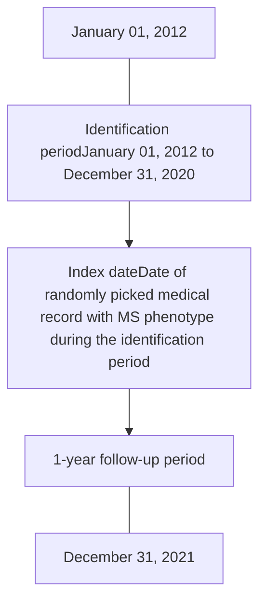
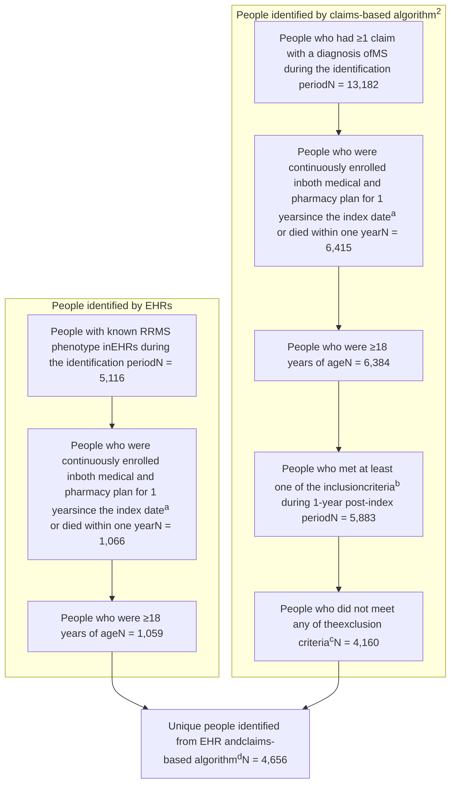

# Clinical and Economic Burden in People with Relapsing-Remitting Multiple Sclerosis in the United States: A Matched-Cohort Study

Nupur Greene1, Ashis K. Das2, Ines Hemim1, Eunice Chang2, Marian H. Tarbox2, Keiko Higuchi3

1Sanofi, Cambridge, MA, USA; 2PHAR, Beverly Hills, CA, USA; 3Sanofi, Bridgewater, NJ, USA

Melissa A Geyer (melissa.geyer@sanofi.com) presenting on behalf of authors

## BACKGROUND

Multiple sclerosis (MS) is categorized into relapsing or progressive forms based on its clinical course1

- Relapsing-remitting MS (RRMS) is the most common form of MS and affects up to 85% of people with MS1

Several disease-modifying therapies (DMTs) are available for RRMS in the United States (US). However, people with RRMS still continue to progress to the secondary progressive phase

With the introduction of newer DMTs in the market, there is a need to assess the disease burden in this population

## OBJECTIVE

- To understand the real-world clinical and economic burden in people with RRMS in the US

## METHODS

### Study design

- A retrospective, matched-cohort study was conducted using a large, integrated US-based administrative health database from January 01, 2012 to December 31, 2021 (Figure 1)

- People with RRMS were matched to unique MS-free controls on age, gender, race, region, and insurance (1:1)

- The index date was same for people with RRMS and controls

### Figure 1: Study time frame

\*MS, multiple sclerosis.

### Study population

- The RRMS cohort consisted of unique people with MS who either met a claim-based RRMS algorithm2 or had an RRMS electronic health record (EHR) during the identification period

- If a person was identified in both EHR and claims-based algorithm, the EHR-based identification was used

- The identification of RRMS cohort was done by using keywords ("relapsing remitting multiple sclerosis", "rrms", "remitting multiple sclerosis", "relapsing multiple sclerosis") in EHR and a validated claims-based algorithm2

### Study measures

- Demographics, Charlson Comorbidity Index (CCI), specific comorbidities of interest, healthcare resource utilization (HCRU), and healthcare costs (HCCs) were compared with the controls during the 1-year observation period

- HCRU and HCCs included inpatient admissions, emergency department visits, outpatient services, pharmacy costs, use of specific services, and cost of infections

### Statistical analyses

- Descriptive statistical analyses were used to compare all study measures

- All costs were reported in US dollars (adjusted to Year 2021)

- All tests were 2-sided, and P<0.05 was considered significant

## RESULTS

### Patient demographics

The final cohort comprised 4,645 people with RRMS and 4,645 matched MS-free controls (Figure 2)

### Figure 2: Attrition chart for RRMS cohort

aIndex date: Date of randomly picked MS claim during the identification period. bInclusion criteria: ≥1 medication claim of DMT; ≥1 claim of brain or spinal MRI; ≥1 internuclear ophthalmoplegia claim and at least 30 days apart from a MS diagnosis; ≥1 medication claim of MS-related symptom therapy; ≥1 MS-related symptom claim and at least 30 days apart from a MS diagnosis. cExclusion criteria: Option A: Use of medications commonly used for progressive disease (mitoxantrone, cyclophosphamide, or methotrexate) at any time during the study period; Option B: Disease progression based on a worsening of EDSS scores within 1-year post-index period; Option C: Evidence of exacerbations within 1-year post-index period. dFor patients identified from both sources (n = 563), EHR-based identification was used.
DMT, disease-modifying therapy; EDSS, Expanded Disability Status Scale; EHR, electronic health record; MRI, magnetic resonance imaging; MS, multiple sclerosis; RRMS, relapsing-remitting multiple sclerosis.

The mean (standard deviation [SD]) age of the RRMS cohort was 52.9 (14.4) years; majority were female (79.1%) and Caucasian (Table 1)

### Table 1: Demographics in the RRMS cohort versus controls

| Variable               | RRMS cohort (N = 4,645) | Control cohort (N = 4,645) |
| ---------------------- | ----------------------- | -------------------------- |
| Age (years), mean ± SD | 52.9 ± 14.4             | 52.9 ± 14.4                |
| 18–34                  | 495 (10.7%)             | 495 (10.7%)                |
| 35–54                  | 2,007 (43.2%)           | 2,007 (43.2%)              |
| 55–64                  | 1,120 (24.1%)           | 1,120 (24.1%)              |
| 65+                    | 1,023 (22.0%)           | 1,023 (22.0%)              |
| Race                   |                         |                            |
| Caucasian              | 3,901 (84.0%)           | 3,901 (84.0%)              |
| African American       | 426 (9.2%)              | 426 (9.2%)                 |
| Other/Unknown          | 318 (6.8%)              | 318 (6.8%)                 |
| Region                 |                         |                            |
| Midwest                | 2,078 (44.7%)           | 2,078 (44.7%)              |
| Northeast              | 946 (20.4%)             | 946 (20.4%)                |
| South                  | 727 (15.7%)             | 727 (15.7%)                |
| West                   | 691 (14.9%)             | 691 (14.9%)                |
| Other/Unknown          | 203 (4.4%)              | 203 (4.4%)                 |
| Plan type              |                         |                            |
| Commercial             | 2,435 (52.4%)           | 2,435 (52.4%)              |
| Medicaid               | 210 (4.5%)              | 210 (4.5%)                 |
| Medicare               | 1,654 (35.6%)           | 1,654 (35.6%)              |
| Unknown                | 346 (7.4%)              | 346 (7.4%)                 |

Data presented as n (%) unless otherwise specified.
RRMS, relapsing-remitting multiple sclerosis; SD, standard deviation.

### Clinical characteristics

The mean CCI score was significantly higher in the RRMS cohort compared to controls (1.6 vs. 1.2; P<0.001)

A significantly higher proportion of people in the RRMS cohort reported infections and leukopenia compared with controls (Figure 3)

### Figure 3: Proportion of people with infections and leukopenia in the RRMS cohort versus controls

| Infection Type | RRMS cohort (%) | Controls (%) |
| -------------- | --------------- | ------------ |
| Infections     | 60.9            | 51.5         |
| Leukopenia     | 1.4             | 0.4          |

Data presented as a percentage of patients.
RRMS, relapsing-remitting multiple sclerosis.

### Specific comorbidities of interest

The top five most frequent MS-related comorbidities in people with RRMS versus controls included malaise/fatigue, major depressive disorders, anxiety, burning/numbness, and abnormal gait (Figure 4)

A significantly higher proportion of people in the RRMS cohort reported other comorbidities (71.9% vs. 60.1%; P<0.001) and autoimmune comorbidities (23.1% vs. 18.1%; P<0.001) compared with controls

### Figure 4: Most frequent MS-related comorbidities in the RRMS cohort versus controls

| Comorbidity                | RRMS cohort (%) | Controls (%) |
| -------------------------- | --------------- | ------------ |
| Malaise/fatigue            | 34.3            | 15.7         |
| Major depressive disorders | 27.6            | 17.7         |
| Anxiety                    | 21.4            | 15.1         |
| Burning/numbness           | 19.4            | 5.8          |
| Abnormal gait              | 16.1            | 5.2          |

Data presented as a percentage of patients.
MS, multiple sclerosis; RRMS, relapsing-remitting multiple sclerosis.

### Healthcare resource utilization and healthcare costs

The RRMS cohort had a significantly higher proportion of people with mortality, hospitalizations, emergency visits, and a higher mean number of physician visits versus controls during the follow-up period (Figure 5)

- The mean (SD) length of hospital stay among utilizers was higher in the RRMS cohort versus controls (15.5 [31.3] days vs. 10.0 [16.0] days; P<0.001)

The mean total HCCs were significantly higher in the RRMS cohort versus controls (P<0.001), which was primarily driven by medical claims and outpatient pharmacy claims costs (Figure 6)

### Figure 5: All-cause healthcare resource utilization in the RRMS cohort versus controls

| Resource Type                  | RRMS cohort | Controls |
| ------------------------------ | ----------- | -------- |
| Mortality (%)                  | 5.0         | 1.2      |
| Hospitalizations (%)           | 18.2        | 11.5     |
| Emergency visits (%)           | 40.3        | 28.1     |
| Physician visits (mean number) | 15.0        | 13.7     |

Data presented as a percentage of patients and the mean number of visits.
RRMS, relapsing-remitting multiple sclerosis.

### Figure 6: Healthcare costs in the RRMS cohort versus controls

| Cost Type                  | RRMS cohort ($) | Controls ($) |
| -------------------------- | --------------- | ------------ |
| Total healthcare costs     | 54,244          | 31,154       |
| Medical claims             | 19,671          | 15,944       |
| Inpatient hospitalizations | 8,725           | 4,836        |
| ED visits                  | 1,878           | 1,156        |
| Physician visits           | 5,272           | 4,801        |
| Other outpatient services  | 3,727           | 2,087        |
| Outpatient pharmacy claims | 23,090          | 15,279       |
| Cost of infections         | 7,865           | 2,514        |

Data presented as mean cost. Cost of infections: Costs of medical claims with a diagnosis of infections in any field plus the costs of antibiotics or antivirals pharmacy claims with days of supply <21 days filled within 7 days of an infection medical claim.

ED, emergency department; RRMS, relapsing-remitting multiple sclerosis; US, United States.

## LIMITATIONS

- Possible miscoding is a limitation of claims data research, which may have impacted patient identification and reported rates of comorbidities

- Results may not be generalizable to other populations not covered by commercial insurance

## CONCLUSIONS

Overall, people with RRMS had more infections and comorbidities and substantially higher HCRU and HCCs compared with matched controls, resulting in considerable clinical and economic burden in this population despite the availability of approved therapies

Copies of this poster obtained through Quick Response (QR) code are for personal use only

QR code

## Disclosures

Melissa A Geyer (Presenter), Nupur Greene, Ines Hemim, and Keiko Higuchi: Employees of Sanofi and may hold stocks or stock options in the company.

Ashis K. Das, Eunice Chang, and Marian H. Tarbox: Employees of PHAR, which was paid by Sanofi to conduct the research described in this poster. PHAR also discloses financial relationships with the following commercial entities outside of the submitted work: Akcea, Amgen, Celgene, Delfi Diagnostics, Dompe, Exact Sciences Corporation, Genentech, Gilead, GRAIL, Greenwich Biosciences, Ionis, Nobelpharma, Novartis, Pardes, Prothena, Pfizer, Recordati, Regeneron, Sanofi US Services, and Sunovion.

## Acknowledgments

Medical writing and editorial assistance were provided by Sanjeev Kallapari, MS (Pharm) and Chiranjit Ghosh, PhD of Sanofi.

Data included in this poster were originally presented at the 9th Annual Americas Committee for Treatment and Research in Multiple Sclerosis (ACTRIMS) Forum, West Palm Beach, FL, USA; Feb 29–Mar 02, 2024

## Funding

This study was funded by Sanofi.

## References

1. Multiple Sclerosis International Federation (MSIF). Atlas of MS. 2023. Accessed October 25, 2023. https://www.atlasofms.org/fact-sheet/united-states-of-america.

2. Van Le H, Le Truong CT, Kamauu AWC, et al. Value Health . 2019; 22(1):77–84.

Poster presented at the National Association of Specialty Pharmacy (NASP) 2024 Annual Meeting & Expo, Nashville, TN, USA; Oct 06–09, 2024

