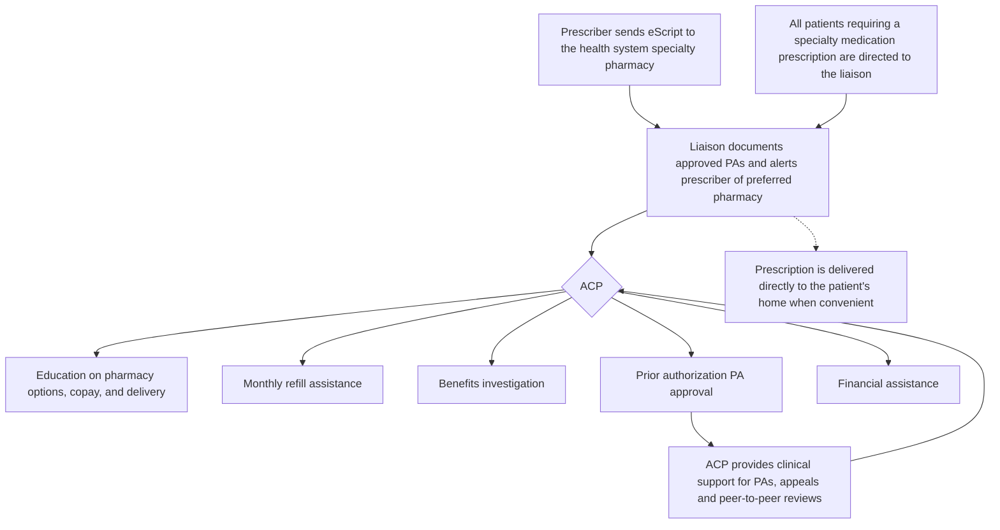

SHIELDS HEALTH SOLUTIONS logo

# Impact of an Embedded Rheumatology Pharmacist

Sefa Kploanyi, PharmD, BCPS; Kate Smullen, PharmD, MSCS, CSP; Martha Stutsky, PharmD, BCPS; Jennifer L. Donovan, PharmD

QR code with "SCAN ME" text

## Background

* In the ambulatory care setting, rheumatologists are often limited in employing potentially effective treatments for their patients due to insurance coverage restrictions and delays in medication approvals.1

* Studies suggest a pharmacist’s involvement can improve the insurance authorization process for specialty medications.2-4

* There is limited evidence to support a pharmacist’s role for rheumatologic disorders.

* The objective is to evaluate the impact of a pharmacist’s involvement in a rheumatology practice affiliated with an integrated Health System Specialty Pharmacy for the following areas: coverage determination outcomes, medication access, and provider satisfaction.

## Methods

* An ambulatory clinical pharmacist (ACP) was incorporated into an integrated care workflow within a rheumatology clinic at a New York based health system.

* Retrospective cohort analysis performed of prescriptions for specialty and non-specialty oral or injectable disease modifying anti-rheumatologic and supportive care agents prescribed by providers from the clinic.

* Time Period:
    

    - Pre-intervention: October 1, 2021 to March 31, 2022
    

    - Post-intervention: April 1, 2022 to September 30, 2022

* Metrics measured:
    

    - Prior authorization (PA) turnaround time
    

    - Prior authorization approval rate
    

    - Appeal approval rate
    

    - Provider satisfaction

## Results

Figure 1: Illustration of the integrated care workflow highlighting the role of the ambulatory clinical pharmacist (ACP)
Figures 2a & 2b: Outcomes of intervention including prior authorization approval rate, appeal approval rate, and prior authorization turn around time

### Figure 1: Integrated Care Workflow

### Figure 2a: Coverage Determination Outcomes

| Metric                            | Pre-Intervention | Post Intervention |
| --------------------------------- | ---------------- | ----------------- |
| Prior Authorization Approval Rate | 77%              | 88%               |
| Appeal Approval Rate              | 65%              | 75%               |

\* Green arrows indicate a 14% increase for PA Approval Rate and a 15% increase for Appeal Approval Rate.

### Figure 2b: Prior Authorization Turnaround Time

| Period            | Turnaround Time (Days) |
| ----------------- | ---------------------- |
| Pre-Intervention  | 3.4                    |
| Post Intervention | 1.5                    |

\* 57% Improved Turnaround Time

### Figure 3: Provider Satisfaction Survey

A provider satisfaction survey (n=10 out of the 20 providers at the clinic) showed that 78% reported that services were very beneficial and 22% found services mostly beneficial. The providers also listed which services they found most impactful with 9/10 choosing appeal assistance.

| Service                                            | Impact Count (n=10) |
| -------------------------------------------------- | ------------------- |
| Appeal assistance                                  | 9                   |
| Prescription clarifications to dispensing pharmacy | 6                   |
| Drug information                                   | 4                   |
| Patient Interventions/Counseling                   | 3                   |
| Medication Samples                                 | 1                   |

## Conclusions

* The addition of an ambulatory clinical pharmacist to the multidisciplinary team in a rheumatology practice can directly improve provider satisfaction and the quality of patient care related to timeliness of medication approvals.

* Future directions will be to observe if these outcomes have a positive impact on patient time to start therapy and clinical disease state outcomes.

### DISCLOSURES

The authors of this presentation have nothing to disclose concerning possible financial or personal relationships with commercial entities that may have a direct or indirect interest in the subject matter of this presentation.

### REFERENCES

1. Wallace ZS, Harkness T, Fu X, Stone JH, Choi HK, Walensky RP. Treatment Delays Associated With Prior Authorization for Infusible Medications: A Cohort Study. Arthritis Care Res (Hoboken). 2020;72(11):1543-1549. doi:10.1002/acr.24062

2. Farrell J, Shapiro LS, Miller M. Clinical Pharmacist As Part of the Interprofessional Team Improves Quality of Care in Patients with Rheumatic Disease [abstract]. Arthritis Rheumatol. 2017; 69 (suppl 10).

3. Ramey W, Lohr KM, Zeltner M, Herrell Postonl H, Johannemann A, Schadler AD, Lenert A. Biological and Targeted Synthetic Dmards’ Prior Authorization Time Is Significantly Reduced with Pharmacy Presence in the Rheumatology Clinic [abstract]. Arthritis Rheumatol. 2017; 69 (suppl 10)

4. Farrell JF, Shapiro LS, Kremer JM, et al. Pharmacist-developed letters may enhance success in obtaining insurance approval for off-label use of biologics (abstract 2444). 2014 ACR/ARHP Annual Meeting

