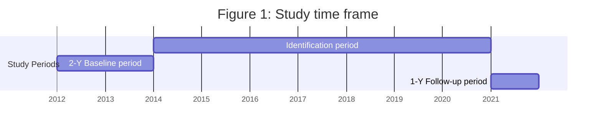

# Understanding the Burden of Illness in People with Nonrelapsing Secondary Progressive Multiple Sclerosis in the United States: A Matched-cohort Study

**Nupur Greene<sup>1</sup>, Ashis K. Das<sup>2</sup>, Ines Hemim<sup>1</sup>, Eunice Chang<sup>2</sup>, Marian H. Tarbox<sup>2</sup>, Keiko Higuchi<sup>3</sup>**

<sup>1</sup>Sanofi, Cambridge, MA, USA; <sup>2</sup>PHAR, Beverly Hills, CA, USA; <sup>3</sup>Sanofi, Bridgewater, NJ, USA

Melissa A Geyer (melissa.geyer@sanofi.com) presenting on behalf of authors

## BACKGROUND

Multiple sclerosis (MS) is categorized into relapsing or progressive forms based on its clinical course<sup>1</sup>

* Relapsing-remitting MS (RRMS) is the most common form of MS representing around 85% of the total MS cases<sup>1</sup>

* Approximately 50% of people with RRMS progress to secondary progressive MS (SPMS) over 10–15 years<sup>2,3</sup>

* However, many people with SPMS continue to accumulate disability in the absence of clinical relapses and can be termed as nonrelapsing SPMS (nrSPMS)

Although several disease-modifying therapies (DMTs) are available for relapsing MS in the United States (US), there are no DMTs approved for nrSPMS<sup>4</sup>

While it is known that people with MS have a substantially lower quality of life and higher healthcare costs (HCCs) than the general population,<sup>5,6</sup> data on the clinical and economic burden in people with nrSPMS are lacking

## OBJECTIVE

To understand the real-world clinical and economic burden in people with nrSPMS in the US

## METHODS

### Study design

A retrospective, matched-cohort study was conducted using a large, integrated US-based administrative health database which included linked electronic health record (EHR) and claims data from January 01, 2012 to December 31, 2021 (Figure 1)

People with nrSPMS were matched to unique MS-free controls based on age, sex, race, region, and insurance (1:1). The index date of control was the same as matched MS patients

### Figure 1: Study time frame


Index date (Date of randomly picked medical record with MS phenotype during identification period)
MS, multiple sclerosis; Y, year.

### Study population

The nrSPMS cohort consisted of people with MS who had an SPMS EHR during the identification period (Figure 1)

The identification of the nrSPMS cohort was also carried out using a validated claim-based nrSPMS algorithm<sup>7</sup>

An additional continuous enrollment during a 2-year baseline period was required to classify people with SPMS into nrSPMS (defined as no relapse in prior 2 years) and active SPMS (defined as ≥1 relapse in prior 2 years)

People were excluded if they were aged >70 years, OR had a primary diagnosis of other neurological disorder (Alzheimer’s, Parkinson’s disease, myasthenia gravis, or stroke), OR had evidence of relapse during the 2-year baseline period

### Study measures

Demographics, Charlson Comorbidity Index (CCI), specific comorbidities of interest, healthcare resource utilization (HCRU), and HCCs were compared with the controls during the 1-year follow-up period

* HCRU and HCCs included inpatient admissions, emergency room visits, outpatient services, pharmacy costs, use of specific services, and cost of infections

### Statistical analyses

Descriptive statistical analyses were used to compare all study measures

All costs were reported in US dollars (adjusted to Year 2021)

All tests were 2-sided, and P < 0.05 was considered significant

## RESULTS

### Demographics

A total of 858 people with nrSPMS were identified, out of which 856 were included in the final cohort (Figure 2) along with the 856 matched MS-free controls. Two people with nrSPMS were excluded as they had no matched controls

### Figure 2: Attrition chart for nrSPMS cohort

```mermaid
graph TD
    A1[People identified by EHR records] --> B1[People with known SPMS phenotype in EHRduring the identification period(N= 839)]
    B1 --> C1[People who were continuously enrolled withboth a medical and a pharmacy plan<sup>a</sup>(N= 108)]
    C1 --> D1[People who were ≥18 years of age(N= 108)]
    D1 --> E1[People who had no evidence of relapse<sup>b</sup>during the 2-year baseline period(N= 69)]
    
    A2[People identified by claim-based algorithm] --> B2[People who had ≥1 inpatient claim with a primarydiagnosis of MS or ≥2 outpatient claims with a primarydiagnosis of MS ≥30 days apartduring the identification period(N= 6,635)]
    B2 --> C2[People who had a medical claim with MS diagnosis duringthe identification period after ≥2 years since the firstobserved MS diagnosis during study period<sup>c</sup>(N= 4,411)]
    C2 --> D2[People who were continuously enrolled with both a medicaland a pharmacy plan<sup>a</sup>(N= 1,819)]
    D2 --> E2[People who were ≥18 years of age(N= 1,818)]
    E2 --> F2[People who had ≥2 out of 3 concept groups OR used≤1 DMT during the 2-year baseline period<sup>d</sup>(N= 1,742)]
    F2 --> G2[People who were 70 years or younger(N= 1,477)]
    G2 --> H2[People who had no primary diagnosis of other neurologicaldisorder (Alzheimer's, Parkinson's disease, myastheniagravis, or stroke)(N= 1,388)]
    H2 --> I2[People who had no evidence of relapse<sup>b</sup> duringthe 2-year baseline period(N= 818)]
    
    E1 --> J[Unique people identified from EHRs andclaim-based algorithm<sup>e</sup>(N= 858)]
    I2 --> J
```
<sup>a</sup>Enrollment was for i) 2 years prior to the index date (baseline period) and ii) 1 year since the index date or died within 1 year.
<sup>b</sup>Having i) ≥1 inpatient visit with a discharge diagnosis of MS or ii) ≥1 outpatient visit with a diagnosis of MS AND use of dexamethasone, methylprednisolone, prednisolone, prednisone, or adrenocorticotropin hormone on day of or within 7 days following the visit.
<sup>c</sup>The date of a randomly picked eligible MS claim was the index date.
<sup>d</sup>There were 662 people who had ≥2 out of 3 concept groups AND used ≤1 DMT during the 2-year baseline period.
<sup>e</sup>For people with nrSPMS identified from both sources, EHR-based resource was used.
DMT, disease-modifying therapy; EHR, electronic health record; MS, multiple sclerosis; nrSPMS, nonrelapsing secondary progressive multiple sclerosis; SPMS, secondary progressive multiple sclerosis.

The mean (standard deviation [SD]) age of the nrSPMS cohort was 54.4 (10.7) years; majority were female (79.8%) and Caucasian (87%; Table 1)

### Table 1: Demographics of people in the nrSPMS cohort versus controls

| Variable               | nrSPMS cohort (N= 856) | Control cohort (N= 856) |
| ---------------------- | ---------------------- | ----------------------- |
| Age (years), mean ± SD | 54.4 ± 10.7            | 54.4 ± 10.7             |
| 18–34                  | 43 (5.0)               | 43 (5.0)                |
| 35–54                  | 343 (40.1)             | 343 (40.1)              |
| 55–64                  | 312 (36.4)             | 312 (36.4)              |
| 65+                    | 158 (18.5)             | 158 (18.5)              |
| Female                 | 683 (79.8)             | 683 (79.8)              |
| Race                   |                        |                         |
| Caucasian              | 745 (87.0)             | 745 (87.0)              |
| African American       | 63 (7.4)               | 63 (7.4)                |
| Other/Unknown          | 48 (5.6)               | 48 (5.6)                |
| Region                 |                        |                         |
| Midwest                | 398 (46.5)             | 398 (46.5)              |
| Northeast              | 180 (21.0)             | 180 (21.0)              |
| South                  | 109 (12.7)             | 109 (12.7)              |
| West                   | 140 (16.4)             | 140 (16.4)              |
| Other/Unknown          | 29 (3.4)               | 29 (3.4)                |
| Plan type              |                        |                         |
| Commercial             | 442 (51.6)             | 442 (51.6)              |
| Medicaid               | 26 (3.0)               | 26 (3.0)                |
| Medicare               | 324 (37.9)             | 324 (37.9)              |
| Unknown                | 64 (7.5)               | 64 (7.5)                |


Data presented as n (%) unless otherwise specified.
nrSPMS, nonrelapsing secondary progressive multiple sclerosis; SD, standard deviation.

### Clinical characteristics

The mean CCI score was significantly lower in the nrSPMS cohort than that in matched controls (1.02 vs. 1.21; P = 0.032)

A higher proportion of people in the nrSPMS cohort reported infections and leukopenia compared with matched controls (Figure 3)

### Figure 3: Proportion of people with infections and leukopenia in the nrSPMS cohort versus matched controls

| Category   | nrSPMS cohort (%) | Controls (%) | P-value   |
| ---------- | ----------------- | ------------ | --------- |
| Infections | 53.9              | 48.8         | P = 0.038 |
| Leukopenia | 1.3               | 0.8          | P = 0.343 |


Data presented as the percentage of people.
nrSPMS, nonrelapsing secondary progressive multiple sclerosis.

### Specific comorbidities of interest

The top five most frequent MS-related comorbidities in people with nrSPMS vs. controls included malaise/fatigue, major depressive disorders, abnormal gait, anxiety, and burning/numbness (Figure 4)

Other comorbidities were reported by 63.6% in the nrSPMS cohort and 60.6% in the matched controls (P = 0.213); autoimmune comorbidities were reported by 17.9% in the nrSPMS cohort and 20.4% in the matched controls (P = 0.177)

### Figure 4: Most frequent MS-related comorbidities in the nrSPMS cohort versus matched controls

| Comorbidity                | nrSPMS cohort (%) | Controls (%) | P-value   |
| -------------------------- | ----------------- | ------------ | --------- |
| Malaise/fatigue            | 31.3              | 15.3         | P < 0.001 |
| Major depressive disorders | 28.6              | 16.0         | P < 0.001 |
| Abnormal gait              | 20.8              | 3.7          | P < 0.001 |
| Anxiety                    | 15.1              | 16.8         | P = 0.322 |
| Burning/numbness           | 14.1              | 3.9          | P < 0.001 |


Data presented as the percentage of people.
MS, multiple sclerosis; nrSPMS, nonrelapsing secondary progressive multiple sclerosis.

### Healthcare resource utilization and healthcare costs

The nrSPMS cohort had a higher proportion of people with mortality, hospitalizations, emergency visits, and a significantly higher mean number of physician visits versus matched controls during the follow-up period (Figure 5)

* The mean (SD) length of hospital stay was 13.8 (22.8) days in the nrSPMS cohort and 12.4 (17.6) days in the matched controls (P = 0.630)

### Figure 5: All-cause HCRU in the nrSPMS cohort versus matched controls

| Category                | nrSPMS cohort | Controls | P-value   |
| ----------------------- | ------------- | -------- | --------- |
| Mortality (%)           | 2.2           | 1.1      | P = 0.057 |
| Hospitalizations (%)    | 10.7          | 10.3     | P = 0.753 |
| Emergency visits (%)    | 30.5          | 28.5     | P = 0.368 |
| Physician visits (mean) | 12.6          | 10.1     | P < 0.001 |


Data presented as a percentage of people and the mean number of visits.
HCRU, Healthcare resource utilization; MS, multiple sclerosis; nrSPMS, nonrelapsing secondary progressive multiple sclerosis.

The mean total HCCs were significantly higher in the nrSPMS cohort than that in matched controls, which were primarily driven by outpatient pharmacy and physician visit costs (Figure 6)

### Figure 6: Healthcare costs in the RRMS cohort versus controls

| Cost Category              | nrSPMS cohort ($) | Controls ($) | P-value   |
| -------------------------- | ----------------- | ------------ | --------- |
| Total healthcare costs     | 58,412            | 24,827       | P < 0.001 |
| Medical claims             | 23,581            | 20,204       | P = 0.230 |
| Inpatient hospitalizations | 5,580             | 5,610        | P = 0.983 |
| ED visits                  | 1,142             | 1,114        | P = 0.879 |
| Physician visits           | 5,610             | 4,110        | P < 0.001 |
| Other outpatient services  | 12,749            | 11,408       | P = 0.514 |
| Outpatient pharmacy claims | 34,830            | 4,623        | P < 0.001 |
| Cost of infectionsa        | 3,573             | 2,613        | P = 0.223 |


Data presented as mean cost.
<sup>a</sup>Cost of infections: Costs of medical claims with a diagnosis of infections in any field plus the costs of antibiotics or antivirals pharmacy claims with days of supply <21 days filled within 7 days of an infection medical claim.
ED, emergency department; nrSPMS, nonrelapsing secondary progressive multiple sclerosis; US, United States.

## LIMITATIONS

* As this study offers a cross-sectional look at the burden of illness for people with nrSPMS, a static perspective may not fully capture the dynamic nature of managing people with nrSPMS over time

* Possible miscoding is a limitation of claims data research, which may have impacted patient identification and reported rates of comorbidities

* Results may not be generalizable to other populations not covered by commercial insurance

## CONCLUSIONS

Overall, people with nrSPMS exhibit a higher prevalence of comorbidities and a substantially increased HCRU and HCC compared to matched controls, resulting in additional clinical and economic burden in a population with no approved therapies

QR code

Copies of this poster obtained through Quick Response (QR) code are for personal use only

### Disclosures

Melissa A Geyer (Presenter), Nupur Greene, Ines Hemim, and Keiko Higuchi: Employees of Sanofi and may hold stocks or stock options in the company.

Ashis K. Das, Eunice Chang, and Marian H. Tarbox: Employees of PHAR, which was paid by Sanofi to conduct the research described in this poster. PHAR also discloses financial relationships with the following commercial entities outside of the submitted work: Akcea, Amgen, Celgene, Delfi Diagnostics, Dompe, Exact Sciences Corporation, Genentech, Gilead, GRAIL, Greenwich Biosciences, Ionis, Nobelpharma, Novartis, Pardes, Prothena, Pfizer, Recordati, Regeneron, Sanofi US Services, and Sunovion.

### Acknowledgments

Medical writing and editorial assistance were provided by Shreya Dam, MS (Biotechnology) and Chiranjit Ghosh, PhD of Sanofi.

Data included in this poster were originally presented at the 76<sup>th</sup> Annual Meeting of the American Academy of Neurology (AAN); Denver, CO, USA; April 13–18, 2024.

### Funding

This study was funded by Sanofi.

### References

1. Multiple Sclerosis International Federation (MSIF). Atlas of MS. 2023. Accessed February 02, 2024. https://www.atlasofms.org/fact-sheet/united-states-of-america.

2. Cree BAC, et al. Neurology. 2021;97:378–388.

3. Weinshenker BG, et al. Brain. 1989;112(pt 1):133–146.

4. Watson C, et al. Neurol Ther. 2023;12(6):1961–1979.

5. Müller S, et al. Neurol Ther. 2020;9(1):67–83.

6. Campbell JD, et al. Mult Scler Relat Disord. 2014;3(2):227–236.

7. Greene N, et al. Poster presented at: Academy of Managed Care Pharmacy (AMCP) Nexus, Orlando, October 16–19, 2023; FL, USA.

Poster presented at the National Association of Specialty Pharmacy (NASP) 2024 Annual Meeting & Expo, Nashville, TN, USA; Oct 06–09, 2024


