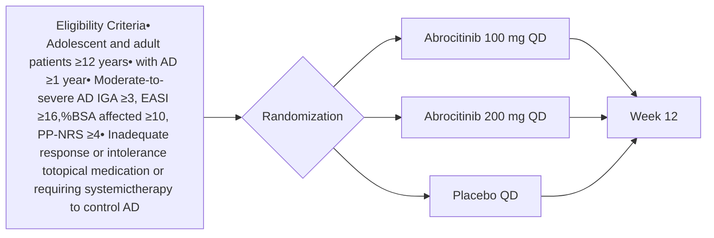

OPR54-EN

# Early Achievement of 3- and 6-Month Treat-To-Target Goals After 4 Weeks of Abrocitinib Monotherapy in Patients With Moderate-to-Severe Atopic Dermatitis: A Post Hoc Analysis

Jonathan I. Silverberg,1 Eric L. Simpson,2 Marjolein de Bruin-Weller,3 Stephan Weidinger,4 Peter Nilsson,5 Dan Henrohn,5*,6 Irina Lazariciu,7 William Romero,8* Kris Jaho9
1The George Washington University School of Medicine and Health Sciences, Washington, DC, USA; 2Oregon Health & Science University, Portland, OR, USA; 3National Expertise Centre for Atopic Dermatitis, University Medical Centre Utrecht, The Netherlands; 4University Hospital Schleswig-Holstein, Kiel, Germany; 5Pfizer AB, Stockholm, Sweden; 6Department of Medical Sciences, Uppsala University, Sweden; 7IQVIA, Kirkland, QC, Canada; 8Pfizer Ltd., Tadworth, Surrey, United Kingdom; 9Pfizer Inc., New York, NY, USA
\*Affiliation at the time this study was conducted.

## BACKGROUND

* A treat-to-target strategy proposed by experts for adults with moderate-to-severe atopic dermatitis (AD) suggests that treatment target goals at 3 months should be a ≥1-point improvement in patient global assessment (PtGA) score and at least 1 of the following improvements1:

  - ≥50% in Eczema Area and Severity Index (EASI-50)

  - ≥50% in SCORing Atopic Dermatitis (SCORAD-50)

  - ≥3 points in Peak Pruritus Numerical Rating Scale (PP-NRS3)

  - ≥4 points in Dermatology Life Quality Index (DLQI4)

  - ≥4 points in Patient-Oriented Eczema Measure (POEM4)

* At 6 months, the proposed treat-to-target goals are a PtGA score of ≤2 and at least 1 of the following1:

  - EASI-75 or EASI ≤7

  - SCORAD-75 or SCORAD ≤24

  - PP-NRS ≤4

  - DLQI ≤5

  - POEM ≤7

* Treatment continuation should be considered if the respective PtGA target goal plus at least 1 disease domain target goal is attained1

* Findings from clinical trials indicate that treatment with abrocitinib, an oral, once-daily, Janus kinase 1-selective inhibitor, is associated with a rapid improvement in multiple clinical domains2

* A strong early response may be a predictor of a later response, as well as of treatment adherence

## OBJECTIVES

* To estimate the proportions of patients with moderate-to-severe AD who attained 3-month and 6-month treat-to-target goals after only 4 weeks of abrocitinib monotherapy

* To assess itch relief at Week 4 of abrocitinib monotherapy

## METHODS

### Study Design

* Data were pooled from the JADE pivotal phase 3 clinical trials JADE MONO-1 (NCT03349060)3 and JADE MONO-2 (NCT03575871),4 in which patients with moderate-to-severe AD aged ≥12 years were treated with abrocitinib (200 or 100 mg/day) or placebo (Figure 1)

**Figure 1. JADE MONO-1 and JADE MONO-2 Study Design**

%BSA, percentage of body surface area; AD, atopic dermatitis; EASI, Eczema Area and Severity Index; IGA, Investigator's Global Assessment; PP-NRS, Peak Pruritus Numerical Rating Scale (with permission from Regeneron Pharmaceuticals, Inc., and Sanofi); QD, once daily.

### Assessments and Statistical Analysis

* In this post hoc analysis, all randomized patients who received at least 1 dose of the study medication were assessed

* Assessments included:

  - Proportions of patients attaining the 3- and 6-month treat-to-target goals at Week 4

* Only patients with available PtGA, EASI, PP-NRS, and DLQI data at Week 4 were included in this analysis

* Data are presented as observed and using descriptive statistics

  - Least squares mean changes from baseline in PP-NRS score (with permission from Regeneron Pharmaceuticals, Inc., and Sanofi) were analyzed using a mixed-effects model with repeated measures

## RESULTS

### Patients

* The data pool included 778 patients (placebo, n=155; abrocitinib 100 mg/day, n=314; abrocitinib 200 mg/day, n=309)
  - Baseline demographics and clinical characteristics were comparable across treatment arms (Table 1)

* Of those, 487 patients had available PtGA, EASI, PP-NRS, and DLQI scores at Week 4 (placebo, n=100; abrocitinib 100 mg/day, n=191; abrocitinib 200 mg/day, n=196)

**Table 1. Baseline Demographics and Clinical Characteristics**

|                       | Placebon=155 | Abrocitinib 100 mg QDn=314 | Abrocitinib 200 mg QDn=309 |
| --------------------- | ------------ | -------------------------- | -------------------------- |
| Age, mean ± SD, years | 32 ± 14      | 35 ± 16                    | 33 ± 16                    |
| Female, n (%)         | 59 (38)      | 130 (41)                   | 140 (45)                   |
| Race, n (%)           |              |                            |                            |
| White                 | 102 (66)     | 214 (68)                   | 195 (63)                   |
| Otherᵃ                | 53 (34)      | 100 (32)                   | 114 (37)                   |
| Weight, mean ± SD, kg | 74 ± 18      | 77 ± 20                    | 75 ± 18                    |
| EASI, mean ± SD       | 28 ± 11      | 30 ± 12                    | 30 ± 13                    |
| PP-NRS, mean ± SD     | 7 ± 2        | 7 ± 2                      | 7 ± 2                      |
| DLQI, mean ± SD       | 14 ± 7       | 15 ± 7                     | 15 ± 6                     |

DLQI, Dermatology Life Quality Index; EASI, Eczema Area and Severity Index; PP-NRS, Peak Pruritus Numerical Rating Scale; QD, once daily.

aPatients who identified as Black or African American, Asian, American Indian or Alaskan Native, Native Hawaiian or Other Pacific Islander, multiracial, or did not report their race.

### Abrocitinib Efficacy After 4 Weeks of Treatment

* At Week 4, a greater proportion of patients (56% [109/196]) treated with abrocitinib 200 mg/day attained the 3-month treat-to-target goals for simultaneous improvements in PtGA, EASI, PP-NRS, and DLQI, compared with patients who received abrocitinib 100 mg/day (28% [54/191]) or placebo (8% [8/100]); the corresponding values for 6-month treat-to-target goals were 29% (57/196), 10% (20/191), and 1% (1/100), respectively (Figure 2)

  - Proportions of patients attaining the 3-month targets were greater with abrocitinib 200 mg/day (77% [150/196]) than with abrocitinib 100 mg/day (56% [107/191]) or placebo (27% [27/100]); these proportions were, respectively, 64% (126/196), 32% (62/191), and 19% (19/100) for the 6-month targets (Figure 2)

**Figure 2. Proportions of Patients Attaining 3- and 6-Month Treatment Goals at Week 4**

#### PtGA Improvement of ≥1 Point and 3-Month Disease Domain Goals at Week 4

| Goal Component                    | Placebo (n=100) | Abrocitinib 100 mg QD (n=191) | Abrocitinib 200 mg QD (n=196) |
| --------------------------------- | --------------- | ----------------------------- | ----------------------------- |
| EASI-50 only                      | 15%             | 42%                           | 67%                           |
| PP-NRS3 only                      | 8%              | 28%                           | 56%                           |
| DLQI4 only                        | 5%              | 9%                            | 6%                            |
| EASI-50 + PP-NRS3                 | 1%              | 2%                            | 5%                            |
| EASI-50 + DLQI4                   | 3%              | 9%                            | 8%                            |
| PP-NRS3 + DLQI4                   | 5%              | 9%                            | 6%                            |
| All 3 (EASI-50 + PP-NRS3 + DLQI4) | 8%              | 28%                           | 56%                           |
| Any 1 (Month 3 target met)        | 27%             | 56%                           | 77%                           |

Month 3 target is defined as PtGA improvement of ≥1 point and achievement of EASI-50 or PP-NRS3 or DLQI4

#### PtGA Absolute Score ≤2 and 6-Month Disease Domain Goals at Week 4

| Goal Component                        | Placebo (n=100) | Abrocitinib 100 mg QD (n=191) | Abrocitinib 200 mg QD (n=196) |
| ------------------------------------- | --------------- | ----------------------------- | ----------------------------- |
| EASI-75 only                          | 6%              | 18%                           | 44%                           |
| PP-NRS ≤4 only                        | 1%              | 10%                           | 29%                           |
| DLQI ≤5 only                          | 5%              | 8%                            | 13%                           |
| EASI-75 + PP-NRS ≤4                   | 1%              | 2%                            | 9%                            |
| EASI-75 + DLQI ≤5                     | 1%              | 2%                            | 4%                            |
| PP-NRS ≤4 + DLQI ≤5                   | 1%              | 10%                           | 29%                           |
| All 3 (EASI-75 + PP-NRS ≤4 + DLQI ≤5) | 1%              | 10%                           | 29%                           |
| Any 1 (Month 6 target met)            | 19%             | 32%                           | 64%                           |

Month 6 target is defined as PtGA score ≤2 and achievement of EASI-75 or PP-NRS ≤4 or DLQI ≤5

DLQI, Dermatology Life Quality Index; DLQI4; ≥4-point improvement from baseline in DLQI; DLQI ≤5; DLQI score ≤5 (baseline >5); EASI, Eczema Area and Severity Index; EASI-50, ≥50% improvement from baseline in EASI; EASI-75, ≥75% improvement from baseline in EASI; PP-NRS, Peak Pruritus Numerical Rating Scale; PP-NRS3, ≥3-point improvement from baseline in PP-NRS; PP-NRS ≤4, PP-NRS score ≤4 (baseline >4); PtGA, patient global assessment; QD, once daily.

Data reported as observed; includes patients with available PtGA, EASI, PP-NRS, and DLQI scores at Week 4.

### Itch Relief After 4 Weeks of Abrocitinib Treatment

* Greater improvements in PP-NRS change from baseline to Week 4 were observed with abrocitinib 200 mg/day than with abrocitinib 100 mg/day or placebo (Figure 3)

**Figure 3. Changes in PP-NRS From Baseline to Week 4**

| Treatment                  | LSM Change From Baseline in PP-NRS Score (95% CI) |
| -------------------------- | ------------------------------------------------- |
| Placebo (n=155)            | -0.7                                              |
| Abrocitinib 100 mg (n=313) | -2.6                                              |
| Abrocitinib 200 mg (n=309) | -3.8                                              |

LSM, least squares mean; MMRM, mixed-effects model with repeated measures; PP-NRS, Peak Pruritus Numerical Rating Scale.

Mean PP-NRS ± SD at baseline was 7 ± 2 for all treatment arms.

All randomized patients who received at least 1 dose of the study medication were assessed.

MMRM contained fixed factors of treatment, week, treatment-by-week interaction, study, baseline disease severity, age category and baseline value and unstructured covariance matrix or compound symmetry covariance matrix.

## CONCLUSIONS

* As early as Week 4, a substantial proportion of patients treated with abrocitinib 200 mg or 100 mg monotherapy attained proposed 3-month and 6-month improvement goals in skin lesions, pruritus, and dermatology-related quality of life

* Improvements in itch severity were greater with abrocitinib 200 mg and abrocitinib 100 mg than with placebo at Week 4

* These data suggest that abrocitinib treatment provides rapid relief of signs and symptoms across several clinical domains

* Moreover, currently proposed 3-month and 6-month treatment goals for patients with moderate-to-severe AD could be achieved far earlier with abrocitinib, thus enabling early clinical response assessment

## REFERENCES

1. De Bruin-Weller M et al. Acta Dermatol Venereol. 2021;101:1068.

2. De Bruin-Weller M et al. Br J Dermatol. 2022;186:e171. Abstract 684.

3. Simpson EL et al. Lancet. 2020;396:255-266.

4. Silverberg JI et al. JAMA Dermatol. 2020;156:863-873.

## ACKNOWLEDGMENTS

The authors thank Pinaki Biswas for his assistance with the additional data analyses provided for this study. Editorial/medical writing support under the guidance of the authors was provided by Renata Cunha, PharmD, at ApotheCom, San Francisco, CA, USA, and was funded by Pfizer Inc., New York, NY, USA, in accordance with Good Publication Practice (GPP 2022) guidelines (Ann Intern Med. 2022; 10.7326/M22-1460).

This study was funded by Pfizer Inc.

Previously presented at the Annual European Academy of Dermatology and Venereology (EADV) Congress; October 11-14, 2023; Berlin, Germany.

## CONTACT INFORMATION

Contact Kris Jaho at kris.jaho@pfizer.com for questions or comments.

QR Code

Copies of this poster and the audio recording obtained through this QR code are for your own personal use only and may not be reproduced without permission from the authors.

Copyright © 2024. All rights reserved.

Presented at the National Association of Specialty Pharmacy (NASP) Annual Meeting and Expo; October 6-9, 2024; Nashville, Tennessee

