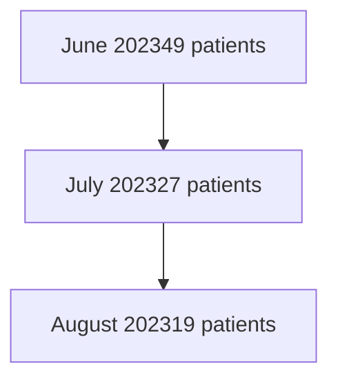

Yale New Haven Health logo

# A model for medication therapy management service implementation in a health system specialty pharmacy

Athena Peterson, PharmD; Lauren Schwartz, PharmD, MBA; Bisni Narayanan, PharmD, MS; Terri Sue Rubino, PharmD, CSP; Vinay Sawant, MPH, MBA

## Background

* Direct and Indirect Remuneration (DIR) fees are implemented by Medicare Part D pharmacy benefit managers to determine pharmacy performance and reimbursement.

* Pharmacy DIR fees have increased by 91,500% between 2010 and 2019. Pharmacies can actively reduce these fees through medication therapy management (MTM) initiatives.

* MTM services can reduce the risk of nonadherence, minimize patient hospital readmittance, and nurture relationships between patients and their pharmacies.

* Outpatient Pharmacy Services at Yale New Haven Health (OPS) recognize these opportunities to increase pharmacy interventions and improve patient outcomes.

* In 2023, OPS established a team to complete MTM services to reduce our DIR fees.

## Objective

* To develop and implement an effective medication therapy management service within a health system specialty pharmacy.

## Methods

Specialist icon Specialty clinical pharmacists were trained in the online MTM platform and the performance information management tool

Intervention icon Clinical interventions included but not limited to, closing therapy gaps, patient consults, finding cost effective and superior therapy alternatives.

Outcomes icon Direct outcomes measured were targeted intervention program (TIP) and comprehensive medication reviews (CMRs)

$ Indirect measures included anticipated reduction in DIR fees

Patient icon Patients with identified PDC gaps in the cholesterol, diabetes, and RASA therapy class were targeted for adherence counseling

## Results

### Intervention Completion Rate

| Date    | CMR Completion Rate (%) | TIPS Completion Rate (%) |
| ------- | ----------------------- | ------------------------ |
| 6/9/23  | 45                      | 35                       |
| 6/16/23 | 55                      | 45                       |
| 6/23/23 | 58                      | 52                       |
| 6/30/23 | 55                      | 55                       |
| 7/7/23  | 68                      | 55                       |
| 7/14/23 | 75                      | 58                       |
| 7/21/23 | 80                      | 60                       |
| 7/28/23 | 82                      | 62                       |
| 8/4/23  | 85                      | 65                       |
| 8/11/23 | 85                      | 65                       |

### Pharmacy Performance Score %

| Date    | Performance Score (%) |
| ------- | --------------------- |
| 6/9/23  | 50                    |
| 6/16/23 | 70                    |
| 6/23/23 | 70                    |
| 6/30/23 | 70                    |
| 7/7/23  | 70                    |
| 7/14/23 | 70                    |
| 7/21/23 | 90                    |
| 7/28/23 | 90                    |
| 8/4/23  | 90                    |
| 8/11/23 | 90                    |

### Cholesterol PDC 91.8%

| Month  | Performance Score (%) | Goal (%) |
| ------ | --------------------- | -------- |
| Jan-23 | 91.8                  | 91       |
| Feb-23 | 90.5                  | 91       |
| Mar-23 | 89.5                  | 91       |
| Apr-23 | 91.0                  | 91       |
| May-23 | 91.8                  | 91       |
| Jun-23 | 91.8                  | 91       |

### Patients with eligible STAR TIPS

### RASA PDC 94.3%

| Month  | Performance Score (%) | Goal (%) |
| ------ | --------------------- | -------- |
| Jan-23 | 89.0                  | 91       |
| Feb-23 | 88.0                  | 91       |
| Mar-23 | 90.0                  | 91       |
| Apr-23 | 92.0                  | 91       |
| May-23 | 93.0                  | 91       |
| Jun-23 | 94.3                  | 91       |

### Diabetes PDC 87.2%

| Month  | Performance Score (%) | Goal (%) |
| ------ | --------------------- | -------- |
| Jan-23 | 75.0                  | 91       |
| Feb-23 | 74.0                  | 91       |
| Mar-23 | 80.0                  | 91       |
| Apr-23 | 85.0                  | 91       |
| May-23 | 89.0                  | 91       |
| Jun-23 | 87.2                  | 91       |

## Discussion

* Patients eligible for clinical interventions are loaded into the online MTM platform on a calendar year basis.

* At the start of 2023, we had 412 patients eligible for MTM services with a 0% completion rate for CMRs and TIPs and 0% ranking for pharmacy performance score.

* At the three-month mark, we have an 80% completion rate for CMRs and 61% completion rate for TIPs

* Currently, we are in the top 20% percentile, with a rating of 5/5 compared to other MTM centers performance

* DIR fees for high-cost specialty medications are often impacted by the adherence of non-specialty medications

* Hence, we focused on completing the STAR Tips and PDC adherence consults for cholesterol, diabetes, and RASA therapy classes as they may have the biggest impact on DIR fees

* The effect of MTM implementation on DIR fees is currently unknown due to the lag time in the DIR fee collection schedule.

## Barriers/Limitations

* We temporarily paused on the implementation of the MTM services due to the transition to a new clinical platform

* It is currently unclear how the CMS regulation changes for 2024 may impact the DIR fees

* GLP-1 receptor agonists used primarily for metabolic indications were included in the Diabetes PDC score. Manufacturer supply issues affected the adherence and 90-day script conversion rates for these medications.

## Future Directions

* Development and expansion of the MTM services to include the two retail locations and ambulatory sites within our health system.

## Conclusion

Our research has shown that a health system specialty pharmacy can develop and implement an effective MTM service within a few months.

The authors of this presentation have nothing to disclose concerning possible financial or personal relationships with commercial entities that may have a direct or indirect interest in the subject matter of this presentation. NASP Annual Meeting & Expo 2023. September 18-21, 2023.

