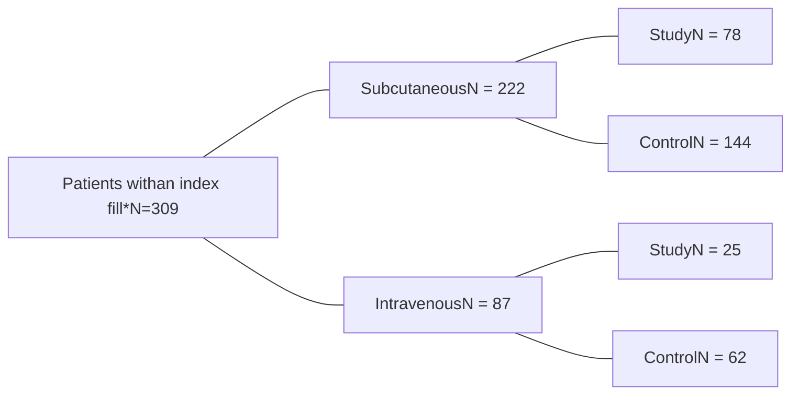

CVS Health. logo

CVS specialty logo

# Hereditary Angioedema Medication Utilization

Dawn Hyatt, PharmD, Natalie Watkins, PharmD, Pavlo Kyrychenko, MD, PhD, Elisea Avalos-Reyes, PhD, Lucia Feczko, RPh, Rashmi Grover, PharmD

## Introduction

* Hereditary Angioedema (HAE) is a rare disorder characterized by localized, non-pruritic edema; “HAE attacks”1-3

* FDA-approved treatments include medication to treat both acute attacks and for prophylaxis1

* Patients must have immediate access to effective acute HAE medication to administer at the onset of an HAE attack. An FDA-approved acute HAE medication (ecallantide, icatibant, or C1INH), subcutaneous (SC) or intravenous (IV), should be used as first-line treatment for attacks irrespective of location1

* Prophylactic therapy is safe and effective for HAE in preventing and decreasing severity of acute attacks1-3

* HAE Medical Advisory Board- 2020 stated, “The decision on when to use long-term prophylactic treatment cannot be made on rigid criteria but should reflect the needs of the individual patient.”1

## Objective

* Real world clinical outcomes of patients initiating HAE prophylactic treatment are not well documented.

* This study examined HAE patient clinical outcomes, specifically acute HAE drug utilization, 12 months before and after initiating prophylactic treatment

## Methods

* This is a retrospective study of HAE patients throughout the United States who received an index fill for an HAE medication from a large specialty pharmacy from August 2017 - December 2018.

* Acute drug utilization was assessed 12 months pre-and post-index fill for both the intervention and control groups.

* We defined the intervention group as patients with at least 1 prophylactic fill during the study period and defined the control group as patients treated by acute HAE medications only during the study period.

* The intervention and control groups were subdivided into two cohorts: subcutaneous (SC) and intravenous (IV) acute treatment.

* A regression model was used to determine differences in acute drug utilization between groups, adjusting for confounders.

## Results

Figure 1. Patient Selection

\*Index fill for study patients was the first prophylactic drug fill between August 2017 and December 2018. Index fill for control patients was a randomly selected acute drug fill between August 2017 and December 2018.

### Table 1. Baseline Characteristics

|                                          | Subcutaneous Study (N= 78) | Subcutaneous Control (N= 144) | Subcutaneous p-value | Intravenous Study (N= 25) | Intravenous Control (N= 62) | Intravenous p-value |
| ---------------------------------------- | ------------------------------ | --------------------------------- | ------------------------ | ----------------------------- | ------------------------------- | ----------------------- |
| Age, mean (SD)                           | 39.7 (15.0)                    | 48.0 (18.8)                       | **0.0010**               | 29.8 (17.5)                   | 35.4 (15.8)                     | 0.1513                  |
| Female, N (%)                            | 55 (70.5%)                     | 103 (71.5%)                       | 0.8734                   | 14 (56.0%)                    | 39 (62.9%)                      | 0.5504                  |
| Index date, mean                         | 7/12/2018                      | 3/28/2018                         | **0.0001**               | 5/15/2018                     | 3/13/2018                       | 0.0677                  |
| Acute days exposure pre, mean (SD)       | 268.3 (99.9)                   | 272.1 (95.3)                      | 0.7772                   | 306.2 (87.5)                  | 257.7 (94.9)                    | **0.0302**              |
| Subacute mg per day pre, mean (SD)       | 11.4 (9.4)                     | 7.0 (8.4)                         | **0.0005**               |                               |                                 |                         |
| Intravenous units per day pre, mean (SD) |                                |                                   |                          | 287.1 (267.9)                 | 244.2 (276.3)                   | 0.5105                  |

### Table 2. Acute Drug Utilization Post Index Fill

|                                                                    | Subcutaneous Study | Subcutaneous Control | Subcutaneous Study vs. control | Subcutaneous p-value | Intravenous Study | Intravenous Control | Intravenous Study vs. control | Intravenous p-value |
| ------------------------------------------------------------------ | ---------------------- | ------------------------ | ---------------------------------- | ------------------------ | --------------------- | ----------------------- | --------------------------------- | ----------------------- |
| Difference in acute utilization Post vs. Pre (mg or units per day) | -5.2                   | -1.4                     | -3.8                               | **0.0001**               | -207.1                | -44.5                   | -162.6                            | **0.0028**              |
| Percent drop in acute utilization (Post vs. Pre)                   | 54.5%                  | 6.1%                     | 48.4%                              | **0.0001**               | 68.4%                 | 1.1%                    | 67.3%                             | **0.0008**              |

### Table 3. Characteristics of Patients who Discontinued Acute Treatment Post-Index Fill

|                                          | Subcutaneous Discontinued (N= 18) | Subcutaneous Stayed (N= 60) | Subcutaneous p-value | Intravenous Discontinued (N= 8) | Intravenous Stayed (N= 17) | Intravenous p-value |
| ---------------------------------------- | ------------------------------------- | ------------------------------- | ------------------------ | ----------------------------------- | ------------------------------ | ----------------------- |
| Age, mean (SD)                           | 33.9 (14.4)                           | 41.4 (14.9)                     | 0.0626                   | 33.0 (17.4)                         | 28.3 (17.9)                    | 0.5377                  |
| Female, N (%)                            | 13 (72.2%)                            | 42 (70.0%)                      | 0.8561                   | 1 (12.5%)                           | 13 (76.5%)                     | **0.0026**              |
| Index date, mean                         | 8/18/2018                             | 6/30/2018                       | 0.1935                   | 7/4/2018                            | 4/21/2018                      | 0.1976                  |
| Acute days exposure pre, mean (SD)       | 233.2 (75.6)                          | 278.8 (104.4)                   | 0.0894                   | 256.8 (132.7)                       | 359.5 (44.4)                   | **0.0500**              |
| Subacute mg per day pre, mean (SD)       | 8.7 (7.5)                             | 12.2 (9.8)                      | 0.1730                   |                                     |                                |                         |
| Intravenous units per day pre, mean (SD) |                                       |                                 |                          | 372.5 (407.6)                       | 246.9 (172.0)                  | 0.2835                  |
| Percent discontinued                     | 23.1%                                 |                                 |                          | 32.0%                               |                                |                         |

* In patients taking SC vs. IV acute therapy, the discontinuation rate after initiating a prophylactic drug was 23.1% and 32%.

* In patients who continued acute SC and IV treatments after initiating a prophylactic treatment, acute medication usage decreased by 3.8 mg/day (48.4%, p <0.0001) vs. 162.6 units/day, (67.3%, p = 0.0008).

* In the IV acute treatment cohort, males (p=0.0026) and patients with lower utilization of medication before prophylactic treatment (p=0.05) were more likely to discontinue acute medications after initiating a prophylactic treatment.

* Patients on SC acute treatment, had no statistically significant correlations between patient characteristics and discontinuation rate.

## Conclusion

* Initiating prophylactic treatment for HAE was associated in a significant reduction of acute drug utilization (SC and IV).

* Gender and low usage of acute drug before prophylactic treatment were predictors of discontinuation of IV acute drug utilization.

* Larger prospective studies are needed to assess financial benefits and impact on Quality of Life when using prophylactic HAE drugs.

## References

1. Busse PJ, Christiansen SC, Riedl MA, et al. Us haea medical advisory board 2020 guidelines for the management of hereditary angioedema. The Journal of Allergy and Clinical Immunology: In Practice. 2021;9(1):132-150.e3.

2. Severity of hereditary angioedema, prevalence, and diagnostic considerations. AJMC. 2018. Available at <u>https://www.ajmc.com/view/severity-of-hae-prevalence-and-diagnostic-considerations</u>

3. Siles R. Hereditary angioedema. Cleveland Clinic Disease Management; 2017. Available at <u>https://www.clevelandclinicmeded.com/medicalpubs/diseasemanagement/allergy/hereditary-angioedema/</u>

## Questions?

Please contact Natalie Watkins at <u>Natalie.Watkins@CVSHealth.com</u> or Dawn Hyatt at <u>Dawn.Hyatt@CVSHealth.com</u>

© 2021 CVS Health and/or one of its affiliates. All rights reserved. This document contains proprietary information and cannot be reproduced, distributed or printed without written permission from CVS Health. Data use and disclosure is subject to applicable law, corporate information firewalls and client contractual limitations.

Proprietary

