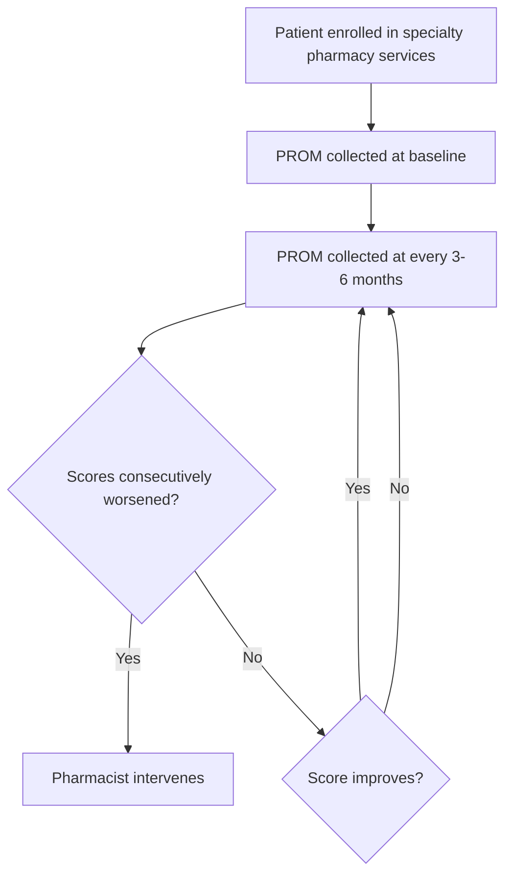

# Development and Implementation of Clinical Dashboards for Clinical Outcomes Measures Reporting Within Health System Specialty Pharmacy Services

Trellis Rx now part of CPS logo

Jessica Mourani, PharmD; Frank Jamison, PharmD; Brandon Hardin, PharmD, MBA, CSP; Amber Skrtic, PharmD, CSP, AAHIVP; Brandon Newman, PharmD, MMHC, CSP; Neda Hanson, PharmD, MPH, CSP; Hector Mayol

## BACKGROUND

* The need to create standardized collection methods and a reporting framework for defined clinical outcomes measures (COMs) is an identified requirement and developing area in health system specialty pharmacy services (HSSP).

* As we begin to understand which key COMs demonstrate positive patient impact across various disease states and the value these COMs hold to key stakeholders, it becomes imperative that there is a method to standardize the reporting of this data in a consistent and actionable way.

* To accomplish this, Trellis Rx implemented technology-enabled clinical dashboards that reflect key identified COMs defined in disease-specific protocols leveraged by pharmacists and patient liaisons working onsite at our partner health systems.

## OBJECTIVE

Illustrate how incorporating technology-enabled clinical dashboards into an HSSP workflow optimizes patient care and outcomes measures reportability.

## METHODS

* Multi-center, descriptive study evaluating disease-specific, technology-enabled clinical dashboards.

* Disease state-specific clinical protocols defining key COMs were developed by clinical subcommittees based on current clinical guidelines, recent research, and specialty pharmacy organization recommendations.

* Once defined, the disease-specific protocols were implemented in Trellis Rx’s specialty pharmacy technology platform, Arbor® and adopted by pharmacists and patient liaisons across Trellis Rx’s partner health systems.

* Arbor’s advanced algorithms trigger automated alerts and interventions enabling consistent and streamlined collection of COMs and other relevant data across Trellis Rx’s partner health systems.

* Finally, real-time, disease-specific dashboards were created via Arbor to monitor compliance with the disease-specific protocols, ensure appropriate collection of COMs, leverage COM data to drive patient care, and enable consistent reporting on COMs to stakeholders.

### Rheumatology COM Protocol Framework

## RESULTS

### Rheumatology Dashboard Reporting Framework Example

**% Patient with Baseline PROM**

| Category                     | Value | Target |
| ---------------------------- | ----- | ------ |
| % Patient with Baseline PROM | 98.8% | 95%    |

**% Patient with PROM in Last 6 Months**

| Category                             | Value | Target |
| ------------------------------------ | ----- | ------ |
| % Patient with PROM in Last 6 Months | 94.4% | 95%    |

**% Patient with Completed Intervention when Score Worsens Consecutively**

| Category                                                               | Value  | Target |
| ---------------------------------------------------------------------- | ------ | ------ |
| % Patient with Completed Intervention when Score Worsens Consecutively | 100.0% | 95%    |

**Change in RAPID3 Severity: Baseline to Most Recent**

| Baseline Severity | Most Recent Severity |
| ----------------- | -------------------- |
| High Severity     | High Severity        |
| Moderate Severity | Moderate Severity    |
| Low Severity      | Low Severity         |
| Near Remission    | Near Remission       |

## CONCLUSIONS

Defining COMs icon
**Defining COMs**
This project describes the importance of defining COMs for various disease states. This allows for consistent monitoring and reporting of COMs using disease-specific, technology-enabled clinical dashboards.

Reporting Framework icon
**Reporting Framework**
Data reporting framework is critical to optimizing patient care, confirming clinical goals and metrics are achieved, and ensuring the accurate reporting of outcomes data.

Sharing Information icon
**Sharing Information**
Dashboards provide meaningful information to share with key stakeholders and is essential to accurately track benchmark data to further standardize care in the specialty pharmacy space.

## REFERENCES

1. Patel K, Chim YL, Grant J, Wascher M, Nathanson A, Canfield S. Development and Implementation of Clinical Outcome Measures for Automated Collection Within Specialty Pharmacy Practice. J Manag Care Spec Pharm. 2020 Jul;26(7):901-909. doi: 10.18553/jmcp.2020.26.7.901. PMID: 32584676.

2. Anna M Hu, PharmD, BCPS, Marc J Pepin, PharmD, BCPS, BCGP, Mohamed G Hashem, PharmD, BCPS, Rachel B Britt, PharmD, BCPS, Sara R Britnell, PharmD, BCPS, William E Bryan, III, PharmD, BCPS, Jamie N Brown, PharmD, FCCP, BCPS, BCACP, Development of a specialty medication clinical dashboard to improve tumor necrosis factor-α inhibitor safety and adherence monitoring, American Journal of Health-System Pharmacy, 2021;, zxab454, https://doi.org/10.1093/ajhp/zxab454

® 2022 Trellis Rx

