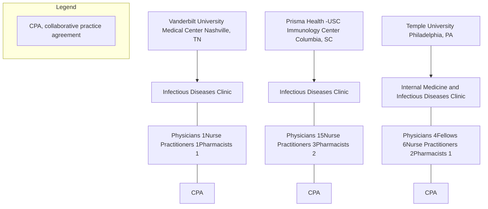

# Crushing and Splitting DAAs for HCV Treatment: A Case Series

Kristen Whelchel1, Autumn D. Zuckerman1, David E. Koren2, Caroline Derrick3, Jeannette Bouchard4, Cody Chastain5

1 Specialty Pharmacy Services, Vanderbilt University Medical Center; Nashville, Tennessee
2 Temple University Health System; Philadelphia, Pennsylvania
3 University of South Carolina Department of Infectious Disease; Columbia, South Carolina
4 WakeMed Health and Hospital System; Raleigh, North Carolina
5 Division of Infectious Diseases, Department of Medicine, Vanderbilt University Medical Center; Nashville, Tennessee

Vanderbilt University logo Temple University logo University of South Carolina logo

726 Melrose Avenue Nashville, TN 37211/Email: kristen.w.whelchel@vumc.org/Tel: 615.875.6131 Fax: 615.875.0666

## BACKGROUND

Ø Direct Acting Antivirals (DAAs) can produce sustained virologic response (SVR) rates >90%.

Ø There is limited data regarding the use of DAAs in patients unable to swallow tablets.

Ø DAA tablet manipulation may impact drug absorption and treatment outcome.

## OBJECTIVE

Ø Describe the safety and effectiveness outcomes of real-world cases requiring DAA tablet manipulation.

## METHOD

| \*\*Design\*\*       | Multi-site, retrospective case series                                                                                         |
| -------------------- | ----------------------------------------------------------------------------------------------------------------------------- |
| \*\*Sample\*\*       | Adult patients receiving DAA therapy with tablet manipulation at three academic health-systems                                |
| \*\*Study period\*\* | January 2013 to December 2019                                                                                                 |
| \*\*Outcomes\*\*     | Achievement of SVR at least 12 weeks after therapy completion, reasons for tablet manipulation, adverse effects and adherence |

## Figure 1: Practice Sites

## RESULTS

### Table 1: Summary of Cases of HCV Treatment Requiring DAA Manipulation

| Gender | Race  | Age | Pertinent Medical History                                 | Non-DAA RX Burden | GT | Fibrosis Stage | Previous HCV Treatment  | Drug Regimen  | Potential Drug Interactions with DAA             | Method of Administration                            | Patient-Reported Adherence | Treatment Outcome |
| ------ | ----- | --- | --------------------------------------------------------- | ----------------- | -- | -------------- | ----------------------- | ------------- | ------------------------------------------------ | --------------------------------------------------- | -------------------------- | ----------------- |
| Male   | White | 67  | NAT+ heart/kidney transplant, HTN, HLD, DM, GI bleeds     | 28                | 1a | Not reported   | Naïve                   | GLE/PIB       | atorvastatin, quetiapine, tacrolimus, omeprazole | Crushed and taken by PEG tube                       | No missed doses            | SVR12 achieved    |
| Female | Black | 68  | NAT+ heart/kidney transplant, TTR amyloidosis, ESRD       | 30                | 1a | Not reported   | Naïve                   | GLE/PIB       | pantoprazole, oxycodone, tacrolimus              | Crushed and taken by PEG tube                       | 2 missed doses             | SVR12 achieved    |
| Male   | Black | 71  | Short gut syndrome, ischemic colitis requiring colectomy  | 8                 | 1a | F2-F3          | Naïve                   | LDV/SOF       | N/A                                              | Halved and taken by mouth                           | No missed doses            | SVR12 achieved    |
| Male   | Black | 61  | H/o squamous cell carcinoma of larynx, HTN, DM, HLD       | 7                 | 1a | F0             | Experienced (IFN)       | LDV/SOF       | magnesium                                        | Crushed and taken with small amount of orange juice | No missed doses            | Lost to follow up |
| Male   | Black | 54  | H/o laryngeal cancer                                      | 3                 | 1a | F0-F1          | Naïve                   | LDV/SOF       | N/A                                              | Crushed and taken by mouth                          | Several missed doses       | Lost to follow up |
| Male   | White | 60  | H/o carcinoma of tonsil, HCC, GERD, HTN                   | 8                 | 3  | F2-F3          | Naïve                   | SOF/VEL       | N/A                                              | Crushed and taken by PEG tube                       | 1 missed dose              | SVR12 achieved    |
| Male   | Black | 73  | H/o malignant neoplasm of supraglottis                    | 3                 | 3  | F2             | Naïve                   | SOF/VEL       | N/A                                              | Crushed and taken by mouth                          | No missed doses            | SVR12 achieved    |
| Female | White | 41  | Scoliosis w/Harrington rod, BMI 17.8                      | 0                 | 3  | F0             | Naïve                   | SOF/VEL       | N/A                                              | Halved and taken on gelatin                         | No missed doses            | SVR12 achieved    |
| Female | White | 60  | H/o squamous cell carcinoma of larynx, GERD HTN, CAD      | 11                | 1a | F0             | Experienced (SMV + SOF) | SOF/VEL       | N/A                                              | Crushed and taken sprinkled on applesauce           | 31 missed doses            | SVR12 achieved    |
| Female | White | 50  | Decompensated cirrhosis, h/o submandibular malignant mass | 12                | 3  | F4             | Experienced (IFN)       | SOF/VEL + RBV | calcium carbonate, ranitidine                    | Quartered and taken by mouth                        | 4 missed doses             | Lost to follow up |

BMI, body mass index; CAD, coronary artery disease; DM, diabetes mellitus; ESRD, end stage renal disease; GERD, gastroesophageal reflux; GI, gastrointestinal; GLE/PIB, glecaprevir/pibrentasvir; GT, genotype; HCC, hepatocellular carcinoma; HLD, hyperlipidemia; H/o, history of; HTN, hypertension; IFN, interferon; LDV/SOF, ledipasvir/sofosbuvir; NAT, nucleic acid testing; PEG, percutaneous endoscopic gastrostomy; RBV, ribavirin; RX, prescription; SMV, simeprevir; SOF, sofosbuvir; SOF/VEL, sofosbuvir/velpatasvir; TTR, transthyretin

### Figure 2: Reasons for Tablet Manipulation

| Reason                                                       | Count |
| ------------------------------------------------------------ | ----- |
| Difficulty swallowing due to history of head and neck cancer | 6     |
| Difficulty swallowing large tablets                          | 2     |
| Short gut syndrome requiring enteral feeding                 | 1     |
| Inpatient intubation post multi-organ transplant             | 1     |

Ø No patients experienced severe adverse effects.
Ø Unpleasant taste was reported.

### Figure 3: HCV RNA Lab Monitoring

| Monitoring Point                 | Percentage (%) |
| -------------------------------- | -------------- |
| Undetectable on Treatment\*      | 100            |
| Undetectable at End of Treatment | 100            |
| Undetectable at SVR12+\*\*       | 70             |

\*Defined as reaching an undetectable HCV RNA while on treatment
\*\*3 patients lost to follow up after end of treatment

## CONCLUSION

Ø All patients with available data achieved an SVR12.

Ø This case series provides evidence for safety and effectiveness with HCV DAA tablet manipulation.

## REFERENCES

1. World Health Organization. Hepatitis C fact sheet. 2019. https://www.who.int/news-room/fact-sheets/detail/hepatitis-c. Accessed October 6, 2020.

2. Oberoi RK, Zhao W, Sidhu DS, et al. A phase 1 study to evaluate the effect of crushing, cutting into half, or grinding of glecaprevir/pibrentasvir tablets on exposures in healthy subjects. J Pharm Sci. 2018;107:1724–30.

## DISCLOSURES

Ø David E. Koren is an independent consultant for AbbVie and has participated on an advisory panel for Gilead.

Ø Other authors report no disclosures or conflicts of interests.

NASP ANNUAL MEETING, SEPTEMBER 27-30, 2021

