# EXTENDED ADHERENCE AND PERSISTENCE TO HIV PREP IN A MULTIDISCIPLINARY PREP CLINIC

KRISTEN WHELCHEL, PHARMD, CSP1, AUTUMN D. ZUCKERMAN, PHARMD, BCPS, AAHIVP, CSP1, JOSH DECLERCQ, MS2, LEENA CHOI, PHD2; SHAHRISTAN RASHID, PHARMD CANDIDATE3, SEAN G. KELLY, MD4

Vanderbilt University Medical Center logo

1VANDERBILT SPECIALTY PHARMACY, VANDERBILT UNIVERSITY MEDICAL CENTER, 2DEPARTMENT OF BIOSTATISTICS, VANDERBILT UNIVERSITY MEDICAL CENTER, 3DEPARTMENT OF PHARMACY, TRISTAR CENTENNIAL MEDICAL CENTER, 4DEPARTMENT OF MEDICINE, VANDERBILT UNIVERSITY MEDICAL CENTER

726 Melrose Avenue Nashville, TN 37211
Email: kristen.w.whelchel@vumc.org
Tel: 615.875.6131 Fax: 615.875.0666

## BACKGROUND

Human immunodeficiency virus (HIV) Pre-Exposure Prophylaxis (PrEP) significantly reduces the risk for HIV infection in high-risk adults

Reported HIV PrEP persistence rates are generally low at 12 to 24 months in United States PrEP clinics

Methods to identify and address barriers to HIV PrEP persistence are needed to improve low PrEP persistence rates

**Objective:** Describe PrEP medication adherence and persistence in patients seen at a multidisciplinary PrEP Clinic

## Figure 1. Specialty Pharmacist Role in Outpatient PrEP Clinic

```mermaid
graph TD
    subgraph PrEP_Assessment [PrEP Assessment]
        PP[Prescribing Provider]
        PP --> DI[Drug Interaction review]
        PP --> RF[Risk factor evaluation]
        PP --> CI[Comorbidities impacting treatment]
        PP --> LB[Labs and baseline screening]
    end

    PrEP_Assessment --> MA[Medication Access]

    subgraph Medication_Access [Medication Access]
        PT[Pharmacy Technician]
        PT --> IE[Insurance eligibility]
        PT --> PF[Preferred pharmacies]
        PT --> PA_Need[Need for prior authorization]
        PT --> AC[Anticipated PrEP cost]
    end

    MA --> MAP[Medication Access Pathways]

    subgraph Medication_Access_Pathways [Medication Access Pathways]
        direction TB
        subgraph Insured
            PT2[Pharmacy Technician]
            PH[Pharmacist]
            PT2 -- "Prior Authorization (if required):" --> PA_Process[Complete paperworkInclude requested andsupporting documentsCoordinate any lackingrequirements with patient]
            PA_Process --> Approved
            PA_Process --> Denied
            Approved --> PH
            Denied --> Appeal[Appeal:Determine reason for rejectionWrite appeal letterSupporting documents]
            Appeal --> Approved2[Approved]
            Appeal --> Denied2[Denied]
        end
        subgraph Uninsured_Underinsured [Uninsured/Underinsured]
            PT3[Pharmacy Technician]
            PT3 -- "Patient Assistance Programs:" --> PAP[Apply for manufacturer assistanceComplete clinical and financial paperworkPatient signature]
        end
    end

    Medication_Access_Pathways --> MC[Medication Counseling]

    subgraph Medication_Counseling [Medication Counseling]
        PH2[Pharmacist]
        PH2 --> ADM[Administration]
        PH2 --> ADH[Adherence]
        PH2 --> SE[Side effects]
        PH2 --> STO[Storage]
        PH2 --> RM[Refill management]
        PH2 --> MR[Monitoring requirements]
        PH2 --> CI2[Contact information provided]
    end

    MC --> OTM[On-Treatment Monitoring]

    subgraph On_Treatment_Monitoring [On-Treatment Monitoring]
        PH3[Pharmacist]
        PP2[Prescribing Provider]
        PH3 --> ADH2[Adherence]
        PH3 --> EFF[Efficacy]
        PH3 --> AE[Adverse effects]
        PH3 --> RN[Ongoing risk and need]
        
        subgraph Financial_Assistance [Financial Assistance:]
            PT4[Pharmacy Technician]
            PT4 --> MCC[Manufacturer copay cards]
        end
    end
```

## METHODS

| Design             | Single-center, retrospective cohort                                                                                                                                                                    |
| ------------------ | ------------------------------------------------------------------------------------------------------------------------------------------------------------------------------------------------------ |
| Sample             | Adult patients initiating PrEP with emtricitabine-tenofovir disoproxil fumarate from a multidisciplinary clinic with prescriptions filled by Vanderbilt Specialty Pharmacy                             |
| Study Period       | September 2016 - March 2019                                                                                                                                                                            |
| Primary Outcome    | Adherence (measured by proportion of days covered (PDC)) for the study period and persistence (measured using patient-reported discontinuation date or date of last fill plus the fill’s days’ supply) |
| Secondary Outcomes | Side effects and reasons for treatment discontinuation                                                                                                                                                 |

## Table 1. Patient Characteristics at Baseline (n=63)

| Characteristic                             | N (%)      |
| ------------------------------------------ | ---------- |
| Age at PrEP start (years; median (IQR))    | 38 (29-47) |
| Gender, male                               | 61 (96.8)  |
| Race                                       |            |
| White                                      | 53 (84.1)  |
| Black                                      | 5 (7.9)    |
| Other/Unknown                              | 5 (7.9)    |
| Insurance type                             |            |
| Commercial                                 | 59 (93.7)  |
| Medicaid                                   | 3 (4.8)    |
| Tricare                                    | 1 (1.6)    |
| Indication for PrEP                        |            |
| Men who have sex with men at high risk     | 61 (96.8)  |
| Serodiscordant heterosexual contact        | 2 (3.2)    |
| Number of sexual partners in last 6 months |            |
| 1                                          | 13 (21)    |
| 2-5                                        | 21 (33)    |
| 6-10                                       | 7 (11)     |
| 10                                         | 8 (13)     |
| Not reported                               | 14 (22)    |
| Reported condom use                        |            |
| Inconsistent (<100%)                       | 28 (60.3)  |
| Consistent (100%)                          | 14 (22.2)  |
| No condom use                              | 5 (7.9)    |
| Not reported                               | 5 (7.9)    |
| Not sexually active                        | 1 (1.6)    |
| eGFR ≥ 60 mL/min                           | 63 (100)   |
| Hepatitis B status                         |            |
| Susceptible at baseline                    | 33 (52.4)  |
| Immune due to vaccination                  | 27 (42.9)  |
| Immune due to natural infection            | 2 (3.2)    |
| Indeterminate (isolated cAb positive)      | 1 (1.6)    |

IQR, interquartile range; cAb, core antibody

## RESULTS

### Figure 2. Adherence by PDC (n=60)

| Proportion of Days Covered (%) | Number of Patients |
| ------------------------------ | ------------------ |
| 100%                           | 29                 |
| 80% to < 100%                  | 27                 |
| 50% to < 80%                   | 3                  |
| < 50%                          | 1                  |

### Reasons for PDC < 80%

* Held for 4 months due to IBS exacerbation not related to PrEP

* Held for 3 months pending reinstatement of insurance

* Held for 1 month due to nausea

* Patient filled PrEP at 2 different pharmacies

### Figure 3. Side Effects (n=24)

| Side Effect            | Count |
| ---------------------- | ----- |
| Worsening Depression   | 1     |
| Lightheadedness        | 1     |
| Vomiting               | 1     |
| Headache               | 2     |
| Renal Function Decline | 3     |
| Fatigue                | 3     |
| GI Upset               | 4     |
| Nausea                 | 9     |

* 257 assessments were conducted with the 63 patients during the study

* 15 patients reported a total of 24 side effects

### Figure 4. Persistence (n=63)

| Time (months) | Persistence probability |
| ------------- | ----------------------- |
| 0             | 1.00                    |
| 6             | 0.87                    |
| 12            | 0.81                    |
| 18            | 0.74                    |
| 24            | 0.74                    |
| 30            | 0.74                    |
| 36            | 0.74                    |
| 42            | 0.74                    |

* Patients were enrolled continuously throughout the study period, therefore the length of possible follow up time is different for each patient

* Tick marks indicate patient censoring due to the end of the study period being reached

| Months on Therapy | Patients on Therapy | Therapy Discontinuations | Total Discontinuations | Patients Censored | Persistence Probability | 95% Confidence Interval |
| ----------------- | ------------------- | ------------------------ | ---------------------- | ----------------- | ----------------------- | ----------------------- |
| 6                 | 55                  | 8                        | 8                      | 0                 | 87%                     | 80-96%                  |
| 12                | 51                  | 4                        | 12                     | 0                 | 81%                     | 72-91%                  |
| 18                | 37                  | 4                        | 16                     | 10                | 74%                     | 64-86%                  |

### Figure 5. Reasons for Discontinuation (n=18)

| Reason                     | Percentage |
| -------------------------- | ---------- |
| Moved/Transferred Care     | 50%        |
| Declining Renal Function\* | 33%        |
| Lack of Risk               | 6%         |
| Lost to Follow Up          | 6%         |
| Worsening Depression\*\*   | 5%         |

\*Patient with CKD resulting from DM
\*\*Patient restarted PrEP later due to HIV exposure and continues to do well on PrEP

## CONCLUSIONS

* Patients receiving PrEP in a multidisciplinary clinic with an integrated clinical pharmacist had high rates of adherence and persistence

* Patients reported few side effects and reasons for discontinuation were appropriate

Coy KC, Hazen RJ, Kirkham HS, Delpino A, Siegler AJ. Persistence on HIV preexposure prophylaxis medication over a 2-year period among a national sample of 7148 PrEP users, United States, 2015 to 2017. J Int AIDS Soc. ;22(2):e25252. doi:10.1002/jia2.25252

